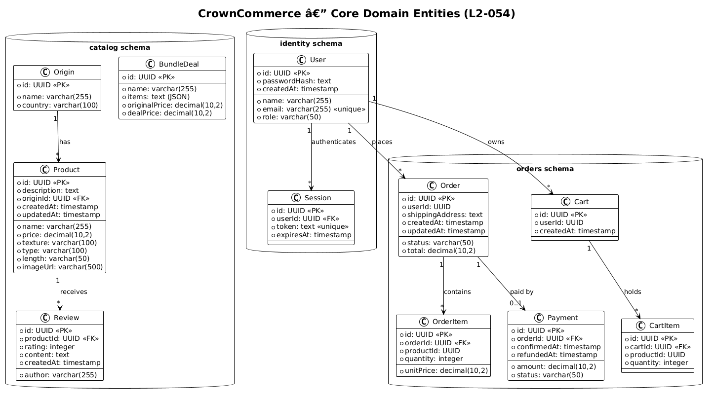
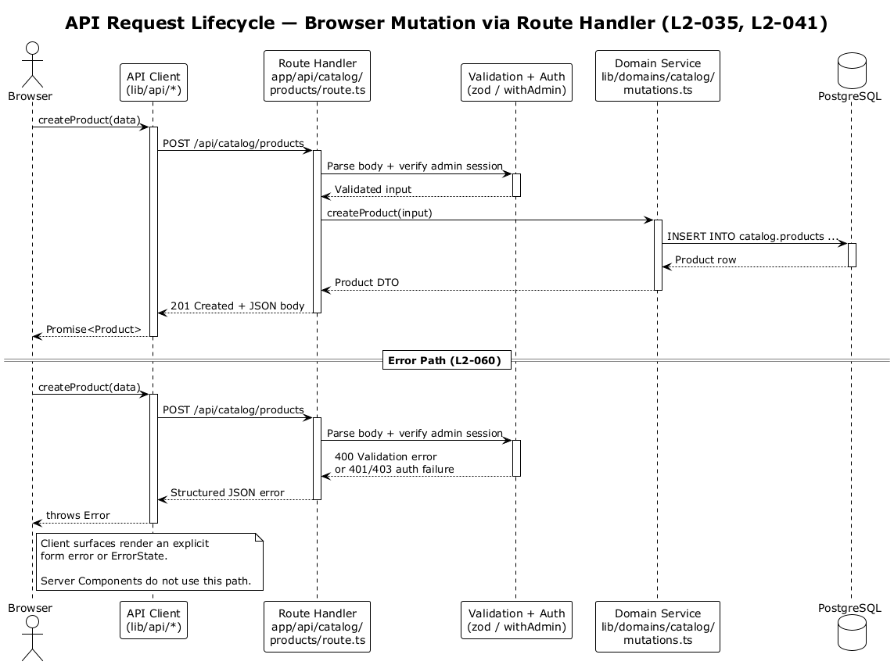
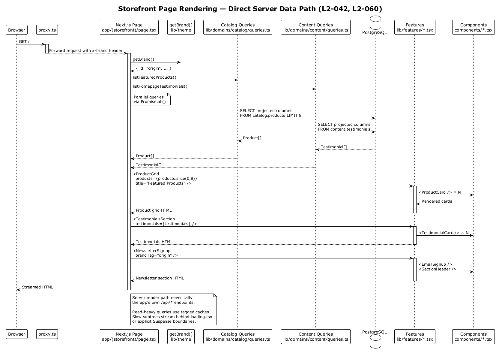

# Platform Architecture & API Gateway — Detailed Design

## 1. Overview

CrownCommerce is a multi-brand premium hair e-commerce platform built as a **modular monolith** — a single Next.js 15 deployment backed by a single PostgreSQL database, with strict domain isolation enforced through 11 separate PostgreSQL schemas. This architecture delivers the organizational benefits of microservice boundaries (independent domain logic, isolated data stores, clear team ownership) without the operational complexity of distributed deployments.

The platform serves two consumer brands — **Origin Hair** (`originhair.com`) and **Mane Haus** (`manehaus.com`) — from the same codebase, with brand detection at the request layer and theme differentiation via CSS design tokens.

| Requirement | Summary |
|---|---|
| **L2-035** | API Gateway Routing — map all frontend API paths to the correct backend domain module |
| **L2-054** | Microservice Independence — each domain has its own schema, models, and application logic |
| **L2-040** | Components Library — presentational UI primitives with no service dependencies |
| **L2-041** | API Library — typed HTTP clients for all 11 domains with configurable base URL |
| **L2-042** | Features Library — 7 intelligent components composing API services and UI primitives |
| **L2-043** | Not Found Page — wildcard route rendering NotFoundPage with home link |
| **L2-060** | Error Handling and Loading States — LoadingSpinner and ErrorState across all pages |

**Actors:**

- **Customer** — unauthenticated or authenticated storefront user who browses products, manages a cart, and places orders via `(storefront)` route group
- **Admin** — authenticated CrownCommerce team member who manages products, orders, content, and CRM data via `(admin)` route group
- **Team Member** — authenticated employee who collaborates via `(teams)` route group (chat, meetings, scheduling)

**Scope boundary:** This document covers the platform's structural architecture: API route gateway pattern, PostgreSQL schema isolation strategy, the 3-tier frontend module hierarchy (components → api → features), and cross-cutting concerns (error handling, loading states, 404 page). Individual domain features (catalog CRUD, checkout flow, chat, etc.) are detailed in their own design documents (Features 04–18).

## 2. Architecture

### 2.1 C4 Context Diagram

Shows CrownCommerce in its environment — three actor types interact with a single platform that delegates to PostgreSQL for persistence and a CDN for static assets.


Key architectural decisions visible at this level:

- **Single deployment target** — one Next.js application serves all three actor types, reducing infrastructure cost and deployment complexity.
- **Single database instance** — PostgreSQL hosts all domain data. Schema-level isolation (see §3.2) provides the independence guarantees of L2-054 without requiring multiple database servers.
- **CDN integration** — Vercel's edge network handles static asset delivery, keeping the Next.js server focused on API and SSR workloads.

### 2.2 C4 Container Diagram

Zooms into the platform boundary, showing the Browser App, Next.js Server, API Client Library, and the schema-partitioned PostgreSQL database.


The container architecture implements L2-035 (API Gateway Routing) directly: all API traffic flows through Next.js App Router's file-system-based routing at `/api/{domain}/*`, which acts as the gateway. There is no separate API gateway process — the Next.js server itself resolves routes to domain-specific handlers.

### 2.3 C4 Component Diagram

Reveals the 3-tier frontend module system and the API route layer that together satisfy L2-040, L2-041, and L2-042.


**The 3-tier dependency rule** (enforced by convention):

```
Pages → Features → API Clients → API Routes → Drizzle → PostgreSQL
             ↓
        UI Components (shadcn + custom)
```

- **Features** may import from **API Clients** and **Components**. They never import from Pages.
- **API Clients** may only import the base `api` object from `lib/api/client.ts`. They never import Components or Features.
- **Components** are pure presentational. They never import API Clients, Features, or database code.
- **Pages** compose Features and may directly call API Clients for server-side data fetching.

## 3. Component Details

### 3.1 API Route Layer (L2-035)

The API gateway is implemented via Next.js App Router's file-system routing convention. Each domain owns a top-level directory under `app/api/`, and route handlers follow a consistent pattern.

**Route map — all 11 domain modules:**

| Domain | Base Path | Route Files | Methods |
|---|---|---|---|
| **Catalog** | `/api/catalog/` | `products/route.ts`, `products/[id]/route.ts`, `origins/route.ts`, `origins/[id]/route.ts`, `reviews/route.ts`, `bundle-deals/route.ts` | GET, POST, PUT, DELETE |
| **Orders** | `/api/orders/` | `route.ts`, `[id]/route.ts`, `cart/route.ts`, `cart/items/route.ts` | GET, POST, PUT, DELETE |
| **Identity** | `/api/identity/` | `auth/route.ts`, `users/route.ts`, `users/[id]/route.ts` | POST (auth actions), GET, POST, PUT, DELETE |
| **Payments** | `/api/payments/` | `route.ts`, `[id]/route.ts` | GET, POST, PUT |
| **Content** | `/api/content/` | `pages/route.ts`, `faqs/route.ts`, `testimonials/route.ts`, `gallery/route.ts`, `hero/route.ts`, `trust-bar/route.ts` | GET, POST |
| **Newsletter** | `/api/newsletter/` | `subscribers/route.ts`, `subscribers/[id]/route.ts`, `campaigns/route.ts`, `campaigns/[id]/route.ts` | GET, POST, PUT, DELETE |
| **Chat** | `/api/chat/` | `conversations/route.ts`, `conversations/[id]/messages/route.ts` | GET, POST |
| **Inquiries** | `/api/inquiries/` | `route.ts`, `[id]/route.ts` | GET, POST, PUT, DELETE |
| **Scheduling** | `/api/scheduling/` | `employees/route.ts`, `channels/route.ts`, `channels/[id]/messages/route.ts`, `meetings/route.ts`, `files/route.ts` | GET, POST |
| **CRM** | `/api/crm/` | `customers/route.ts`, `customers/[id]/route.ts`, `leads/route.ts`, `leads/[id]/route.ts` | GET, POST, PUT, DELETE |
| **Notifications** | `/api/notifications/` | `route.ts`, `[id]/route.ts` | GET, POST, PUT |

**Canonical route handler pattern:**

Every route handler follows the same structure, satisfying L2-035's requirement that each path maps to the correct domain module:

```typescript
// app/api/catalog/products/route.ts
import { NextResponse } from "next/server";
import { db } from "@/lib/db";
import { products } from "@/lib/db/schema/catalog";

export async function GET() {
  try {
    const allProducts = await db.select().from(products);
    return NextResponse.json(allProducts);
  } catch (error) {
    return NextResponse.json(
      { error: "Failed to fetch products" },
      { status: 500 }
    );
  }
}

export async function POST(request: Request) {
  try {
    const body = await request.json();
    const [product] = await db.insert(products).values(body).returning();
    return NextResponse.json(product, { status: 201 });
  } catch (error) {
    return NextResponse.json(
      { error: "Failed to create product" },
      { status: 500 }
    );
  }
}
```

**Pattern invariants:**

1. Each handler imports only from its own domain schema (e.g., `catalog` handlers import only from `@/lib/db/schema/catalog`).
2. All handlers return `NextResponse.json()` — never raw `Response`.
3. All handlers wrap logic in `try/catch` and return structured `{ error: string }` on failure with appropriate HTTP status codes (L2-060).
4. Parameterized routes use Next.js 15's async `params`: `{ params }: { params: Promise<{ id: string }> }`.

### 3.2 Database Schema Layer (L2-054)

Domain isolation is enforced at the PostgreSQL schema level using Drizzle ORM's `pgSchema` function. Each domain declares its own schema, and all tables within that domain are namespaced accordingly.

**Schema declarations:**

```typescript
// lib/db/schema/catalog.ts
export const catalogSchema = pgSchema("catalog");
export const products = catalogSchema.table("products", { ... });
export const origins  = catalogSchema.table("origins", { ... });

// lib/db/schema/orders.ts
export const ordersSchema = pgSchema("orders");
export const orders = ordersSchema.table("orders", { ... });
export const carts  = ordersSchema.table("carts", { ... });

// lib/db/schema/identity.ts
export const identitySchema = pgSchema("identity");
export const users    = identitySchema.table("users", { ... });
export const sessions = identitySchema.table("sessions", { ... });
```

**All 11 schemas and their tables:**

| Schema | Tables | Drizzle File |
|---|---|---|
| `catalog` | products, origins, reviews, bundle_deals | `lib/db/schema/catalog.ts` |
| `orders` | orders, order_items, carts, cart_items, payments | `lib/db/schema/orders.ts` |
| `identity` | users, sessions | `lib/db/schema/identity.ts` |
| `content` | pages, faqs, testimonials, gallery_images, hero_content, trust_bar_items | `lib/db/schema/content.ts` |
| `newsletter` | subscribers, campaigns, campaign_recipients | `lib/db/schema/newsletter.ts` |
| `chat` | conversations, messages | `lib/db/schema/chat.ts` |
| `inquiries` | inquiries | `lib/db/schema/inquiries.ts` |
| `scheduling` | employees, channels, channel_messages, meetings, meeting_attendees, files | `lib/db/schema/scheduling.ts` |
| `crm` | customers, leads | `lib/db/schema/crm.ts` |
| `notifications` | notifications | `lib/db/schema/notifications.ts` |

> **Note:** Payments uses the `orders` schema (table `orders.payments`) rather than a separate schema, since payments are tightly coupled to order lifecycle. This is the single intentional exception to the one-schema-per-domain rule.

**Database connection (`lib/db/index.ts`):**

A single Drizzle instance is configured with all schemas merged into one schema map:

```typescript
import { drizzle } from "drizzle-orm/postgres-js";
import postgres from "postgres";
import * as catalog from "./schema/catalog";
import * as orders from "./schema/orders";
import * as identity from "./schema/identity";
// ... 7 more schema imports

const connectionString = process.env.DATABASE_URL
  || "postgresql://localhost:5432/crown_commerce";
const client = postgres(connectionString);

export const db = drizzle(client, {
  schema: {
    ...catalog, ...orders, ...identity, ...content,
    ...newsletter, ...chat, ...inquiries, ...scheduling,
    ...crm, ...notifications,
  },
});
```

**Trade-off analysis — pgSchema isolation:**

| Advantage | Limitation |
|---|---|
| Single database server reduces infrastructure cost | Cross-schema JOINs are possible but discouraged by convention |
| Independent migrations per schema (L2-054 AC2) | All schemas share the same connection pool |
| Clear ownership boundary visible in SQL (`catalog.products` vs `orders.orders`) | No per-schema resource limits (CPU, memory) |
| Drizzle enforces schema prefix at compile time | Requires discipline to avoid cross-schema imports in route handlers |

### 3.3 API Client Library (L2-041)

The API client library at `lib/api/` provides typed HTTP clients for all 11 domain modules. It consists of a base request handler and domain-specific client modules.

**Base client (`lib/api/client.ts`):**

```typescript
const BASE_URL = process.env.NEXT_PUBLIC_API_URL || "";

async function request<T>(
  path: string,
  options: RequestOptions = {}
): Promise<T> {
  const { params, ...init } = options;
  let url = `${BASE_URL}${path}`;
  if (params) {
    url += `?${new URLSearchParams(params).toString()}`;
  }
  const res = await fetch(url, {
    ...init,
    headers: { "Content-Type": "application/json", ...init.headers },
  });
  if (!res.ok) {
    const error = await res.json().catch(() => ({ error: res.statusText }));
    throw new Error(error.error || `Request failed: ${res.status}`);
  }
  return res.json();
}

export const api = {
  get:    <T>(path, options?) => request<T>(path, { ...options, method: "GET" }),
  post:   <T>(path, body?, options?) => request<T>(path, { ...options, method: "POST", body: JSON.stringify(body) }),
  put:    <T>(path, body?, options?) => request<T>(path, { ...options, method: "PUT", body: JSON.stringify(body) }),
  delete: <T>(path, options?) => request<T>(path, { ...options, method: "DELETE" }),
};
```

**Domain clients:**

Each domain module exports a typed API object that wraps the base `api` methods with domain-specific paths and interfaces.

| Client Module | File | Key Methods |
|---|---|---|
| `catalogApi` | `lib/api/catalog.ts` | `getProducts()`, `getProduct(id)`, `createProduct(data)`, `updateProduct(id, data)`, `deleteProduct(id)`, plus origins, reviews, bundleDeals |
| `ordersApi` | `lib/api/orders.ts` | `getOrders()`, `getOrder(id)`, `createOrder(data)`, `updateOrder(id, data)`, `getCart(userId)`, `addCartItem(data)`, `removeCartItem(id)` |
| `identityApi` | `lib/api/identity.ts` | `register(data)`, `login(data)`, `getProfile()`, `getUsers()`, `getUser(id)`, `updateUser(id, data)`, `deleteUser(id)` |
| `paymentsApi` | `lib/api/payments.ts` | `getPayments()`, `getPayment(id)`, `createPayment(data)`, `updatePayment(id, data)` |
| `contentApi` | `lib/api/content.ts` | `getPages()`, `getFaqs()`, `getTestimonials()`, `getGallery()`, `getHeroContent()`, `getTrustBar()` |
| `newsletterApi` | `lib/api/newsletter.ts` | `getSubscribers()`, `subscribe(data)`, `getCampaigns()`, `createCampaign(data)` |
| `chatApi` | `lib/api/chat.ts` | `getConversations()`, `getMessages(conversationId)`, `sendMessage(conversationId, data)` |
| `inquiriesApi` | `lib/api/inquiries.ts` | `getInquiries()`, `createInquiry(data)`, `updateInquiry(id, data)`, `deleteInquiry(id)` |
| `schedulingApi` | `lib/api/scheduling.ts` | `getEmployees()`, `getChannels()`, `getMeetings()`, `createMeeting(data)` |
| `crmApi` | `lib/api/crm.ts` | `getCustomers()`, `getLeads()`, `createLead(data)`, `updateLead(id, data)` |
| `notificationsApi` | `lib/api/notifications.ts` | `getNotifications()`, `createNotification(data)`, `markAsRead(id)` |

**Configurable base URL (L2-041 AC1):** The `NEXT_PUBLIC_API_URL` environment variable controls where API requests are sent. When empty (default), requests are relative to the current host — ideal for same-origin deployment. In development, this can be set to `http://localhost:3000` for server-side fetches.

### 3.4 Components Library (L2-040)

The `components/` directory contains presentational UI primitives with **zero service dependencies**. Components accept data via props and emit events via callback props. They are themed through CSS design tokens (Tailwind CSS v4 variables), ensuring consistent rendering across both brands.

**shadcn/ui primitives (`components/ui/`):**

| Component | File | Variants / Exports |
|---|---|---|
| Button | `components/ui/button.tsx` | Variants: `default`, `destructive`, `outline`, `secondary`, `ghost`, `link`. Sizes: `default`, `sm`, `lg`, `icon` |
| Card | `components/ui/card.tsx` | Exports: `Card`, `CardHeader`, `CardTitle`, `CardDescription`, `CardContent`, `CardFooter` |
| Input | `components/ui/input.tsx` | Standard text input with focus ring |
| Label | `components/ui/label.tsx` | Form label with accessibility binding |
| Textarea | `components/ui/textarea.tsx` | Multi-line text input |
| Badge | `components/ui/badge.tsx` | Variants: `default`, `secondary`, `destructive`, `outline` |
| Separator | `components/ui/separator.tsx` | Horizontal/vertical rule |
| Skeleton | `components/ui/skeleton.tsx` | Loading placeholder animation |

**Custom domain components (`components/`):**

| Component | File | Responsibility | Dependencies |
|---|---|---|---|
| ProductCard | `components/product-card.tsx` | Renders a product card with image, name, price, badges | Card, Badge, next/image, next/link |
| TestimonialCard | `components/testimonial-card.tsx` | Renders a customer testimonial with rating | Card |
| SectionHeader | `components/section-header.tsx` | Page section title + subtitle typography | None |
| EmailSignup | `components/email-signup.tsx` | Email input + submit button (client component) | Button, Input |
| ChatWidget | `components/chat-widget.tsx` | Floating chat interface (client component) | Button, Input |
| LoadingSpinner | `components/loading-spinner.tsx` | Animated loading indicator (L2-060) | None |
| ErrorState | `components/error-state.tsx` | Error message with retry button (L2-060) | Button |

### 3.5 Features Library (L2-042)

The `lib/features/` directory contains 7 **intelligent compositions** — components that combine API service calls with UI primitives to deliver complete, reusable page sections. Features are the bridge between data fetching and presentation.

| Feature | File | API Dependencies | Component Dependencies | Purpose |
|---|---|---|---|---|
| ProductGrid | `lib/features/product-grid.tsx` | (receives data via props) | ProductCard, SectionHeader | Responsive product grid with optional title/subtitle |
| CartSummary | `lib/features/cart-summary.tsx` | (receives data via props) | Card, Button | Shopping cart display with item management and checkout CTA |
| TestimonialsSection | `lib/features/testimonials-section.tsx` | (receives data via props) | TestimonialCard, SectionHeader | Customer testimonial grid |
| NewsletterSignup | `lib/features/newsletter-signup.tsx` | (EmailSignup calls `/api/newsletter/subscribers`) | EmailSignup, SectionHeader | Newsletter subscription section |
| ChatContainer | `lib/features/chat-container.tsx` | chatApi | ChatWidget | Full chat interface with conversation management |
| FAQList | `lib/features/faq-list.tsx` | (receives data via props) | Card | FAQ accordion/list display |
| InquiryForm | `lib/features/inquiry-form.tsx` | inquiriesApi | Input, Textarea, Button | Customer inquiry submission form |

**Composition pattern example — ProductGrid:**

```typescript
// lib/features/product-grid.tsx
interface ProductGridProps {
  title?: string;
  subtitle?: string;
  products: Product[];
}

export function ProductGrid({ title, subtitle, products }: ProductGridProps) {
  return (
    <section className="py-16">
      {title && <SectionHeader title={title} subtitle={subtitle} />}
      <div className="grid grid-cols-1 sm:grid-cols-2 lg:grid-cols-3 xl:grid-cols-4 gap-6">
        {products.map((product) => (
          <ProductCard key={product.id} {...product} />
        ))}
      </div>
      {products.length === 0 && (
        <p className="text-center text-muted-foreground py-12">
          No products found.
        </p>
      )}
    </section>
  );
}
```

**Page composition pattern — Home Page (`app/(storefront)/page.tsx`):**

The storefront home page demonstrates how features are composed by server components with parallel data fetching:

```typescript
export default async function HomePage() {
  const brand = await getBrand();
  const [products, testimonials] = await Promise.all([
    getProducts(),
    getTestimonials(),
  ]);

  return (
    <>
      {/* Hero Section — inline, brand-aware */}
      <section className="relative py-24 md:py-32">
        <h1>...</h1>
      </section>

      {/* Feature compositions */}
      <ProductGrid
        title="Featured Products"
        subtitle="Our most popular selections"
        products={products.slice(0, 8)}
      />
      <TestimonialsSection testimonials={testimonials} />
      <NewsletterSignup brandTag={brand.id} />
    </>
  );
}
```

### 3.6 Route Groups

The Next.js App Router's route group feature organizes pages by access pattern:

| Route Group | Path Pattern | Purpose | Auth Required |
|---|---|---|---|
| `(storefront)` | `/`, `/shop`, `/product/[id]`, `/cart`, `/checkout`, `/contact`, `/faq`, `/bundle-deals`, `/login`, `/register` | Customer-facing pages | No (except checkout) |
| `(admin)` | `/admin/dashboard`, `/admin/products`, `/admin/orders`, `/admin/customers` | Back-office management | Yes (role: admin) |
| `(teams)` | `/teams/home`, `/teams/chat`, `/teams/meetings` | Employee collaboration | Yes (role: team) |
| `(coming-soon)` | `/origin`, `/mane-haus` | Pre-launch landing pages | No |

### 3.7 Not Found Page (L2-043)

Next.js App Router's `not-found.tsx` convention provides the wildcard catch-all. When any route fails to match, the framework renders the NotFoundPage component with a message and a link back to the home page.

```
app/not-found.tsx → Renders NotFoundPage with "Back to Home" link
```

## 4. Data Model

### 4.1 Class Diagram

Shows the core domain entities across the three primary schemas (catalog, orders, identity) and their relationships.



### 4.2 Entity Descriptions

**Catalog Schema:**

| Entity | Key Fields | Notes |
|---|---|---|
| **Product** | `id` (UUID PK), `name`, `description`, `price` (decimal 10,2), `texture`, `type`, `length`, `originId` (FK → Origin), `imageUrl` | Core commerce entity. Price stored as decimal for precision. |
| **Origin** | `id` (UUID PK), `name`, `country` | Sourcing metadata — maps to origin countries for hair products. |
| **Review** | `id` (UUID PK), `productId` (FK → Product), `author`, `rating` (integer 1-5), `content` | Customer product reviews. |
| **BundleDeal** | `id` (UUID PK), `name`, `items` (JSON text), `originalPrice`, `dealPrice` | Promotional bundles. `items` contains JSON array of product references. |

**Orders Schema:**

| Entity | Key Fields | Notes |
|---|---|---|
| **Order** | `id` (UUID PK), `userId`, `status` (default "pending"), `total` (decimal), `shippingAddress`, timestamps | Status lifecycle: pending → confirmed → shipped → delivered (or cancelled). |
| **OrderItem** | `id` (UUID PK), `orderId` (FK → Order), `productId`, `quantity`, `unitPrice` | Line items snapshot product price at order time. `productId` is a cross-schema reference (not a FK constraint). |
| **Cart** | `id` (UUID PK), `userId`, `createdAt` | One active cart per user. |
| **CartItem** | `id` (UUID PK), `cartId` (FK → Cart), `productId`, `quantity` | `productId` references catalog.products by convention (not FK). |
| **Payment** | `id` (UUID PK), `orderId` (FK → Order), `amount`, `status` (default "pending"), `confirmedAt`, `refundedAt` | Lives in orders schema. Status: pending → confirmed → refunded. |

**Identity Schema:**

| Entity | Key Fields | Notes |
|---|---|---|
| **User** | `id` (UUID PK), `name`, `email` (unique), `passwordHash`, `role` (default "customer") | Roles: customer, admin, team. Password hashed server-side. |
| **Session** | `id` (UUID PK), `userId` (FK → User), `token` (unique), `expiresAt` | JWT-based sessions. Token stored for server-side validation/revocation. |

**Cross-schema references:** `orders.order_items.productId` and `orders.cart_items.productId` reference `catalog.products.id` by convention rather than foreign key constraint. This preserves schema independence (L2-054) — orders can exist even if catalog data changes.

## 5. Key Workflows

### 5.1 API Request Lifecycle (L2-035, L2-041, L2-060)

Traces a complete request from browser through the API client library, Next.js routing, Drizzle ORM, to PostgreSQL and back — including the error path.



**Flow:**

1. Browser code (or server component) calls `catalogApi.getProducts()`.
2. The API client constructs `GET /api/catalog/products` using the base `api.get()` method with the configured `NEXT_PUBLIC_API_URL`.
3. Next.js App Router matches the request to `app/api/catalog/products/route.ts` and invokes the `GET()` export.
4. The route handler calls `db.select().from(products)`, which Drizzle translates to `SELECT * FROM catalog.products`.
5. PostgreSQL returns rows, Drizzle maps them to typed `Product[]` objects, and the handler returns `NextResponse.json(products)`.
6. On error, the handler catches the exception and returns `{ error: "Failed to fetch products" }` with status 500. The API client detects `!res.ok` and throws, allowing the UI to display `<ErrorState />`.

### 5.2 Page Rendering with Feature Composition (L2-042, L2-060)

Shows how the storefront home page composes features, performs parallel data fetching, and handles loading/error states.



**Flow:**

1. Browser requests `/` — Next.js SSR invokes the `HomePage` server component.
2. `getBrand()` resolves the hostname to a brand configuration (Origin Hair vs Mane Haus).
3. `Promise.all([getProducts(), getTestimonials()])` fetches data in parallel from the API routes.
4. The page passes fetched data as props to feature components: `<ProductGrid>`, `<TestimonialsSection>`, `<NewsletterSignup>`.
5. Each feature renders its section using custom and UI components (ProductCard, TestimonialCard, EmailSignup).
6. The fully composed HTML is streamed to the browser.
7. **Error resilience:** fetch helpers return empty arrays `[]` on failure, so features render graceful empty states rather than crashing the page. Client-side re-fetches surface `<ErrorState onRetry={...} />` for interactive recovery.

## 6. API Contracts

All API routes follow RESTful conventions with JSON request/response bodies. The consistent patterns below apply across all 11 domains.

### 6.1 Standard Response Patterns

**Success — collection:**
```
GET /api/catalog/products → 200 OK
Body: Product[]
```

**Success — single resource:**
```
GET /api/catalog/products/:id → 200 OK
Body: Product
```

**Success — creation:**
```
POST /api/catalog/products → 201 Created
Body: Product (with generated id, timestamps)
```

**Not found:**
```
GET /api/catalog/products/:id → 404 Not Found
Body: { "error": "Not found" }
```

**Server error:**
```
GET /api/catalog/products → 500 Internal Server Error
Body: { "error": "Failed to fetch products" }
```

### 6.2 Domain Endpoint Reference

**Catalog Domain (`/api/catalog/`):**

| Method | Path | Description |
|---|---|---|
| GET | `/api/catalog/products` | List all products |
| POST | `/api/catalog/products` | Create a product |
| GET | `/api/catalog/products/:id` | Get product by ID |
| PUT | `/api/catalog/products/:id` | Update product |
| DELETE | `/api/catalog/products/:id` | Delete product |
| GET | `/api/catalog/origins` | List all origins |
| GET | `/api/catalog/origins/:id` | Get origin by ID |
| PUT | `/api/catalog/origins/:id` | Update origin |
| DELETE | `/api/catalog/origins/:id` | Delete origin |
| GET | `/api/catalog/reviews` | List all reviews |
| POST | `/api/catalog/reviews` | Create a review |
| POST | `/api/catalog/bundle-deals` | Create a bundle deal |

**Orders Domain (`/api/orders/`):**

| Method | Path | Description |
|---|---|---|
| GET | `/api/orders` | List all orders |
| POST | `/api/orders` | Create an order |
| GET | `/api/orders/:id` | Get order by ID |
| PUT | `/api/orders/:id` | Update order (status, address) |
| GET | `/api/orders/cart?userId=` | Get cart for user |
| POST | `/api/orders/cart` | Create a cart |
| POST | `/api/orders/cart/items` | Add item to cart |
| DELETE | `/api/orders/cart/items?id=` | Remove item from cart |

**Identity Domain (`/api/identity/`):**

| Method | Path | Body | Description |
|---|---|---|---|
| POST | `/api/identity/auth` | `{ action: "register", name, email, password }` | Register new user |
| POST | `/api/identity/auth` | `{ action: "login", email, password }` | Login |
| POST | `/api/identity/auth` | `{ action: "logout" }` | Logout |
| POST | `/api/identity/auth` | `{ action: "profile" }` | Get current user profile |
| GET | `/api/identity/users` | — | List all users (admin) |
| GET | `/api/identity/users/:id` | — | Get user by ID |
| PUT | `/api/identity/users/:id` | `Partial<User>` | Update user |
| DELETE | `/api/identity/users/:id` | — | Delete user |

### 6.3 Type Interfaces

All API clients export TypeScript interfaces that match the Drizzle schema types:

```typescript
// lib/api/catalog.ts
export interface Product {
  id: string;
  name: string;
  description: string | null;
  price: string;           // decimal returned as string
  texture: string | null;
  type: string | null;
  length: string | null;
  originId: string | null;
  imageUrl: string | null;
  createdAt: string;
  updatedAt: string;
}

// lib/api/orders.ts
export interface Order {
  id: string;
  userId: string | null;
  status: string;
  total: string;
  shippingAddress: string | null;
  createdAt: string;
  updatedAt: string;
}

// lib/api/identity.ts
export interface User {
  id: string;
  name: string;
  email: string;
  role: string;
  createdAt?: string;
}
```

## 7. Security Considerations

### 7.1 Authentication & Authorization

- **JWT via jose library** — tokens are signed server-side and stored in `httpOnly` cookies (not accessible to client-side JavaScript).
- **Action-based auth endpoint** — `/api/identity/auth` uses a `{ action: "register" | "login" | "logout" | "profile" }` dispatch pattern rather than separate endpoints. This centralizes auth logic.
- **Role-based access** — User roles (`customer`, `admin`, `team`) determine route group access. Admin routes under `(admin)` require `role: "admin"`.

### 7.2 API Route Security

- **No shared database credentials in client code** — the `DATABASE_URL` is server-only (`process.env`, not `NEXT_PUBLIC_`).
- **Schema isolation prevents accidental cross-domain access** — a catalog route handler cannot accidentally query `identity.users` because it only imports `@/lib/db/schema/catalog`.
- **Error messages are generic** — handlers return "Failed to fetch products" rather than exposing stack traces or SQL errors.

### 7.3 Cross-Schema Reference Safety

- `productId` in order/cart items is stored as a plain UUID, not a foreign key constraint. This means:
  - Orders survive if a product is deleted from the catalog (historical integrity).
  - No cross-schema FK constraints that could create migration coupling.
  - Application-level validation is required when creating order items.

### 7.4 Input Handling

- Request bodies are parsed via `request.json()` in each handler.
- Drizzle ORM parameterizes all queries, preventing SQL injection.
- Future enhancement: add Zod validation schemas for all POST/PUT bodies (currently partial — newsletter uses Zod, others accept raw body).

## 8. Trade-off Analysis

### 8.1 Modular Monolith vs Microservices

| Factor | Modular Monolith (Current) | Microservices (Alternative) |
|---|---|---|
| **Deployment** | Single `next build` → one container | 11+ independent deployments |
| **Latency** | In-process function calls between domains | Network hops for inter-service calls |
| **Data consistency** | Single transaction scope available | Eventual consistency, saga patterns needed |
| **Operational cost** | One server, one database, one CI pipeline | Multiple servers, databases, pipelines |
| **Team scaling** | Schema isolation provides ownership boundaries | Service boundaries enforce team independence |
| **Migration path** | Can extract domains to microservices later | Already separated |

**Decision rationale:** CrownCommerce is a small-team e-commerce platform. The modular monolith delivers microservice-like domain isolation (via pgSchema) with monolith-like operational simplicity. The architecture preserves the option to extract high-traffic domains (e.g., catalog, orders) into standalone services if scale demands it.

### 8.2 File-System API Gateway vs Dedicated Gateway

The Next.js App Router serves as both the frontend server and the API gateway. This eliminates a separate gateway process but means:

- **Pro:** Zero additional infrastructure. Route discovery is automatic from the file system.
- **Pro:** Type safety — API clients and route handlers share the same TypeScript project.
- **Con:** No out-of-the-box rate limiting, circuit breaking, or request transformation.
- **Con:** API routes share the Node.js event loop with SSR workloads.

**Mitigation:** For rate limiting and advanced gateway features, Vercel edge middleware or a reverse proxy (Nginx, Cloudflare) can be layered in front without changing the application code.

## 9. Open Questions

| # | Question | Impact | Status |
|---|---|---|---|
| 1 | Should a dedicated `middleware.ts` be added for global auth token validation and brand detection? | Would centralize hostname → brand mapping and auth checks currently done per-layout. | Open |
| 2 | Should cross-schema references (e.g., `productId` in order items) be validated at the application layer on write? | Currently no validation — a non-existent `productId` can be stored. | Open |
| 3 | Should API routes add Zod validation for all POST/PUT request bodies? | Would improve input safety and error messages. Newsletter already uses Zod. | Open |
| 4 | Should the base API client add retry logic for transient failures (5xx, network errors)? | Would improve resilience for server-side fetches in SSR. | Open |
| 5 | Should high-traffic read endpoints (GET /api/catalog/products) add cache headers or Next.js ISR? | Would reduce database load under traffic. Currently `cache: "no-store"`. | Open |
