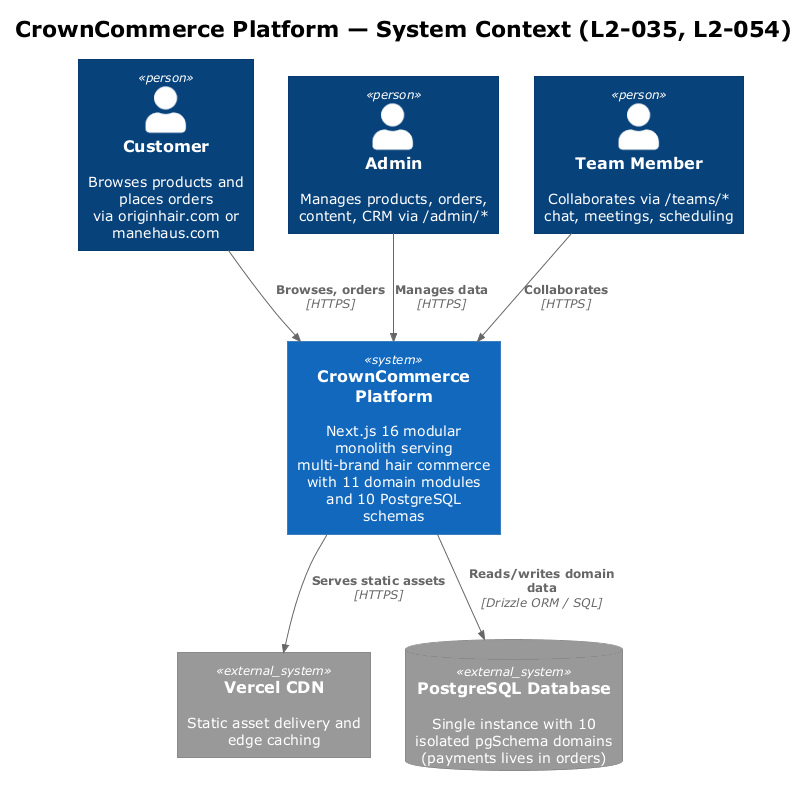
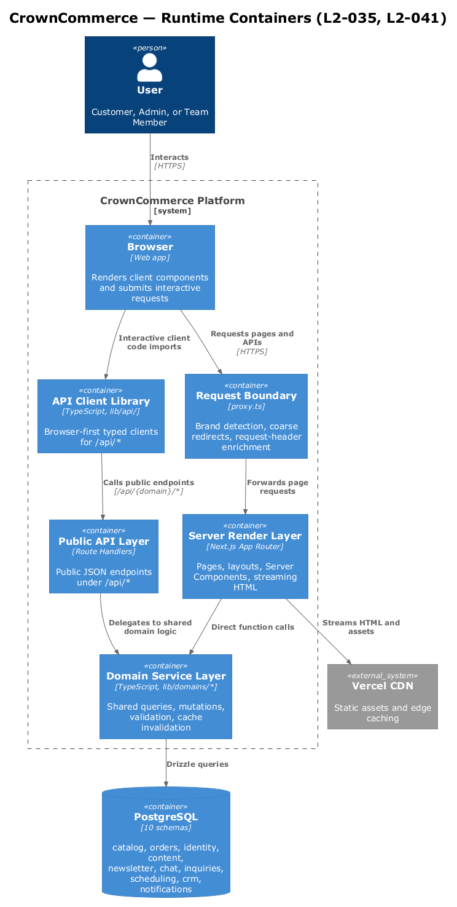
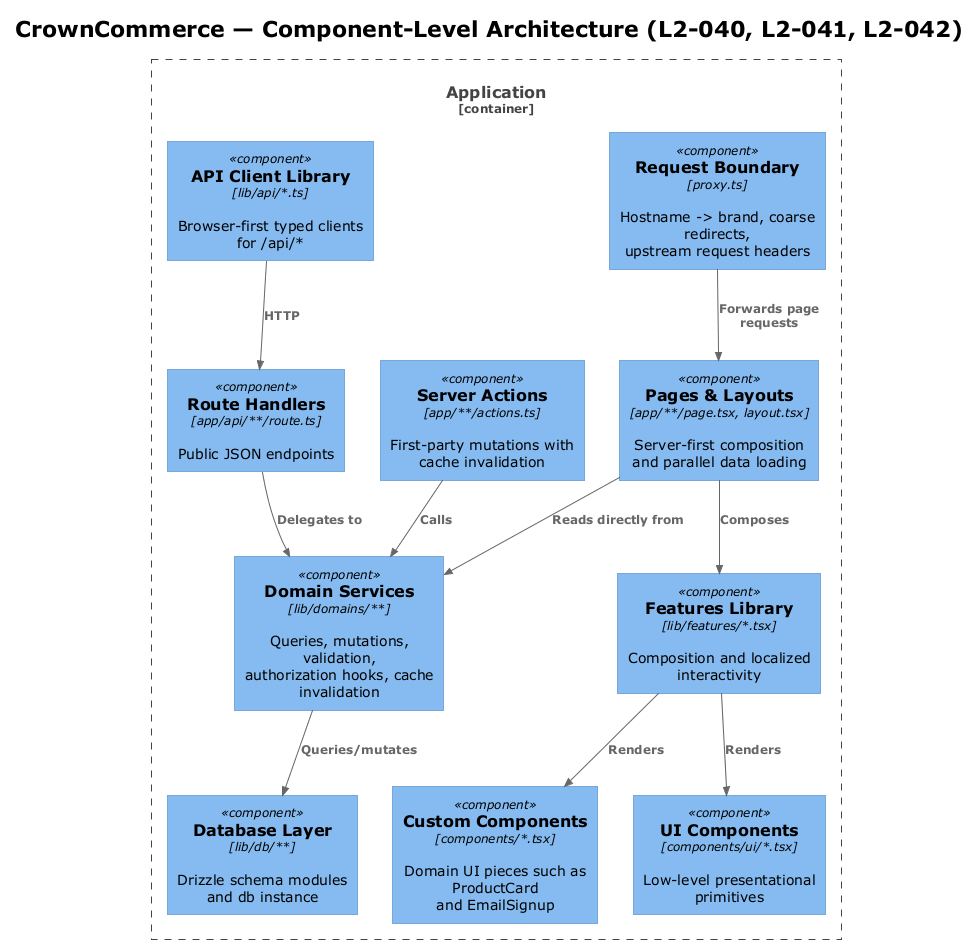

# Platform Architecture & Runtime Boundary — Detailed Design

## 1. Overview

CrownCommerce is a multi-brand premium hair commerce platform implemented as a **modular monolith** on **Next.js 16.2**, **React 19.2**, **Drizzle ORM**, and **PostgreSQL**. It serves both **Origin Hair** (`originhair.com`) and **Mane Haus** (`manehaus.com`) from one codebase and one deployment target.

The platform is split into **11 domain modules**:

- Catalog
- Orders
- Identity
- Payments
- Content
- Newsletter
- Chat
- Inquiries
- Scheduling
- CRM
- Notifications

Persistence is isolated across **10 PostgreSQL schemas**, not 11. Payments is intentionally stored inside the `orders` schema because payment state is part of order lifecycle.

This document is intentionally prescriptive. It was rewritten after a five-pass audit to correct patterns that would otherwise lead to slower renders, brittle request handling, and inaccurate architectural guidance.

| Requirement | Summary |
|---|---|
| **L2-035** | API Gateway Routing |
| **L2-040** | Components Library |
| **L2-041** | API Library |
| **L2-042** | Features Library |
| **L2-043** | Not Found Page |
| **L2-054** | Microservice Independence |
| **L2-060** | Error Handling and Loading States |

**Actors**

- **Customer** uses the storefront route group.
- **Admin** manages commerce and content through `/admin/*`.
- **Team Member** uses collaboration features through `/teams/*`.

**Scope boundary**

This document covers the platform-level runtime boundary, data-access architecture, schema isolation model, API route design, shared UI module rules, and the cross-cutting conventions that keep the codebase performant and maintainable. Domain-specific CRUD, workflows, and screen behavior belong in Features 02-18.

## 2. Five-Pass Audit Summary

| Pass | Problem Found | Design Correction |
|---|---|---|
| **1. Framework correctness** | The document was written as if the app were on Next.js 15 and treated `middleware.ts` as the preferred request boundary. | The target architecture now uses **Next.js 16.2** conventions, including **root-level `proxy.ts`** for coarse request interception and async request APIs everywhere. |
| **2. Request/data boundary** | Server Components were described as calling internal `/api/*` endpoints via HTTP. That is slower, harder to cache, and can break prerendering. | **Server pages and layouts fetch from domain services directly.** Route Handlers are reserved for browser clients, third-party callers, webhooks, and true HTTP boundaries. |
| **3. Caching and rendering** | The old design normalized blanket `cache: "no-store"` fetches and did not define a route-segment loading/error strategy. | Read-heavy queries use **cache-aware domain services** with **tag-based invalidation**. Route groups define `loading.tsx`, `error.tsx`, and `not-found.tsx` deliberately instead of relying on ad hoc empty-state fallbacks. |
| **4. Security and contracts** | Mutating routes were described as accepting raw `request.json()` bodies with minimal structure, and auth rules were underspecified. | Route Handlers are now defined as **thin adapters**: parse, validate, authorize, call service, return typed response. Public POST routes must have validation and abuse controls. |
| **5. Operational integrity** | The old document claimed platform conventions that the repo did not actually implement, including 404 handling and a correct request boundary. | This document now distinguishes **target architecture** from **current repo gaps**, so implementation work can close the delta instead of hiding it. |

## 3. Architecture

### 3.1 C4 Context Diagram



At context level, CrownCommerce remains a single product surface for three actor types, backed by one PostgreSQL instance and a CDN/edge layer for assets. The important correction is that the platform should be understood as a **server-first web application with a public API surface**, not as a browser app that always talks to itself over HTTP.

### 3.2 C4 Container Diagram



The platform is composed of five runtime containers:

| Container | Responsibility |
|---|---|
| **Browser** | Renders client components, submits forms, invokes browser-only API clients when interactivity requires HTTP. |
| **Request Boundary (`proxy.ts`)** | Performs hostname-to-brand mapping, coarse redirects/rewrites, and request-header enrichment. It is not the final authority for auth. |
| **Server Render Layer** | App Router pages, layouts, and Server Components. This is the primary read path for HTML responses. |
| **Public API Layer** | Route Handlers under `app/api/**`. Public HTTP boundary for browser clients, callbacks, and external integrations. |
| **Domain Service Layer** | Shared queries, mutations, validation helpers, cache invalidation, and business rules reused by Server Components, Server Actions, and Route Handlers. |

### 3.3 C4 Component Diagram



The corrected dependency rule is:

```text
proxy.ts -> matched page requests

Pages / Layouts -> Domain Services -> Drizzle -> PostgreSQL
Pages / Layouts -> Features -> UI Components

Client Components -> API Clients -> Route Handlers -> Domain Services
Server Actions -> Domain Services
```

The critical rule is the middle line: **Server Components do not call their own Route Handlers over HTTP.**

## 4. Component Details

### 4.1 Request Boundary: `proxy.ts`

In Next.js 16, the preferred request boundary file is **`proxy.ts` at project root**. It replaces the old `middleware.ts` convention for Node.js request interception.

**Responsibilities**

- Resolve hostname to brand.
- Attach brand context to the **upstream request headers**, not only the response headers.
- Perform coarse redirects such as redirecting unauthenticated requests away from `/admin/*` or `/teams/*`.
- Exclude static assets, metadata files, and `/api/*` from unnecessary work via `config.matcher`.

**Non-responsibilities**

- Final authorization decisions.
- Domain data access.
- Business logic.
- Role enforcement by itself.

**Design rule**

Proxy is an optimization and routing boundary. Layouts, Server Actions, and Route Handlers must still verify authorization at the point of use.

```typescript
// proxy.ts
import { NextResponse, type NextRequest } from "next/server";

const BRAND_HOSTNAMES = {
  "originhair.com": "origin",
  "www.originhair.com": "origin",
  "manehaus.com": "mane-haus",
  "www.manehaus.com": "mane-haus",
} as const;

export function proxy(request: NextRequest) {
  const hostname = (request.headers.get("host") ?? "localhost").split(":")[0];
  const brand = BRAND_HOSTNAMES[hostname] ?? "origin";

  const requestHeaders = new Headers(request.headers);
  requestHeaders.set("x-brand", brand);

  if (request.nextUrl.pathname.startsWith("/admin")) {
    const token = request.cookies.get("auth-token")?.value;
    if (!token) {
      return NextResponse.redirect(new URL("/login", request.url));
    }
  }

  if (
    request.nextUrl.pathname.startsWith("/teams") &&
    !request.nextUrl.pathname.startsWith("/teams/login")
  ) {
    const token = request.cookies.get("auth-token")?.value;
    if (!token) {
      return NextResponse.redirect(new URL("/teams/login", request.url));
    }
  }

  return NextResponse.next({
    request: { headers: requestHeaders },
  });
}
```

### 4.2 Domain Service Layer

The old design jumped directly from pages or route handlers to Drizzle queries. That scales poorly because query logic, validation, cache invalidation, and cross-entity rules become duplicated.

The corrected design introduces a shared service layer:

```text
lib/domains/
  catalog/
    queries.ts
    mutations.ts
    schemas.ts
  content/
    queries.ts
  identity/
    auth.ts
  ...
```

**Responsibilities**

- Query composition and column projection.
- Pagination and sorting rules.
- Zod schemas for input validation.
- Cross-schema write validation where required.
- Cache invalidation after mutations.
- Shared read models for Server Components and Route Handlers.

**Example: cache-aware server-side read**

```typescript
// lib/domains/catalog/queries.ts
import { unstable_cache } from "next/cache";
import { db } from "@/lib/db";
import { products } from "@/lib/db/schema/catalog";

export const listFeaturedProducts = unstable_cache(
  async () => {
    return db
      .select({
        id: products.id,
        name: products.name,
        price: products.price,
        imageUrl: products.imageUrl,
      })
      .from(products)
      .limit(8);
  },
  ["catalog:featured-products"],
  {
    tags: ["catalog:products"],
    revalidate: 300,
  }
);
```

This is the correct place to optimize query shape and caching. It avoids `SELECT *`, avoids an internal HTTP hop, and gives mutations a stable tag to invalidate.

**Migration note**

The current repo does not yet enable `cacheComponents`. Until it does, `unstable_cache` is the appropriate read-cache mechanism for repeated server-side queries. When `cacheComponents` is enabled, the same services can move to `"use cache"`, `cacheLife()`, and `cacheTag()` without changing the higher-level architecture.

### 4.3 Server Render Layer

App Router pages and layouts are the primary HTML read path. Their job is composition, not transport.

**Rules**

- Fetch directly from the data source through domain services.
- Use `Promise.all()` for independent reads.
- Keep client components shallow and purposeful.
- Stream dynamic subtrees behind `loading.tsx` or explicit `<Suspense>` boundaries.
- Use `notFound()` for missing resources instead of rendering implicit null states.

**Correct page pattern**

```typescript
import { getBrand } from "@/lib/theme";
import { listFeaturedProducts } from "@/lib/domains/catalog/queries";
import { listHomepageTestimonials } from "@/lib/domains/content/queries";

export default async function HomePage() {
  const [brand, products, testimonials] = await Promise.all([
    getBrand(),
    listFeaturedProducts(),
    listHomepageTestimonials(),
  ]);

  return (
    <>
      <Hero brand={brand} />
      <ProductGrid products={products} />
      <TestimonialsSection testimonials={testimonials} />
      <NewsletterSignup brandTag={brand.id} />
    </>
  );
}
```

**Explicitly forbidden**

```typescript
await fetch("http://localhost:3000/api/catalog/products", { cache: "no-store" });
```

That pattern adds an extra HTTP hop, hard-codes deployment assumptions, and throws away caching opportunities.

### 4.4 Route Handlers

Route Handlers are the **public HTTP boundary**. They exist because some callers genuinely need HTTP:

- browser-only interactive components
- cross-surface client SDKs
- webhooks and callbacks
- third-party integrations
- automation and scripting

They are not the default data path for server rendering.

**Required handler shape**

1. Parse request.
2. Validate request shape.
3. Verify auth and role where needed.
4. Delegate to a domain service.
5. Return a typed response.
6. Invalidate cache tags after writes.

```typescript
// app/api/catalog/products/route.ts
import { NextResponse } from "next/server";
import { z } from "zod";
import { createProduct } from "@/lib/domains/catalog/mutations";
import { withAdmin } from "@/lib/auth/middleware";

const createProductSchema = z.object({
  name: z.string().min(1),
  price: z.string(),
  imageUrl: z.string().url().nullable().optional(),
});

export async function POST(request: Request) {
  return withAdmin(request, async () => {
    const json = await request.json();
    const input = createProductSchema.parse(json);
    const product = await createProduct(input);

    return NextResponse.json(product, { status: 201 });
  });
}
```

**Design corrections vs. the old document**

- Returning `Response` is valid; JSON endpoints should standardize on `NextResponse.json()`.
- Direct table writes from Route Handlers are discouraged except for trivial prototypes.
- Public mutating routes must not accept raw unvalidated `request.json()` payloads.
- Parameterized handlers use async `params` in Next.js 16.

### 4.5 API Client Library

The API client library at `lib/api/**` still has value, but its scope is narrower than the original document implied.

**Primary use cases**

- Client Components that need browser-side refetch or mutation.
- Test helpers and browser automation.
- Same-origin admin and team surfaces that intentionally use the public API.

**Non-use case**

- Server Components reading first-party data during HTML rendering.

**Quality rules for the base client**

- Do not force `Content-Type: application/json` on bodiless GET requests.
- Handle `204 No Content`.
- Support `AbortSignal`.
- Use `credentials: "same-origin"` when auth cookies are required.
- Avoid absolute `localhost` fallbacks in server-render paths.
- Normalize transport errors into typed application errors.

### 4.6 Components and Features

The old document described features as "intelligent components" that compose API services and UI primitives. That is too broad and encourages hidden data fetching inside render trees.

The corrected model is:

- **UI components** in `components/ui/**` and `components/**` are presentational or narrowly interactive.
- **Features** in `lib/features/**` compose data already loaded by a parent, plus localized interactivity.
- **Only explicitly interactive client features** should own HTTP mutation/refetch logic.

This keeps the render tree predictable and makes caching decisions visible at the page or service layer instead of being buried inside arbitrary components.

### 4.7 Database Layer and Schema Isolation

**Schema model**

| Domain Module | PostgreSQL Schema | Notes |
|---|---|---|
| Catalog | `catalog` | Products, origins, reviews, bundle deals |
| Orders | `orders` | Orders, carts, items, payments |
| Identity | `identity` | Users, sessions |
| Content | `content` | Pages, FAQs, testimonials, gallery, hero, trust bar |
| Newsletter | `newsletter` | Subscribers, campaigns, recipients |
| Chat | `chat` | Conversations, messages |
| Inquiries | `inquiries` | Customer inquiries |
| Scheduling | `scheduling` | Employees, channels, meetings, files |
| CRM | `crm` | Customers, leads |
| Notifications | `notifications` | System notifications |

**Rules**

- No client-side imports from `lib/db/**`.
- Cross-schema references remain application-level contracts unless there is a compelling consistency reason to add a foreign key.
- Read queries project only the columns the caller needs.
- List endpoints must define ordering and limits or pagination.
- Migrations stay schema-scoped even though the runtime uses one connection pool.

## 5. Performance Rules

| Concern | Rule | Why |
|---|---|---|
| **Server render latency** | Server Components call domain services directly. | Avoids internal HTTP round trips and absolute-URL deployment coupling. |
| **Database load** | No unbounded list reads in storefront or admin UIs. | Protects the single database instance from accidental full-table scans. |
| **Cacheability** | Product, content, FAQ, testimonial, and navigation reads use tagged caches. | These are read-heavy and change far less often than they are viewed. |
| **Mutation freshness** | Mutations invalidate tags immediately after commit. | Readers stop serving stale catalog or content data for longer than intended. |
| **Streaming UX** | Dynamic subtrees live behind `loading.tsx` or `<Suspense>`. | Prevents a slow secondary query from blocking first paint of the full page shell. |
| **Client polling** | Live or frequently changing client data uses SWR or React Query. | Avoids hand-rolled refetch loops and redundant network traffic. |

## 6. Cross-Cutting Conventions

### 6.1 404 Handling

The platform should provide:

- `app/not-found.tsx` for global 404 UI
- segment-specific `not-found.tsx` where a route needs custom recovery text
- `notFound()` in pages when a requested entity does not exist

The old document treated this as already complete. It is not complete until those files exist.

### 6.2 Error Boundaries and Loading States

Required route-segment conventions:

- `app/(storefront)/loading.tsx`
- `app/(storefront)/error.tsx`
- `app/(admin)/admin/loading.tsx`
- `app/(admin)/admin/error.tsx`
- `app/(teams)/teams/loading.tsx`
- `app/(teams)/teams/error.tsx`

These boundaries are where `LoadingSpinner` and `ErrorState` belong. They should not be treated as generic optional components sprinkled manually into any page that happens to fail.

### 6.3 Authentication and Authorization

- Proxy performs coarse gating only.
- Layout guards such as `requireAdmin()` and `requireTeamMember()` remain authoritative for protected UI trees.
- Route Handlers verify authorization themselves via `withAuth()` / `withAdmin()`.
- Mutations from Client Components may use Server Actions when there is no need for a public API boundary.

### 6.4 Brand Resolution

- Brand identity is derived from the hostname in `proxy.ts`.
- `getBrand()` reads the enriched request headers in server code.
- Theme switching remains token-driven via CSS.
- Brand logic must not require a client-side hydration round trip.

## 7. API Surface Summary

The platform still exposes the following public HTTP namespaces:

| Domain | Base Path | Primary Consumers |
|---|---|---|
| Catalog | `/api/catalog/*` | Storefront client interactions, admin CRUD, automation |
| Orders | `/api/orders/*` | Cart, checkout, admin order management |
| Identity | `/api/identity/*` | Login, registration, profile, user management |
| Payments | `/api/payments/*` | Checkout and admin payment workflows |
| Content | `/api/content/*` | Admin content management, client-side content mutations |
| Newsletter | `/api/newsletter/*` | Email signup, campaigns |
| Chat | `/api/chat/*` | Client-side conversation/message flows |
| Inquiries | `/api/inquiries/*` | Storefront contact/inquiry forms |
| Scheduling | `/api/scheduling/*` | Teams and admin meeting flows |
| CRM | `/api/crm/*` | Admin CRM tooling |
| Notifications | `/api/notifications/*` | Teams/admin notification surfaces |

The existence of this API surface does **not** imply that server rendering should consume it.

## 8. Current Repo Gaps Versus This Design

The repo currently still has several mismatches against the target architecture:

| Gap | Why it matters |
|---|---|
| Several Server Components fetch their own `/api/*` endpoints over absolute URLs with `cache: "no-store"`. | This adds latency, reduces cache leverage, and makes future prerendering harder. |
| The app does not yet have the full route-segment `loading.tsx`, `error.tsx`, and root `not-found.tsx` contract described above. | Error and loading UX is not yet architecture-driven. |
| Many Route Handlers still parse raw JSON and write directly to tables. | Validation, invariants, and cache invalidation are not centralized. |
| Domain services are not yet extracted into `lib/domains/**`. | Query logic and transport concerns remain too tightly coupled. |

These gaps are intentional follow-up work, not reasons to weaken the design.

## 9. Open Questions

| # | Question | Impact |
|---|---|---|
| 1 | When should the repo enable `cacheComponents` and migrate high-value reads from `unstable_cache` to `"use cache"` + `cacheTag()`? | Affects long-term caching ergonomics and streaming behavior. |
| 2 | Which first-party mutations should move from client `fetch("/api/*")` calls to Server Actions? | Affects UX latency, type safety, and duplicated transport code. |
| 3 | What rate-limiting store should back public POST routes such as newsletter signup, auth, and inquiries? | Affects abuse resistance at the public API edge. |
| 4 | Which cross-schema references should remain soft references and which deserve true foreign keys? | Affects migration coupling and data consistency. |

## 10. Key Architectural Decisions

1. CrownCommerce remains a **modular monolith**, not a distributed microservice system.
2. The correct Next.js 16 request boundary is **root-level `proxy.ts`**, not an `app/middleware.ts` convention.
3. **Server Components read from domain services directly**, never from the app's own Route Handlers.
4. Route Handlers are **thin public adapters** that validate, authorize, delegate, and serialize.
5. Caching, invalidation, and query shape belong in a **shared domain service layer**, not inside pages or ad hoc fetch helpers.
