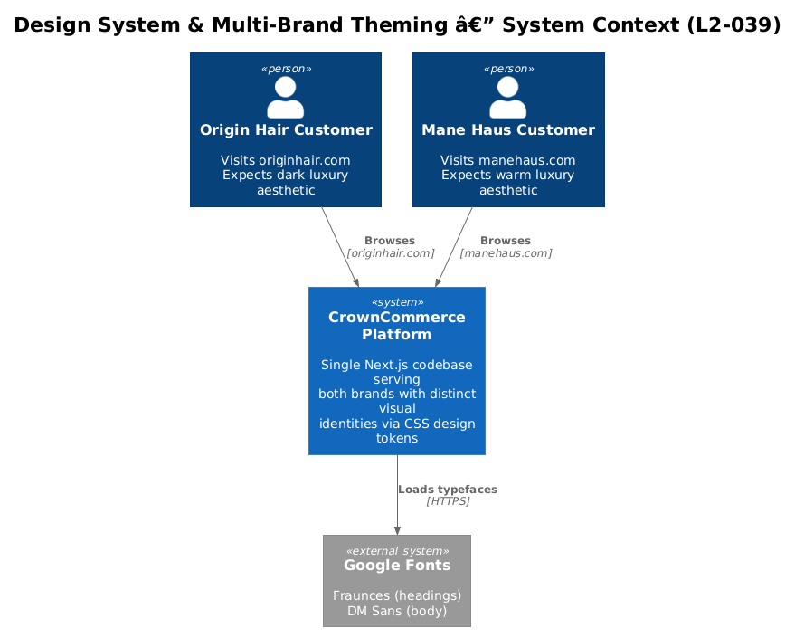
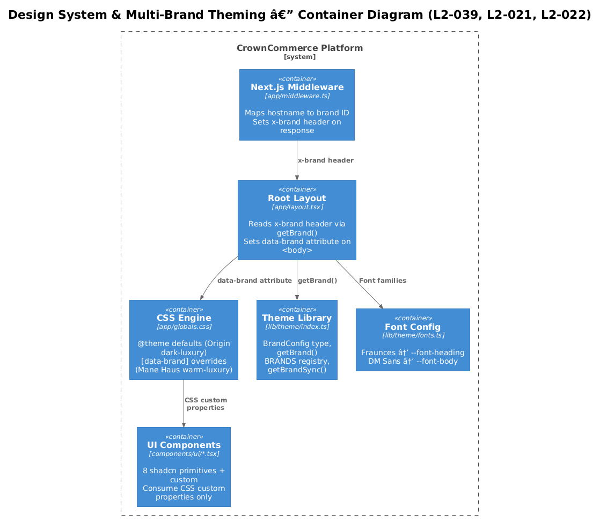
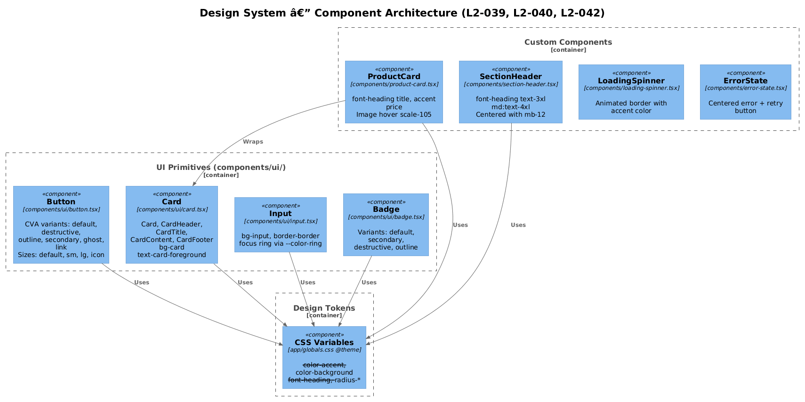
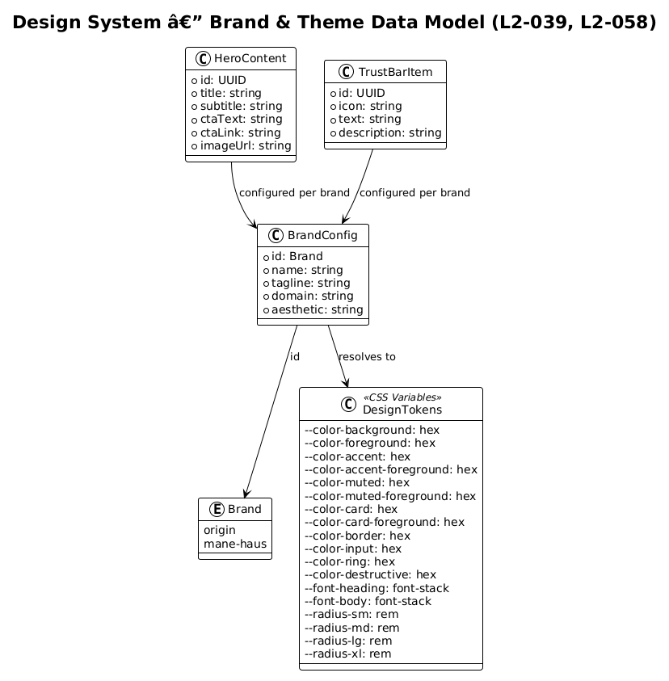
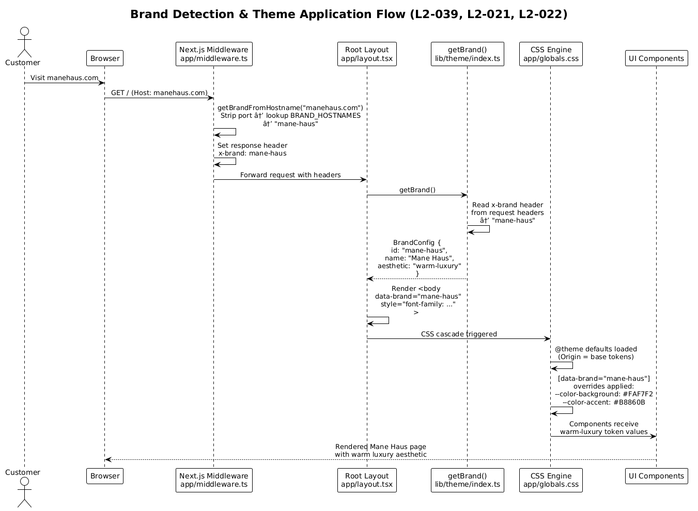
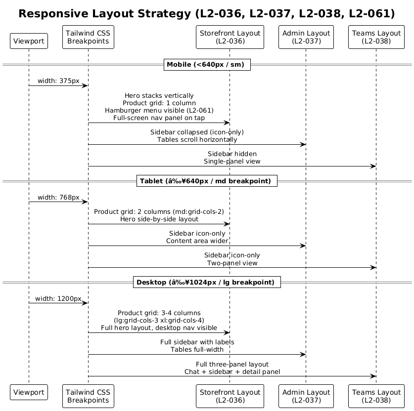

# Design System & Multi-Brand Theming — Detailed Design

## 1. Overview

The CrownCommerce design system enables two luxury hair brands — **Origin Hair Collective** and **Mane Haus** — to share a single Next.js codebase while maintaining visually distinct identities. Hostname-based routing determines which brand's CSS design tokens are applied at runtime through a `[data-brand]` attribute on the `<body>` element.

This document covers the CSS custom property token system, the brand detection pipeline, responsive layout strategies across storefront, admin, and teams interfaces, and the brand-aware component architecture.

### Actors

| Actor | Description |
|-------|-------------|
| Origin Hair Customer | Visits originhair.com; expects a dark luxury aesthetic with gold accents |
| Mane Haus Customer | Visits manehaus.com; expects a warm luxury aesthetic with dark goldenrod accents |
| Admin User | Manages products, orders via the admin dashboard |
| Team Member | Collaborates via the teams interface |

### Requirements Addressed

| ID | Requirement | Summary |
|----|-------------|---------|
| L2-039 | CSS Design Token System | Tokens for colors, typography, spacing; Origin = dark luxury, Mane Haus = warm luxury |
| L2-021 | Origin Hair Collective Storefront | Dark luxury brand: hero, trust bar, brand story, product grid, testimonials, gallery |
| L2-022 | Mane Haus Storefront | Warm luxury brand: shares features, distinct brand identity |
| L2-036 | Responsive Home Page | Hero stacks vertically on mobile; product grid scales 1→2→3→4 columns |
| L2-037 | Responsive Admin Panel | Collapsible sidebar on mobile; full sidebar ≥1024px; scrollable tables |
| L2-038 | Responsive Teams App | Hidden sidebar on mobile; full three-panel layout on desktop |
| L2-057 | Navigation & Routing | Complete route set with MainLayout wrapper for storefront |
| L2-058 | Home Page Configuration | Configurable hero content, sections, and brand messaging per brand |
| L2-061 | Mobile Navigation | Hamburger menu trigger, full-screen navigation panel |

---

## 2. Architecture

### 2.1 C4 Context Diagram



Two customer personas access the CrownCommerce platform through their respective brand domains. The platform resolves brand identity from the hostname and applies the corresponding visual theme. External dependency on Google Fonts provides the Fraunces (headings) and DM Sans (body) typefaces.

### 2.2 C4 Container Diagram



The theming pipeline spans five containers within the Next.js application:

| Container | Source | Responsibility |
|-----------|--------|----------------|
| Next.js Middleware | `app/middleware.ts` | Maps hostname → brand ID; sets `x-brand` response header |
| Root Layout | `app/layout.tsx` | Reads `x-brand` header; sets `data-brand` attribute on `<body>` |
| CSS Engine | `app/globals.css` | Defines `@theme` defaults (Origin) and `[data-brand]` overrides (Mane Haus) |
| Theme Library | `lib/theme/index.ts` | Exports `BrandConfig`, `BRANDS` registry, `getBrand()`, `getBrandSync()` |
| Font Config | `lib/theme/fonts.ts` | Defines Fraunces (`--font-heading`) and DM Sans (`--font-body`) font stacks |
| UI Components | `components/ui/*.tsx` | 8 shadcn primitives + custom components; consume CSS custom properties only |

### 2.3 C4 Component Diagram



Components are organized into three tiers:

1. **UI Primitives** — shadcn/ui components (Button, Card, Input, Badge) using CVA for variant management
2. **Custom Components** — Domain-specific components (ProductCard, SectionHeader, LoadingSpinner, ErrorState) that compose primitives
3. **Design Tokens** — CSS custom properties defined in `app/globals.css` via Tailwind v4 `@theme`

All components reference design tokens exclusively — no hardcoded color values.

---

## 3. Component Details

### 3.1 Brand Detection Pipeline

The brand detection pipeline flows through four stages:

```
Hostname → Middleware → x-brand Header → Root Layout → data-brand Attribute → CSS Cascade → Components
```

**Stage 1: Hostname Resolution** (`app/middleware.ts`)

```typescript
const BRAND_HOSTNAMES: Record<string, Brand> = {
  "originhair.com": "origin",
  "www.originhair.com": "origin",
  "manehaus.com": "mane-haus",
  "www.manehaus.com": "mane-haus",
};
```

The `getBrandFromHostname()` function strips the port number (for local development) and performs a lookup. Unrecognized hostnames fall back to `"origin"`.

**Stage 2: Header Propagation** (`app/middleware.ts`)

The middleware sets `x-brand` on the response headers. This allows server components to read the brand without re-parsing the hostname.

**Stage 3: Layout Application** (`app/layout.tsx`)

```typescript
const brand = await getBrand(); // reads x-brand header
// <body data-brand={brand.id === "mane-haus" ? "mane-haus" : undefined}>
```

The `data-brand` attribute is only set for Mane Haus. Origin uses the `@theme` defaults, avoiding an unnecessary attribute selector.

**Stage 4: CSS Cascade** (`app/globals.css`)

The `@theme` block defines Origin's tokens as defaults. The `[data-brand="mane-haus"]` selector overrides only the tokens that differ. Shared tokens (radii, destructive color, fonts) are inherited.

### 3.2 CSS Token Architecture

The token system uses Tailwind v4's `@theme` directive, which registers CSS custom properties at the `:root` level and makes them available as Tailwind utility classes.

**Default layer (Origin Hair Collective):**

```css
@theme {
  --color-background: #1A1A1C;
  --color-accent: #C9A962;
  --font-heading: "Fraunces", serif;
  /* ... full token set */
}
```

**Override layer (Mane Haus):**

```css
[data-brand="mane-haus"] {
  --color-background: #FAF7F2;
  --color-accent: #B8860B;
  /* ... overridden tokens only */
}
```

**Why `[data-brand]` attribute selectors?**

| Approach | Pros | Cons |
|----------|------|------|
| `[data-brand]` attribute (chosen) | Single-pass server render; no JS hydration flicker; works with any CSS engine | Slightly higher specificity than `:root` |
| Tailwind `darkMode: "class"` | Familiar pattern | Conflates dark mode with branding; limited to two states |
| CSS `@media prefers-color-scheme` | Zero JS | Cannot map to brand identity; user-controlled |
| Runtime JS token injection | Maximum flexibility | Causes FOUC; requires hydration |

### 3.3 Typography System

| Role | Font | CSS Variable | Fallback Stack | Usage |
|------|------|-------------|----------------|-------|
| Headings | Fraunces | `--font-heading` | Georgia, Cambria, 'Times New Roman', Times, serif | `h1`–`h4`, SectionHeader, ProductCard title |
| Body | DM Sans | `--font-body` | system-ui, -apple-system, BlinkMacSystemFont, 'Segoe UI', Roboto, sans-serif | Paragraphs, buttons, inputs, labels |

Font variables are set on the `<body>` element via the `style` attribute in `app/layout.tsx`, using the font configuration from `lib/theme/fonts.ts`. The `@theme` directive maps these to Tailwind utilities: `font-heading` and `font-body`.

Both brands share the same typefaces — brand differentiation is achieved through color tokens, not typography.

### 3.4 Responsive Breakpoint Strategy

The platform uses Tailwind's default breakpoints with mobile-first responsive design:

| Breakpoint | Width | Tailwind Prefix | Storefront (L2-036) | Admin (L2-037) | Teams (L2-038) |
|------------|-------|-----------------|---------------------|----------------|----------------|
| Base | <640px | (none) | 1-col grid, stacked hero, hamburger menu | Collapsed sidebar (icon-only), horizontal-scroll tables | Hidden sidebar, single panel |
| sm | ≥640px | `sm:` | Minor spacing adjustments | — | — |
| md | ≥768px | `md:` | 2-col product grid, side-by-side hero, `text-4xl` headings | Icon-only sidebar, wider content | Icon-only sidebar, two panels |
| lg | ≥1024px | `lg:` | 3-col product grid, desktop nav | Full sidebar with labels, full-width tables | Full three-panel layout |
| xl | ≥1280px | `xl:` | 4-col product grid | Max-width content container | — |

**Key responsive patterns:**

- **ProductGrid**: `grid-cols-1 md:grid-cols-2 lg:grid-cols-3 xl:grid-cols-4`
- **Hero section**: Stacks vertically on mobile, side-by-side on `md:`
- **SectionHeader**: `text-3xl md:text-4xl`
- **Admin sidebar**: Collapsed below `lg:`, full width at `lg:` and above
- **Teams layout**: Single panel → two panel → three panel progression
- **Mobile nav (L2-061)**: Hamburger icon triggers full-screen overlay panel

### 3.5 Component Token Usage

All UI components consume design tokens via Tailwind utility classes that reference CSS custom properties. No component contains hardcoded hex color values.

| Component | Source | Token Usage |
|-----------|--------|-------------|
| Button (default) | `components/ui/button.tsx` | `bg-accent text-accent-foreground hover:bg-accent/90` |
| Button (outline) | `components/ui/button.tsx` | `border-border bg-background hover:bg-muted` |
| Card | `components/ui/card.tsx` | `bg-card text-card-foreground border-border` |
| Input | `components/ui/input.tsx` | `bg-input border-border focus-visible:ring-ring` |
| Badge (default) | `components/ui/badge.tsx` | `bg-accent text-accent-foreground` |
| ProductCard | `components/product-card.tsx` | `font-heading` (title), `text-accent` (price), `border-accent/50` (hover), `bg-card` |
| SectionHeader | `components/section-header.tsx` | `font-heading`, `text-foreground`, `text-muted-foreground` (subtitle) |
| LoadingSpinner | `components/loading-spinner.tsx` | `border-accent` (animated ring) |
| ErrorState | `components/error-state.tsx` | `text-destructive` (message), Button (retry) |
| ChatWidget | `components/chat-widget.tsx` | `bg-accent text-accent-foreground` (trigger), `bg-card` (panel) |

### 3.6 Layout Component Architecture

| Layout | Source | Structure | Brand-Aware Elements |
|--------|--------|-----------|---------------------|
| Root | `app/layout.tsx` | `<html>` → `<body data-brand>` | `data-brand` attribute, font-family style |
| Storefront | `app/(storefront)/layout.tsx` | Header + MainLayout + Footer + ChatWidget | Brand name in header (`text-accent`), tagline in footer |
| Admin | `app/(admin)/layout.tsx` | Collapsible sidebar + main content | Sidebar uses `bg-card`, `border-border` |
| Teams | `app/(teams)/layout.tsx` | Three-panel (sidebar + main + detail) | Panel borders use `border-border` |
| Coming Soon | `app/(coming-soon)/layout.tsx` | Full-screen brand launch page | Fully brand-specific content and colors |

---

## 4. Data Model

### 4.1 Class Diagram



### 4.2 Brand Configuration

```typescript
export type Brand = "origin" | "mane-haus";

export interface BrandConfig {
  id: Brand;          // Unique identifier used in data-brand attribute
  name: string;       // Display name (e.g., "Origin Hair Collective")
  tagline: string;    // Brand tagline for headers/footers
  domain: string;     // Primary domain (e.g., "originhair.com")
  aesthetic: string;  // Theme descriptor ("dark-luxury" | "warm-luxury")
}
```

### 4.3 Home Page Content Types

```typescript
interface HeroContent {
  title: string;       // Main headline
  subtitle: string;    // Supporting text
  ctaText: string;     // Call-to-action button label
  ctaLink: string;     // CTA destination URL
  imageUrl: string;    // Hero image path
}

interface TrustBarItem {
  icon: string;        // Icon identifier
  text: string;        // Short label
  description: string; // Extended description
}
```

### 4.4 Design Token Reference

| Token | Origin Hair Collective | Mane Haus | Usage |
|-------|----------------------|-----------|-------|
| `--color-background` | `#1A1A1C` (near-black) | `#FAF7F2` (warm cream) | Page background, `bg-background` |
| `--color-foreground` | `#FAFAF9` (off-white) | `#1C1917` (near-black) | Primary text, `text-foreground` |
| `--color-accent` | `#C9A962` (gold) | `#B8860B` (dark goldenrod) | CTAs, links, prices, `bg-accent` / `text-accent` |
| `--color-accent-foreground` | `#1A1A1C` (dark) | `#FAF7F2` (light) | Text on accent backgrounds, `text-accent-foreground` |
| `--color-muted` | `#2A2A2E` (dark gray) | `#F5F0E8` (warm beige) | Secondary backgrounds, `bg-muted` |
| `--color-muted-foreground` | `#A1A1AA` (medium gray) | `#78716C` (warm gray) | Secondary text, `text-muted-foreground` |
| `--color-card` | `#232326` (charcoal) | `#FFFFFF` (white) | Card backgrounds, `bg-card` |
| `--color-card-foreground` | `#FAFAF9` (off-white) | `#1C1917` (near-black) | Card text, `text-card-foreground` |
| `--color-border` | `#3A3A3E` (dark border) | `#E7E0D5` (warm border) | Borders, `border-border` |
| `--color-input` | `#2A2A2E` (dark input) | `#F5F0E8` (warm input) | Input backgrounds, `bg-input` |
| `--color-ring` | `#C9A962` (gold) | `#B8860B` (dark goldenrod) | Focus rings, `ring-ring` |
| `--color-destructive` | `#EF4444` (red) | `#EF4444` (red) | Error states, `text-destructive` |
| `--font-heading` | `"Fraunces", serif` | `"Fraunces", serif` | Headings, `font-heading` |
| `--font-body` | `"DM Sans", sans-serif` | `"DM Sans", sans-serif` | Body text, `font-body` |
| `--radius-sm` | `0.25rem` | `0.25rem` | Small border radius |
| `--radius-md` | `0.375rem` | `0.375rem` | Medium border radius |
| `--radius-lg` | `0.5rem` | `0.5rem` | Large border radius |
| `--radius-xl` | `0.75rem` | `0.75rem` | Extra-large border radius |

**Note:** Typography, radii, and destructive color are shared across both brands. Only color palette tokens differ between themes.

---

## 5. Key Workflows

### 5.1 Brand Detection & Theme Application



**Step-by-step flow:**

1. **Customer visits** `manehaus.com` in their browser.
2. **Browser sends** `GET /` with `Host: manehaus.com` header.
3. **Middleware** (`app/middleware.ts`) calls `getBrandFromHostname("manehaus.com")`:
   - Strips port number (for dev environments)
   - Looks up `BRAND_HOSTNAMES["manehaus.com"]` → `"mane-haus"`
   - Falls back to `"origin"` if hostname is unrecognized
4. **Middleware sets** `x-brand: mane-haus` on the response headers.
5. **Root Layout** (`app/layout.tsx`) calls `getBrand()`:
   - Reads `x-brand` header from the request
   - Returns `BrandConfig { id: "mane-haus", name: "Mane Haus", aesthetic: "warm-luxury" }`
6. **Root Layout renders** `<body data-brand="mane-haus" style="font-family: ...">`.
7. **CSS Engine** resolves custom properties:
   - `@theme` defaults load (Origin base tokens)
   - `[data-brand="mane-haus"]` overrides activate
   - `--color-background` becomes `#FAF7F2`, `--color-accent` becomes `#B8860B`, etc.
8. **UI Components** receive warm-luxury token values through CSS custom properties.
9. **Browser renders** the Mane Haus page with the warm luxury aesthetic.

**Origin flow:** Steps 1–4 are the same except `x-brand: origin` is set. In step 6, `data-brand` is not set on `<body>` (Origin uses `@theme` defaults directly), so the CSS override selector does not match.

### 5.2 Responsive Layout Adaptation



**Storefront responsive behavior (L2-036, L2-061):**

| Viewport | Hero | Product Grid | Navigation |
|----------|------|-------------|------------|
| Mobile (<640px) | Stacked vertically: image above text | `grid-cols-1` | Hamburger menu → full-screen overlay |
| Tablet (≥768px) | Side-by-side: image + text | `md:grid-cols-2` | Hamburger menu still visible |
| Desktop (≥1024px) | Full width hero with overlaid text | `lg:grid-cols-3` | Full horizontal nav bar |
| Wide (≥1280px) | Constrained max-width | `xl:grid-cols-4` | Full horizontal nav bar |

**Admin responsive behavior (L2-037):**

| Viewport | Sidebar | Content | Tables |
|----------|---------|---------|--------|
| Mobile (<1024px) | Collapsed icon-only | Full width minus sidebar icons | Horizontal scroll with `overflow-x-auto` |
| Desktop (≥1024px) | Full width with labels | Adjusted width | Full-width display |

**Teams responsive behavior (L2-038):**

| Viewport | Sidebar | Main Panel | Detail Panel |
|----------|---------|------------|-------------|
| Mobile (<640px) | Hidden | Full width | Hidden (navigate to view) |
| Tablet (≥768px) | Icon-only | Expanded | Hidden |
| Desktop (≥1024px) | Full width | Center panel | Visible right panel |

### 5.3 Home Page Section Configuration (L2-058)

Each brand's home page is assembled from configurable content blocks:

| Section | Component | Content Source | Description |
|---------|-----------|---------------|-------------|
| Hero | `HeroSection` | `HeroContent` | Full-width hero with title, subtitle, CTA button, background image |
| Trust Bar | `TrustBar` | `TrustBarItem[]` | Icon + text badges (e.g., "100% Human Hair", "Free Shipping") |
| Brand Story | `BrandStory` | Static content | Brand narrative with image |
| Product Grid | `ProductGrid` | Product API | Responsive grid of `ProductCard` components |
| Testimonials | `TestimonialsSection` | `Testimonial[]` | Customer reviews with star ratings, `grid-cols-1 md:grid-cols-3` |
| Gallery | `GallerySection` | `GalleryImage[]` | Image gallery showcasing products in use |
| Newsletter CTA | `NewsletterSignup` | Static content | `SectionHeader` + email signup form, `py-16 bg-muted/50` |

Content data is defined per brand, allowing each brand to have distinct hero imagery, messaging, and featured products while sharing the same component architecture.

---

## 6. Design Decisions & Trade-offs

### 6.1 CSS Custom Properties vs. Tailwind Config Tokens

**Decision:** Use Tailwind v4 `@theme` directive to define CSS custom properties.

**Rationale:** Tailwind v4's `@theme` registers custom properties at the `:root` level and automatically generates utility classes (`bg-accent`, `text-foreground`, etc.). This provides the benefits of CSS custom properties (runtime overrides via `[data-brand]`) while preserving Tailwind's utility-first DX. No JavaScript is needed to switch themes — the CSS cascade handles it.

### 6.2 `[data-brand]` Attribute Selector Approach

**Decision:** Use a `data-brand` attribute on `<body>` with CSS attribute selectors for theme overrides.

**Rationale:** This approach delivers the correct theme on the initial server render with zero client-side hydration flicker. The attribute is set server-side in the Root Layout based on the `x-brand` header. CSS specificity is straightforward: `[data-brand="mane-haus"]` overrides `:root`/`@theme` defaults. Adding a third brand would require only a new attribute value and corresponding CSS block.

### 6.3 Origin as Default Theme

**Decision:** Origin Hair Collective tokens are the `@theme` defaults; Mane Haus overrides via `[data-brand]`.

**Rationale:** This means Origin requires no `data-brand` attribute, reducing DOM output for the primary brand. In `app/layout.tsx`, `data-brand` is only set when `brand.id === "mane-haus"`. This also means unrecognized hostnames gracefully fall back to Origin's dark luxury aesthetic.

### 6.4 Shared Typography Across Brands

**Decision:** Both brands use Fraunces for headings and DM Sans for body text.

**Rationale:** Typography consistency reinforces the premium positioning shared by both brands. Visual differentiation is achieved through the color palette alone, which simplifies the token system and reduces font loading overhead. Each brand's aesthetic ("dark-luxury" vs. "warm-luxury") is defined entirely by its color tokens.

---

## 7. Security Considerations

| Concern | Mitigation |
|---------|------------|
| Brand spoofing via hostname manipulation | Middleware falls back to `"origin"` for unrecognized hostnames; no sensitive data exposed through brand selection |
| CSS injection through brand identifier | Brand ID is an enum (`"origin" \| "mane-haus"`); never interpolated into CSS at runtime |
| Admin route access | Middleware checks `auth-token` cookie before allowing access to `/admin/*` routes |
| Team route access | Middleware checks `auth-token` cookie before allowing access to `/teams/*` routes |
| Cross-brand data leakage | Brand detection is purely visual (CSS tokens); all data APIs are brand-agnostic at the DB level |

---

## 8. Open Questions

| # | Question | Context | Impact |
|---|----------|---------|--------|
| 1 | Should a third brand be planned for in the token architecture? | Current system supports two brands with a simple override pattern | May need CSS layers or a more scalable override mechanism |
| 2 | Should brand-specific fonts be supported in the future? | Currently both brands share Fraunces + DM Sans | Would require per-brand font loading and additional CSS variables |
| 3 | How should brand-specific images/assets be organized? | Hero images, logos differ per brand | Need a convention for `public/` directory structure (e.g., `public/origin/`, `public/mane-haus/`) |
| 4 | Should dark mode be supported within each brand theme? | Origin is already dark; Mane Haus is light | `prefers-color-scheme` would conflict with the brand-as-theme approach |
| 5 | What is the animation/transition strategy for component interactions? | Hover states (e.g., ProductCard `scale-105`) exist but are ad-hoc | A shared motion token system (durations, easings) could improve consistency |
