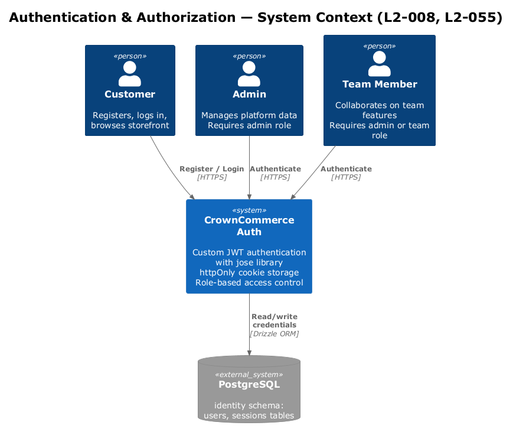
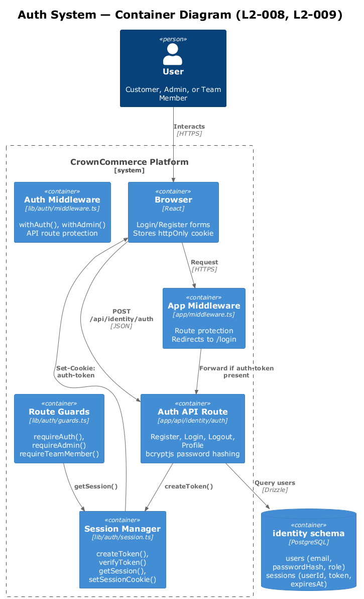
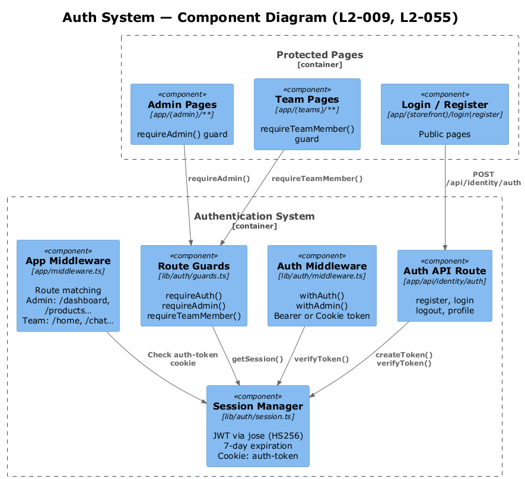
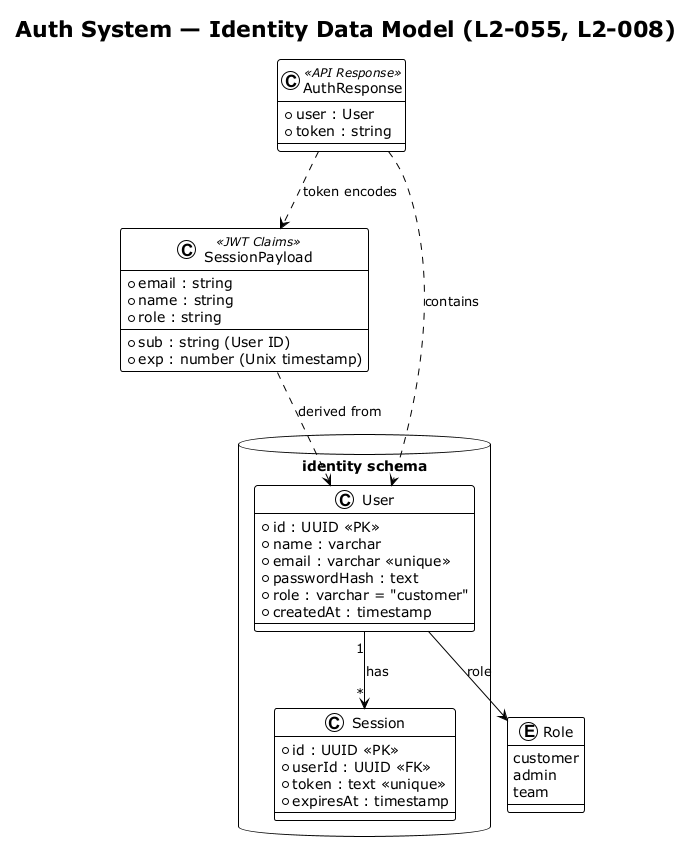
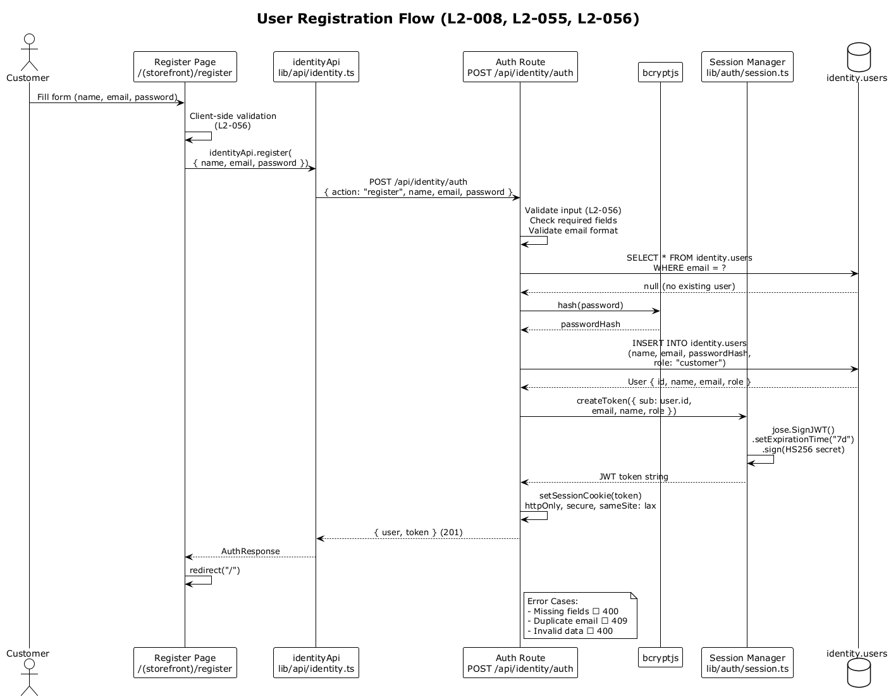
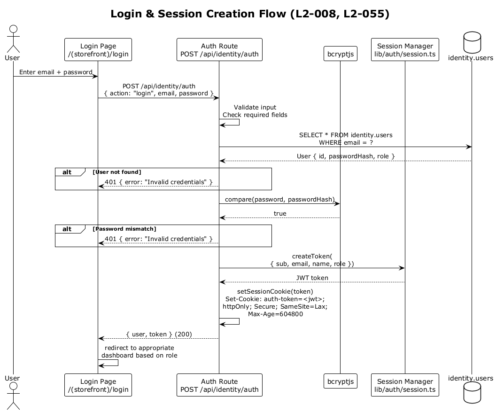
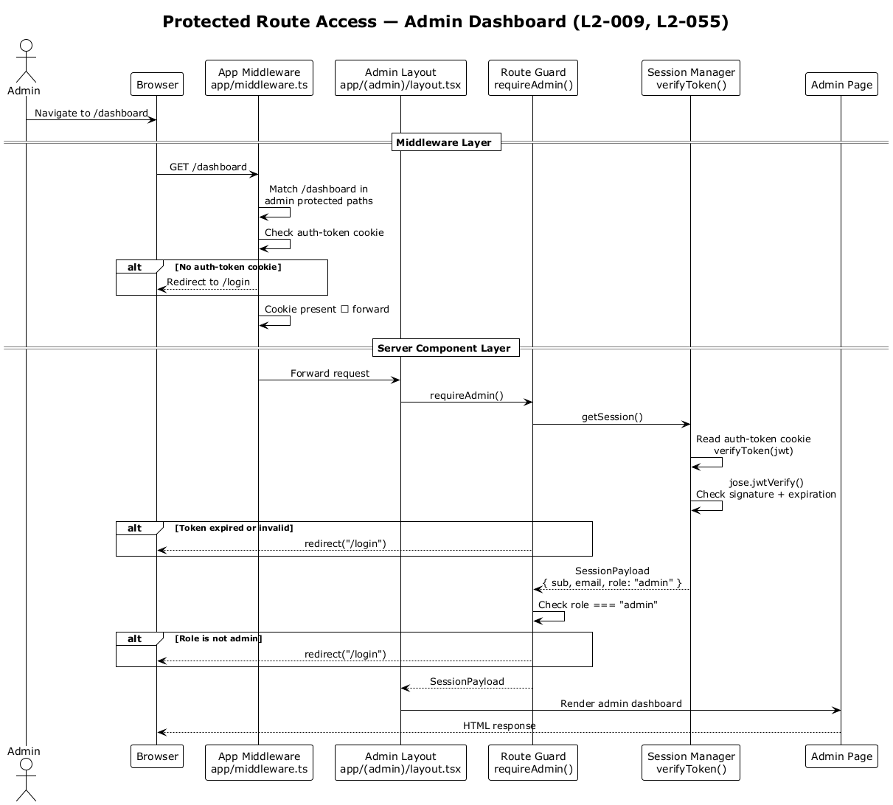

# Authentication & Authorization — Detailed Design

## 1. Overview

Custom JWT-based authentication using the `jose` library with httpOnly cookie storage. Three roles (`customer`, `admin`, `team`) with server-side guards and middleware-level route protection. Covers registration, login, session management, and role-based access control.

| Requirement | Summary |
|---|---|
| **L2-008** | User Registration and Login — POST register, POST login, GET profile, 401 for invalid/missing auth |
| **L2-009** | Auth Guards and Interceptors — token attachment, guards redirect, logout clears token |
| **L2-055** | Auth Token Security — JWT claims (sub, email, name, role), signing key externalized, expired → 401 |
| **L2-056** | Input Validation — validate all input, 400 for missing/invalid fields, XSS sanitization |

**Actors:**
- **Customer** — unauthenticated or authenticated storefront user who registers and logs in
- **Admin** — authenticated user with `role: "admin"` who manages platform data via the admin dashboard
- **Team Member** — authenticated user with `role: "admin"` or `role: "team"` who accesses team collaboration features

**Scope boundary:** This feature covers user identity, session management, and access control. Transactional emails (password reset) and OAuth/social login are out of scope for the current release.

## 2. Architecture

### 2.1 C4 Context Diagram

Shows the authentication system in the broader CrownCommerce landscape.



### 2.2 C4 Container Diagram

Technical containers involved in authentication and authorization operations.



### 2.3 C4 Component Diagram

Internal components within the Next.js application that implement authentication.



## 3. Component Details

### 3.1 Session Manager (`lib/auth/session.ts`)

- **Responsibility:** JWT token lifecycle — creation, verification, cookie management. Single source of truth for session state.
- **Interfaces:**
  - `createToken(payload: Omit<SessionPayload, "exp">): Promise<string>` — Signs a JWT with HS256 via `jose`, 7-day expiration
  - `verifyToken(token: string): Promise<SessionPayload | null>` — Verifies signature and expiry, returns claims or null
  - `getSession(): Promise<SessionPayload | null>` — Reads `auth-token` cookie and calls `verifyToken()`
  - `setSessionCookie(token: string)` — Sets httpOnly cookie with secure attributes
  - `clearSession()` — Deletes the `auth-token` cookie
- **Dependencies:** `jose` library, Next.js `cookies()` API
- **Configuration:**
  - Algorithm: `HS256`
  - Secret: `process.env.AUTH_SECRET` (fallback: `"development-secret-change-in-production"`)
  - Cookie name: `auth-token`
  - Cookie attributes: `httpOnly: true`, `secure: true` (production), `sameSite: "lax"`, `maxAge: 604800` (7 days)

### 3.2 Route Guards (`lib/auth/guards.ts`)

- **Responsibility:** Server-component-level access control. Called at the top of server component page files to enforce role requirements before rendering.
- **Interfaces:**
  - `requireAuth(): Promise<SessionPayload>` — Verifies any valid session exists; redirects to `/login` if absent
  - `requireAdmin(): Promise<SessionPayload>` — Verifies `role === "admin"`; redirects to `/login` if unauthorized
  - `requireTeamMember(): Promise<SessionPayload>` — Verifies `role === "admin"` or `role === "team"`; redirects to `/login` if unauthorized
- **Dependencies:** `getSession()` from Session Manager, Next.js `redirect()`
- **Design note (L2-009):** Guards redirect to `/login` rather than returning 403 because they run inside server components where HTTP status codes are not directly settable. The redirect provides a better UX for page-level access denial.

### 3.3 Auth Middleware (`lib/auth/middleware.ts`)

- **Responsibility:** API-route-level access control. Wraps API route handlers to enforce authentication and role requirements, returning proper HTTP status codes.
- **Interfaces:**
  - `withAuth(request, handler): Promise<NextResponse>` — Extracts token from `Authorization: Bearer <token>` header or `auth-token` cookie; validates via `verifyToken()`; returns 401 if missing/invalid; passes `SessionPayload` to handler
  - `withAdmin(request, handler): Promise<NextResponse>` — Calls `withAuth()`, then checks `role === "admin"`; returns 403 if not admin
- **Dependencies:** Session Manager `verifyToken()`
- **Design note:** Supports both Bearer token (for API clients) and cookie (for browser requests), enabling the same API routes to serve both contexts.

### 3.4 Identity API Route (`app/api/identity/auth/route.ts`)

- **Responsibility:** Single POST endpoint handling all authentication actions via an `action` discriminator field.
- **Actions:**
  - `register` — Validates input (L2-056), checks for duplicate email, hashes password with `bcryptjs`, inserts user into `identity.users`, creates JWT, sets cookie, returns `{ user, token }`
  - `login` — Validates input, looks up user by email, compares password with `bcryptjs`, creates JWT, sets cookie, returns `{ user, token }`
  - `logout` — Clears the session cookie
  - `profile` — Reads session from cookie, returns user data
- **Dependencies:** `bcryptjs`, Session Manager, Drizzle ORM, `identity.users` table
- **Design note (L2-008):** Using a single route with action discriminator keeps the API surface minimal. Each action is validated independently with specific error responses.

### 3.5 App Middleware (`app/middleware.ts`)

- **Responsibility:** Edge-level route protection that runs before any page rendering. Checks for `auth-token` cookie presence on protected routes and redirects to `/login` if absent.
- **Protected route sets:**
  - **Admin routes:** `/dashboard`, `/products`, `/origins`, `/customers`, `/orders`, `/leads`, `/inquiries`, `/testimonials`, `/faqs`, `/gallery`, `/content-pages`, `/subscribers`, `/campaigns`, `/employees`, `/users`, `/schedule`, `/meetings`, `/conversations`, `/hero-content`, `/trust-bar`
  - **Team routes:** `/home`, `/chat`, `/team`
- **Additional behavior:** Sets `x-brand` header from hostname for multi-brand routing
- **Design note (L2-009):** This middleware only checks cookie *presence*, not validity. Full token verification happens in the route guards and auth middleware. This layered approach avoids expensive crypto operations at the edge while still preventing unauthenticated navigation.

## 4. Data Model

### 4.1 Class Diagram



### 4.2 Entity Descriptions

**identity.users**
| Column | Type | Description |
|---|---|---|
| `id` | UUID (PK) | Auto-generated via `gen_random_uuid()` |
| `name` | VARCHAR | User display name, NOT NULL |
| `email` | VARCHAR | User email, UNIQUE, NOT NULL |
| `passwordHash` | TEXT | bcrypt hash of user password, NOT NULL |
| `role` | VARCHAR | One of `"customer"`, `"admin"`, `"team"`. Default `"customer"` |
| `createdAt` | TIMESTAMP | Row creation time, default `now()` |

**identity.sessions**
| Column | Type | Description |
|---|---|---|
| `id` | UUID (PK) | Session identifier |
| `userId` | UUID (FK→users) | Owning user |
| `token` | TEXT | JWT token string, UNIQUE, NOT NULL |
| `expiresAt` | TIMESTAMP | Token expiration time, NOT NULL |

**SessionPayload (JWT claims)**
| Claim | Type | Description |
|---|---|---|
| `sub` | string | User ID (maps to `identity.users.id`) |
| `email` | string | User email |
| `name` | string | User display name |
| `role` | string | User role (`customer`, `admin`, `team`) |
| `exp` | number | Expiration as Unix timestamp (7 days from creation) |

**Key relationships:**
- A user can have many sessions (1:N via `identity.sessions.userId`)
- Each session belongs to exactly one user
- The JWT `SessionPayload` is derived from the `User` record at token creation time

## 5. Key Workflows

### 5.1 User Registration Flow (L2-008, L2-055, L2-056)

Customer fills out the registration form, the system validates input, hashes the password, creates the user, issues a JWT, and sets the session cookie.



**Steps:**
1. Customer fills out name, email, password on the Register page
2. Client-side validation checks required fields and email format (L2-056)
3. `identityApi.register()` sends POST to `/api/identity/auth` with `{ action: "register", name, email, password }`
4. API validates all input server-side — missing fields → 400, invalid email format → 400
5. Checks for existing user with same email — duplicate → 409
6. Hashes password with `bcryptjs`
7. Inserts new user into `identity.users` with `role: "customer"`
8. Creates JWT via `createToken()` with `{ sub: user.id, email, name, role }`
9. Sets `auth-token` httpOnly cookie via `setSessionCookie()`
10. Returns `{ user, token }` with 201 status
11. Client redirects to homepage

**Trade-off:** Passwords are hashed with bcrypt (via `bcryptjs`) rather than Argon2. bcrypt is well-established and widely supported in JavaScript runtimes including edge functions. Argon2 offers better resistance to GPU attacks but requires native bindings that complicate deployment.

### 5.2 Login & Session Creation (L2-008, L2-055)

User logs in with email and password. The system verifies credentials, issues a JWT, and sets the session cookie.



**Steps:**
1. User enters email and password on the Login page
2. POST to `/api/identity/auth` with `{ action: "login", email, password }`
3. API queries `identity.users` by email
4. If user not found → 401 `"Invalid credentials"`
5. Compares submitted password against stored `passwordHash` via `bcryptjs.compare()`
6. If mismatch → 401 `"Invalid credentials"` (same error message to prevent email enumeration)
7. Creates JWT via `createToken()` with user claims
8. Sets `auth-token` cookie: `httpOnly; Secure; SameSite=Lax; Max-Age=604800`
9. Returns `{ user, token }` with 200 status
10. Client redirects to appropriate dashboard based on role

### 5.3 Protected Route Access (L2-009, L2-055)

Authenticated user navigates to an admin route. The request passes through two protection layers: app middleware (cookie presence check) and route guard (full token verification + role check).



**Steps:**
1. Admin navigates to `/dashboard`
2. App middleware matches path against admin protected routes
3. Middleware checks for `auth-token` cookie presence — missing → redirect to `/login`
4. Request forwarded to admin layout server component
5. Layout calls `requireAdmin()` guard
6. Guard calls `getSession()` → reads cookie → `verifyToken()` via `jose.jwtVerify()`
7. If token expired/invalid → redirect to `/login`
8. If `role !== "admin"` → redirect to `/login`
9. Guard returns `SessionPayload` to layout
10. Admin page renders

### 5.4 Logout Flow

1. Client calls `identityApi.logout()` → POST `/api/identity/auth` with `{ action: "logout" }`
2. API calls `clearSession()` which deletes the `auth-token` cookie
3. Returns 200 success
4. Client redirects to `/login`

### 5.5 API Route Protection (L2-009)

For API routes (not pages), the `withAuth()` / `withAdmin()` middleware wraps the handler:

1. Extract token from `Authorization: Bearer <token>` header, falling back to `auth-token` cookie
2. Call `verifyToken()` — invalid/missing → 401 JSON response
3. For `withAdmin()`: check `role === "admin"` — unauthorized → 403 JSON response
4. Pass `SessionPayload` to the wrapped handler function

## 6. API Contracts

### POST /api/identity/auth — Register
```typescript
// Request
{
  action: "register",
  name: string,      // required, non-empty
  email: string,     // required, valid email format
  password: string,  // required, non-empty
  role?: string      // optional, defaults to "customer"
}

// Response 201 (success)
{
  user: { id: string, name: string, email: string, role: string, createdAt: string },
  token: string  // JWT
}
// + Set-Cookie: auth-token=<jwt>; HttpOnly; Secure; SameSite=Lax; Max-Age=604800

// Response 400 (validation error)
{ error: "Missing required fields" }

// Response 409 (duplicate email)
{ error: "Email already registered" }
```

### POST /api/identity/auth — Login
```typescript
// Request
{
  action: "login",
  email: string,     // required
  password: string   // required
}

// Response 200 (success)
{
  user: { id: string, name: string, email: string, role: string },
  token: string  // JWT
}
// + Set-Cookie: auth-token=<jwt>; HttpOnly; Secure; SameSite=Lax; Max-Age=604800

// Response 401 (invalid credentials)
{ error: "Invalid credentials" }
```

### POST /api/identity/auth — Logout
```typescript
// Request
{ action: "logout" }

// Response 200
{ success: true }
// + Set-Cookie: auth-token=; Max-Age=0 (cookie deleted)
```

### POST /api/identity/auth — Profile
```typescript
// Request
{ action: "profile" }
// Requires valid auth-token cookie

// Response 200
{
  user: { id: string, name: string, email: string, role: string }
}

// Response 401 (no valid session)
{ error: "Unauthorized" }
```

### User Management (admin only)
```typescript
// GET /api/identity/users — List all users
// Requires withAdmin() middleware
User[]

// GET /api/identity/users/[id] — Get user by ID
User

// PUT /api/identity/users/[id] — Update user
Partial<User> → User

// DELETE /api/identity/users/[id] — Delete user
{ success: true }
```

## 7. Security Considerations

### 7.1 JWT Token Security (L2-055)

| Concern | Mitigation |
|---|---|
| **Signing algorithm** | HS256 (HMAC-SHA256) via `jose` library. Symmetric key stored in `AUTH_SECRET` env var. |
| **Secret management** | `process.env.AUTH_SECRET` with development fallback `"development-secret-change-in-production"`. Production deployments **must** set a strong, unique secret. |
| **Token expiration** | 7-day TTL set via `jose.setExpirationTime("7d")`. Expired tokens return 401. |
| **Token claims** | `sub` (user ID), `email`, `name`, `role`, `exp`. No sensitive data (password hash) in claims. |
| **Issuer/Audience** | Not currently implemented. Designed for future addition — `jose` supports `iss` and `aud` claims natively. |

### 7.2 Cookie Security

| Attribute | Value | Purpose |
|---|---|---|
| `httpOnly` | `true` | Prevents JavaScript access — mitigates XSS token theft |
| `secure` | `true` (production) | Cookie only sent over HTTPS |
| `sameSite` | `"lax"` | Prevents CSRF on state-changing requests while allowing top-level navigation |
| `maxAge` | `604800` (7 days) | Aligns with JWT expiration |
| `path` | `/` | Cookie available to all routes |

### 7.3 Password Security

- **Algorithm:** bcrypt via `bcryptjs` library
- **Storage:** Hashed password stored in `identity.users.passwordHash` column. Plain-text passwords are never persisted.
- **Comparison:** `bcryptjs.compare()` for timing-safe comparison during login

### 7.4 Role-Based Access Control Matrix

| Route Pattern | Required Role | Enforcement Layer |
|---|---|---|
| `/login`, `/register` | None (public) | — |
| `/` (storefront) | None (public) | — |
| `/dashboard`, `/products`, `/origins`, `/customers`, `/orders`, `/leads`, `/inquiries`, `/testimonials`, `/faqs`, `/gallery`, `/content-pages`, `/subscribers`, `/campaigns`, `/employees`, `/users`, `/schedule`, `/meetings`, `/conversations`, `/hero-content`, `/trust-bar` | `admin` | App Middleware (cookie presence) + `requireAdmin()` guard |
| `/home`, `/chat`, `/team` | `admin` or `team` | App Middleware (cookie presence) + `requireTeamMember()` guard |
| `POST /api/identity/auth` (register, login) | None | — |
| `POST /api/identity/auth` (profile) | Any authenticated | `auth-token` cookie required |
| `GET/PUT/DELETE /api/identity/users/*` | `admin` | `withAdmin()` middleware |

### 7.5 Protection Layers

The system uses a three-layer defense:

1. **App Middleware (`app/middleware.ts`)** — Edge-level. Checks cookie *presence* only (no crypto). Fast rejection of unauthenticated navigation to protected pages.
2. **Route Guards (`lib/auth/guards.ts`)** — Server-component-level. Full JWT verification + role check. Redirects unauthorized users to `/login`.
3. **Auth Middleware (`lib/auth/middleware.ts`)** — API-route-level. Full JWT verification + role check. Returns 401/403 JSON responses for API consumers.

### 7.6 Input Validation (L2-056)

- **Client-side:** Form components validate required fields and email format before submission
- **Server-side:** API route validates all fields independently — never trusts client validation
- **Error responses:** 400 for missing/invalid fields with descriptive error messages
- **XSS mitigation:** httpOnly cookies prevent token theft; React's built-in escaping prevents XSS in rendered content

### 7.7 Future Security Enhancements

| Enhancement | Description |
|---|---|
| **Token rotation** | Issue short-lived access tokens (15 min) with long-lived refresh tokens. Reduces window of exposure for stolen tokens. |
| **JWT issuer/audience** | Add `iss` and `aud` claims to prevent token reuse across environments. |
| **Rate limiting** | Throttle login attempts per IP/email to mitigate brute-force attacks. |
| **Account lockout** | Lock accounts after N failed login attempts with admin unlock flow. |
| **Password complexity** | Enforce minimum length, character variety requirements at registration. |
| **Session revocation** | Use the `identity.sessions` table for server-side session tracking, enabling forced logout. |

## 8. Open Questions

1. **Session table usage:** The `identity.sessions` table exists in the schema but is not currently used — JWTs are stateless. Should we implement server-side session tracking for revocation capability? This would add a DB lookup on every request but enable forced logout and "active sessions" management.

2. **Token refresh strategy:** The current 7-day token has no refresh mechanism. Should we implement a sliding window (extend on activity) or a separate refresh token endpoint? Sliding window is simpler but less secure; refresh tokens are more standard but add complexity.

3. **Password reset flow:** No password reset mechanism exists. This will require a separate token-based email flow (similar to newsletter confirmation) using the Notification Service (Feature 15).

4. **OAuth/Social login:** Should we support Google/GitHub OAuth as an alternative to email/password? This would require extending the `identity.users` schema with an `oauthProvider` field and integrating NextAuth or a custom OAuth flow.

5. **CSRF protection:** The `sameSite: "lax"` cookie attribute provides baseline CSRF protection. Should we add a CSRF token for additional defense-in-depth on state-changing API requests?
