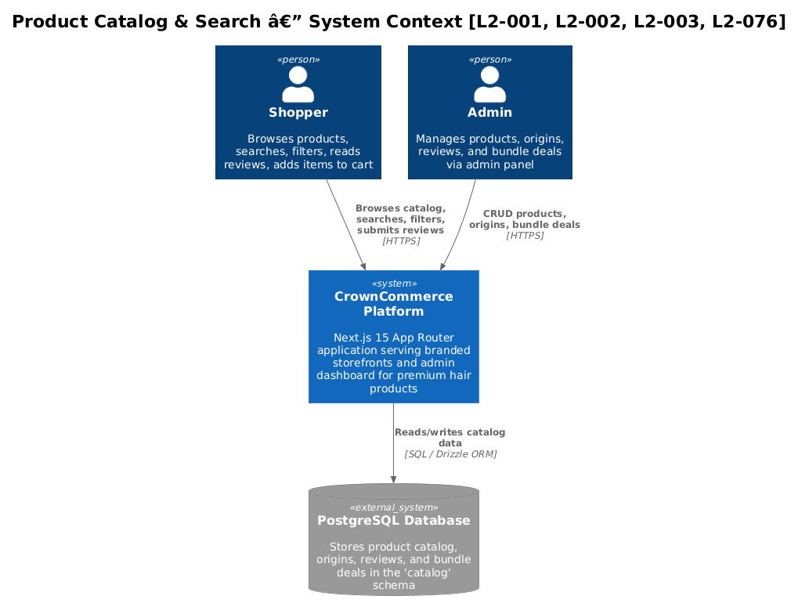
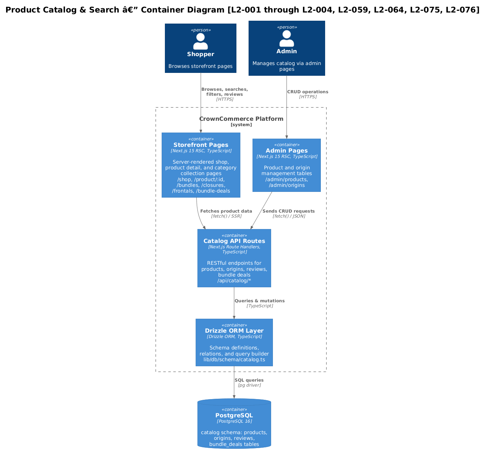
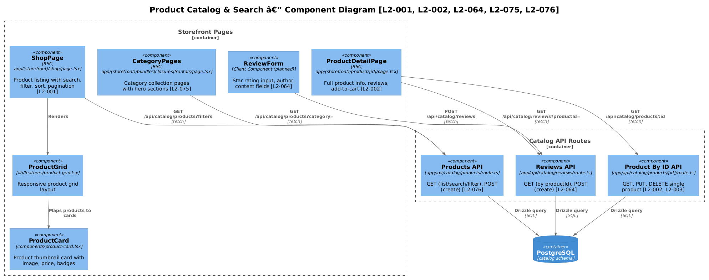
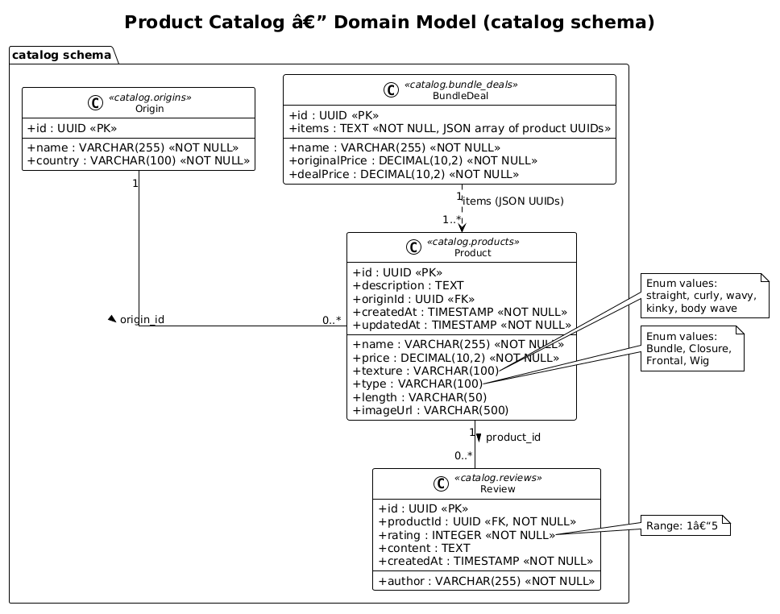
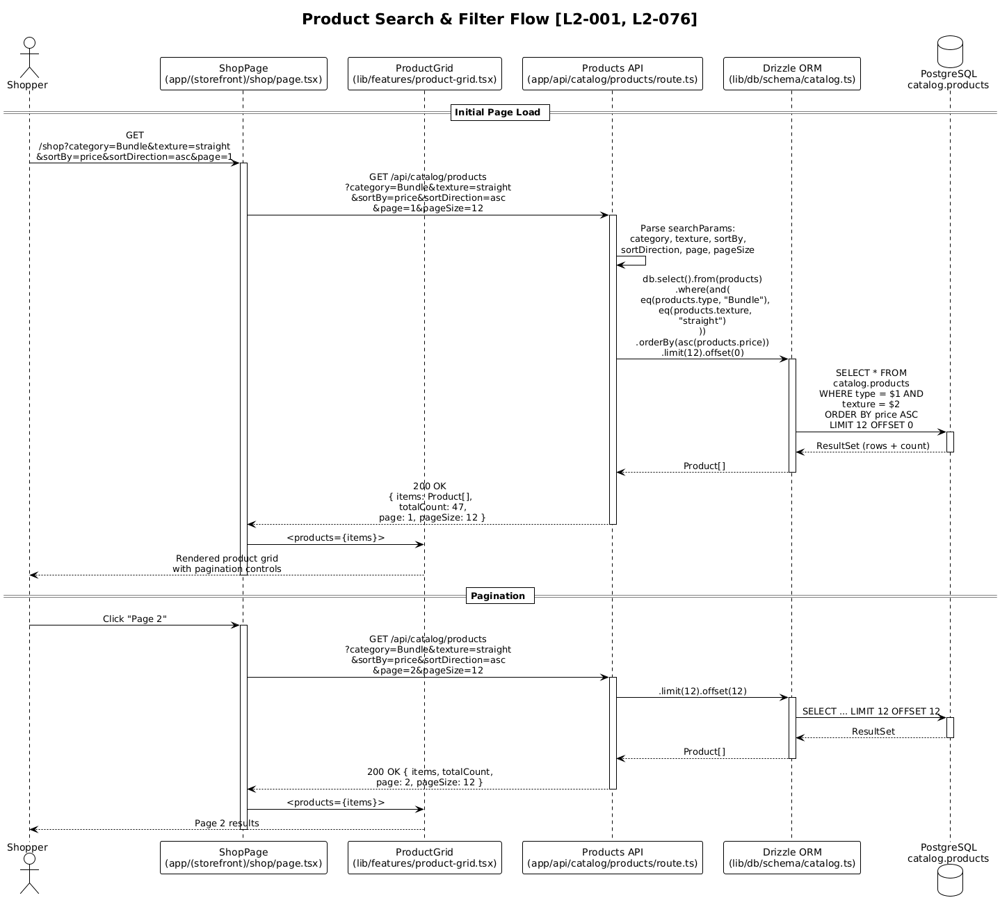
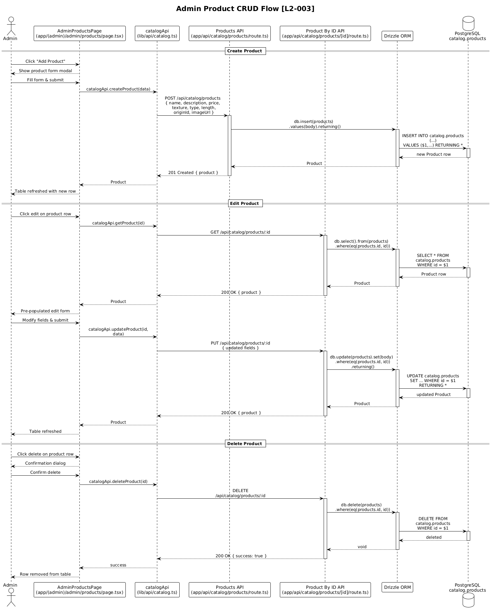
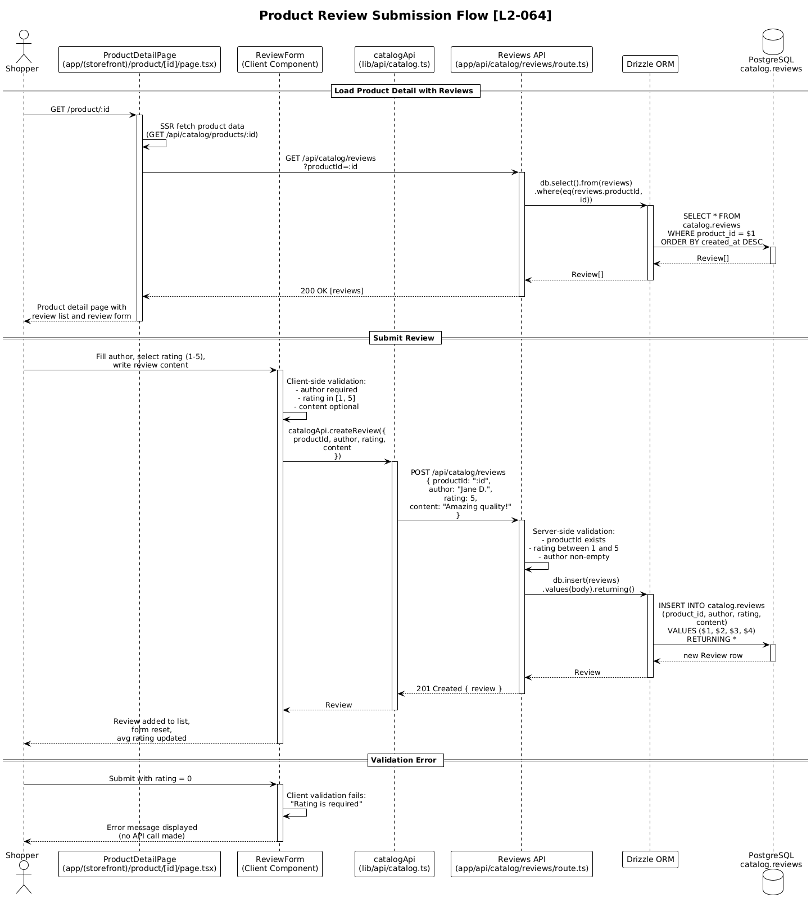

# Product Catalog & Search — Detailed Design

## 1. Overview

The Product Catalog & Search feature is the commercial backbone of the CrownCommerce platform. It enables shoppers to discover, browse, filter, and search premium hair products (bundles, closures, frontals, wigs) across two branded storefronts ("Origin" and "Mane Haus"), and provides administrators with full CRUD management of products, origins, reviews, and bundle deals.

### Purpose & Problem Solved

CrownCommerce needs a performant, filterable product catalog that serves both direct consumers and salon professionals. The catalog must support:

- **Browsing** — grid-based product listing with responsive layout
- **Filtering** — by category, texture, origin country, price range, and length
- **Sorting** — by price (ascending/descending), name (A–Z)
- **Search** — keyword-based product lookup
- **Pagination** — scalable result sets with page/pageSize controls
- **Category collections** — dedicated landing pages for bundles, closures, frontals, and bundle deals
- **Product detail** — full product information with reviews and add-to-cart
- **Admin management** — CRUD operations for products, origins, reviews, and bundle deals

### Actors

| Actor | Description |
|-------|-------------|
| **Shopper** | Unauthenticated or authenticated user browsing the storefront |
| **Admin** | Authenticated administrator managing catalog data via `/admin/*` routes |

### Scope

This design covers the catalog domain bounded by the `catalog` PostgreSQL schema, the `/api/catalog/*` API routes, storefront pages (`/shop`, `/product/:id`, `/bundles`, `/closures`, `/frontals`, `/bundle-deals`), and admin pages (`/admin/products`, `/admin/origins`).

### Requirements Traceability

| Requirement | Summary |
|-------------|---------|
| **L2-001** | Product Listing Page — shop page with grid, filtering, sorting |
| **L2-002** | Product Detail Page — full product info, add-to-cart, 404 handling |
| **L2-003** | Admin Product CRUD — data table with search, filter, pagination, create/edit/delete |
| **L2-004** | Admin Origin Management — CRUD for hair origin countries |
| **L2-059** | Bundle Deals — combined product deals at discounted prices |
| **L2-064** | Product Reviews — create/list reviews with ratings on product detail |
| **L2-075** | Category Collection Pages — `/bundles`, `/closures`, `/frontals`, `/bundle-deals` with hero sections and filter chips |
| **L2-076** | Advanced Product Search — query params for filtering, sorting, pagination, related products |

---

## 2. Architecture

### 2.1 C4 Context Diagram

Shows CrownCommerce in its system landscape with the actors (Shopper, Admin) and the external PostgreSQL database.



### 2.2 C4 Container Diagram

Breaks the system into its deployable containers: the Next.js application (serving both SSR pages and API routes) and the PostgreSQL database with the `catalog` schema.



### 2.3 C4 Component Diagram

Decomposes the catalog feature into its internal components: storefront UI, admin UI, API route handlers, and the Drizzle ORM data-access layer.



---

## 3. Component Details

### 3.1 ProductGrid (`lib/features/product-grid.tsx`)

- **Responsibility**: Renders a responsive grid of `ProductCard` components. Accepts a filtered/sorted product array and an optional title/subtitle for section headers.
- **Interfaces**: `ProductGridProps { title?, subtitle?, products[] }`
- **Dependencies**: `ProductCard`, `SectionHeader`
- **Behavior**: Renders 1 column on mobile (`<576px`), 2 columns on tablet (`sm:`), 3 columns on desktop (`lg:`), 4 columns on wide (`xl:`). Shows empty state when `products.length === 0`. *(L2-001)*

### 3.2 ProductCard (`components/product-card.tsx`)

- **Responsibility**: Displays a single product thumbnail with image, name, type badge, length, and price. Links to `/product/:id`.
- **Interfaces**: `ProductCardProps { id, name, price, imageUrl, texture?, type?, length? }`
- **Dependencies**: `next/image`, `next/link`, shadcn `Card`, `Badge`
- **Behavior**: Hover effect scales image and adds shadow. Renders "No image" placeholder when `imageUrl` is null. *(L2-001, L2-064 — future: display average star rating and review count)*

### 3.3 ShopPage (`app/(storefront)/shop/page.tsx`)

- **Responsibility**: Server component that fetches all products and renders them in a `ProductGrid`. Entry point for product browsing. *(L2-001)*
- **Interfaces**: Route `/shop` — no params currently; will accept `?category`, `?texture`, `?search`, `?sortBy`, `?page` query params per L2-076.
- **Dependencies**: `ProductGrid`, `GET /api/catalog/products`
- **Data flow**: SSR `fetch()` → API route → Drizzle → PostgreSQL → JSON → `ProductGrid`

### 3.4 ProductDetailPage (`app/(storefront)/product/[id]/page.tsx`)

- **Responsibility**: Displays full product information for a single product. Shows 404 page when product is not found. *(L2-002)*
- **Interfaces**: Route `/product/:id` — dynamic segment `[id]`
- **Dependencies**: `GET /api/catalog/products/:id`, shadcn `Button`, `Badge`, `next/image`
- **Behavior**: Two-column layout (image + details) on desktop, stacked on mobile. Includes type/texture badges, description, length, price, and "Add to Cart" button. Returns friendly 404 with "Back to Shop" link for invalid IDs. *(L2-002, L2-064 — future: paginated review list and review form)*

### 3.5 Category Collection Pages (`app/(storefront)/bundles|closures|frontals|bundle-deals/page.tsx`)

- **Responsibility**: Dedicated pages for each product category with category-specific hero sections and filtered product grids. *(L2-075)*
- **Current Implementation**: Each page fetches all products and filters client-side by `type` field (`"Bundle"`, `"Closure"`, `"Frontal"`). Bundle Deals page fetches from `/api/catalog/bundle-deals`.
- **Interfaces**: Routes `/bundles`, `/closures`, `/frontals`, `/bundle-deals`
- **Dependencies**: `ProductGrid`, `SectionHeader`, `GET /api/catalog/products`, `GET /api/catalog/bundle-deals`
- **Future**: Will use server-side `?category=` filter param per L2-076 instead of client-side filtering. Filter chips for texture/length per L2-075.

### 3.6 AdminProductsPage (`app/(admin)/admin/products/page.tsx`)

- **Responsibility**: Data table listing all products with name, type, price, and length columns. "Add Product" button in header. *(L2-003)*
- **Interfaces**: Route `/admin/products`
- **Dependencies**: `GET /api/catalog/products`, shadcn `Card`, `Button`, `Badge`
- **Future**: Search input, category/type filters, pagination controls, inline edit/delete actions with confirmation dialog. *(L2-003)*

### 3.7 AdminOriginsPage (`app/(admin)/admin/origins/page.tsx`)

- **Responsibility**: Data table listing all origins with name and country columns. "Add Origin" button in header. *(L2-004)*
- **Interfaces**: Route `/admin/origins`
- **Dependencies**: `GET /api/catalog/origins`, shadcn `Card`, `Button`
- **Future**: Inline edit/delete, create dialog. *(L2-004)*

### 3.8 Catalog API Routes (`app/api/catalog/*`)

- **Responsibility**: RESTful HTTP handlers for all catalog CRUD operations. Each route file exports `GET`, `POST`, `PUT`, and/or `DELETE` async functions following Next.js App Router conventions.
- **Routes**: See §6 API Contracts for full details.
- **Dependencies**: `db` (Drizzle instance), catalog schema tables, `drizzle-orm` operators (`eq`)
- **Error Handling**: All handlers wrap logic in try/catch. Returns `{ error: string }` with appropriate HTTP status codes (400, 404, 500).

### 3.9 Catalog API Client (`lib/api/catalog.ts`)

- **Responsibility**: TypeScript client that wraps the generic `api` fetch helper with typed methods for each catalog endpoint. Used by client components and can be used in SSR.
- **Interfaces**: `catalogApi.getProducts()`, `catalogApi.getProduct(id)`, `catalogApi.createProduct(data)`, etc.
- **Dependencies**: `lib/api/client.ts` (generic fetch wrapper)
- **Type exports**: `Product`, `Origin`, `Review`, `BundleDeal` interfaces

### 3.10 Drizzle Schema & Relations (`lib/db/schema/catalog.ts`)

- **Responsibility**: Defines the `catalog` PostgreSQL schema with four tables and their ORM relations. Serves as the single source of truth for the catalog data model.
- **Tables**: `products`, `origins`, `reviews`, `bundle_deals` — all in `pgSchema("catalog")`
- **Relations**: `products.originId → origins.id` (many-to-one), `reviews.productId → products.id` (many-to-one)
- **Dependencies**: `drizzle-orm/pg-core`, `drizzle-orm`

---

## 4. Data Model

### 4.1 Class Diagram



### 4.2 Entity Descriptions

#### Product (`catalog.products`)

The central entity representing a hair product available for purchase.

| Column | Type | Constraints | Description |
|--------|------|-------------|-------------|
| `id` | `UUID` | PK, auto-generated | Unique product identifier |
| `name` | `VARCHAR(255)` | NOT NULL | Product display name |
| `description` | `TEXT` | nullable | Long-form product description |
| `price` | `DECIMAL(10,2)` | NOT NULL | Unit price in USD |
| `texture` | `VARCHAR(100)` | nullable | Hair texture (straight, curly, wavy, kinky, body wave) |
| `type` | `VARCHAR(100)` | nullable | Product category (Bundle, Closure, Frontal, Wig) |
| `length` | `VARCHAR(50)` | nullable | Hair length (e.g., "18\"", "20\"") |
| `origin_id` | `UUID` | FK → `origins.id`, nullable | Reference to hair origin country |
| `image_url` | `VARCHAR(500)` | nullable | URL to product image |
| `created_at` | `TIMESTAMP` | NOT NULL, default NOW | Record creation timestamp |
| `updated_at` | `TIMESTAMP` | NOT NULL, default NOW | Last modification timestamp |

#### Origin (`catalog.origins`)

Represents a geographic origin for hair products. Used for filtering and provenance display.

| Column | Type | Constraints | Description |
|--------|------|-------------|-------------|
| `id` | `UUID` | PK, auto-generated | Unique origin identifier |
| `name` | `VARCHAR(255)` | NOT NULL | Origin display name (e.g., "Brazilian Virgin") |
| `country` | `VARCHAR(100)` | NOT NULL | Country of origin (e.g., "Brazil") |

#### Review (`catalog.reviews`)

Customer-submitted product review with a 1–5 star rating. *(L2-064)*

| Column | Type | Constraints | Description |
|--------|------|-------------|-------------|
| `id` | `UUID` | PK, auto-generated | Unique review identifier |
| `product_id` | `UUID` | FK → `products.id`, NOT NULL | Reviewed product |
| `author` | `VARCHAR(255)` | NOT NULL | Reviewer display name |
| `rating` | `INTEGER` | NOT NULL, range 1–5 | Star rating |
| `content` | `TEXT` | nullable | Review body text |
| `created_at` | `TIMESTAMP` | NOT NULL, default NOW | Submission timestamp |

#### BundleDeal (`catalog.bundle_deals`)

A promotional package combining multiple products at a discounted price. *(L2-059)*

| Column | Type | Constraints | Description |
|--------|------|-------------|-------------|
| `id` | `UUID` | PK, auto-generated | Unique deal identifier |
| `name` | `VARCHAR(255)` | NOT NULL | Deal display name |
| `items` | `TEXT` | NOT NULL | JSON-serialized array of product UUIDs |
| `original_price` | `DECIMAL(10,2)` | NOT NULL | Sum of individual product prices |
| `deal_price` | `DECIMAL(10,2)` | NOT NULL | Discounted bundle price |

### 4.3 Relationships

| Relationship | Type | Description |
|-------------|------|-------------|
| Product → Origin | Many-to-One | Each product optionally references one origin via `origin_id` |
| Product → Review | One-to-Many | Each product can have many reviews via `reviews.product_id` |
| BundleDeal → Product | Many-to-Many (logical) | `bundle_deals.items` stores a JSON array of product UUIDs — no FK constraint |

---

## 5. Key Workflows

### 5.1 Product Search & Filter *(L2-001, L2-076)*

A shopper navigates to the shop page, applies filters (category, texture, origin, price range), enters a search term, selects a sort option, and pages through results.

**Flow:**
1. Shopper loads `/shop` (or `/bundles`, `/closures`, `/frontals`)
2. Next.js SSR calls `GET /api/catalog/products` with query params (`?category=Bundle&texture=straight&sortBy=price&sortDirection=asc&page=1&pageSize=12`)
3. API route handler parses `searchParams`, builds a Drizzle query with `where()` clauses and `orderBy()`
4. Drizzle executes the parameterized SQL against `catalog.products` (with optional JOIN to `catalog.origins`)
5. API returns paginated response: `{ items: Product[], totalCount: number, page: number, pageSize: number }`
6. `ProductGrid` renders the product cards; pagination controls update the URL query params



### 5.2 Admin Product CRUD *(L2-003)*

An admin creates, edits, or deletes a product through the admin products page.

**Create flow:**
1. Admin clicks "Add Product" → modal/form opens
2. Admin fills form fields (name, description, price, texture, type, length, origin, image URL)
3. Client calls `POST /api/catalog/products` with JSON body
4. API route validates and inserts via `db.insert(products).values(body).returning()`
5. New product returned with 201 status; table refreshes

**Edit flow:**
1. Admin clicks edit action on a product row
2. Form pre-populated via `GET /api/catalog/products/:id`
3. Admin modifies fields, submits
4. Client calls `PUT /api/catalog/products/:id` with updated fields
5. API route executes `db.update(products).set(body).where(eq(products.id, id)).returning()`

**Delete flow:**
1. Admin clicks delete action → confirmation dialog appears
2. On confirm, client calls `DELETE /api/catalog/products/:id`
3. API route executes `db.delete(products).where(eq(products.id, id))`
4. Returns `{ success: true }`; table refreshes



### 5.3 Product Review Submission *(L2-064)*

A shopper submits a review on a product detail page.

**Flow:**
1. Shopper navigates to `/product/:id`
2. Page loads product data and existing reviews via `GET /api/catalog/products/:id` and `GET /api/catalog/reviews?productId=:id`
3. Shopper fills the review form (author name, rating 1–5, content)
4. Client validates: author required, rating required and in [1,5], content optional
5. Client calls `POST /api/catalog/reviews` with `{ productId, author, rating, content }`
6. API route inserts via `db.insert(reviews).values(body).returning()`
7. New review returned with 201 status; review list refreshes
8. Product card's average rating and review count update on next render



---

## 6. API Contracts

All endpoints are under `/api/catalog/`. Request and response bodies are JSON. Errors follow the shape `{ "error": "message" }`.

### 6.1 Products

#### `GET /api/catalog/products`

List products with optional filtering, sorting, and pagination. *(L2-001, L2-076)*

**Query Parameters:**

| Param | Type | Description |
|-------|------|-------------|
| `category` | `string` | Filter by type: `Bundle`, `Closure`, `Frontal`, `Wig` |
| `texture` | `string` | Filter by texture: `straight`, `curly`, `wavy`, `kinky`, `body wave` |
| `search` | `string` | Keyword search across `name` and `description` |
| `minPrice` | `string` | Minimum price (inclusive) |
| `maxPrice` | `string` | Maximum price (inclusive) |
| `lengthInches` | `string` | Filter by length value |
| `originId` | `string` | Filter by origin UUID |
| `sortBy` | `string` | Sort field: `price`, `name`, `createdAt` (default: `createdAt`) |
| `sortDirection` | `string` | `asc` or `desc` (default: `desc`) |
| `page` | `string` | Page number (default: `1`) |
| `pageSize` | `string` | Items per page (default: `12`, max: `50`) |

**Response (200):**

```json
{
  "items": [
    {
      "id": "550e8400-e29b-41d4-a716-446655440000",
      "name": "Brazilian Straight Bundle",
      "description": "Premium virgin hair bundle...",
      "price": "89.99",
      "texture": "straight",
      "type": "Bundle",
      "length": "18\"",
      "originId": "660e8400-e29b-41d4-a716-446655440001",
      "imageUrl": "https://cdn.example.com/products/brazilian-straight.jpg",
      "createdAt": "2025-01-15T10:30:00.000Z",
      "updatedAt": "2025-01-15T10:30:00.000Z"
    }
  ],
  "totalCount": 47,
  "page": 1,
  "pageSize": 12
}
```

**Current implementation note:** The existing `GET` handler returns a flat `Product[]` without pagination. The paginated envelope shape above is the target per L2-076.

#### `GET /api/catalog/products/:id`

Fetch a single product by UUID. *(L2-002)*

**Response (200):**
```json
{
  "id": "550e8400-e29b-41d4-a716-446655440000",
  "name": "Brazilian Straight Bundle",
  "description": "Premium virgin hair bundle...",
  "price": "89.99",
  "texture": "straight",
  "type": "Bundle",
  "length": "18\"",
  "originId": "660e8400-e29b-41d4-a716-446655440001",
  "imageUrl": "https://cdn.example.com/products/brazilian-straight.jpg",
  "createdAt": "2025-01-15T10:30:00.000Z",
  "updatedAt": "2025-01-15T10:30:00.000Z"
}
```

**Response (404):**
```json
{ "error": "Not found" }
```

#### `GET /api/catalog/products/:id/related`

Fetch related products (same category/texture, excluding the current product). *(L2-076)*

**Response (200):**
```json
[
  { "id": "...", "name": "...", "price": "...", "imageUrl": "...", "type": "...", "texture": "..." }
]
```

Returns up to 4 products matching the same `type` or `texture`, ordered by `createdAt desc`.

#### `POST /api/catalog/products`

Create a new product. Requires admin authentication. *(L2-003)*

**Request body:**
```json
{
  "name": "Brazilian Straight Bundle",
  "description": "Premium virgin hair bundle...",
  "price": "89.99",
  "texture": "straight",
  "type": "Bundle",
  "length": "18\"",
  "originId": "660e8400-e29b-41d4-a716-446655440001",
  "imageUrl": "https://cdn.example.com/products/brazilian-straight.jpg"
}
```

**Response (201):** Full product object with generated `id`, `createdAt`, `updatedAt`.

**Response (500):**
```json
{ "error": "Failed to create product" }
```

#### `PUT /api/catalog/products/:id`

Update an existing product. Partial updates supported. Requires admin authentication. *(L2-003)*

**Request body:** Any subset of product fields.

**Response (200):** Updated product object.

**Response (404):**
```json
{ "error": "Not found" }
```

#### `DELETE /api/catalog/products/:id`

Delete a product. Requires admin authentication. *(L2-003)*

**Response (200):**
```json
{ "success": true }
```

---

### 6.2 Origins

#### `GET /api/catalog/origins`

List all hair origins. *(L2-004)*

**Response (200):**
```json
[
  { "id": "660e8400-...", "name": "Brazilian Virgin", "country": "Brazil" },
  { "id": "770e8400-...", "name": "Peruvian Virgin", "country": "Peru" }
]
```

#### `GET /api/catalog/origins/:id`

Fetch a single origin. *(L2-004)*

**Response (200):** Single `Origin` object.
**Response (404):** `{ "error": "Not found" }`

#### `POST /api/catalog/origins`

Create a new origin. Requires admin authentication. *(L2-004)*

**Request body:**
```json
{ "name": "Indian Remy", "country": "India" }
```

**Response (201):** Full origin object with generated `id`.

#### `PUT /api/catalog/origins/:id`

Update an origin. *(L2-004)*

**Response (200):** Updated origin object.
**Response (404):** `{ "error": "Not found" }`

#### `DELETE /api/catalog/origins/:id`

Delete an origin. *(L2-004)*

**Response (200):** `{ "success": true }`

---

### 6.3 Reviews

#### `GET /api/catalog/reviews`

List reviews, optionally filtered by product. *(L2-064)*

**Query Parameters:**

| Param | Type | Description |
|-------|------|-------------|
| `productId` | `string` | Filter reviews for a specific product UUID |

**Response (200):**
```json
[
  {
    "id": "880e8400-...",
    "productId": "550e8400-...",
    "author": "Jane D.",
    "rating": 5,
    "content": "Amazing quality, very soft and silky!",
    "createdAt": "2025-02-01T14:20:00.000Z"
  }
]
```

#### `POST /api/catalog/reviews`

Submit a new product review. *(L2-064)*

**Request body:**
```json
{
  "productId": "550e8400-e29b-41d4-a716-446655440000",
  "author": "Jane D.",
  "rating": 5,
  "content": "Amazing quality!"
}
```

**Validation rules:**
- `productId` — required, must be valid UUID referencing an existing product
- `author` — required, non-empty string, max 255 characters
- `rating` — required, integer in range [1, 5]
- `content` — optional, text

**Response (201):** Full review object with generated `id` and `createdAt`.

**Response (400):**
```json
{ "error": "Rating must be between 1 and 5" }
```

---

### 6.4 Bundle Deals

#### `GET /api/catalog/bundle-deals`

List all bundle deals. *(L2-059)*

**Response (200):**
```json
[
  {
    "id": "990e8400-...",
    "name": "Complete Brazilian Set",
    "items": "[\"550e8400-...\", \"551e8400-...\", \"552e8400-...\"]",
    "originalPrice": "269.97",
    "dealPrice": "219.99"
  }
]
```

Note: `items` is a JSON-encoded string. Consumers must `JSON.parse(deal.items)` to get the product UUID array.

#### `POST /api/catalog/bundle-deals`

Create a new bundle deal. Requires admin authentication. *(L2-059)*

**Request body:**
```json
{
  "name": "Complete Brazilian Set",
  "items": "[\"550e8400-...\", \"551e8400-...\"]",
  "originalPrice": "269.97",
  "dealPrice": "219.99"
}
```

**Response (201):** Full bundle deal object with generated `id`.

---

### 6.5 Error Response Shapes

All error responses follow a consistent shape:

| Status | Shape | When |
|--------|-------|------|
| `400` | `{ "error": "Validation message" }` | Invalid request body or params |
| `404` | `{ "error": "Not found" }` | Resource does not exist |
| `500` | `{ "error": "Failed to {action} {resource}" }` | Unexpected server error |

---

## 7. Security Considerations

### 7.1 Authentication & Authorization

- **Storefront routes** (`/shop`, `/product/:id`, category pages): Public access, no authentication required.
- **Admin routes** (`/admin/products`, `/admin/origins`): Requires authenticated admin session. Authentication is handled via custom JWT (`jose` library) stored in an httpOnly cookie named `auth-token`.
- **API write operations** (`POST`, `PUT`, `DELETE`): Should validate the `auth-token` cookie and verify admin role before processing. Currently, the API route handlers do not enforce authentication — this is a known gap to be addressed.
- **API read operations** (`GET`): Public access for storefront consumption.

### 7.2 Input Validation

- **Product creation/update**: Validate `name` (required, max 255 chars), `price` (required, positive decimal), `texture` (enum), `type` (enum), `length` (format validation).
- **Review submission**: Validate `rating` in [1, 5], `author` required, `productId` references existing product.
- **Bundle deals**: Validate `items` is valid JSON array of UUIDs, `dealPrice < originalPrice`.
- **SQL injection**: Mitigated by Drizzle ORM's parameterized queries — no raw SQL concatenation.

### 7.3 Data Protection

- **UUID primary keys**: Prevents sequential enumeration of resources.
- **No PII in catalog**: Product and origin data is non-sensitive. Review `author` is a display name, not linked to user accounts.
- **Rate limiting**: Consider adding rate limiting to `POST /api/catalog/reviews` to prevent spam.

### 7.4 CORS & Same-Origin

- All API routes are served from the same Next.js origin — no CORS configuration needed.
- The `auth-token` cookie is httpOnly and same-site, preventing XSS-based token theft.

---

## 8. Open Questions

| # | Question | Context |
|---|----------|---------|
| 1 | **Should product filtering/sorting happen server-side or client-side?** | Currently, category pages fetch all products and filter in the component. L2-076 specifies server-side query params. Migration path needed. |
| 2 | **Should `bundle_deals.items` be a proper join table?** | Currently stored as a JSON string of product UUIDs with no FK constraint. A `bundle_deal_items` join table would enable referential integrity and cascading deletes. |
| 3 | **How should full-text search be implemented?** | Options: PostgreSQL `ILIKE` for simple search, `tsvector/tsquery` for full-text, or a dedicated search service (e.g., Meilisearch). Performance implications differ. |
| 4 | **Should reviews require authentication?** | L2-064 specifies `author` as a free-text field. Linking reviews to authenticated users would prevent abuse but adds complexity. |
| 5 | **What is the pagination limit for reviews?** | L2-064 says "paginated reviews" but doesn't specify page size. Suggest defaulting to 10 reviews per page. |
| 6 | **Should admin API routes validate the `auth-token` JWT?** | Current handlers have no auth checks. Need to decide: middleware-level protection for `/api/catalog/*` write methods, or per-handler validation. |
| 7 | **How should `GET /products/:id/related` determine relatedness?** | L2-076 mentions related products but not the algorithm. Current plan: match on `type` or `texture`, limit 4. Consider collaborative filtering in future. |
