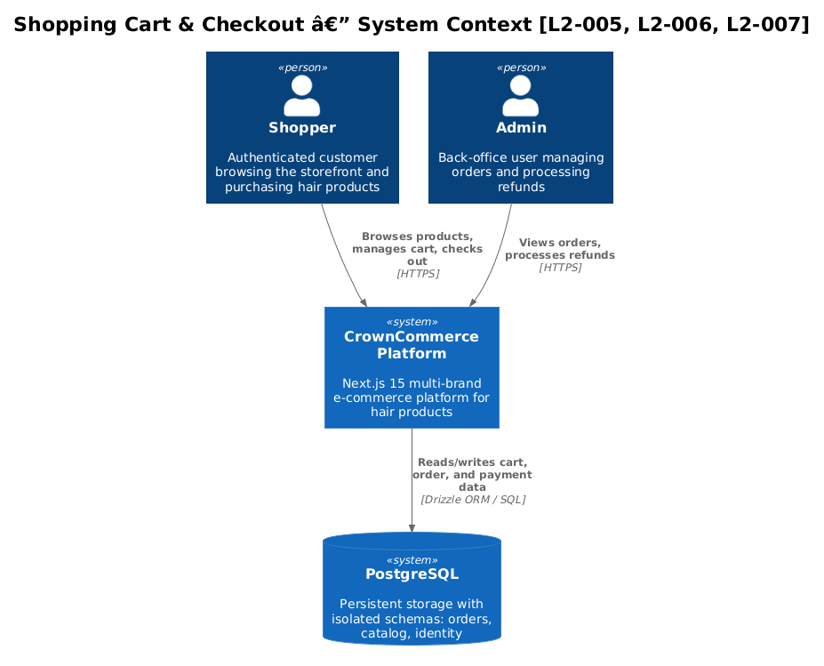
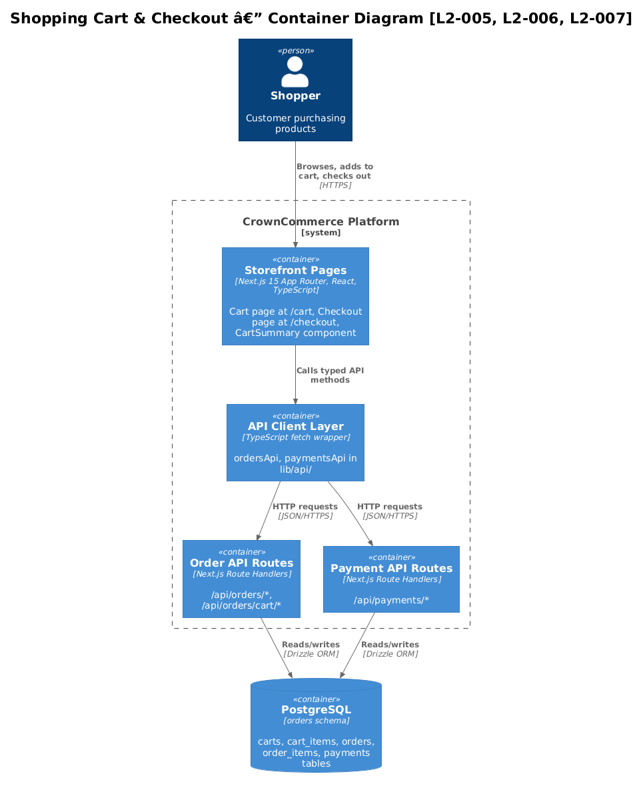
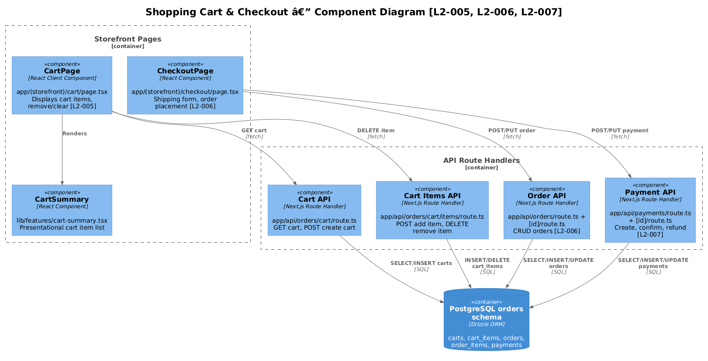
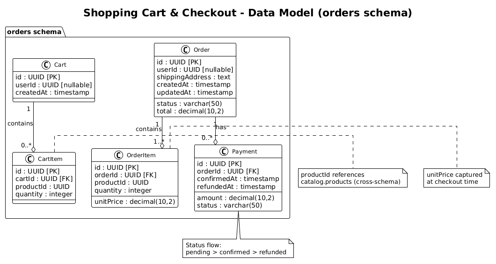
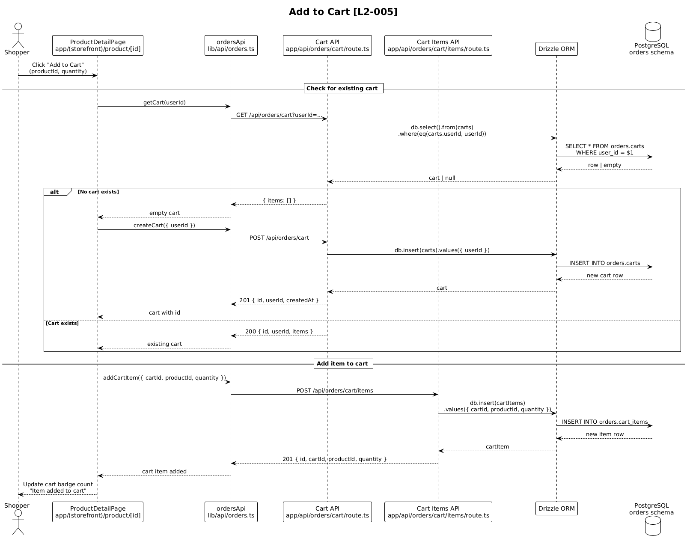
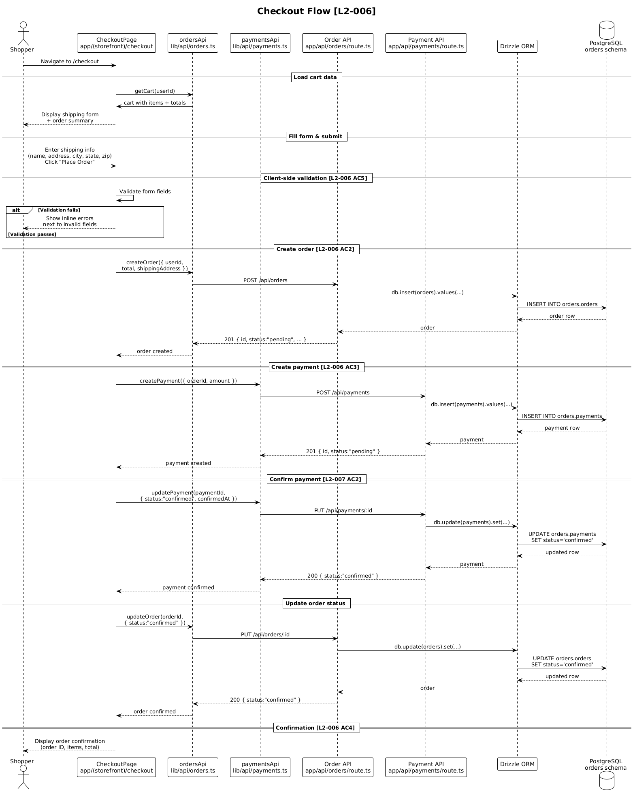
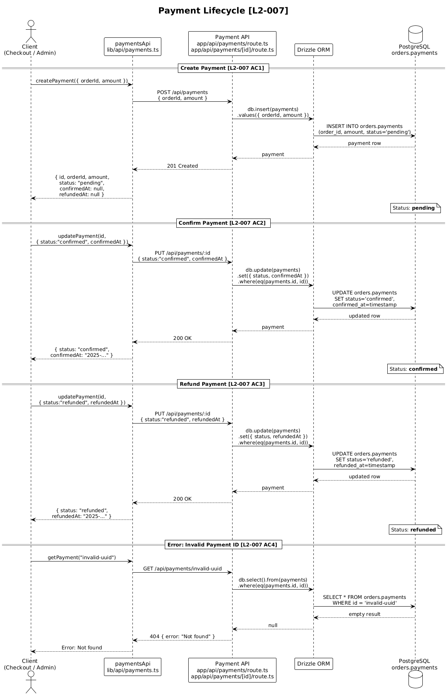

# Shopping Cart & Checkout — Detailed Design

## 1. Overview

This design covers the complete purchase flow for the CrownCommerce platform: managing a shopping cart, completing checkout with shipping and payment information, and processing payments through their lifecycle.

**Problem solved:** Customers need a seamless way to collect products, review their selections, provide shipping details, pay for their order, and receive confirmation — all within the multi-brand storefront.

**Users / Actors:**

| Actor | Description |
|-------|-------------|
| Shopper | Authenticated or guest user browsing the storefront |
| Admin | Back-office user who may view orders or process refunds |
| Payment System | Internal payment processing module (no external gateway yet) |

**Scope:**
- Cart management (add, remove, clear items) — **L2-005**
- Multi-step checkout (shipping → payment → confirmation) — **L2-006**
- Payment lifecycle (create → confirm → refund) — **L2-007**

**Out of scope:** Inventory reservation, tax calculation, shipping rate lookup, external payment gateways (Stripe, PayPal), email order receipts.

**Key file paths:**

| Layer | Path |
|-------|------|
| DB Schema | `lib/db/schema/orders.ts` |
| API Client (Orders) | `lib/api/orders.ts` |
| API Client (Payments) | `lib/api/payments.ts` |
| Cart API Route | `app/api/orders/cart/route.ts` |
| Cart Items API Route | `app/api/orders/cart/items/route.ts` |
| Order API Routes | `app/api/orders/route.ts`, `app/api/orders/[id]/route.ts` |
| Payment API Routes | `app/api/payments/route.ts`, `app/api/payments/[id]/route.ts` |
| Cart Page | `app/(storefront)/cart/page.tsx` |
| Checkout Page | `app/(storefront)/checkout/page.tsx` |
| Cart Summary Component | `lib/features/cart-summary.tsx` |

---

## 2. Architecture

### 2.1 C4 Context Diagram

Shows the CrownCommerce system in its environment — the Shopper interacting with the platform, which persists data to PostgreSQL.



### 2.2 C4 Container Diagram

Breaks the system into its runtime containers: the Next.js application (serving both SSR pages and API routes) and the PostgreSQL database with the `orders` schema.



### 2.3 C4 Component Diagram

Internal components within the Next.js application that participate in the cart-checkout-payment flow.



---

## 3. Component Details

### 3.1 Cart Page — `app/(storefront)/cart/page.tsx`

- **Responsibility:** Renders the shopping cart UI. Fetches the user's cart via `ordersApi.getCart(userId)`, displays items using `CartSummary`, handles remove/clear actions, and navigates to `/checkout`. *(L2-005)*
- **Interfaces:** Client component (`"use client"`). Uses `useRouter` for navigation and `useState` for local item state.
- **Dependencies:** `CartSummary` feature component, `ordersApi` client, auth context (for `userId`).
- **Behaviour:**
  - On mount: call `ordersApi.getCart(userId)` → populate items state.
  - Remove item: call `ordersApi.removeCartItem(id)` → filter item from state *(L2-005 AC2)*.
  - Clear cart: iterate items and call `ordersApi.removeCartItem(id)` for each *(L2-005 AC3)*.
  - Empty state: display "Your cart is empty" with a link to `/shop` *(L2-005 AC5)*.
  - Checkout: call `router.push("/checkout")` *(L2-005 AC4)*.

### 3.2 Checkout Page — `app/(storefront)/checkout/page.tsx`

- **Responsibility:** Multi-step checkout form collecting shipping address and payment details, then creating the order and processing payment. *(L2-006)*
- **Interfaces:** Client component. Uses shadcn/ui `Card`, `Input`, `Label`, `Button`.
- **Dependencies:** `ordersApi`, `paymentsApi`, auth context, cart state.
- **Behaviour:**
  1. Display shipping form: firstName, lastName, address, city, state, zip *(L2-006 AC1)*.
  2. On submit: validate all fields — show inline errors next to invalid fields *(L2-006 AC5)*.
  3. Create order: `ordersApi.createOrder({ userId, total, shippingAddress, status: "pending" })` *(L2-006 AC2)*.
  4. Create payment: `paymentsApi.createPayment({ orderId, amount: total })` *(L2-006 AC3)*.
  5. Confirm payment: `paymentsApi.updatePayment(paymentId, { status: "confirmed" })` *(L2-006 AC3)*.
  6. Update order: `ordersApi.updateOrder(orderId, { status: "confirmed" })`.
  7. Display order confirmation with order ID, items, and total *(L2-006 AC4)*.

### 3.3 CartSummary Component — `lib/features/cart-summary.tsx`

- **Responsibility:** Presentational component rendering cart items with product name, quantity, unit price, line total, a remove button per item, and a checkout button. *(L2-005 AC1)*
- **Props:**
  ```typescript
  interface CartSummaryProps {
    items: CartItem[];    // { id, productId, productName, price, quantity }
    onRemove: (id: string) => void;
    onCheckout: () => void;
  }
  ```
- **Behaviour:** Computes `total = Σ(price × quantity)`. When `items.length === 0`, renders empty state message. Uses `Trash2` icon from lucide-react for remove action.

### 3.4 Cart API — `app/api/orders/cart/route.ts` & `cart/items/route.ts`

- **Responsibility:** CRUD operations for shopping carts and cart items. *(L2-005)*
- **Endpoints:**

  | Method | Path | Description |
  |--------|------|-------------|
  | GET | `/api/orders/cart?userId=` | Fetch cart with items for a user |
  | POST | `/api/orders/cart` | Create a new cart |
  | POST | `/api/orders/cart/items` | Add item to cart |
  | DELETE | `/api/orders/cart/items?id=` | Remove item from cart |

- **Dependencies:** Drizzle ORM, `carts` and `cartItems` tables from `orders` schema.

### 3.5 Order API — `app/api/orders/route.ts` & `[id]/route.ts`

- **Responsibility:** Create and manage orders. *(L2-006)*
- **Endpoints:**

  | Method | Path | Description |
  |--------|------|-------------|
  | GET | `/api/orders` | List all orders |
  | POST | `/api/orders` | Create a new order |
  | GET | `/api/orders/:id` | Get order by ID |
  | PUT | `/api/orders/:id` | Update order (status, address) |

- **Dependencies:** Drizzle ORM, `orders` table from `orders` schema.

### 3.6 Payment API — `app/api/payments/route.ts` & `[id]/route.ts`

- **Responsibility:** Payment lifecycle management — create, confirm, refund. *(L2-007)*
- **Endpoints:**

  | Method | Path | Description |
  |--------|------|-------------|
  | GET | `/api/payments` | List all payments |
  | POST | `/api/payments` | Create a payment record |
  | GET | `/api/payments/:id` | Get payment by ID |
  | PUT | `/api/payments/:id` | Update payment (confirm/refund) |

- **Dependencies:** Drizzle ORM, `payments` table from `orders` schema.
- **Status transitions:** `pending` → `confirmed` → `refunded` (see §5.3).

---

## 4. Data Model

### 4.1 Class Diagram

All tables live in the PostgreSQL `orders` schema, defined in `lib/db/schema/orders.ts`.



### 4.2 Entity Descriptions

#### Cart (`orders.carts`)

| Column | Type | Constraints | Description |
|--------|------|-------------|-------------|
| `id` | UUID | PK, auto-generated | Cart identifier |
| `user_id` | UUID | nullable | Owner (null for guest carts) |
| `created_at` | timestamp | not null, default now | Creation time |

A cart is created per user session. Guest users get a cart with `user_id = null` (associated via cookie/session ID in a future iteration).

#### CartItem (`orders.cart_items`)

| Column | Type | Constraints | Description |
|--------|------|-------------|-------------|
| `id` | UUID | PK, auto-generated | Item identifier |
| `cart_id` | UUID | FK → carts.id, not null | Parent cart |
| `product_id` | UUID | not null | References `catalog.products.id` |
| `quantity` | integer | not null, default 1 | Number of units |

Each row represents one product line in the cart. Quantity is always ≥ 1.

#### Order (`orders.orders`)

| Column | Type | Constraints | Description |
|--------|------|-------------|-------------|
| `id` | UUID | PK, auto-generated | Order identifier |
| `user_id` | UUID | nullable | Purchaser |
| `status` | varchar(50) | not null, default "pending" | Order lifecycle state |
| `total` | decimal(10,2) | not null | Order total amount |
| `shipping_address` | text | nullable | Serialized shipping address |
| `created_at` | timestamp | not null, default now | Creation time |
| `updated_at` | timestamp | not null, default now | Last update time |

**Status values:** `pending` → `confirmed` → `shipped` → `delivered` | `cancelled`

#### OrderItem (`orders.order_items`)

| Column | Type | Constraints | Description |
|--------|------|-------------|-------------|
| `id` | UUID | PK, auto-generated | Line item identifier |
| `order_id` | UUID | FK → orders.id, not null | Parent order |
| `product_id` | UUID | not null | References `catalog.products.id` |
| `quantity` | integer | not null | Number of units ordered |
| `unit_price` | decimal(10,2) | not null | Price at time of purchase |

Captures a snapshot of the product price at checkout time, ensuring order totals remain accurate even if product prices change later.

#### Payment (`orders.payments`)

| Column | Type | Constraints | Description |
|--------|------|-------------|-------------|
| `id` | UUID | PK, auto-generated | Payment identifier |
| `order_id` | UUID | FK → orders.id, not null | Associated order |
| `amount` | decimal(10,2) | not null | Payment amount |
| `status` | varchar(50) | not null, default "pending" | Payment state |
| `confirmed_at` | timestamp | nullable | When payment was confirmed |
| `refunded_at` | timestamp | nullable | When refund was processed |

**Status values:** `pending` → `confirmed` → `refunded`

---

## 5. Key Workflows

### 5.1 Add to Cart

A shopper on a product detail page clicks "Add to Cart". The system checks if a cart exists for the user, creates one if needed, then adds the item.



**Steps:**

1. Shopper clicks "Add to Cart" on a product page.
2. Frontend calls `ordersApi.getCart(userId)` to check for an existing cart.
3. If no cart exists, frontend calls `ordersApi.createCart({ userId })`.
4. Frontend calls `ordersApi.addCartItem({ cartId, productId, quantity })`.
5. API route inserts into `orders.cart_items` via Drizzle.
6. Success response returned; UI updates cart badge count.

**Edge cases:**
- If the same product is already in the cart, the frontend should increment quantity (requires a future `updateCartItem` endpoint or upsert logic).
- Guest users: `userId` is null; cart is associated by session. *(Out of scope for v1.)*

### 5.2 Checkout Flow

The complete flow from checkout page load through order confirmation. *(L2-006)*



**Steps:**

1. Shopper navigates to `/checkout`; page loads cart data.
2. Shopper fills in shipping address fields (firstName, lastName, address, city, state, zip).
3. Shopper clicks "Place Order".
4. Frontend validates all form fields. If invalid → display inline errors *(L2-006 AC5)* and stop.
5. Frontend calls `ordersApi.createOrder({ userId, total, shippingAddress, status: "pending" })`.
6. API inserts into `orders.orders` via Drizzle → returns order with `id`.
7. Frontend calls `paymentsApi.createPayment({ orderId, amount: total })`.
8. API inserts into `orders.payments` → returns payment with `id`, status `"pending"`.
9. Frontend calls `paymentsApi.updatePayment(paymentId, { status: "confirmed", confirmedAt: now })`.
10. API updates payment row → returns confirmed payment.
11. Frontend calls `ordersApi.updateOrder(orderId, { status: "confirmed" })`.
12. API updates order status → returns confirmed order.
13. Frontend clears the cart and displays order confirmation *(L2-006 AC4)*.

**Error recovery:**
- If order creation fails (step 5): show error, allow retry.
- If payment creation fails (step 7): order remains `pending`; show error, allow retry.
- If payment confirmation fails (step 9): payment stays `pending`; prompt user to retry.
- If order update fails (step 11): payment is confirmed but order stuck at `pending` — should be reconciled by an admin or background job.

### 5.3 Payment Processing

The full payment lifecycle: creation, confirmation, and optional refund. *(L2-007)*



**Status transitions:**

```
pending ──→ confirmed ──→ refunded
   │                         
   └──→ (failed — future)    
```

**Create payment** *(L2-007 AC1):*
- `POST /api/payments` with `{ orderId, amount }`.
- Inserts row with `status: "pending"`.
- Returns payment ID.

**Confirm payment** *(L2-007 AC2):*
- `PUT /api/payments/:id` with `{ status: "confirmed", confirmedAt: <timestamp> }`.
- Updates existing row; sets `confirmed_at`.
- Returns updated payment.

**Refund payment** *(L2-007 AC3):*
- `PUT /api/payments/:id` with `{ status: "refunded", refundedAt: <timestamp> }`.
- Only valid on a `confirmed` payment.
- Updates row; sets `refunded_at`.
- Returns updated payment.

**Invalid ID** *(L2-007 AC4):*
- Any endpoint called with a non-existent payment UUID returns `404 { error: "Not found" }`.

---

## 6. API Contracts

### 6.1 Cart Endpoints

#### `GET /api/orders/cart?userId={userId}`

Fetch the cart and its items for a given user.

**Response 200:**
```json
{
  "id": "a1b2c3d4-...",
  "userId": "u1v2w3x4-...",
  "createdAt": "2025-01-15T10:30:00.000Z",
  "items": [
    {
      "id": "i1j2k3l4-...",
      "cartId": "a1b2c3d4-...",
      "productId": "p1q2r3s4-...",
      "quantity": 2
    }
  ]
}
```

**Response 200 (no cart):**
```json
{ "items": [] }
```

**Error 400:** `{ "error": "userId required" }` — missing `userId` query param.

#### `POST /api/orders/cart`

Create a new cart.

**Request:**
```json
{ "userId": "u1v2w3x4-..." }
```

**Response 201:**
```json
{
  "id": "a1b2c3d4-...",
  "userId": "u1v2w3x4-...",
  "createdAt": "2025-01-15T10:30:00.000Z"
}
```

#### `POST /api/orders/cart/items`

Add an item to a cart.

**Request:**
```json
{
  "cartId": "a1b2c3d4-...",
  "productId": "p1q2r3s4-...",
  "quantity": 1
}
```

**Response 201:**
```json
{
  "id": "i1j2k3l4-...",
  "cartId": "a1b2c3d4-...",
  "productId": "p1q2r3s4-...",
  "quantity": 1
}
```

#### `DELETE /api/orders/cart/items?id={itemId}`

Remove an item from the cart.

**Response 200:**
```json
{ "success": true }
```

**Error 400:** `{ "error": "id required" }` — missing `id` query param.

### 6.2 Order Endpoints

#### `GET /api/orders`

List all orders.

**Response 200:**
```json
[
  {
    "id": "o1p2q3r4-...",
    "userId": "u1v2w3x4-...",
    "status": "confirmed",
    "total": "129.99",
    "shippingAddress": "123 Main St, Springfield, IL 62701",
    "createdAt": "2025-01-15T10:35:00.000Z",
    "updatedAt": "2025-01-15T10:36:00.000Z"
  }
]
```

#### `POST /api/orders`

Create a new order.

**Request:**
```json
{
  "userId": "u1v2w3x4-...",
  "total": "129.99",
  "shippingAddress": "123 Main St, Springfield, IL 62701"
}
```

**Response 201:**
```json
{
  "id": "o1p2q3r4-...",
  "userId": "u1v2w3x4-...",
  "status": "pending",
  "total": "129.99",
  "shippingAddress": "123 Main St, Springfield, IL 62701",
  "createdAt": "2025-01-15T10:35:00.000Z",
  "updatedAt": "2025-01-15T10:35:00.000Z"
}
```

#### `GET /api/orders/:id`

Get a single order by ID.

**Response 200:** Same shape as individual item in list above.

**Response 404:** `{ "error": "Not found" }`

#### `PUT /api/orders/:id`

Update an order (typically to change status).

**Request:**
```json
{ "status": "confirmed" }
```

**Response 200:** Updated order object.

**Response 404:** `{ "error": "Not found" }`

### 6.3 Payment Endpoints

#### `GET /api/payments`

List all payments.

**Response 200:**
```json
[
  {
    "id": "py1a2b3c-...",
    "orderId": "o1p2q3r4-...",
    "amount": "129.99",
    "status": "confirmed",
    "confirmedAt": "2025-01-15T10:36:00.000Z",
    "refundedAt": null
  }
]
```

#### `POST /api/payments` *(L2-007 AC1)*

Create a payment record.

**Request:**
```json
{
  "orderId": "o1p2q3r4-...",
  "amount": "129.99"
}
```

**Response 201:**
```json
{
  "id": "py1a2b3c-...",
  "orderId": "o1p2q3r4-...",
  "amount": "129.99",
  "status": "pending",
  "confirmedAt": null,
  "refundedAt": null
}
```

#### `GET /api/payments/:id`

Get a single payment.

**Response 200:** Same shape as individual item in list above.

**Response 404:** `{ "error": "Not found" }` *(L2-007 AC4)*

#### `PUT /api/payments/:id` — Confirm *(L2-007 AC2)*

**Request:**
```json
{
  "status": "confirmed",
  "confirmedAt": "2025-01-15T10:36:00.000Z"
}
```

**Response 200:** Updated payment object with `status: "confirmed"`.

#### `PUT /api/payments/:id` — Refund *(L2-007 AC3)*

**Request:**
```json
{
  "status": "refunded",
  "refundedAt": "2025-01-15T10:40:00.000Z"
}
```

**Response 200:** Updated payment object with `status: "refunded"`.

**Response 404:** `{ "error": "Not found" }` *(L2-007 AC4)*

### 6.4 Error Response Shape

All error responses follow a consistent shape:

```json
{ "error": "<human-readable message>" }
```

| Status | Meaning | Example |
|--------|---------|---------|
| 400 | Bad request / missing param | `{ "error": "userId required" }` |
| 404 | Resource not found | `{ "error": "Not found" }` |
| 500 | Internal server error | `{ "error": "Failed to create order" }` |

---

## 7. Security Considerations

### Authentication
- All cart and order operations require an authenticated user identified by a JWT in the `auth-token` httpOnly cookie (parsed via `jose`).
- API routes should extract `userId` from the JWT rather than trusting the request body to prevent users from modifying other users' carts or orders.

### Authorization
- A user can only read/modify their own cart and orders.
- Refund operations (`PUT /api/payments/:id` with `status: "refunded"`) should be restricted to admin roles in a future iteration.
- The current API routes do not enforce these checks — this is a known gap to address before production.

### Input Validation
- All `POST`/`PUT` bodies must be validated server-side (type, length, format). Currently the routes pass `body` directly to Drizzle — adding Zod validation is recommended.
- `quantity` must be a positive integer ≥ 1.
- `amount` and `total` must be positive decimals.
- `status` must be one of the allowed values for its entity.

### Data Integrity
- `productId` references are cross-schema (from `catalog` schema) and cannot use foreign keys. Validation must happen at the application layer.
- `unit_price` in `order_items` captures price at checkout time — it must never be updated retroactively.
- Payment amount must equal order total at creation time.

### CSRF Protection
- The `auth-token` cookie is httpOnly and SameSite — combined with the `Content-Type: application/json` requirement in `lib/api/client.ts`, this mitigates CSRF for mutation endpoints.

---

## 8. Open Questions

| # | Question | Impact | Status |
|---|----------|--------|--------|
| 1 | Should cart items support quantity update (increment/decrement), or only add/remove? | UX — currently no `PUT` endpoint for cart items | Open |
| 2 | How should guest carts be associated? Session cookie? Local storage? | Affects cart persistence for unauthenticated users | Open |
| 3 | Should order creation be transactional (order + order items + payment in one DB transaction)? | Data consistency on partial failures | Open |
| 4 | When should `order_items` be populated — during checkout or on a separate step? | Currently no endpoint inserts into `order_items` | Open |
| 5 | Should refund be a separate `POST /api/payments/:id/refund` endpoint or continue using `PUT`? | L2-007 AC3 specifies `POST …/refund`, but current code uses `PUT` | Open |
| 6 | Is Zod schema validation planned for API route bodies before production? | Security — prevents invalid data from reaching DB | Open |
| 7 | Should the checkout page support payment method selection (card, etc.) or is it a single mock flow for now? | UX completeness | Open |
