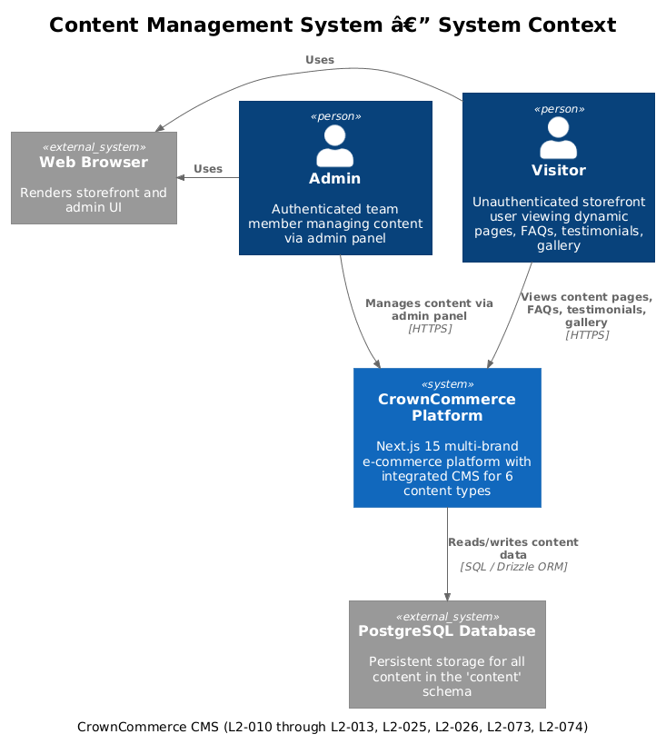
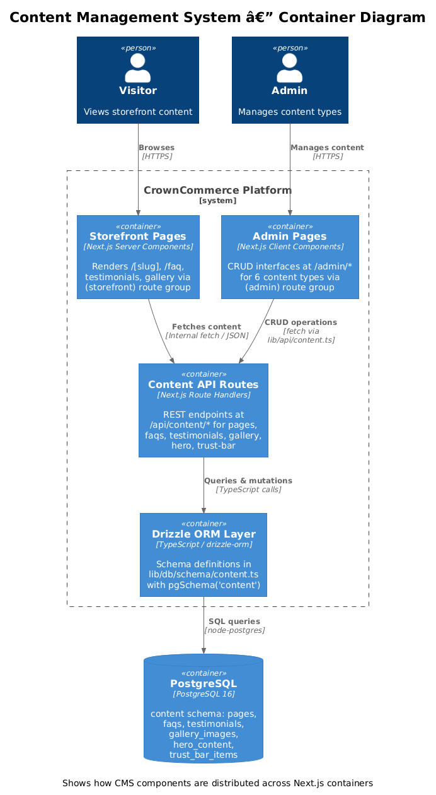
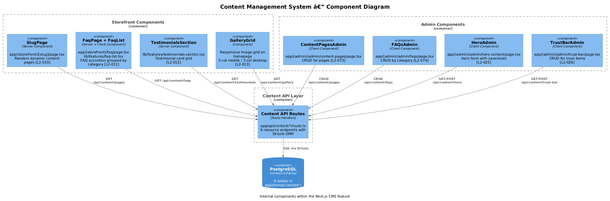
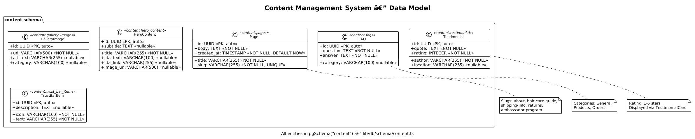
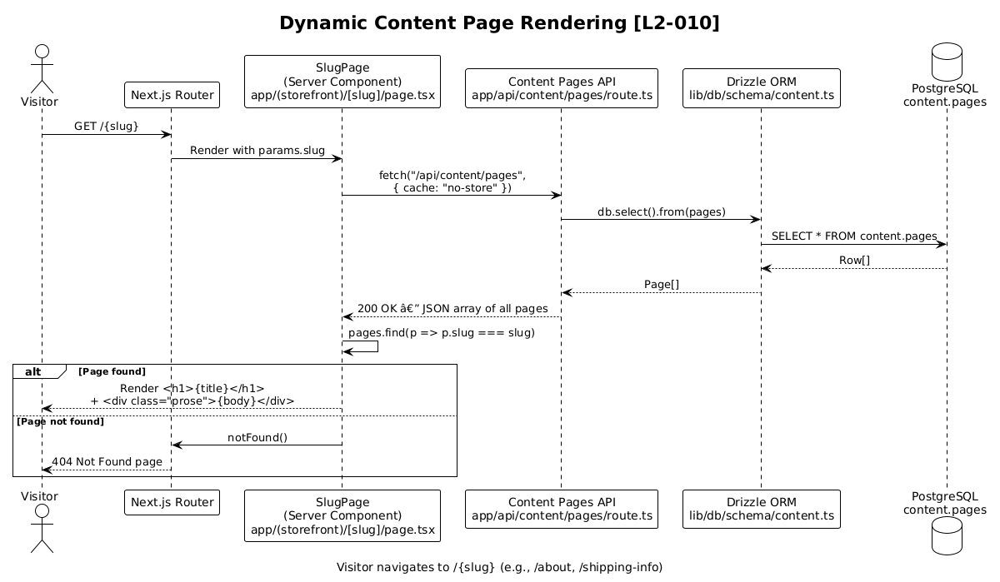
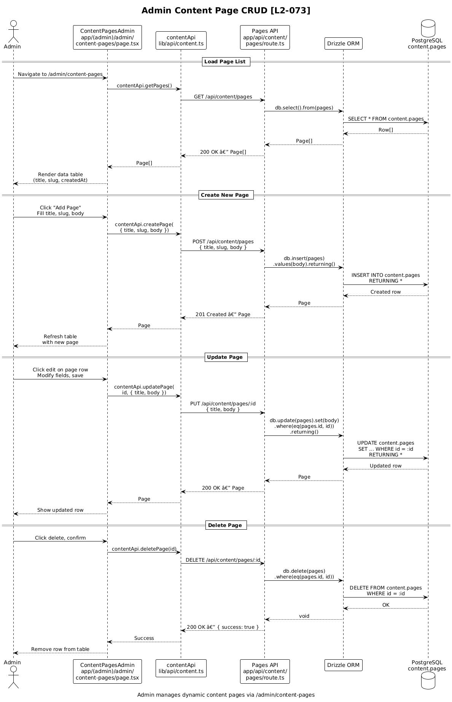
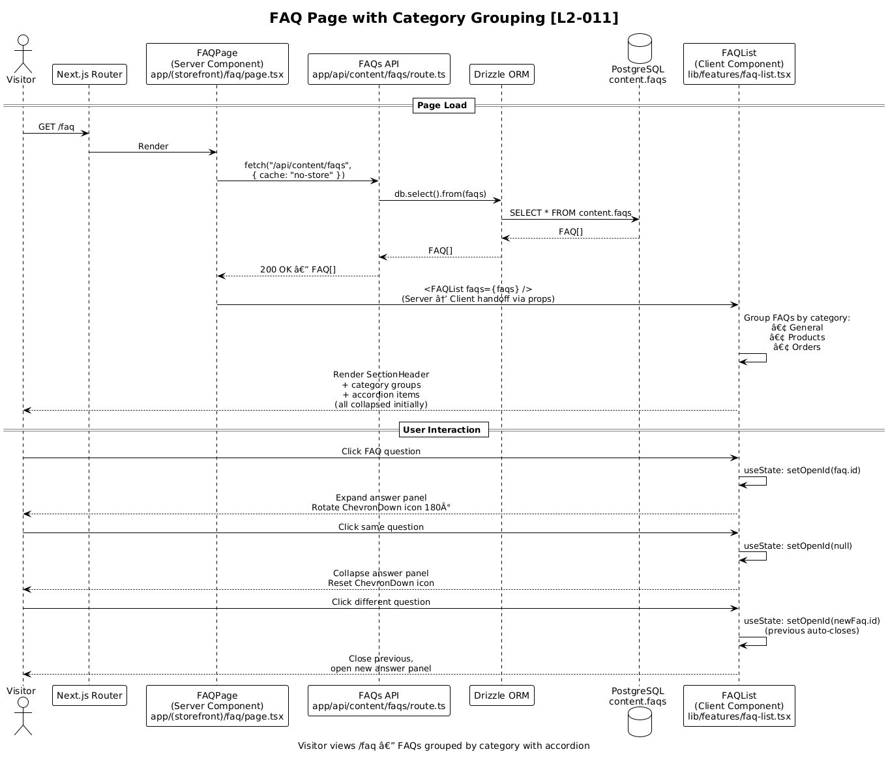

# Content Management System — Detailed Design

## 1. Overview

The Content Management System (CMS) provides a flexible, database-driven content layer for the CrownCommerce multi-brand e-commerce platform. It enables admins to create, update, and delete six distinct content types — dynamic pages, FAQs, testimonials, gallery images, hero sections, and trust bar items — that render across consumer storefronts without code deployments.

| Requirement | Summary |
|---|---|
| **L2-010** | Dynamic content pages at `/[slug]` (about, hair-care-guide, shipping-info, returns, ambassador-program) |
| **L2-011** | FAQ page at `/faq` with accordion format grouped by category (General, Products, Orders) |
| **L2-012** | Testimonials display (quote, author, rating, location) on storefronts; admin CRUD |
| **L2-013** | Gallery content on home page; responsive grid (2-col mobile, 3-col desktop) |
| **L2-025** | Admin hero content form (title, subtitle, CTA text, CTA link, image URL) |
| **L2-026** | Admin trust bar item CRUD (icon, text, description) |
| **L2-073** | Admin CRUD for dynamic content pages (title, slug, body) |
| **L2-074** | Admin FAQ management organized by category |

**Actors:**
- **Visitor** — unauthenticated storefront user viewing dynamic pages, FAQs, testimonials, gallery, hero, and trust bar content
- **Admin** — authenticated CrownCommerce team member creating and managing all content types via the admin panel

**Scope boundary:** This feature covers content storage, retrieval, and admin management for the six content types listed above. It does not include rich-text WYSIWYG editing (body is stored as plain text/HTML string), media upload to cloud storage (image URLs are provided directly), or content versioning/scheduling.

**Key design decision:** Each content type has its own dedicated database table within the `content` PostgreSQL schema and its own REST API route. This denormalized approach keeps each content type simple and independently queryable at the cost of slight repetition in API route handlers. The `content` schema is isolated via Drizzle ORM's `pgSchema("content")` to maintain clean domain separation from other features.

## 2. Architecture

### 2.1 C4 Context Diagram

Shows how the CMS fits within the overall CrownCommerce system. Visitors access content through the Next.js storefront; Admins manage content through the admin panel.



### 2.2 C4 Container Diagram

The CMS lives within the Next.js monolith. Content API routes serve both storefront Server Components (via internal fetch) and admin Client Components (via the `contentApi` client). All data persists in the `content` PostgreSQL schema.



### 2.3 C4 Component Diagram

Internal components of the CMS: storefront rendering components, admin management pages, API route handlers, and the Drizzle ORM data access layer.



## 3. Component Details

### 3.1 Storefront Content Components

#### 3.1.1 SlugPage (`app/(storefront)/[slug]/page.tsx`)

- **Responsibility:** Renders dynamic content pages by matching the URL slug to a `content.pages` record. Implements **L2-010**.
- **Behavior:** Server Component that fetches all pages from `/api/content/pages`, finds the matching slug, and renders the `title` as an `<h1>` and `body` in a prose-styled container. Calls `notFound()` if no matching slug exists, returning a 404.
- **Dependencies:** Content Pages API, Next.js `notFound()`
- **Supported slugs:** `about`, `hair-care-guide`, `shipping-info`, `returns`, `ambassador-program`

#### 3.1.2 FAQPage (`app/(storefront)/faq/page.tsx`)

- **Responsibility:** Fetches all FAQs and delegates rendering to `FAQList`. Implements **L2-011**.
- **Behavior:** Server Component that fetches from `/api/content/faqs`. Returns empty array on error (graceful degradation).
- **Dependencies:** Content FAQs API, `FAQList` feature component

#### 3.1.3 FAQList (`lib/features/faq-list.tsx`)

- **Responsibility:** Client-side interactive accordion for FAQ items. Implements the expand/collapse behavior from **L2-011**.
- **Behavior:** `"use client"` component with `useState` tracking the currently open FAQ ID. Clicking a question toggles its answer panel. Only one FAQ can be open at a time. Uses `SectionHeader` for the page title and `ChevronDown` icon with rotation animation for open/close state.
- **Props:** `faqs: FAQ[]`, optional `title: string`
- **Note:** Currently renders a flat list. **L2-011** requires grouping by category (General, Products, Orders) — this is an implementation gap documented in Open Questions.

#### 3.1.4 TestimonialsSection (`lib/features/testimonials-section.tsx`)

- **Responsibility:** Renders a grid of testimonial cards. Implements **L2-012** storefront display.
- **Behavior:** Server Component composition that maps testimonials into a responsive grid (`grid-cols-1 md:grid-cols-2 lg:grid-cols-3`). Uses `SectionHeader` with "What Our Clients Say" title.
- **Dependencies:** `TestimonialCard`, `SectionHeader`

#### 3.1.5 TestimonialCard (`components/testimonial-card.tsx`)

- **Responsibility:** Renders a single testimonial with star rating. Part of **L2-012**.
- **Behavior:** Displays 5 stars (filled/unfilled based on `rating`), a blockquote for the testimonial text, and author name with optional location. Uses shadcn `Card` and `CardContent`.
- **Props:** `quote: string`, `author: string`, `rating: number`, `location?: string | null`

#### 3.1.6 SectionHeader (`components/section-header.tsx`)

- **Responsibility:** Reusable centered section heading with optional subtitle.
- **Props:** `title: string`, `subtitle?: string`, `className?: string`

### 3.2 Admin Content Management

All admin pages are in the `(admin)` route group under `/admin/*`. They are protected by the middleware's `auth-token` cookie check — unauthenticated users are redirected to `/login`. Currently, all admin pages render placeholder UI (Card with descriptive text and an action button). The following describes the target implementation per requirements.

#### 3.2.1 ContentPagesAdmin (`app/(admin)/admin/content-pages/page.tsx`)

- **Responsibility:** CRUD management for dynamic content pages. Implements **L2-073**.
- **Target behavior:**
  - Data table listing all pages (title, slug, createdAt)
  - "Add Page" button opens a form with fields: `title` (text input), `slug` (text input, auto-generated from title), `body` (textarea/rich text)
  - Edit: inline or modal form pre-populated with existing values
  - Delete: confirmation dialog → `DELETE /api/content/pages/:id`
- **API calls:** `contentApi.getPages()`, `contentApi.createPage()`, `contentApi.updatePage()`, `contentApi.deletePage()`

#### 3.2.2 FAQsAdmin (`app/(admin)/admin/faqs/page.tsx`)

- **Responsibility:** CRUD for FAQs organized by category. Implements **L2-074**.
- **Target behavior:**
  - Data table with columns: question, category, answer (truncated)
  - Filter/group by category (General, Products, Orders)
  - "Add FAQ" form: `question` (text input), `answer` (textarea), `category` (select dropdown)
  - Edit and delete with confirmation
- **API calls:** `contentApi.getFaqs()`, `contentApi.createFaq()`, `contentApi.updateFaq()`, `contentApi.deleteFaq()`

#### 3.2.3 TestimonialsAdmin (`app/(admin)/admin/testimonials/page.tsx`)

- **Responsibility:** CRUD for customer testimonials. Implements admin portion of **L2-012**.
- **Target behavior:**
  - Data table: author, rating (stars), quote (truncated), location
  - "Add Testimonial" form: `quote` (textarea), `author` (text), `rating` (number 1-5), `location` (text, optional)
  - Edit and delete operations
- **API calls:** `contentApi.getTestimonials()`, `contentApi.createTestimonial()`, `contentApi.updateTestimonial()`, `contentApi.deleteTestimonial()`

#### 3.2.4 GalleryAdmin (`app/(admin)/admin/gallery/page.tsx`)

- **Responsibility:** Manage gallery images. Implements **L2-013** admin + **L2-072**.
- **Target behavior:**
  - Grid/list view of gallery images with thumbnails
  - "Upload Image" form: `url` (text input for image URL), `altText` (text), `category` (select/text)
  - Delete capability (currently no `[id]` route — see Open Questions)
- **API calls:** `contentApi.getGallery()`, `contentApi.addGalleryImage()`

#### 3.2.5 HeroAdmin (`app/(admin)/admin/hero-content/page.tsx`)

- **Responsibility:** Manage homepage hero section. Implements **L2-025**.
- **Target behavior:**
  - Form pre-populated with current hero content: `title`, `subtitle`, `ctaText`, `ctaLink`, `imageUrl`
  - Save button persists changes; Reset button reverts to last saved state
  - Live preview of hero section (optional enhancement)
- **API calls:** `contentApi.getHeroContent()`, `contentApi.createHeroContent()`

#### 3.2.6 TrustBarAdmin (`app/(admin)/admin/trust-bar/page.tsx`)

- **Responsibility:** CRUD for trust bar items. Implements **L2-026**.
- **Target behavior:**
  - Data table: icon, text, description
  - "Add Item" form: `icon` (text input — icon name/class), `text` (text input), `description` (textarea, optional)
  - Delete capability (currently no `[id]` route — see Open Questions)
- **API calls:** `contentApi.getTrustBar()`, `contentApi.createTrustBarItem()`

### 3.3 Content API Routes

All API routes follow the same pattern: Next.js Route Handlers using Drizzle ORM to query the `content` PostgreSQL schema. Routes are located under `app/api/content/`.

| Route | Methods | [id] Variant | Schema Table |
|---|---|---|---|
| `/api/content/pages` | GET, POST | GET, PUT, DELETE | `content.pages` |
| `/api/content/faqs` | GET, POST | GET, PUT, DELETE | `content.faqs` |
| `/api/content/testimonials` | GET, POST | PUT, DELETE | `content.testimonials` |
| `/api/content/gallery` | GET, POST | — | `content.gallery_images` |
| `/api/content/hero` | GET, POST | — | `content.hero_content` |
| `/api/content/trust-bar` | GET, POST | — | `content.trust_bar_items` |

**Route handler pattern (consistent across all routes):**

```typescript
// Collection route (e.g., app/api/content/pages/route.ts)
export async function GET() {
  const results = await db.select().from(table);
  return NextResponse.json(results);
}

export async function POST(request: Request) {
  const body = await request.json();
  const [item] = await db.insert(table).values(body).returning();
  return NextResponse.json(item, { status: 201 });
}

// Individual route (e.g., app/api/content/pages/[id]/route.ts)
export async function GET(_req, { params }) {
  const { id } = await params;
  const [item] = await db.select().from(table).where(eq(table.id, id));
  if (!item) return NextResponse.json({ error: "Not found" }, { status: 404 });
  return NextResponse.json(item);
}

export async function PUT(request, { params }) {
  const { id } = await params;
  const body = await request.json();
  const [item] = await db.update(table).set(body).where(eq(table.id, id)).returning();
  if (!item) return NextResponse.json({ error: "Not found" }, { status: 404 });
  return NextResponse.json(item);
}

export async function DELETE(_req, { params }) {
  const { id } = await params;
  await db.delete(table).where(eq(table.id, id));
  return NextResponse.json({ success: true });
}
```

## 4. Data Model

### 4.1 Class Diagram

All six content entities live in the `content` PostgreSQL schema, isolated from other domain schemas via Drizzle ORM's `pgSchema("content")`.



### 4.2 Entity Descriptions

#### Page (`content.pages`)

| Column | Type | Constraints | Description |
|---|---|---|---|
| `id` | UUID | PK, auto-generated | Unique identifier |
| `title` | VARCHAR(255) | NOT NULL | Page heading displayed as `<h1>` |
| `slug` | VARCHAR(255) | NOT NULL, UNIQUE | URL path segment (e.g., `about`, `returns`) |
| `body` | TEXT | NOT NULL | Page content (plain text or HTML string) |
| `created_at` | TIMESTAMP | NOT NULL, DEFAULT NOW() | Creation timestamp |

**Usage:** Storefront renders pages at `/{slug}`. Admin manages via content pages CRUD.

#### FAQ (`content.faqs`)

| Column | Type | Constraints | Description |
|---|---|---|---|
| `id` | UUID | PK, auto-generated | Unique identifier |
| `question` | TEXT | NOT NULL | The FAQ question |
| `answer` | TEXT | NOT NULL | The FAQ answer |
| `category` | VARCHAR(100) | nullable | Grouping category (General, Products, Orders) |

**Usage:** FAQ page groups by category and renders in accordion. Admin manages with category filtering.

#### Testimonial (`content.testimonials`)

| Column | Type | Constraints | Description |
|---|---|---|---|
| `id` | UUID | PK, auto-generated | Unique identifier |
| `quote` | TEXT | NOT NULL | Customer testimonial text |
| `author` | VARCHAR(255) | NOT NULL | Customer name |
| `rating` | INTEGER | NOT NULL | Star rating (1-5) |
| `location` | VARCHAR(255) | nullable | Customer location (e.g., "London, UK") |

**Usage:** `TestimonialsSection` renders as cards on storefronts. Admin manages via data table.

#### GalleryImage (`content.gallery_images`)

| Column | Type | Constraints | Description |
|---|---|---|---|
| `id` | UUID | PK, auto-generated | Unique identifier |
| `url` | VARCHAR(500) | NOT NULL | Image URL (external or `/images/` path) |
| `alt_text` | VARCHAR(255) | nullable | Accessibility alt text |
| `category` | VARCHAR(100) | nullable | Image category for filtering |

**Usage:** Gallery grid on storefront home page. Admin adds images via URL.

#### HeroContent (`content.hero_content`)

| Column | Type | Constraints | Description |
|---|---|---|---|
| `id` | UUID | PK, auto-generated | Unique identifier |
| `title` | VARCHAR(255) | NOT NULL | Hero headline |
| `subtitle` | TEXT | nullable | Hero subheading |
| `cta_text` | VARCHAR(100) | nullable | Call-to-action button label |
| `cta_link` | VARCHAR(255) | nullable | CTA destination URL |
| `image_url` | VARCHAR(500) | nullable | Hero background/feature image URL |

**Usage:** Drives the homepage hero section. Admin edits via pre-populated form with save/reset.

#### TrustBarItem (`content.trust_bar_items`)

| Column | Type | Constraints | Description |
|---|---|---|---|
| `id` | UUID | PK, auto-generated | Unique identifier |
| `icon` | VARCHAR(100) | NOT NULL | Icon name or class (e.g., Lucide icon name) |
| `text` | VARCHAR(255) | NOT NULL | Trust indicator text (e.g., "Free Shipping") |
| `description` | TEXT | nullable | Extended description |

**Usage:** Trust bar displayed on storefronts. Admin manages items via CRUD interface.

## 5. Key Workflows

### 5.1 Dynamic Content Page Rendering

A visitor navigates to a dynamic content page (e.g., `/about`). The Next.js Server Component fetches all pages from the Content API, finds the matching slug, and renders the page. If no match is found, a 404 is returned.



**Steps:**
1. Visitor requests `/{slug}` (e.g., `/about`)
2. Next.js matches the `[slug]` catch-all route in `(storefront)` group
3. `ContentPage` Server Component calls `getPage(slug)` which fetches `GET /api/content/pages`
4. API route handler queries `db.select().from(pages)` via Drizzle ORM
5. PostgreSQL returns all rows from `content.pages`
6. Server Component filters for matching `slug`
7. If found: renders `<h1>{title}</h1>` and `<div>{body}</div>` with prose styling
8. If not found: calls `notFound()` → Next.js returns 404 page

### 5.2 Admin Content CRUD (Content Pages)

An admin creates, edits, or deletes a dynamic content page through the admin panel.



**Create flow:**
1. Admin clicks "Add Page" on `/admin/content-pages`
2. Admin fills in `title`, `slug`, `body` fields
3. Client calls `contentApi.createPage({ title, slug, body })`
4. `POST /api/content/pages` → `db.insert(pages).values(body).returning()`
5. PostgreSQL inserts row into `content.pages`, returns created record
6. API returns 201 with the new page JSON
7. Admin UI refreshes the page list

**Edit flow:**
1. Admin clicks edit on an existing page
2. Form pre-populates with current values
3. Admin modifies fields and saves
4. Client calls `contentApi.updatePage(id, { title, slug, body })`
5. `PUT /api/content/pages/:id` → `db.update(pages).set(body).where(eq(pages.id, id)).returning()`
6. Returns updated page or 404 if not found

**Delete flow:**
1. Admin clicks delete, confirms via dialog
2. Client calls `contentApi.deletePage(id)`
3. `DELETE /api/content/pages/:id` → `db.delete(pages).where(eq(pages.id, id))`
4. Returns `{ success: true }`

### 5.3 FAQ Page with Category Grouping

A visitor navigates to `/faq`. The page fetches all FAQs, groups them by category, and renders interactive accordions.



**Steps:**
1. Visitor requests `/faq`
2. Next.js matches `(storefront)/faq/page.tsx`
3. `FAQPage` Server Component calls `getFaqs()` → `GET /api/content/faqs`
4. API route queries `db.select().from(faqs)` via Drizzle
5. PostgreSQL returns all FAQ rows from `content.faqs`
6. Server passes FAQs array to `<FAQList>` client component
7. `FAQList` groups FAQs by `category` field (General, Products, Orders)
8. Renders each category group with a section header
9. Each FAQ renders as an accordion item (question as trigger, answer as collapsible panel)
10. Visitor clicks a question → `useState` toggles `openId` → answer panel expands/collapses with `ChevronDown` icon rotation

## 6. API Contracts

### 6.1 Content Pages

#### `GET /api/content/pages`

Returns all content pages.

**Response:** `200 OK`
```json
[
  {
    "id": "550e8400-e29b-41d4-a716-446655440000",
    "title": "About Us",
    "slug": "about",
    "body": "<p>Welcome to CrownCommerce...</p>",
    "createdAt": "2025-01-15T10:30:00.000Z"
  }
]
```

#### `GET /api/content/pages/:id`

Returns a single content page by ID.

**Response:** `200 OK` — single page object (same shape as array element above)
**Error:** `404` — `{ "error": "Not found" }`

#### `POST /api/content/pages`

Creates a new content page.

**Request body:**
```json
{
  "title": "Shipping Info",
  "slug": "shipping-info",
  "body": "<p>We ship worldwide...</p>"
}
```

**Response:** `201 Created` — created page object with `id` and `createdAt`
**Error:** `500` — `{ "error": "Failed to create page" }` (e.g., duplicate slug violates UNIQUE constraint)

#### `PUT /api/content/pages/:id`

Updates an existing content page.

**Request body:** (partial — any subset of fields)
```json
{
  "title": "Updated Title",
  "body": "<p>Updated content...</p>"
}
```

**Response:** `200 OK` — updated page object
**Error:** `404` — `{ "error": "Not found" }`

#### `DELETE /api/content/pages/:id`

Deletes a content page.

**Response:** `200 OK` — `{ "success": true }`
**Error:** `500` — `{ "error": "Failed to delete page" }`

---

### 6.2 FAQs

#### `GET /api/content/faqs`

**Response:** `200 OK`
```json
[
  {
    "id": "660e8400-e29b-41d4-a716-446655440001",
    "question": "What is your return policy?",
    "answer": "We accept returns within 30 days...",
    "category": "Orders"
  }
]
```

#### `GET /api/content/faqs/:id`

**Response:** `200 OK` — single FAQ object
**Error:** `404` — `{ "error": "Not found" }`

#### `POST /api/content/faqs`

**Request body:**
```json
{
  "question": "How do I track my order?",
  "answer": "You can track your order by...",
  "category": "Orders"
}
```

**Response:** `201 Created` — created FAQ object

#### `PUT /api/content/faqs/:id`

**Request body:** (partial)
```json
{
  "answer": "Updated answer text...",
  "category": "General"
}
```

**Response:** `200 OK` — updated FAQ object
**Error:** `404` — `{ "error": "Not found" }`

#### `DELETE /api/content/faqs/:id`

**Response:** `200 OK` — `{ "success": true }`

---

### 6.3 Testimonials

#### `GET /api/content/testimonials`

**Response:** `200 OK`
```json
[
  {
    "id": "770e8400-e29b-41d4-a716-446655440002",
    "quote": "Amazing hair extensions, totally natural look!",
    "author": "Sarah J.",
    "rating": 5,
    "location": "London, UK"
  }
]
```

#### `POST /api/content/testimonials`

**Request body:**
```json
{
  "quote": "Best hair products I've ever used!",
  "author": "Emily R.",
  "rating": 5,
  "location": "Manchester, UK"
}
```

**Response:** `201 Created` — created testimonial object

#### `PUT /api/content/testimonials/:id`

**Request body:** (partial)
```json
{
  "rating": 4,
  "location": "Birmingham, UK"
}
```

**Response:** `200 OK` — updated testimonial object
**Error:** `404` — `{ "error": "Not found" }`

#### `DELETE /api/content/testimonials/:id`

**Response:** `200 OK` — `{ "success": true }`

---

### 6.4 Gallery Images

#### `GET /api/content/gallery`

**Response:** `200 OK`
```json
[
  {
    "id": "880e8400-e29b-41d4-a716-446655440003",
    "url": "/images/gallery/client-1.jpg",
    "altText": "Client with balayage extensions",
    "category": "Transformations"
  }
]
```

#### `POST /api/content/gallery`

**Request body:**
```json
{
  "url": "https://cdn.example.com/gallery/new-image.jpg",
  "altText": "New client photo",
  "category": "Events"
}
```

**Response:** `201 Created` — created gallery image object

> **Note:** Gallery currently lacks `[id]` routes for PUT and DELETE. See Open Questions.

---

### 6.5 Hero Content

#### `GET /api/content/hero`

**Response:** `200 OK`
```json
[
  {
    "id": "990e8400-e29b-41d4-a716-446655440004",
    "title": "Luxury Hair Extensions",
    "subtitle": "Premium quality, ethically sourced",
    "ctaText": "Shop Now",
    "ctaLink": "/shop",
    "imageUrl": "/images/hero-banner.jpg"
  }
]
```

#### `POST /api/content/hero`

**Request body:**
```json
{
  "title": "Summer Collection",
  "subtitle": "New arrivals for the season",
  "ctaText": "Explore",
  "ctaLink": "/shop?collection=summer",
  "imageUrl": "/images/hero-summer.jpg"
}
```

**Response:** `201 Created` — created hero content object

> **Note:** Hero currently lacks PUT/DELETE `[id]` routes. **L2-025** requires save/reset behavior — this likely needs a PUT endpoint. See Open Questions.

---

### 6.6 Trust Bar Items

#### `GET /api/content/trust-bar`

**Response:** `200 OK`
```json
[
  {
    "id": "aa0e8400-e29b-41d4-a716-446655440005",
    "icon": "truck",
    "text": "Free Shipping",
    "description": "On all orders over £50"
  }
]
```

#### `POST /api/content/trust-bar`

**Request body:**
```json
{
  "icon": "shield-check",
  "text": "Secure Payments",
  "description": "256-bit SSL encryption"
}
```

**Response:** `201 Created` — created trust bar item object

> **Note:** Trust bar currently lacks `[id]` routes for PUT and DELETE. **L2-026** requires edit/delete. See Open Questions.

---

### 6.7 Error Response Format

All API errors follow a consistent shape:

```json
{
  "error": "Human-readable error message"
}
```

| Status Code | Meaning | When |
|---|---|---|
| `200` | Success | Successful GET, PUT, DELETE |
| `201` | Created | Successful POST |
| `404` | Not Found | Resource with given ID does not exist |
| `500` | Server Error | Database errors, unexpected failures |

## 7. Security Considerations

### 7.1 Authentication & Authorization

- **Admin routes** (`/admin/*`) are protected by the main middleware in `middleware.ts`. If no `auth-token` cookie is present, the user is redirected to `/login`.
- **API routes** do not currently enforce authentication. This is a gap — mutating endpoints (POST, PUT, DELETE) should use the `withAdmin` middleware from `lib/auth/middleware.ts` to verify the JWT token and require `role: "admin"`.

### 7.2 Input Validation

- **Current state:** API routes accept request bodies directly and pass them to Drizzle `insert`/`update` without explicit validation. Database constraints (NOT NULL, VARCHAR length, UNIQUE on `pages.slug`) provide a safety net but error messages are not user-friendly.
- **Recommendation:** Add Zod schemas for each content type to validate input before database operations. Return `400 Bad Request` with field-level error messages for invalid input.

### 7.3 XSS Prevention

- The `body` field on content pages stores raw text/HTML. When rendered with `{page.body}` in React, JSX auto-escapes the content, preventing XSS. If `dangerouslySetInnerHTML` is used in the future for rich HTML rendering, a sanitization library (e.g., DOMPurify) must be added.

### 7.4 Slug Injection

- The `[slug]` dynamic route accepts any URL path segment. The current implementation safely queries the database and returns 404 for non-matching slugs. The UNIQUE constraint on `pages.slug` prevents duplicate slugs.

### 7.5 Rate Limiting

- No rate limiting is currently applied to content API endpoints. For public GET endpoints serving storefront content, consider adding caching headers (`Cache-Control`) to reduce database load.

## 8. Open Questions

1. **Missing `[id]` routes for Gallery, Hero, and Trust Bar:** Requirements L2-025 (hero save/reset), L2-026 (trust bar edit/delete), and L2-072 (gallery delete) require PUT and DELETE operations, but these content types only have collection-level GET and POST routes. Individual-item routes need to be added.

2. **FAQ category grouping in `FAQList`:** L2-011 requires FAQs grouped by category (General, Products, Orders), but the current `FAQList` component renders a flat list. The component needs to be updated to group and render by category with section headers.

3. **Admin page implementations:** All six admin pages currently render placeholder UI. Full implementations with data tables, forms, and CRUD operations are needed per L2-012, L2-025, L2-026, L2-073, L2-074.

4. **Gallery responsive grid specification:** L2-013 specifies 2-column layout below 576px and 3-column at ≥992px. The gallery grid component needs to be created on the storefront with these specific breakpoints.

5. **Content page slug-based fetch optimization:** The current `[slug]/page.tsx` fetches ALL pages and filters client-side. For performance, consider adding a `GET /api/content/pages?slug={slug}` query parameter or a dedicated `GET /api/content/pages/by-slug/:slug` endpoint.

6. **API route authentication:** Mutating content API endpoints (POST, PUT, DELETE) are not protected by auth middleware. The `withAdmin` helper exists in `lib/auth/middleware.ts` but is not applied to content routes.

7. **Hero content cardinality:** The `hero_content` table supports multiple rows, but the homepage typically shows one hero section. Should this be a singleton (one row, updated in place) or support multiple hero variants (e.g., per brand)?
