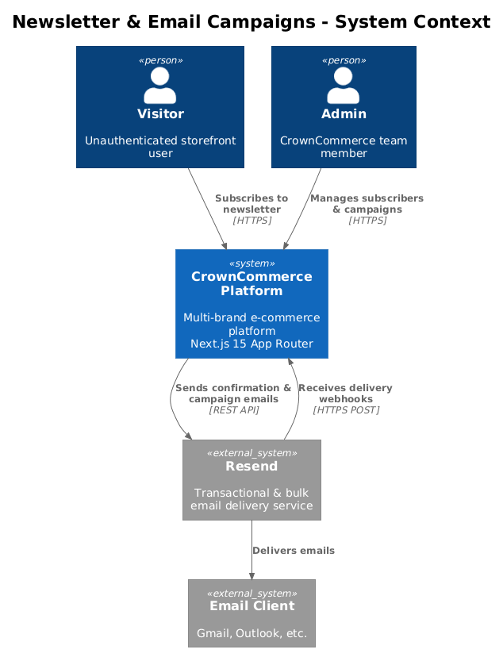
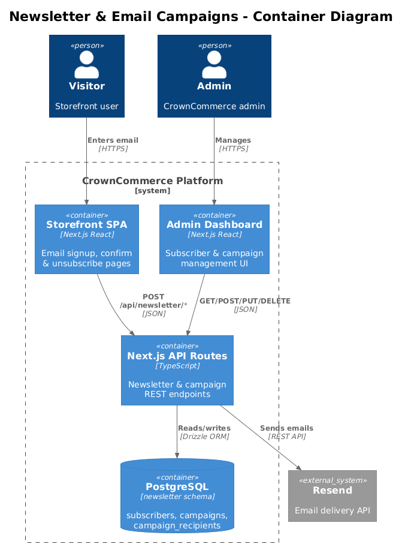
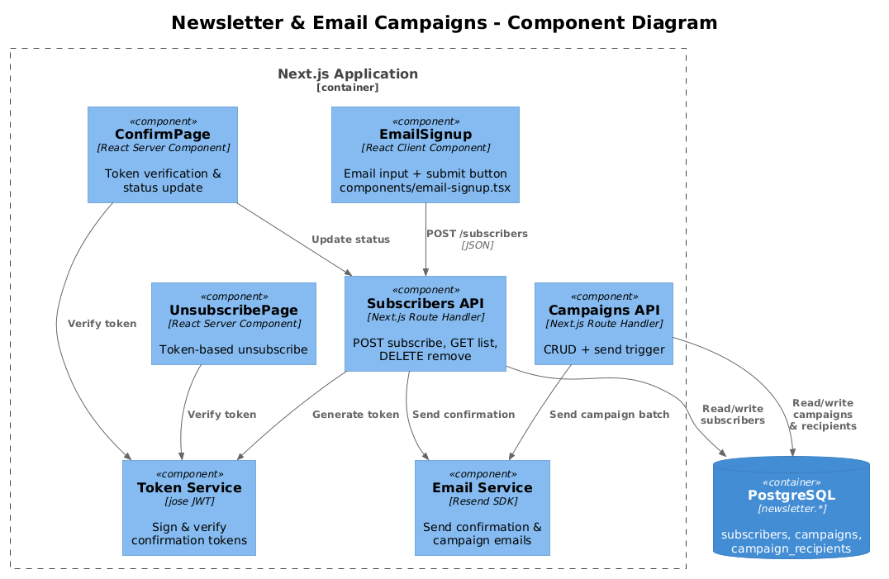
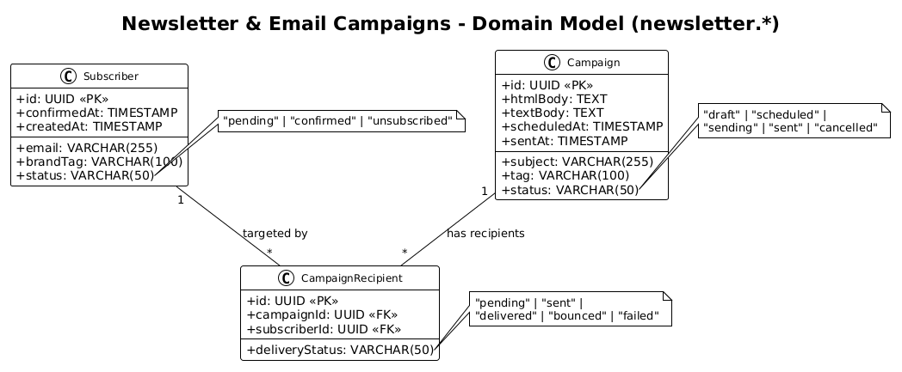
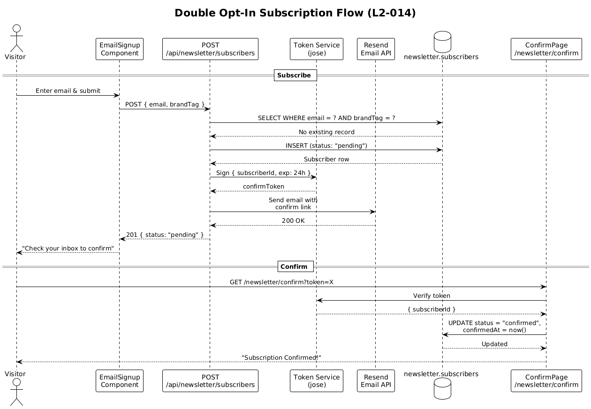
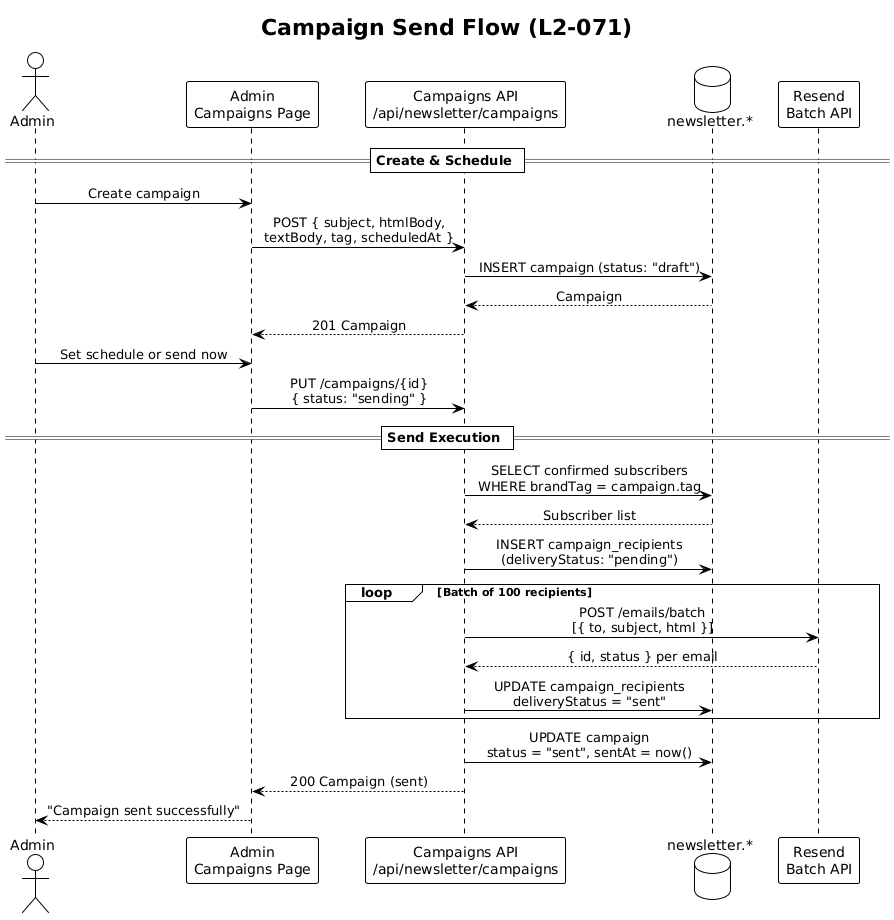
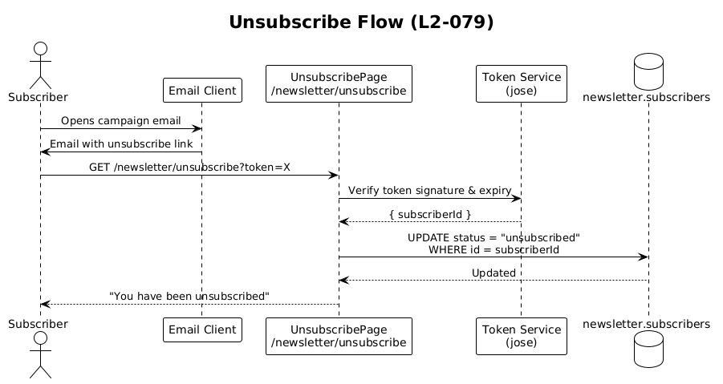

# Newsletter & Email Campaigns — Detailed Design

## 1. Overview

The Newsletter & Email Campaigns feature provides CrownCommerce with subscriber acquisition, lifecycle management, and targeted email campaign delivery across both brands (Origin Hair and Mane Haus). It spans four requirements:

| Requirement | Summary |
|---|---|
| **L2-014** | Newsletter subscription with double opt-in on storefronts |
| **L2-015** | Admin subscriber management with brand filtering and stats |
| **L2-071** | Email campaign creation, scheduling, sending, and delivery reporting |
| **L2-079** | Dedicated confirm/unsubscribe pages for token-based links |

**Actors:**
- **Visitor** — unauthenticated storefront user who subscribes to a newsletter
- **Admin** — authenticated CrownCommerce team member who manages subscribers and campaigns
- **System (Scheduler)** — background process that triggers campaign sends at scheduled times

**Scope boundary:** This feature covers email list management and campaign delivery only. Transactional emails (order confirmations, password resets) are handled by the Notification Service (Feature 15) and are out of scope.

## 2. Architecture

### 2.1 C4 Context Diagram

Shows the Newsletter system in the broader CrownCommerce landscape.



### 2.2 C4 Container Diagram

Technical containers involved in newsletter and campaign operations.



### 2.3 C4 Component Diagram

Internal components within the Next.js application that implement newsletter functionality.



## 3. Component Details

### 3.1 EmailSignup (`components/email-signup.tsx`)

- **Responsibility:** Presentational client component that renders an email input + submit button. Fires a POST to `/api/newsletter/subscribers` with `{ email, brandTag }`.
- **Interfaces:** Props `{ brandTag?: string; placeholder?: string; buttonText?: string }`. Manages local `idle | loading | success | error` state.
- **Dependencies:** shadcn `Button`, `Input`
- **Design note (L2-014):** The component currently transitions to a success state on 200 OK. For double opt-in, the success message must change to "Check your inbox to confirm" rather than "Subscribed!" — the subscriber is `pending` until they click the confirmation link.

### 3.2 NewsletterSignup (`lib/features/newsletter-signup.tsx`)

- **Responsibility:** Feature composition that wraps `EmailSignup` with section layout and copy. Used by storefront homepage/footer layouts.
- **Interfaces:** Props `{ brandTag?: string }`
- **Dependencies:** `EmailSignup`, `SectionHeader`
- **Design note:** The `brandTag` prop is injected by the storefront layout based on hostname routing (middleware resolves `originhair.com` → `"origin"`, `manehaus.com` → `"mane-haus"`).

### 3.3 Subscribers API Route (`app/api/newsletter/subscribers/route.ts`)

- **Responsibility:** Handles `GET` (list all subscribers) and `POST` (create new subscriber).
- **POST behavior (L2-014):**
  1. Validate email format via Zod schema
  2. Check for existing subscriber with same email + brandTag
  3. If already confirmed → return 409 with "already subscribed" message
  4. If pending → resend confirmation email, return 200
  5. If new → insert with `status: "pending"`, generate confirmation token (JWT with subscriber ID, 24h expiry), send confirmation email via Resend, return 201
- **GET behavior (L2-015):** Returns all subscribers. Accepts optional `?brandTag=` query param for filtering.

### 3.4 Subscriber Delete Route (`app/api/newsletter/subscribers/[id]/route.ts`)

- **Responsibility:** `DELETE` removes a subscriber record (L2-015).
- **Dependencies:** Drizzle ORM, `newsletter.subscribers` table

### 3.5 Campaign API Routes (`app/api/newsletter/campaigns/route.ts`, `[id]/route.ts`)

- **Responsibility:** Full CRUD for campaigns (L2-071).
- **Campaign lifecycle:** `draft` → `scheduled` → `sending` → `sent` (or `cancelled` at any point before `sending`)
- **POST /campaigns:** Create new campaign with `status: "draft"`
- **PUT /campaigns/[id]:** Update campaign fields. Setting `scheduledAt` transitions status to `scheduled`. Setting `status: "cancelled"` cancels.
- **PUT /campaigns/[id] with `{ status: "sending" }`:** Triggers the send flow — queries subscribers matching campaign `tag`, creates `campaign_recipients` rows, enqueues emails via Resend batch API.

### 3.6 Confirm Page (`app/(storefront)/newsletter/confirm/page.tsx`)

- **Responsibility (L2-079):** Reads `?token=X` from URL search params, verifies JWT, updates subscriber status to `"confirmed"` with `confirmedAt` timestamp. Displays success or error card.
- **Dependencies:** jose JWT verification, Drizzle ORM

### 3.7 Unsubscribe Page (`app/(storefront)/newsletter/unsubscribe/page.tsx`)

- **Responsibility (L2-079):** Reads `?token=X`, verifies JWT, updates subscriber status to `"unsubscribed"`. Displays confirmation card.
- **Dependencies:** jose JWT verification, Drizzle ORM

### 3.8 Admin Subscribers Page (`app/(admin)/admin/subscribers/page.tsx`)

- **Responsibility (L2-015):** Server component that displays subscriber list with brand filter tabs (All | Origin Hair | Mane Haus) and stats cards (total, active, new this month, unsubscribed). Delete action per row.
- **Dependencies:** `newsletterApi`, admin layout auth guard

### 3.9 Admin Campaigns Page (`app/(admin)/admin/campaigns/page.tsx`)

- **Responsibility (L2-071):** Campaign list with status filter, create dialog (subject, HTML body, text body, tag, scheduled time), send/cancel actions, per-campaign recipient delivery report with pagination.
- **Dependencies:** `newsletterApi`, admin layout auth guard

## 4. Data Model

### 4.1 Class Diagram



### 4.2 Entity Descriptions

**newsletter.subscribers**
| Column | Type | Description |
|---|---|---|
| `id` | UUID (PK) | Auto-generated |
| `email` | VARCHAR(255) | Subscriber email, NOT NULL |
| `brand_tag` | VARCHAR(100) | Brand scope (`"origin"`, `"mane-haus"`, or NULL for cross-brand) |
| `status` | VARCHAR(50) | `pending` → `confirmed` → `unsubscribed`. Default `"pending"` |
| `confirmed_at` | TIMESTAMP | Set when subscriber clicks confirmation link |
| `created_at` | TIMESTAMP | Row creation time |

**newsletter.campaigns**
| Column | Type | Description |
|---|---|---|
| `id` | UUID (PK) | Auto-generated |
| `subject` | VARCHAR(255) | Email subject line, NOT NULL |
| `html_body` | TEXT | HTML email content |
| `text_body` | TEXT | Plain text fallback |
| `tag` | VARCHAR(100) | Target brand tag for recipient filtering |
| `status` | VARCHAR(50) | `draft` → `scheduled` → `sending` → `sent` (or `cancelled`) |
| `scheduled_at` | TIMESTAMP | When to send (NULL = manual trigger) |
| `sent_at` | TIMESTAMP | Actual send completion time |

**newsletter.campaign_recipients**
| Column | Type | Description |
|---|---|---|
| `id` | UUID (PK) | Auto-generated |
| `campaign_id` | UUID (FK→campaigns) | Parent campaign |
| `subscriber_id` | UUID (FK→subscribers) | Target subscriber |
| `delivery_status` | VARCHAR(50) | `pending` → `sent` → `delivered` / `bounced` / `failed` |

**Key relationships:**
- A campaign targets many recipients (1:N via `campaign_recipients`)
- Each recipient links to exactly one subscriber (N:1)
- `campaign_recipients` is a join table that also tracks per-recipient delivery outcome

## 5. Key Workflows

### 5.1 Double Opt-In Subscription Flow (L2-014)

The visitor subscribes → receives a confirmation email → clicks the link → becomes confirmed.



**Steps:**
1. Visitor enters email in `EmailSignup` component
2. Client POSTs to `/api/newsletter/subscribers` with `{ email, brandTag }`
3. API validates email, checks for duplicates
4. Inserts subscriber with `status: "pending"`
5. Generates a JWT confirmation token (contains subscriber ID, 24h TTL)
6. Sends confirmation email via Resend with link: `https://{domain}/newsletter/confirm?token={jwt}`
7. Returns 201 with "Check your inbox" message
8. Visitor clicks link → Confirm page verifies token → Updates status to `"confirmed"`

**Trade-off:** We use JWT tokens for confirmation links rather than random opaque tokens stored in the database. This avoids a `confirmation_tokens` table and the associated cleanup cron, at the cost of slightly larger URLs. The JWT is signed with the application secret and expires in 24 hours, providing equivalent security.

### 5.2 Campaign Send Flow (L2-071)

Admin creates a campaign, optionally schedules it, and the system delivers it to matching subscribers.



**Steps:**
1. Admin creates campaign via admin UI (status: `draft`)
2. Admin sets schedule or triggers immediate send
3. System queries confirmed subscribers matching campaign `tag`
4. Creates `campaign_recipients` rows with `delivery_status: "pending"`
5. Calls Resend batch email API with all recipient emails
6. Updates `campaign_recipients` delivery statuses based on Resend webhook callbacks
7. Sets campaign status to `sent` with `sentAt` timestamp

**Trade-off:** We use Resend's batch API rather than individual send calls. This limits us to Resend's batch size (100 per call), so large campaigns require chunked iteration. The upside is drastically fewer API calls and simpler rate-limit management.

### 5.3 Unsubscribe Flow (L2-079)



**Steps:**
1. Every campaign email includes an unsubscribe link: `https://{domain}/newsletter/unsubscribe?token={jwt}`
2. Subscriber clicks link → Unsubscribe page extracts token
3. Verifies JWT signature and expiry
4. Updates subscriber `status` to `"unsubscribed"`
5. Displays confirmation message

## 6. API Contracts

### POST /api/newsletter/subscribers
**Purpose:** Subscribe to newsletter (L2-014)
```typescript
// Request
{ email: string; brandTag?: string }

// Response 201 (new subscriber)
{ id: string; email: string; brandTag: string | null; status: "pending"; createdAt: string }

// Response 200 (resent confirmation)
{ message: "Confirmation email resent" }

// Response 409 (already confirmed)
{ error: "Email already subscribed" }
```

### GET /api/newsletter/subscribers
**Purpose:** List subscribers (L2-015, admin only)
```typescript
// Query params: ?brandTag=origin
// Response 200
Subscriber[]  // { id, email, brandTag, status, confirmedAt, createdAt }
```

### DELETE /api/newsletter/subscribers/[id]
**Purpose:** Remove subscriber (L2-015, admin only)
```typescript
// Response 200
{ success: true }
```

### POST /api/newsletter/campaigns
**Purpose:** Create campaign (L2-071, admin only)
```typescript
// Request
{ subject: string; htmlBody?: string; textBody?: string; tag?: string; scheduledAt?: string }

// Response 201
Campaign  // { id, subject, htmlBody, textBody, tag, status: "draft", scheduledAt, sentAt }
```

### PUT /api/newsletter/campaigns/[id]
**Purpose:** Update campaign or trigger send (L2-071, admin only)
```typescript
// Request (update fields)
Partial<Campaign>

// Request (trigger send)
{ status: "sending" }

// Request (cancel)
{ status: "cancelled" }

// Response 200
Campaign
```

### GET /api/newsletter/campaigns/[id]
**Purpose:** Get campaign details with recipient report (L2-071)
```typescript
// Response 200
Campaign & { recipients?: CampaignRecipient[] }
```

## 7. Security Considerations

| Concern | Mitigation |
|---|---|
| **Email enumeration** | POST subscriber endpoint returns the same user-facing message for new and existing-pending emails. Only existing-confirmed returns 409, which is acceptable since subscription is public. |
| **Confirmation token forgery** | JWTs signed with `process.env.JWT_SECRET` via jose. Tokens expire in 24h. |
| **Admin endpoint access** | GET subscribers, DELETE subscriber, and all campaign endpoints require valid `auth-token` cookie with admin role claim. Enforced by admin layout middleware. |
| **HTML injection in campaigns** | Campaign `htmlBody` is authored by admins only (trusted input). However, a CSP header on sent emails and sanitization of any dynamic interpolation (subscriber name) is recommended. |
| **Unsubscribe link abuse** | Unsubscribe tokens are subscriber-specific JWTs. An attacker cannot unsubscribe arbitrary users without their token. Consider adding a rate limiter to the unsubscribe endpoint. |
| **Resend API key** | Stored in `RESEND_API_KEY` env var, never exposed to the client. All Resend calls are server-side only. |

## 8. Open Questions

1. **Subscriber uniqueness scope:** Should `(email, brandTag)` be a unique constraint, allowing the same email to subscribe to both brands independently? Current schema allows this but it's not explicitly enforced with a unique index.

2. **Campaign scheduling mechanism:** The current design assumes a polling-based approach (check for campaigns where `scheduledAt <= now()` and `status = 'scheduled'`). Should we use a Vercel Cron Job, or an external scheduler like BullMQ? Vercel Cron is simpler for the current scale.

3. **Resend webhook integration:** Delivery status updates (`delivered`, `bounced`, `failed`) require a Resend webhook endpoint. This endpoint needs to be implemented and secured with Resend's webhook signature verification.

4. **Email template system:** Should campaigns use pre-built HTML templates with variable interpolation (e.g., `{{subscriber.email}}`), or is raw HTML authoring sufficient for the initial release?

5. **GDPR compliance:** Unsubscribe must happen within one click per CAN-SPAM. Current design satisfies this. However, we may also need a "delete my data" flow that removes subscriber records entirely rather than just marking as unsubscribed.
