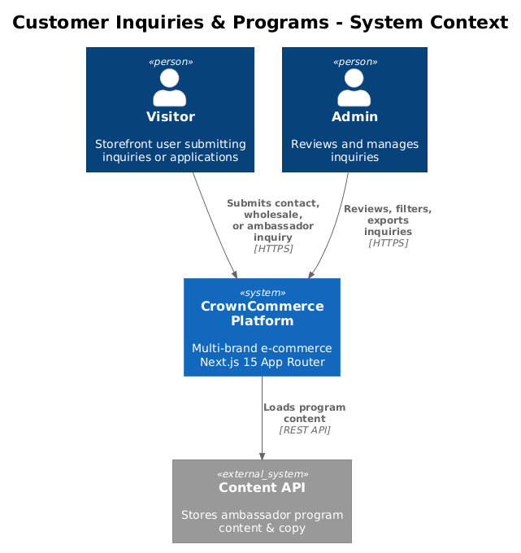
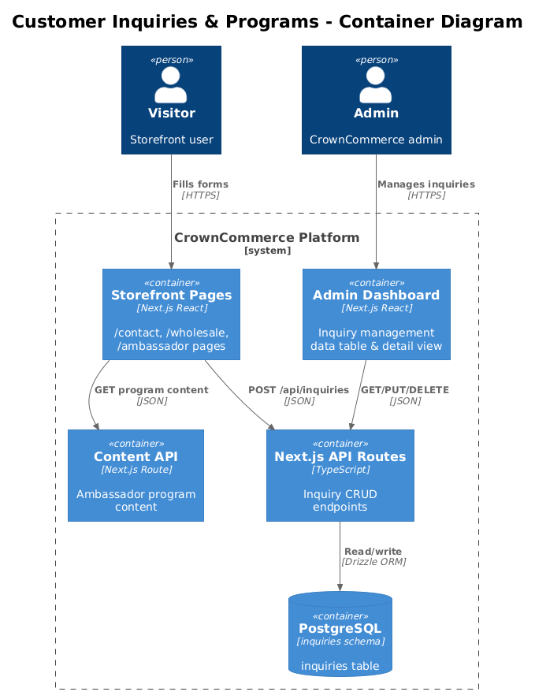
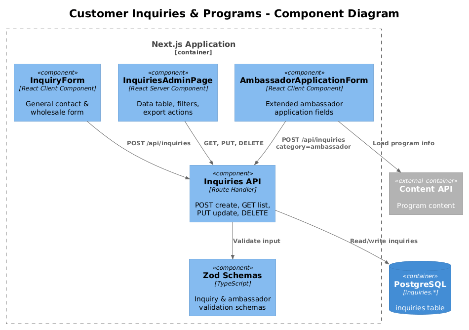
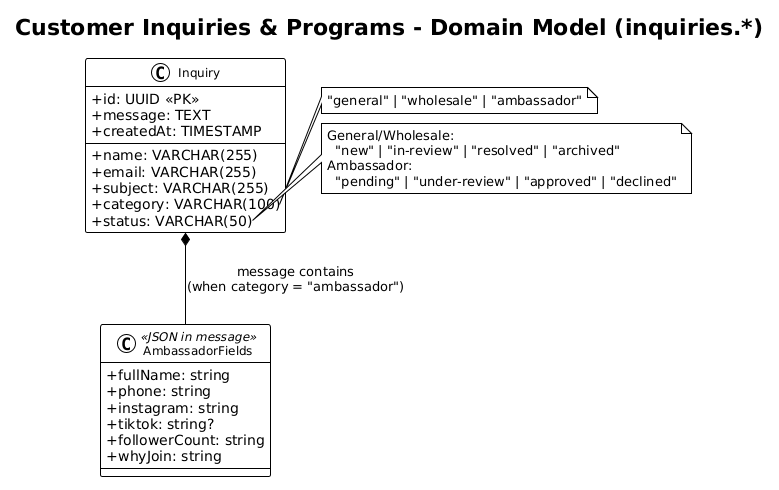
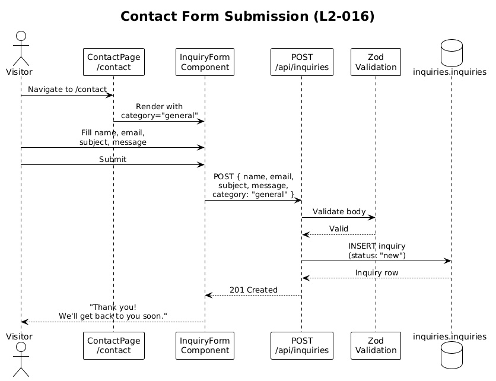
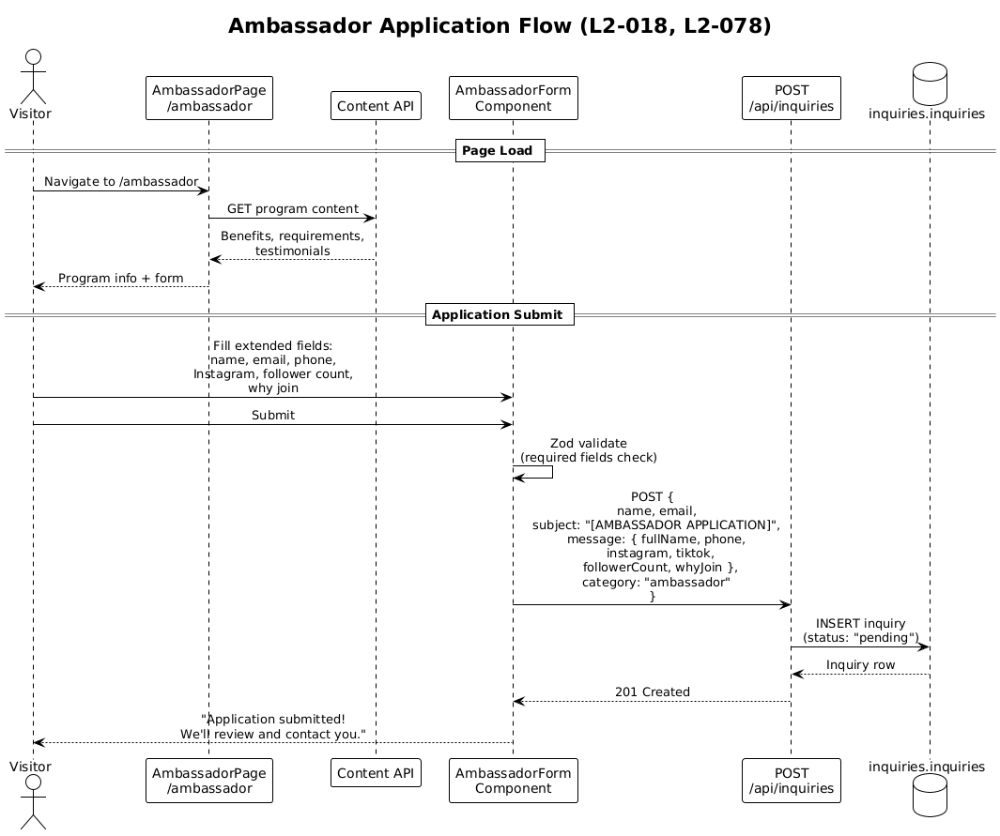
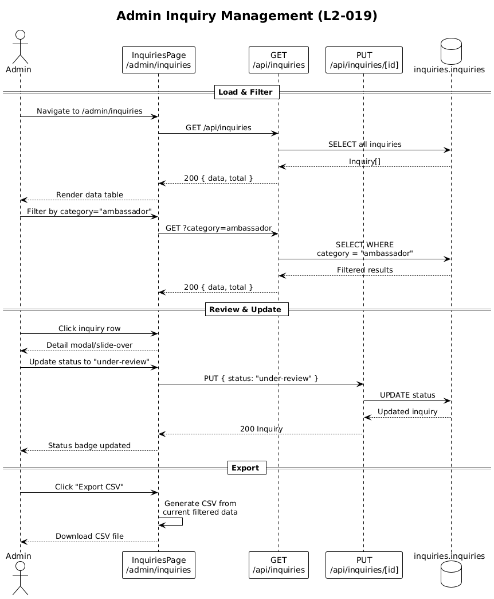

# Customer Inquiries & Programs — Detailed Design

## 1. Overview

The Customer Inquiries & Programs feature provides a unified intake system for all customer communications — general contact, wholesale inquiries, and ambassador program applications — through a single `inquiries` domain model with category-based differentiation. The ambassador program extends beyond basic inquiries with dedicated application fields and status tracking.

| Requirement | Summary |
|---|---|
| **L2-016** | Contact form at `/contact` with standard fields |
| **L2-017** | Wholesale inquiry form at `/wholesale` with "[WHOLESALE]" subject prefix |
| **L2-018** | Ambassador application at `/ambassador` with "[AMBASSADOR APPLICATION]" prefix |
| **L2-019** | Admin inquiry management with search, filter, delete, CSV/PDF export |
| **L2-078** | Ambassador service: extended application form, status lifecycle tracking |

**Actors:**
- **Visitor** — unauthenticated storefront user submitting inquiries or applications
- **Admin** — authenticated CrownCommerce team member reviewing and managing inquiries

**Scope boundary:** This feature handles inquiry creation, storage, and admin management. It does not include email notification to admins on new inquiries (that's a Notification Service concern, Feature 15), nor does it cover CRM-level customer relationship tracking (Feature 15 CRM).

**Key design decision:** All inquiry types (contact, wholesale, ambassador) share the same `inquiries` table and API endpoints. The `category` column differentiates them. Ambassador applications extend this with additional fields stored in a structured JSON column or a dedicated `ambassador_applications` join table. This unified model reduces API surface area and admin complexity at the cost of ambassador-specific queries being slightly more complex.

## 2. Architecture

### 2.1 C4 Context Diagram



### 2.2 C4 Container Diagram



### 2.3 C4 Component Diagram



## 3. Component Details

### 3.1 InquiryForm (`lib/features/inquiry-form.tsx`)

- **Responsibility:** Client component that renders a contact/inquiry form. Accepts a `category` prop that determines form behavior (subject prefix, field visibility). Handles form submission via POST to `/api/inquiries`.
- **Props:** `{ category?: string; title?: string }`
- **Current implementation:** Uses controlled form state with `useState`. For L2-078 ambassador extension, this will need to be refactored or a separate `AmbassadorForm` component created.
- **Validation (L2-016):** Currently relies on HTML `required` attributes. Should be enhanced with Zod schema validation + react-hook-form for richer error messages and type safety.
- **Dependencies:** shadcn `Button`, `Input`, `Textarea`, `Label`, `Card`

### 3.2 Contact Page (`app/(storefront)/contact/page.tsx`)

- **Responsibility (L2-016):** Renders `InquiryForm` with `category="general"`. Fields: name, email, subject, message. Optional product dropdown could be added as a prop-driven select field.
- **Dependencies:** `InquiryForm`

### 3.3 Wholesale Page (`app/(storefront)/wholesale/page.tsx`)

- **Responsibility (L2-017):** Renders introductory copy about wholesale program + `InquiryForm` with `category="wholesale"`. The form prefixes subjects with "[WHOLESALE]" server-side during POST processing.
- **Dependencies:** `InquiryForm`

### 3.4 Ambassador Page (`app/(storefront)/ambassador/page.tsx`)

- **Responsibility (L2-018, L2-078):** Two-section layout:
  1. **Program info section:** Loaded from Content API (benefits, requirements, testimonials)
  2. **Application form:** Extended fields beyond basic inquiry — full name, email, phone, Instagram handle, optional TikTok, follower count range, "why join" message
- **Design note:** The ambassador form requires more fields than `InquiryForm` supports. Two options:
  - *Option A (chosen):* Create a dedicated `AmbassadorApplicationForm` component that submits to the same `/api/inquiries` endpoint with `category: "ambassador"` and stores extended fields in the `message` as structured JSON
  - *Option B (deferred):* Add an `ambassador_applications` table with typed columns. Better for querying but adds schema complexity. Can be migrated to later if ambassador volume warrants it.

### 3.5 Inquiries API Route (`app/api/inquiries/route.ts`)

- **Responsibility:** `GET` lists all inquiries (admin), `POST` creates a new inquiry (public).
- **POST behavior:**
  1. Validate body with Zod schema (name, email required; message required; category required)
  2. If `category` is `"wholesale"`, prepend "[WHOLESALE]" to subject
  3. If `category` is `"ambassador"`, prepend "[AMBASSADOR APPLICATION]" to subject
  4. Insert into `inquiries.inquiries` with `status: "new"`
  5. Return 201
- **GET behavior (L2-019):** Returns all inquiries. Accepts query params: `?category=`, `?status=`, `?search=` (searches name, email, subject). Results paginated with `?page=&limit=`.

### 3.6 Inquiry Detail Route (`app/api/inquiries/[id]/route.ts`)

- **Responsibility:** `GET` returns single inquiry, `PUT` updates status, `DELETE` removes (L2-019).
- **Status transitions:** `new` → `in-review` → `resolved` / `archived`
- **Ambassador-specific statuses (L2-078):** `pending` → `under-review` → `approved` / `declined`

### 3.7 Admin Inquiries Page (`app/(admin)/admin/inquiries/page.tsx`)

- **Responsibility (L2-019):** Full-featured inquiry management:
  - **Data table:** Sortable columns (date, name, category, status), searchable by name/email/subject
  - **Filters:** Category tabs (All | Contact | Wholesale | Ambassador), Status dropdown
  - **Actions:** View details (slide-over or modal), delete, bulk actions
  - **Export (L2-019):** CSV export via client-side generation from fetched data. PDF export via browser print or a library like jsPDF.
- **Dependencies:** `inquiriesApi`, admin auth guard, shadcn `DataTable`, `Dialog`, `Select`

## 4. Data Model

### 4.1 Class Diagram



### 4.2 Entity Descriptions

**inquiries.inquiries**
| Column | Type | Description |
|---|---|---|
| `id` | UUID (PK) | Auto-generated |
| `name` | VARCHAR(255) | Submitter full name, NOT NULL |
| `email` | VARCHAR(255) | Submitter email, NOT NULL |
| `subject` | VARCHAR(255) | Subject line (auto-prefixed for wholesale/ambassador) |
| `message` | TEXT | Message body. For ambassador category, may contain structured JSON with extended fields |
| `category` | VARCHAR(100) | `"general"` \| `"wholesale"` \| `"ambassador"`. Default `"general"` |
| `status` | VARCHAR(50) | `"new"` → `"in-review"` → `"resolved"` / `"archived"`. Default `"new"` |
| `created_at` | TIMESTAMP | Submission time |

**Ambassador extended fields** (stored as structured JSON in `message` for ambassador category):
```json
{
  "fullName": "string",
  "phone": "string",
  "instagram": "string",
  "tiktok": "string (optional)",
  "followerCount": "string (range)",
  "whyJoin": "string",
  "rawMessage": "string"
}
```

**Design trade-off:** Storing ambassador-specific fields in JSON within the `message` column keeps the schema simple and avoids a migration for a secondary table. The downside is that SQL queries on individual fields (e.g., "find all ambassadors with >10k followers") require JSON operators. If ambassador applications grow, a typed `ambassador_applications` table should be introduced.

## 5. Key Workflows

### 5.1 Contact Form Submission (L2-016)

Standard inquiry flow — visitor fills out form, system stores it, admin reviews later.



**Steps:**
1. Visitor navigates to `/contact`
2. Fills in name, email, subject, message
3. Client-side Zod validation (required fields, email format)
4. POST to `/api/inquiries` with `category: "general"`
5. API validates, inserts, returns 201
6. UI shows "Thank you" confirmation

### 5.2 Ambassador Application Flow (L2-018, L2-078)

Extended flow with program content loading and structured application data.



**Steps:**
1. Visitor navigates to `/ambassador`
2. Page loads program content from Content API
3. Visitor fills in extended form (name, email, phone, Instagram, TikTok, follower count, why join message)
4. Client-side validation (required: name, email, Instagram, follower count, why join)
5. POST to `/api/inquiries` with `category: "ambassador"`, structured message body
6. API prepends "[AMBASSADOR APPLICATION]" to subject
7. API inserts with `status: "pending"`
8. UI shows success confirmation
9. Later: Admin reviews in inquiries page, updates status to `"under-review"` → `"approved"` or `"declined"`

### 5.3 Admin Inquiry Management (L2-019)



**Steps:**
1. Admin navigates to `/admin/inquiries`
2. Page fetches all inquiries with default filters
3. Admin can filter by category, status, or search text
4. Admin clicks inquiry row → detail view shows full message
5. Admin can update status, delete, or export filtered results

## 6. API Contracts

### POST /api/inquiries
**Purpose:** Submit an inquiry (public, L2-016/L2-017/L2-018)
```typescript
// Request
{
  name: string;          // required
  email: string;         // required, valid email
  subject?: string;      // optional for general, auto-prefixed for wholesale/ambassador
  message: string;       // required, plain text or JSON for ambassador
  category: "general" | "wholesale" | "ambassador";
}

// Response 201
{ id: string; name: string; email: string; subject: string;
  message: string; category: string; status: "new"; createdAt: string }

// Response 400 (validation error)
{ error: string; fields?: Record<string, string> }
```

### GET /api/inquiries
**Purpose:** List inquiries (admin only, L2-019)
```typescript
// Query params: ?category=ambassador&status=new&search=jane&page=1&limit=25
// Response 200
{ data: Inquiry[]; total: number; page: number; limit: number }
```

### GET /api/inquiries/[id]
**Purpose:** Get single inquiry detail (admin only)
```typescript
// Response 200
Inquiry

// Response 404
{ error: "Not found" }
```

### PUT /api/inquiries/[id]
**Purpose:** Update inquiry status (admin only)
```typescript
// Request
{ status: "in-review" | "resolved" | "archived" | "under-review" | "approved" | "declined" }

// Response 200
Inquiry
```

### DELETE /api/inquiries/[id]
**Purpose:** Delete inquiry (admin only, L2-019)
```typescript
// Response 200
{ success: true }
```

## 7. Security Considerations

| Concern | Mitigation |
|---|---|
| **Spam submissions** | Public POST endpoint is vulnerable to spam. Implement rate limiting (e.g., 5 submissions per IP per hour) and consider adding a honeypot field or reCAPTCHA. |
| **XSS in message display** | Admin inquiry detail must sanitize displayed message content. React's default JSX escaping handles this, but if rendering HTML from ambassador JSON fields, use `DOMPurify`. |
| **Admin access control** | All GET (list), PUT, DELETE operations require valid `auth-token` cookie with admin role. POST (create) is intentionally public. |
| **Email validation** | Zod schema validates email format on the server, not just client-side HTML validation. Prevents malformed data from reaching the database. |
| **Data export (L2-019)** | CSV/PDF export happens client-side from already-fetched data. No additional endpoint needed. Ensure export doesn't include sensitive admin metadata. |
| **Ambassador PII** | Ambassador applications contain phone numbers and social media handles. These are stored in the `message` column. Access is restricted to admin-only endpoints. Consider encryption at rest for PII fields in production. |

## 8. Open Questions

1. **Ambassador table migration:** When should we migrate from JSON-in-message to a dedicated `ambassador_applications` table? Threshold: when ambassador query patterns become complex (filtering by follower count, status-specific ambassador reports).

2. **Email notifications to admin:** Should new inquiries trigger an email to the admin team? This would require integration with the Notification Service. Current design stores only; notification is deferred.

3. **Product dropdown (L2-016):** The contact form spec mentions an "optional product dropdown." This requires loading products from the Catalog API at form render time. Should this be a server component that pre-fetches, or a client-side dynamic load?

4. **Inquiry assignment:** Should inquiries support assignment to specific team members? Current design has no `assignee` field. This would be a natural extension for team-based workflow.

5. **Ambassador application edit:** Can an applicant edit their application after submission? Current design is fire-and-forget. If edit is needed, we'd need an applicant-facing status page with auth.
