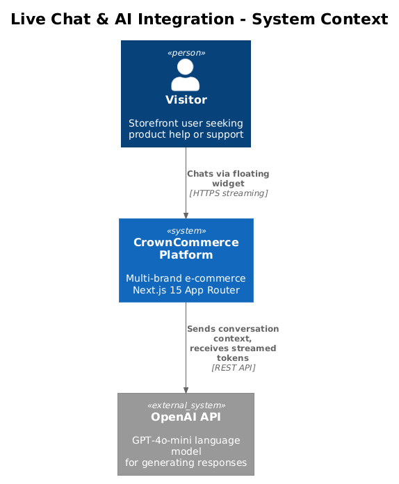
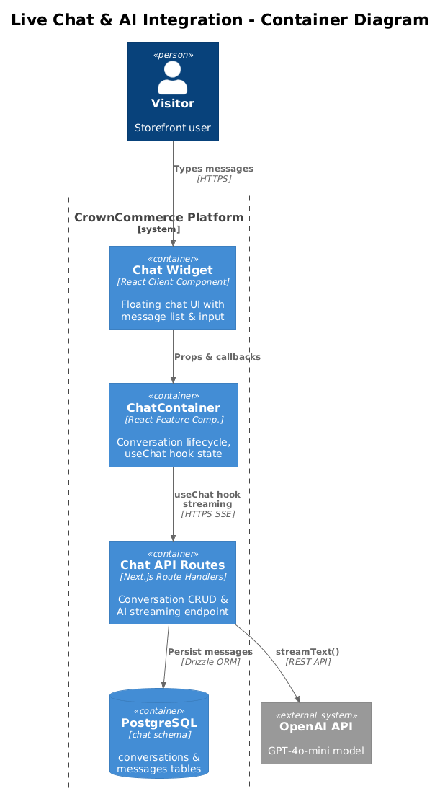
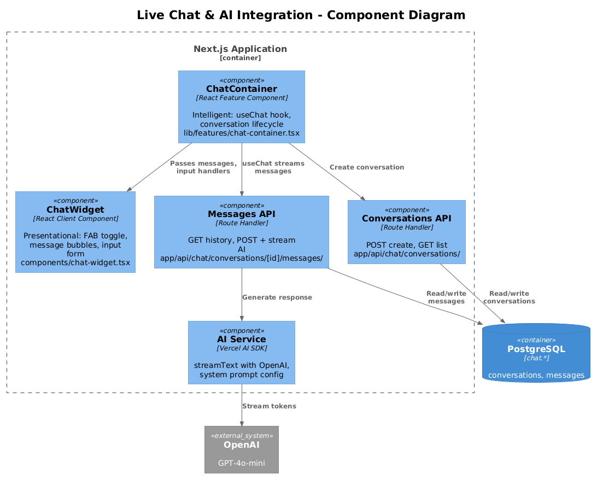
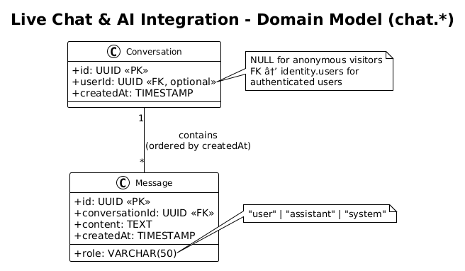
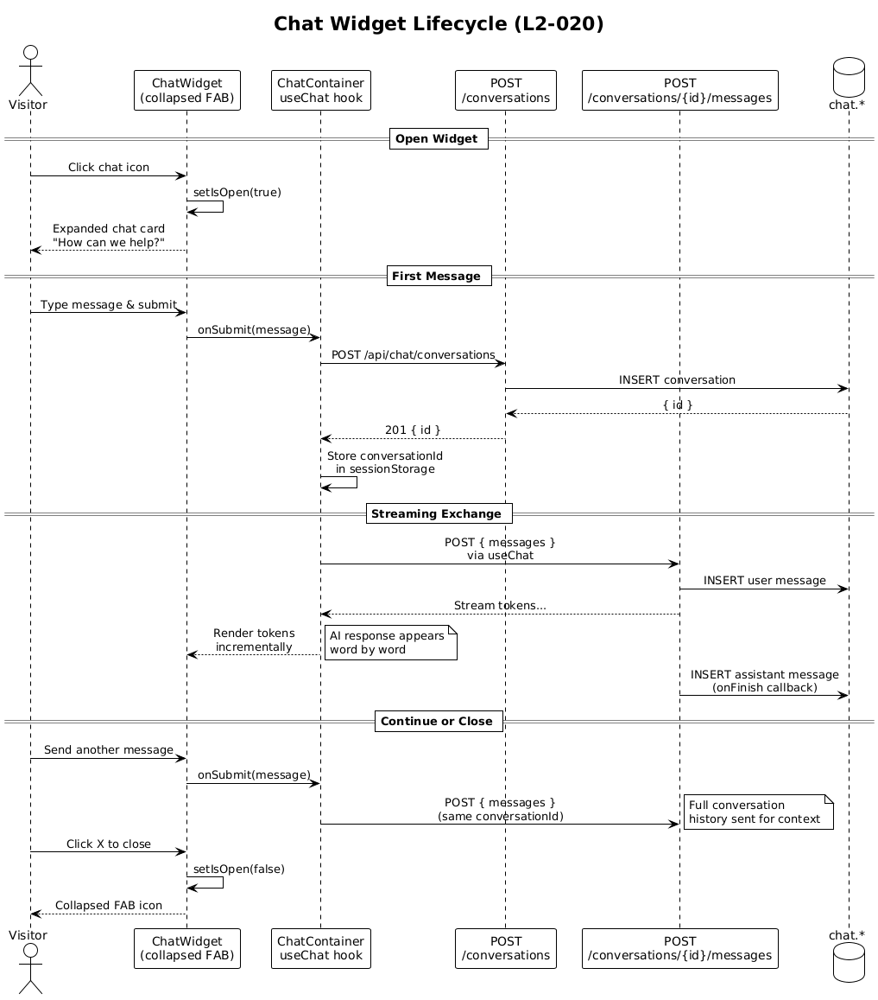
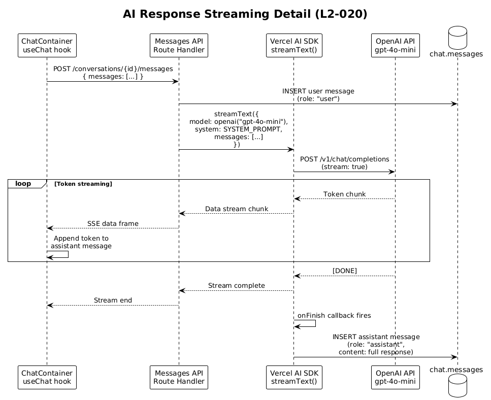

# Live Chat & AI Integration — Detailed Design

## 1. Overview

The Live Chat & AI Integration feature provides real-time conversational support on CrownCommerce storefronts through a floating chat widget powered by the Vercel AI SDK. Visitors can ask questions and receive AI-generated responses streamed in real-time, with full conversation persistence in the database.

| Requirement | Summary |
|---|---|
| **L2-020** | Floating chat widget on consumer storefronts with AI-generated responses |

**Actors:**
- **Visitor** — unauthenticated or authenticated storefront user who initiates a chat
- **AI Assistant** — OpenAI-powered model (via Vercel AI SDK) that generates responses

**Scope boundary:** This feature covers the consumer-facing chat experience only. Admin chat monitoring, human agent handoff, and chat analytics are out of scope for the initial release. The AI assistant answers product-related questions and provides general support — it does not process orders, manage accounts, or access customer PII.

**Technology choices:**
- **Vercel AI SDK** (`ai` + `@ai-sdk/openai`): Chosen for native Next.js streaming support, built-in `useChat` hook for client state management, and server-side streaming via `streamText`. This eliminates the need to build custom SSE/WebSocket infrastructure.
- **Conversation persistence:** All messages are stored in PostgreSQL (`chat` schema) for potential future analytics and human review. The AI SDK's `onFinish` callback writes the assistant response to the database after streaming completes.

## 2. Architecture

### 2.1 C4 Context Diagram



### 2.2 C4 Container Diagram



### 2.3 C4 Component Diagram



## 3. Component Details

### 3.1 ChatWidget (`components/chat-widget.tsx`)

- **Responsibility:** Presentational client component with two states:
  - **Collapsed:** Floating action button (FAB) with `MessageCircle` icon, fixed bottom-right
  - **Expanded:** Chat card with message list, input field, and send button
- **Current implementation:** Manages local message state, creates a new conversation per session, sends messages via REST. This will be refactored to use the Vercel AI SDK `useChat` hook for streaming.
- **UI elements:** shadcn `Card`, `Button`, `Input`; Lucide icons (`MessageCircle`, `X`, `Send`)
- **State management:** `isOpen` (toggle), `messages` (chat history), `input` (current text), `loading` (AI response pending)
- **Design note:** The widget renders conditionally on storefront layouts only — not on admin or team route groups. It's included in the `(storefront)` layout.

### 3.2 ChatContainer (`lib/features/chat-container.tsx`)

- **Responsibility:** Feature composition that wraps `ChatWidget`. Currently a thin wrapper; will be enhanced to:
  1. Manage conversation lifecycle (create on first message, reuse existing)
  2. Pass the Vercel AI SDK `useChat` hook's state and handlers down to `ChatWidget`
  3. Handle conversation ID persistence in `sessionStorage` to survive page navigations
- **Pattern:** Follows the project's intelligent container / presentational component split. `ChatContainer` owns business logic; `ChatWidget` owns rendering.
- **Dependencies:** `ChatWidget`, `useChat` from `ai/react`

### 3.3 Messages API Route (`app/api/chat/conversations/[id]/messages/route.ts`)

- **Responsibility:** `GET` retrieves message history for a conversation. `POST` is the AI chat endpoint that processes user messages and returns streamed AI responses.
- **POST behavior (with Vercel AI SDK):**
  1. Extract `conversationId` from URL params
  2. Validate that conversation exists
  3. Parse incoming messages from the Vercel AI SDK client format
  4. Persist user message to database
  5. Call `streamText` with OpenAI model and system prompt
  6. On completion, persist assistant message to database via `onFinish`
  7. Return streaming response using `toDataStreamResponse()`
- **System prompt:** Configures the AI as a CrownCommerce product specialist with knowledge of hair care products, brand differences (Origin Hair vs Mane Haus), and general e-commerce support.

### 3.4 Conversations API Route (`app/api/chat/conversations/route.ts`)

- **Responsibility:** `GET` lists conversations (for future admin use). `POST` creates a new conversation.
- **POST behavior:** Creates a conversation row with optional `userId` (NULL for anonymous visitors, populated for authenticated users via `auth-token` cookie).

### 3.5 System Prompt Configuration

The AI system prompt is a critical component that shapes response quality:

```
You are a helpful assistant for CrownCommerce, a premium hair care e-commerce platform.
You help customers with product questions, hair care advice, order inquiries, and general support.
Brands: Origin Hair (originhair.com) and Mane Haus (manehaus.com).
Be friendly, professional, and concise. If you don't know something, say so.
Do not make up product information. Do not process orders or access customer accounts.
```

This prompt is stored as a constant in the messages route handler, not in the database, so changes require a code deployment. This is intentional for the initial release — a CMS-managed prompt can be added later.

## 4. Data Model

### 4.1 Class Diagram



### 4.2 Entity Descriptions

**chat.conversations**
| Column | Type | Description |
|---|---|---|
| `id` | UUID (PK) | Auto-generated |
| `user_id` | UUID | Optional FK to identity.users. NULL for anonymous visitors |
| `created_at` | TIMESTAMP | Conversation start time |

**chat.messages**
| Column | Type | Description |
|---|---|---|
| `id` | UUID (PK) | Auto-generated |
| `conversation_id` | UUID (FK→conversations) | Parent conversation, NOT NULL |
| `role` | VARCHAR(50) | `"user"` \| `"assistant"` \| `"system"` |
| `content` | TEXT | Message text, NOT NULL |
| `created_at` | TIMESTAMP | Message time |

**Key relationships:**
- A conversation has many messages (1:N, ordered by `created_at`)
- Messages have a `role` that distinguishes user input, AI responses, and system prompts
- The `system` role is used for the initial system prompt message (optionally persisted)

**Design note:** The schema intentionally keeps messages simple (text content only). For future enhancements (image attachments, product card embeds, structured responses), a `metadata` JSONB column could be added to `messages`.

## 5. Key Workflows

### 5.1 Chat Widget Lifecycle (L2-020)

The complete flow from widget icon to conversation to closure.



**Steps:**
1. Storefront layout renders `ChatContainer` → `ChatWidget` (collapsed FAB)
2. Visitor clicks the chat icon → widget expands
3. On first message, `ChatContainer` creates a conversation via POST `/api/chat/conversations`
4. Stores `conversationId` in `sessionStorage` for page navigation persistence
5. User types message and submits
6. `useChat` sends messages to POST `/api/chat/conversations/{id}/messages`
7. Server streams AI response tokens back
8. Client renders tokens incrementally in the message list
9. On stream completion, both user and assistant messages are persisted in DB
10. Visitor can continue conversing or close the widget

### 5.2 AI Response Streaming (L2-020)

Detail of the server-side AI processing with Vercel AI SDK.



**Steps:**
1. Client sends message array via `useChat` hook
2. API route receives POST with messages in AI SDK format
3. Persists user message to `chat.messages`
4. Calls `streamText` from `ai` package with `openai('gpt-4o-mini')` model
5. OpenAI returns tokens as a stream
6. API route pipes stream to client via `toDataStreamResponse()`
7. Client's `useChat` hook incrementally updates the assistant message in UI
8. When stream completes, `onFinish` callback fires on server
9. Server persists complete assistant message to `chat.messages`

**Trade-off:** We use `gpt-4o-mini` rather than `gpt-4o` for cost efficiency. The mini model is sufficient for product Q&A and general support. If response quality proves insufficient, upgrading is a one-line model change. At ~$0.15/1M input tokens vs ~$2.50/1M for GPT-4o, this saves ~94% on AI costs.

## 6. API Contracts

### POST /api/chat/conversations
**Purpose:** Create a new conversation
```typescript
// Request (body optional)
{ userId?: string }

// Response 201
{ id: string; userId: string | null; createdAt: string }
```

### GET /api/chat/conversations/[id]/messages
**Purpose:** Retrieve message history for a conversation
```typescript
// Response 200
Message[]  // [{ id, conversationId, role, content, createdAt }]
```

### POST /api/chat/conversations/[id]/messages
**Purpose:** Send a message and receive AI streaming response (L2-020)
```typescript
// Request (Vercel AI SDK format)
{
  messages: Array<{ role: "user" | "assistant" | "system"; content: string }>
}

// Response: Streaming data response (text/event-stream)
// Vercel AI SDK data stream protocol
// Client consumes via useChat hook
```

**Important:** This endpoint returns a streaming response, not a standard JSON response. The client must use the Vercel AI SDK's `useChat` hook (which sets the `api` option to this endpoint) to correctly consume the stream.

## 7. Security Considerations

| Concern | Mitigation |
|---|---|
| **AI prompt injection** | The system prompt is server-side only and not exposed to the client. User messages are passed as the `user` role — they cannot override the system prompt. The AI SDK handles role separation. |
| **Rate limiting** | Chat endpoints should be rate-limited per IP or session (e.g., 30 messages per minute) to prevent abuse and runaway OpenAI costs. Implement via middleware or Vercel Edge config. |
| **OpenAI API key exposure** | `OPENAI_API_KEY` is a server-only env var. The streaming happens server-side; only rendered tokens reach the client. |
| **PII in conversations** | Visitors may include personal information in chat. Messages are stored in the database. Access is currently unrestricted (no admin viewer yet). When admin chat review is added, ensure it respects data retention policies. |
| **Conversation enumeration** | Conversation IDs are UUIDs (128-bit random). An attacker cannot enumerate conversations. However, the GET messages endpoint should validate that the requesting user owns the conversation (or is an admin). |
| **Cost control** | Use `maxTokens` parameter in `streamText` to cap response length (e.g., 500 tokens). Monitor OpenAI usage via their dashboard. Set billing alerts. |
| **Content filtering** | OpenAI's built-in content moderation filters harmful content. Additionally, consider adding a pre-send check for obviously inappropriate messages before calling the AI. |

## 8. Open Questions

1. **Conversation reuse vs. new per session:** Should returning visitors (same `sessionStorage`) resume their previous conversation, or always start fresh? Resuming provides context but may confuse the AI with stale context. Current design: new conversation per browser session.

2. **Human agent handoff:** When the AI cannot help, should there be a "Talk to a human" button? This requires a separate live agent system (e.g., Intercom, Zendesk) or a custom admin chat interface. Deferred to a future iteration.

3. **Product knowledge base:** Should the AI have access to the product catalog for accurate answers? Options:
   - *RAG approach:* Embed product catalog, retrieve relevant products per query
   - *Tool calling:* Give the AI a `searchProducts` tool that queries the catalog API
   - *Static context:* Include top products in the system prompt
   
   Deferred: Start with general knowledge, add retrieval if response quality suffers.

4. **Anonymous vs. authenticated:** Should authenticated users' conversations link to their customer profile? Current schema supports this via `userId`, but the widget doesn't currently pass the user context.

5. **Multi-brand context:** Should the AI system prompt change based on which brand storefront the visitor is on? E.g., on `originhair.com`, the AI focuses on Origin Hair products. This could be achieved by passing `brandTag` to the API route and selecting a brand-specific system prompt.
