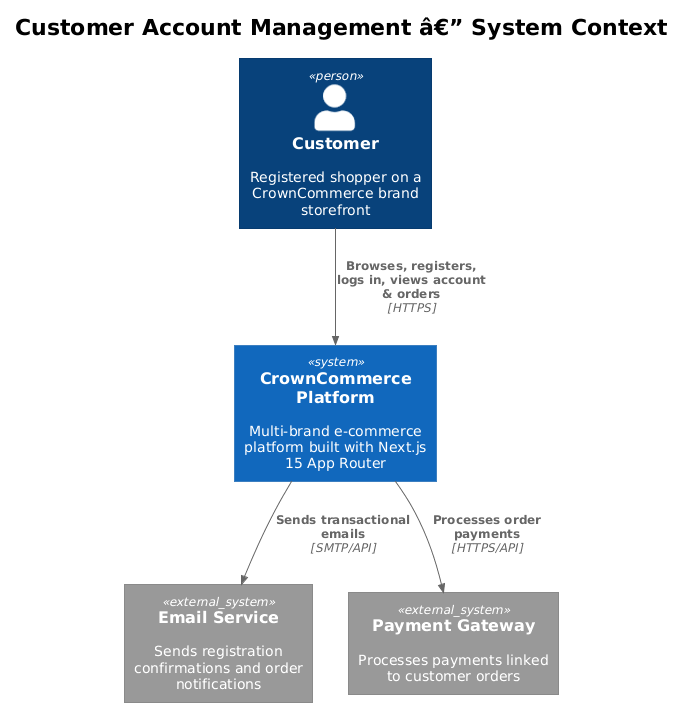
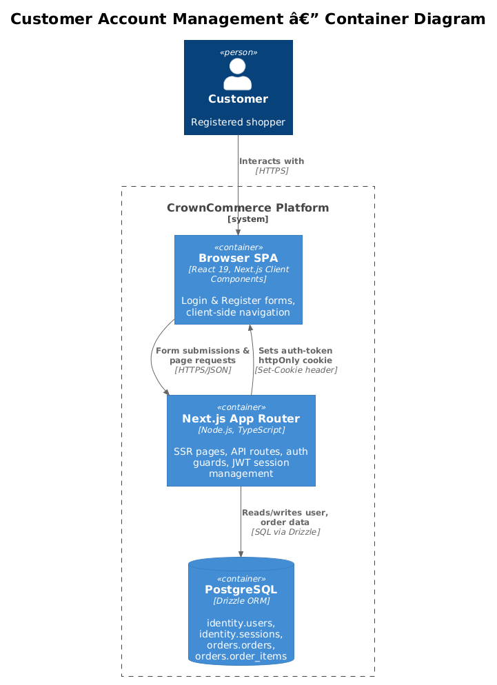
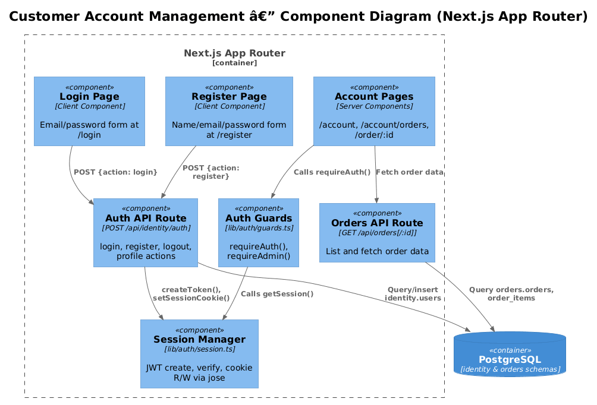
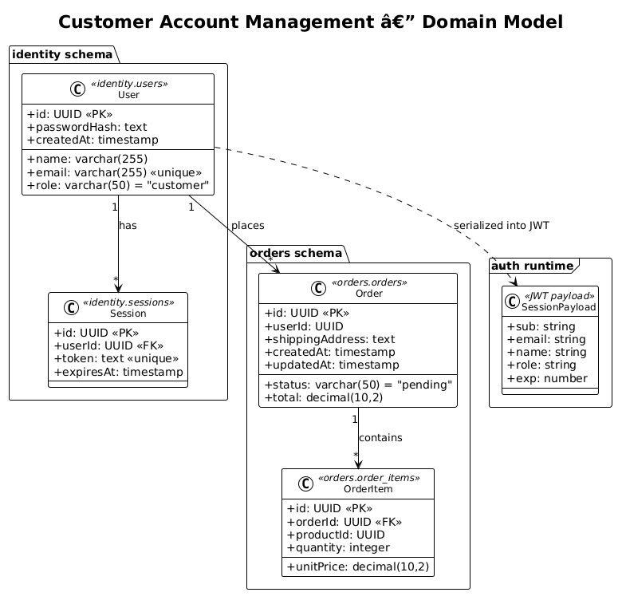
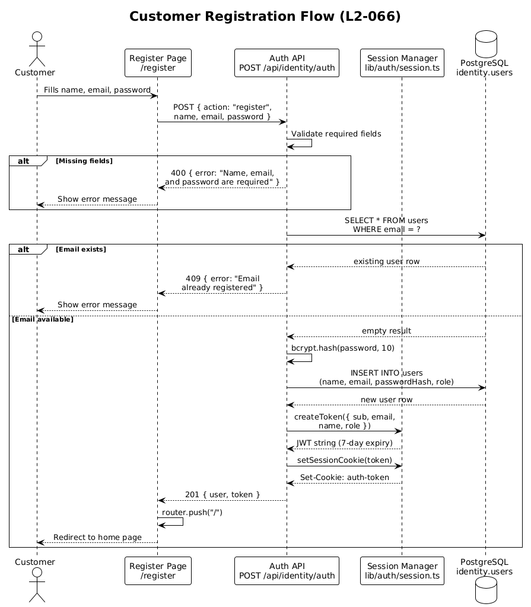
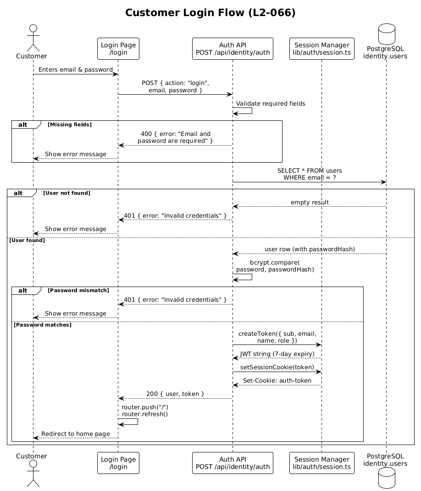
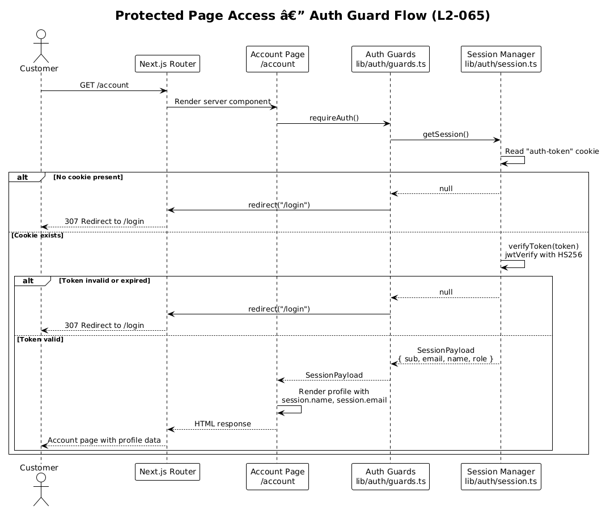

# Customer Account Management — Detailed Design

> **Feature 10** · Traces to **L1-030**, **L2-065**, **L2-066**
> Status: **Draft**

---

## 1. Overview

Customer Account Management provides authenticated storefont experiences for CrownCommerce customers. It spans two functional areas:

| Req | Scope | Summary |
|-----|-------|---------|
| **L2-065** | Account pages | Auth-gated `/account` (profile), `/account/orders` (history), `/order/:id` (detail) — unauthenticated visitors redirect to `/login` |
| **L2-066** | Login & registration | `/login` (credentials → identity API → redirect) and `/register` (name, email, password → identity API → create account) with error feedback |

**Actors:** Customers (registered shoppers on any CrownCommerce brand storefront).
**Scope boundary:** This design covers the storefront customer-facing flows only — admin user management, team collaboration, and OAuth/social login are out of scope.

### Multi-Brand Consideration

CrownCommerce uses hostname-based brand routing (e.g., `originhair.com` → Origin, `manehaus.com` → Mane Haus). All account pages live within the `(storefront)` route group and inherit the brand layout (`app/(storefront)/layout.tsx`). The auth system is brand-agnostic — JWT tokens carry `sub`, `email`, `name`, and `role` but no brand identifier. A single customer identity works across all storefronts. This is a deliberate trade-off: it simplifies the auth model at the cost of not being able to scope order history or profile data per brand without additional filtering on the `orders.userId` + product-brand join.

---

## 2. Architecture

### 2.1 C4 Context Diagram

Shows the Customer Account Management feature in the broader system landscape.



The customer interacts with the CrownCommerce platform via a web browser. The platform relies on PostgreSQL for persistence. External systems (email service for registration confirmations, payment gateway for order data) are shown for completeness but are not directly part of this feature's implementation scope today.

### 2.2 C4 Container Diagram

Shows the technical containers involved in the auth and account flows.



The Next.js App Router serves as both the SSR frontend and the API backend. Auth state is managed via httpOnly cookies containing a JWT, avoiding the need for a separate session store in the hot path (the `identity.sessions` table exists but is not used by the current JWT-based flow — see [Open Questions](#8-open-questions)).

### 2.3 C4 Component Diagram

Shows the internal components of the Next.js application relevant to this feature.



**Design decision — Server Components for account pages:** The account pages (`/account`, `/account/orders`) are React Server Components that call `requireAuth()` at the top of the render function. This ensures the auth guard runs server-side before any HTML is sent to the client, preventing flash-of-unauthenticated-content. The login and register pages are Client Components because they manage form state and submission.

---

## 3. Component Details

### 3.1 Auth API Route (`app/api/identity/auth/route.ts`)

- **Responsibility:** Single POST endpoint that dispatches on an `action` field to handle `login`, `register`, `logout`, and `profile` operations (L2-066).
- **Interface:** `POST /api/identity/auth` with JSON body `{ action: string, ...params }`.
- **Dependencies:** `lib/db` (Drizzle ORM), `lib/db/schema/identity` (users table), `bcryptjs` (password hashing), `lib/auth/session` (JWT creation and cookie management).
- **Design trade-off:** A single route with action dispatch vs. separate `/auth/login`, `/auth/register` routes. The current pattern keeps the auth surface area in one file, which is simpler for a small team. If the auth system grows (e.g., password reset, email verification, OAuth), splitting into separate routes would improve maintainability.

### 3.2 Session Manager (`lib/auth/session.ts`)

- **Responsibility:** JWT lifecycle — create, verify, read from cookie, write to cookie, clear.
- **Interface:**
  - `createToken(payload)` → `string` (7-day HS256 JWT via `jose`)
  - `verifyToken(token)` → `SessionPayload | null`
  - `getSession()` → `SessionPayload | null` (reads `auth-token` cookie)
  - `setSessionCookie(token)` → void (sets httpOnly, secure, sameSite=lax, 7-day maxAge)
  - `clearSession()` → void (deletes cookie)
- **Token payload (`SessionPayload`):** `{ sub: string (user ID), email, name, role, exp }`.
- **Security:** Tokens are signed with `AUTH_SECRET` env var. The cookie is httpOnly (no JS access), secure in production, and sameSite=lax (CSRF mitigation for top-level navigations).

### 3.3 Auth Guards (`lib/auth/guards.ts`)

- **Responsibility:** Server-side route protection (L2-065 requirement: unauthenticated → redirect to `/login`).
- **Interface:**
  - `requireAuth()` → `SessionPayload` or redirect to `/login`
  - `requireAdmin()` → `SessionPayload` (role=admin) or redirect to `/`
  - `requireTeamMember()` → `SessionPayload` (role=admin|team) or redirect to `/`
- **Pattern:** Each guard calls `getSession()`, checks conditions, and uses Next.js `redirect()` (throws a redirect response) if the check fails. Because `redirect()` throws, no further code executes — the page component never renders.

### 3.4 Account Profile Page (`app/(storefront)/account/page.tsx`)

- **Responsibility:** Display authenticated customer's profile information (L2-065).
- **Type:** React Server Component.
- **Auth:** Calls `requireAuth()` — redirects to `/login` if no valid session.
- **Data:** Reads `session.name`, `session.email`, `session.role` directly from the JWT payload. No additional DB query needed for basic profile display.
- **Navigation:** Links to `/account/orders` for order history.

### 3.5 Order History Page (`app/(storefront)/account/orders/page.tsx`)

- **Responsibility:** Display list of customer's past orders (L2-065).
- **Type:** React Server Component.
- **Auth:** Calls `requireAuth()` to get the session, then uses `session.sub` (user ID) to query orders.
- **Data flow:** Queries `orders` table filtered by `userId = session.sub`, ordered by `createdAt` descending. Currently a placeholder — full implementation will call the orders API or query directly.

### 3.6 Order Detail Page (`app/(storefront)/order/[id]/page.tsx`)

- **Responsibility:** Display full details for a single order (L2-065).
- **Type:** React Server Component.
- **Auth:** Should verify the order belongs to the authenticated user (ownership check).
- **Data flow:** Fetches order by ID from `orders` table, joins `orderItems` for line items. Displays status, total, shipping address, and individual item details.

### 3.7 Login Page (`app/(storefront)/login/page.tsx`)

- **Responsibility:** Credential-based authentication (L2-066).
- **Type:** Client Component (`"use client"`).
- **Flow:** Form submission → `POST /api/identity/auth { action: "login", email, password }` → on success, `router.push("/")` + `router.refresh()` → on failure, display error message.
- **Navigation:** "Don't have an account?" link to `/register` (L2-066 requirement).
- **Design note:** The current implementation always redirects to `/` on success. L2-066 specifies "redirect to previous page or home." This requires storing the return URL (e.g., via query param `?returnTo=/account`) — see [Open Questions](#8-open-questions).

### 3.8 Register Page (`app/(storefront)/register/page.tsx`)

- **Responsibility:** New customer account creation (L2-066).
- **Type:** Client Component (`"use client"`).
- **Flow:** Form with name, email, password (min 8 chars) → `POST /api/identity/auth { action: "register", name, email, password }` → on success, redirect to home → on failure (e.g., email already registered), display error.
- **Validation:** Client-side `minLength={8}` on password field. Server-side checks for required fields and duplicate email (409 Conflict).

---

## 4. Data Model

### 4.1 Class Diagram



### 4.2 Entity Descriptions

#### `identity.users`

| Column | Type | Constraints | Description |
|--------|------|-------------|-------------|
| `id` | `uuid` | PK, auto-generated | Unique user identifier, carried as `sub` in JWT |
| `name` | `varchar(255)` | NOT NULL | Display name |
| `email` | `varchar(255)` | NOT NULL, UNIQUE | Login credential, also in JWT payload |
| `password_hash` | `text` | NOT NULL | bcrypt hash (cost factor 10) |
| `role` | `varchar(50)` | NOT NULL, default `"customer"` | One of: `customer`, `admin`, `team` |
| `created_at` | `timestamp` | NOT NULL, default `now()` | Registration timestamp |

#### `identity.sessions`

| Column | Type | Constraints | Description |
|--------|------|-------------|-------------|
| `id` | `uuid` | PK, auto-generated | Session record identifier |
| `user_id` | `uuid` | FK → users.id, NOT NULL | Owning user |
| `token` | `text` | NOT NULL, UNIQUE | Stored token value |
| `expires_at` | `timestamp` | NOT NULL | Expiration time |

> **Note:** The `sessions` table exists in the schema but is not currently used by the JWT-based auth flow. JWT verification is stateless — `verifyToken()` checks the signature and expiration without a DB lookup. This table may be used for future token revocation or server-side session tracking.

#### `orders.orders`

| Column | Type | Constraints | Description |
|--------|------|-------------|-------------|
| `id` | `uuid` | PK, auto-generated | Order identifier |
| `user_id` | `uuid` | nullable | Customer who placed the order |
| `status` | `varchar(50)` | NOT NULL, default `"pending"` | Order lifecycle state |
| `total` | `decimal(10,2)` | NOT NULL | Order total amount |
| `shipping_address` | `text` | nullable | Delivery address |
| `created_at` | `timestamp` | NOT NULL, default `now()` | Order placement time |
| `updated_at` | `timestamp` | NOT NULL, default `now()` | Last modification |

#### `orders.order_items`

| Column | Type | Constraints | Description |
|--------|------|-------------|-------------|
| `id` | `uuid` | PK, auto-generated | Line item identifier |
| `order_id` | `uuid` | FK → orders.id, NOT NULL | Parent order |
| `product_id` | `uuid` | NOT NULL | Referenced product |
| `quantity` | `integer` | NOT NULL | Quantity ordered |
| `unit_price` | `decimal(10,2)` | NOT NULL | Price at time of purchase |

**Relationships:**
- `users` 1 → * `orders` (via `user_id`)
- `orders` 1 → * `order_items` (via `order_id`)
- `users` 1 → * `sessions` (via `user_id`)

---

## 5. Key Workflows

### 5.1 Customer Registration (L2-066)

The customer creates a new account via the `/register` page.



**Steps:**
1. Customer fills in name, email, and password on the register form.
2. Client Component submits `POST /api/identity/auth { action: "register", name, email, password }`.
3. Auth API validates required fields — returns 400 if missing.
4. Auth API checks for existing email — returns 409 if duplicate.
5. Password is hashed with bcrypt (cost factor 10).
6. New user row is inserted into `identity.users` with role `"customer"`.
7. JWT is created with the new user's `sub`, `email`, `name`, and `role`.
8. JWT is set as `auth-token` httpOnly cookie.
9. API returns 201 with user object.
10. Client redirects to home page.

### 5.2 Customer Login (L2-066)

Returning customer authenticates via the `/login` page.



**Steps:**
1. Customer enters email and password on the login form.
2. Client Component submits `POST /api/identity/auth { action: "login", email, password }`.
3. Auth API validates required fields — returns 400 if missing.
4. Auth API queries `identity.users` by email — returns 401 "Invalid credentials" if not found.
5. bcrypt compares submitted password against stored hash — returns 401 if mismatch.
6. JWT is created and set as `auth-token` cookie.
7. API returns 200 with user object.
8. Client redirects to home (or previous page if `returnTo` is implemented).

**Error handling:** Invalid credentials return a generic "Invalid credentials" message (not "email not found" or "wrong password") to prevent user enumeration.

### 5.3 Protected Page Access (L2-065)

Customer navigates to an auth-gated page like `/account`.



**Steps:**
1. Customer navigates to `/account`.
2. Next.js server renders the Account page component.
3. Page calls `requireAuth()` from `lib/auth/guards.ts`.
4. Guard calls `getSession()` which reads the `auth-token` cookie.
5. If cookie exists, `verifyToken()` validates the JWT signature and expiration.
6. **Authenticated path:** Session payload is returned, page renders with profile data.
7. **Unauthenticated path:** No cookie or invalid token → `redirect("/login")` throws, aborting the render and sending a 307 redirect to the login page.

**JWT token lifecycle:**
- **Creation:** On login or registration (7-day expiry).
- **Verification:** On every protected page load (stateless — no DB hit).
- **Expiration:** After 7 days, `verifyToken()` returns null → treated as unauthenticated.
- **Revocation:** Currently not supported (stateless JWT). Clearing the cookie logs out the current browser but doesn't invalidate the token server-side. The `identity.sessions` table could enable revocation in the future.

---

## 6. API Contracts

### 6.1 Identity Auth API

**Endpoint:** `POST /api/identity/auth`

All operations use the same endpoint with an `action` discriminator.

#### Register

```
POST /api/identity/auth
Content-Type: application/json

{
  "action": "register",
  "name": "Jane Doe",
  "email": "jane@example.com",
  "password": "securepass123"
}
```

| Status | Response | Condition |
|--------|----------|-----------|
| `201` | `{ user: { id, name, email, role }, token }` | Success |
| `400` | `{ error: "Name, email, and password are required" }` | Missing fields |
| `409` | `{ error: "Email already registered" }` | Duplicate email |
| `500` | `{ error: "Authentication failed" }` | Server error |

**Side effect:** Sets `auth-token` httpOnly cookie (7-day maxAge).

#### Login

```
POST /api/identity/auth
Content-Type: application/json

{
  "action": "login",
  "email": "jane@example.com",
  "password": "securepass123"
}
```

| Status | Response | Condition |
|--------|----------|-----------|
| `200` | `{ user: { id, name, email, role }, token }` | Success |
| `400` | `{ error: "Email and password are required" }` | Missing fields |
| `401` | `{ error: "Invalid credentials" }` | Wrong email or password |
| `500` | `{ error: "Authentication failed" }` | Server error |

**Side effect:** Sets `auth-token` httpOnly cookie.

#### Logout

```
POST /api/identity/auth
Content-Type: application/json

{ "action": "logout" }
```

| Status | Response | Condition |
|--------|----------|-----------|
| `200` | `{ success: true }` | Always |

**Side effect:** Deletes `auth-token` cookie.

#### Profile

```
POST /api/identity/auth
Content-Type: application/json

{ "action": "profile" }
```

| Status | Response | Condition |
|--------|----------|-----------|
| `200` | `SessionPayload` (`{ sub, email, name, role, exp }`) | Valid session |
| `401` | `{ error: "Unauthorized" }` | No valid session |

### 6.2 Orders API

#### List Orders

```
GET /api/orders
```

| Status | Response | Condition |
|--------|----------|-----------|
| `200` | `Order[]` | Success |
| `500` | `{ error: "Failed to fetch orders" }` | Server error |

> **Note:** The current implementation returns all orders without user filtering. For L2-065 compliance, this should be scoped to the authenticated user's orders using `session.sub`.

#### Get Order by ID

```
GET /api/orders/:id
```

| Status | Response | Condition |
|--------|----------|-----------|
| `200` | `Order` | Found |
| `404` | `{ error: "Order not found" }` | No match |
| `500` | `{ error: "Failed to fetch order" }` | Server error |

> **Note:** No ownership check exists — any user can fetch any order by ID. For L2-065, add `userId` verification.

---

## 7. Security Considerations

### 7.1 Authentication

- **JWT signing:** HS256 with `AUTH_SECRET` environment variable. The fallback `"development-secret-change-in-production"` must never be used in production — enforce via deployment checks.
- **Cookie security:** `httpOnly` (prevents XSS token theft), `secure` in production (HTTPS only), `sameSite=lax` (CSRF mitigation for top-level navigations).
- **Token expiration:** 7-day lifetime. No refresh token mechanism — users must re-authenticate after expiry.

### 7.2 Password Security

- **Hashing:** bcrypt with cost factor 10 (via `bcryptjs`). Industry standard for password storage.
- **No plaintext logging:** The auth route does not log passwords or tokens.
- **User enumeration prevention:** Login returns a generic "Invalid credentials" for both unknown email and wrong password.

### 7.3 Authorization Gaps (To Address)

| Gap | Risk | Mitigation |
|-----|------|------------|
| `GET /api/orders` returns all orders | Information disclosure — customer A can see customer B's orders | Filter by `session.sub` in the query |
| `GET /api/orders/:id` has no ownership check | Same as above for direct order access | Verify `order.userId === session.sub` |
| No CSRF token on auth forms | State-changing POSTs could be forged | `sameSite=lax` mitigates for same-site; consider adding CSRF tokens for full protection |
| Token not revocable server-side | Stolen token valid for 7 days | Implement token revocation via `identity.sessions` table or reduce token lifetime |
| No rate limiting on login endpoint | Brute-force password attacks | Add rate limiting middleware (e.g., per-IP throttling) |

### 7.4 Multi-Brand Auth

The JWT token is set with `path: "/"` and no `domain` restriction. In production, each brand runs on a different hostname. Cookies are scoped to the origin by the browser, so a token set on `originhair.com` is not sent to `manehaus.com`. This means:

- Customers must log in separately on each brand.
- A single `identity.users` row can authenticate on any brand (credentials are shared).
- Order history on one brand shows orders from all brands (no brand scoping in the `orders` table).

---

## 8. Open Questions

| # | Question | Context | Impact |
|---|----------|---------|--------|
| 1 | **Should login redirect to the previous page?** | L2-066 says "redirect to previous page or home." Current implementation always redirects to `/`. Implementing `?returnTo=` requires URL validation to prevent open redirect attacks. | UX improvement — customers clicking "Sign In" from a product page return to that page after login. |
| 2 | **Should order history be scoped per brand?** | Currently `orders.user_id` links to a user but there's no brand column. A customer who shops on both Origin and Mane Haus sees all orders combined. | Data model change — add `brand_id` to orders, or use the product catalog's brand association. |
| 3 | **Use the `identity.sessions` table for token revocation?** | The table exists in the schema but isn't used. Stateless JWT means logout only clears the cookie — stolen tokens remain valid until expiry. | Security improvement vs. added DB query on every request. Could be opt-in for sensitive operations. |
| 4 | **Add email verification on registration?** | L2-066 doesn't mention email verification. Accounts are immediately active after registration. | Reduces spam accounts and ensures email deliverability. Requires email service integration. |
| 5 | **Password complexity requirements?** | Current client-side validation is `minLength={8}`. No server-side password policy beyond "required." | Add server-side validation: minimum length, complexity rules. |
| 6 | **Profile editing capability?** | L2-065 specifies profile display (`/account`) but doesn't mention editing name, email, or password. | Future feature — add `PATCH /api/identity/auth` with action `"update-profile"`. |
