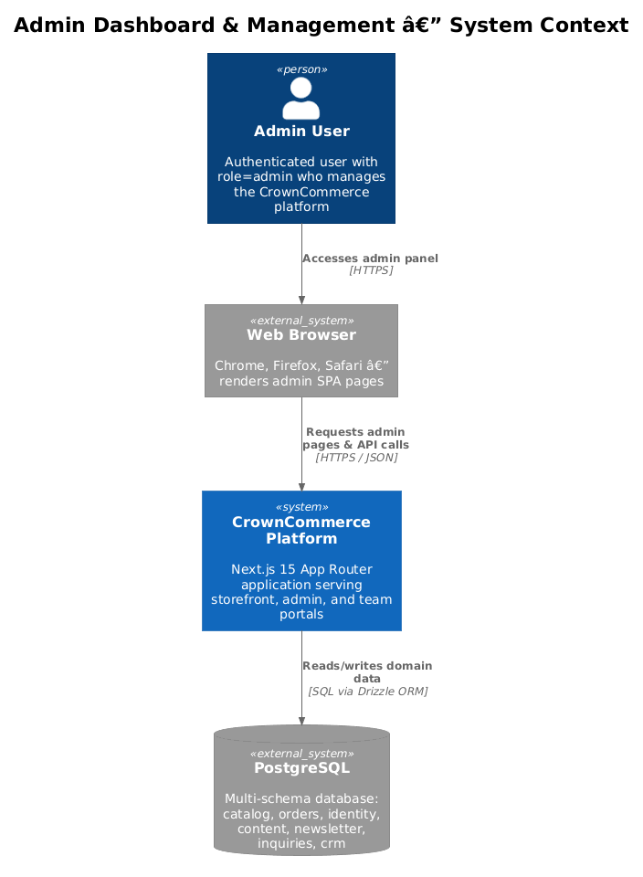
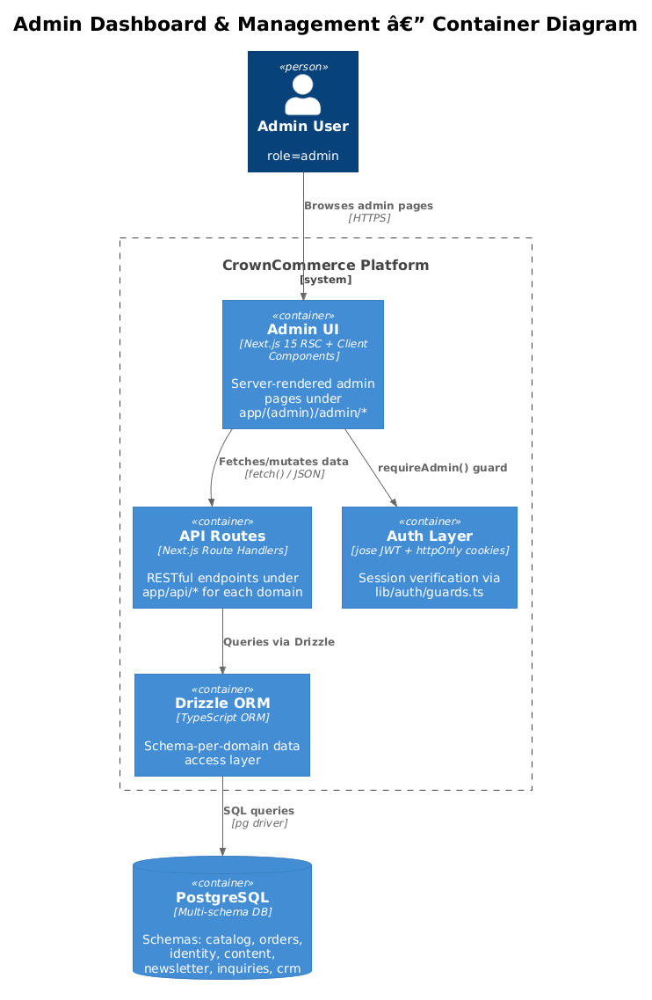
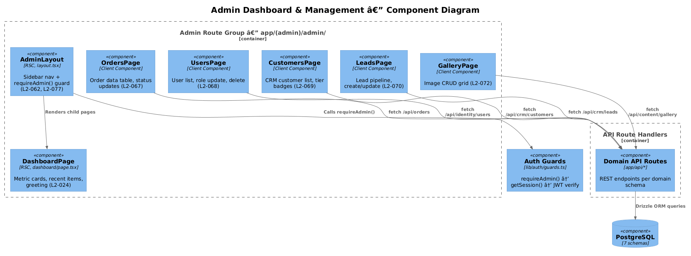
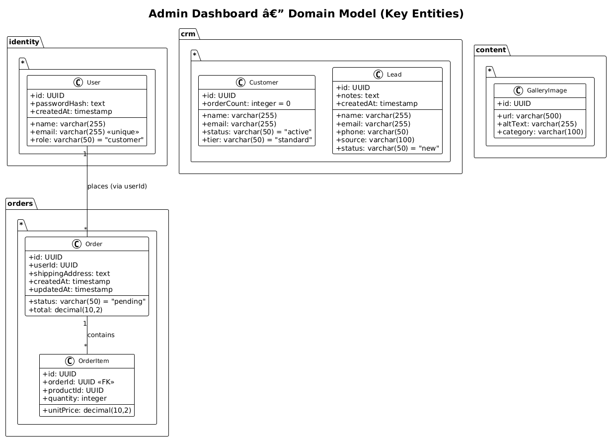
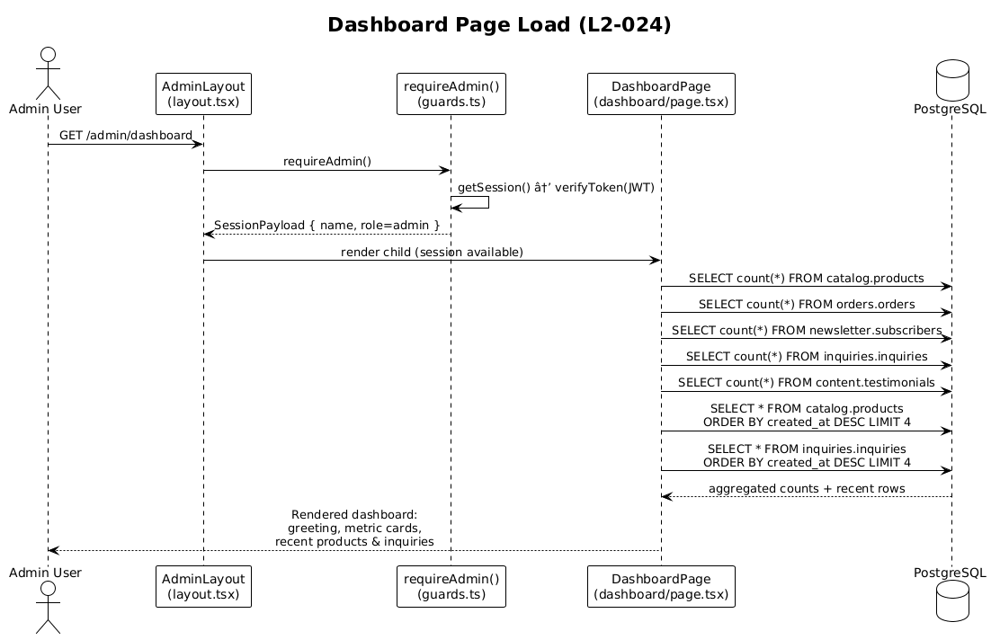
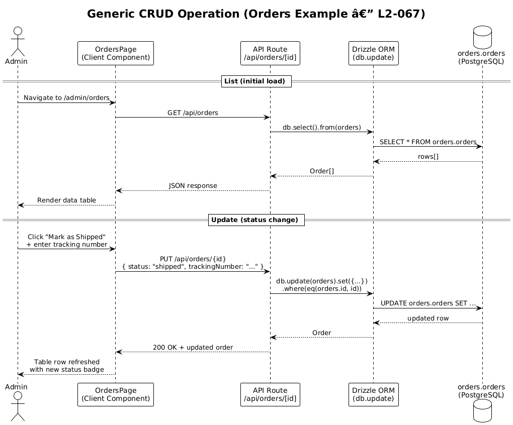
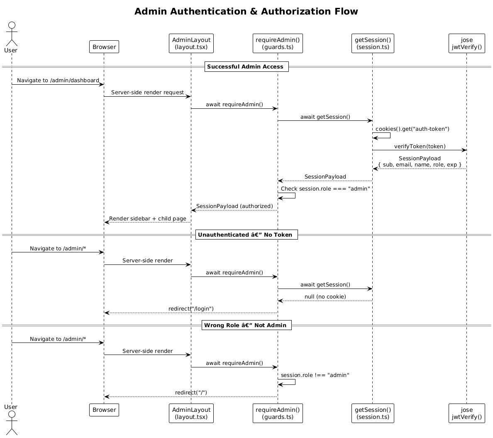

# Admin Dashboard & Management — Detailed Design

## 1. Overview

The Admin Dashboard & Management feature provides the centralized back-office interface for the CrownCommerce platform. It enables administrators to monitor platform activity through an aggregated dashboard and manage all domain entities—orders, users, customers, leads, gallery images, and more—via a consistent CRUD interface.

**Actors:** Authenticated users with `role=admin` (enforced by `requireAdmin()` in `lib/auth/guards.ts`).

**Scope boundary:** All pages under the `app/(admin)/admin/*` route group, the corresponding `app/api/*` REST endpoints, and the Drizzle ORM data-access layer. The storefront and team portals are out of scope.

**Requirements covered:**

| Req ID | Title | Summary |
|--------|-------|---------|
| L2-024 | Admin Dashboard | Metric cards, recent products/inquiries, authenticated greeting |
| L2-062 | Admin Sidebar Navigation | 20+ nav links with active highlighting |
| L2-067 | Admin Order Management | Searchable order table, status transitions, tracking number |
| L2-068 | Admin User Management | User list, role updates, account deletion |
| L2-069 | Admin Customer Management | CRM customers with status chips, tier badges, search |
| L2-070 | Admin Lead Management | Lead pipeline with source/status tracking, creation form |
| L2-072 | Admin Gallery Management | Gallery image CRUD (URL, alt text, category) |
| L2-077 | Admin Sidebar Complete Navigation | All 20+ items visible/scrollable, current page highlighted |

---

## 2. Architecture

### 2.1 C4 Context Diagram

The admin interface is one portal within the CrownCommerce Next.js application. The admin user interacts through a web browser; all data is persisted in a single PostgreSQL instance using schema-per-domain isolation.



### 2.2 C4 Container Diagram

Within the platform, the admin experience spans four logical containers: the server-rendered admin UI (React Server Components + client components), the Next.js API route handlers, the auth layer (JWT via `jose`), and the Drizzle ORM data-access layer. These all run within the same Next.js process but represent distinct architectural responsibilities.



### 2.3 C4 Component Diagram

Inside the admin route group, the `AdminLayout` component acts as the shell—rendering the sidebar navigation (L2-062, L2-077) and invoking `requireAdmin()` to gate access. Each admin page (Dashboard, Orders, Users, Customers, Leads, Gallery) is a child component rendered into the layout's `<main>` slot. Pages communicate with the PostgreSQL database either directly via server-side Drizzle queries (for RSC pages like Dashboard) or via `fetch()` calls to the API route handlers (for client components).



---

## 3. Component Details

### 3.1 Admin Shell — `AdminLayout` (L2-062, L2-077)

- **File:** `app/(admin)/admin/layout.tsx`
- **Responsibility:** Renders the two-column admin shell (sidebar + content area) and enforces admin-only access.
- **Behavior:**
  1. Calls `await requireAdmin()` on every request — this is a server-side guard that runs before any child page renders.
  2. Renders a `<aside>` sidebar containing the `navItems` array (20 items covering all admin routes).
  3. The sidebar is `hidden md:block` (collapses on mobile) and `overflow-y-auto` (scrollable for 20+ items).
  4. Renders `{children}` inside `<main className="flex-1 p-6 overflow-y-auto">`.
- **Active link highlighting (L2-077):** The current layout uses static classes. To implement active highlighting, introduce the `usePathname()` client hook in a `<SidebarNav>` client component that compares each `navItem.href` against the current pathname and applies `bg-muted font-medium` to the active link.

**Design trade-off — Server layout vs. client sidebar:**
The layout itself must remain a server component (it calls `requireAdmin()` which uses `cookies()`). The sidebar navigation highlighting requires `usePathname()`, a client-only hook. The recommended approach is to extract the `<nav>` portion into a `SidebarNav` client component that receives `navItems` as a prop, while keeping the outer layout as an RSC. This avoids converting the entire layout to a client component and preserves the server-side auth guard.

### 3.2 Dashboard Page (L2-024)

- **File:** `app/(admin)/admin/dashboard/page.tsx`
- **Responsibility:** Displays platform health at a glance — metric cards, recent items, and a personalized greeting.
- **Current state:** Static placeholder with hardcoded counts for Products (12), Orders (0), Subscribers (0), Inquiries (0).
- **Target behavior:**
  - **Greeting:** Display `"Welcome back, {session.name}"` using the session payload from `requireAdmin()`.
  - **Metric cards:** Five cards showing live counts queried from separate schemas:
    - Products → `SELECT count(*) FROM catalog.products`
    - Inquiries → `SELECT count(*) FROM inquiries.inquiries`
    - Testimonials → `SELECT count(*) FROM content.testimonials`
    - Subscribers → `SELECT count(*) FROM newsletter.subscribers`
    - Content Pages → `SELECT count(*) FROM content.pages`
  - **Recent Products:** Latest 4 products ordered by `created_at DESC` with a "View All" link to `/admin/products`.
  - **Recent Inquiries:** Latest 4 inquiries ordered by `created_at DESC` with a "View All" link to `/admin/inquiries`.
- **Data access pattern:** Since this is a server component, all queries execute server-side via Drizzle ORM. No API routes are needed for the dashboard — direct DB access is simpler and avoids unnecessary HTTP round-trips.

**Design trade-off — Multi-schema aggregation:**
The dashboard must query 5+ tables across 4 schemas (`catalog`, `orders`, `identity`, `content`, `newsletter`, `inquiries`). Two approaches:
1. **Parallel server-side queries (recommended):** Use `Promise.all()` to issue all count queries and recent-items queries concurrently via Drizzle. This keeps the page as a single RSC with ~7 parallel DB queries.
2. **Dedicated dashboard API endpoint:** Create a `/api/admin/dashboard` endpoint that aggregates everything. This adds complexity and an HTTP hop with no benefit since the page is already server-rendered.

We recommend approach 1 for simplicity.

### 3.3 Order Management Page (L2-067)

- **File:** `app/(admin)/admin/orders/page.tsx`
- **API routes:** `app/api/orders/route.ts` (GET, POST), `app/api/orders/[id]/route.ts` (GET, PUT)
- **Responsibility:** Displays orders in a searchable data table and allows status updates.
- **Target behavior:**
  - **Data table columns:** Order ID (truncated UUID), Customer Name (resolved via `userId` → `identity.users`), Email, Total (formatted currency), Status (badge), Date (formatted `createdAt`).
  - **Search:** Client-side filter on customer name and order ID. For large datasets, migrate to server-side search via query parameter.
  - **Status update:** Inline status dropdown or action button. Status transitions: `pending` → `processing` → `shipped` → `delivered`. When updating to `shipped`, a modal prompts for an optional tracking number.
  - **API contract:** `PUT /api/orders/{id}` with body `{ status: string, trackingNumber?: string }`.

**Design trade-off — Customer name resolution:**
The `orders.orders` table stores only `userId`. To show customer names, either:
1. **Join at API level (recommended):** Modify `GET /api/orders` to join `identity.users` on `userId` and return the name inline. This requires a cross-schema join which Drizzle supports.
2. **Client-side resolution:** Fetch users separately and join in the UI. This adds complexity and extra network calls.

### 3.4 User Management Page (L2-068)

- **File:** `app/(admin)/admin/users/page.tsx`
- **API routes:** `app/api/identity/users/route.ts` (GET), `app/api/identity/users/[id]/route.ts` (GET, PUT, DELETE)
- **Responsibility:** Lists all platform users and allows role changes and account deletion.
- **Target behavior:**
  - **Data table columns:** Name, Email, Role (badge), Created At.
  - **Role update:** Inline dropdown to change role (`customer`, `team`, `admin`). Calls `PUT /api/identity/users/{id}` with `{ role: string }`.
  - **Delete:** Action button triggering a confirmation dialog (shadcn `AlertDialog`). Calls `DELETE /api/identity/users/{id}`.
  - **Safety guard:** The API should prevent an admin from deleting their own account or demoting themselves (avoid admin lockout).

### 3.5 Customer Management Page (L2-069)

- **File:** `app/(admin)/admin/customers/page.tsx`
- **API routes:** `app/api/crm/customers/route.ts` (GET, POST), `app/api/crm/customers/[id]/route.ts` (GET, PUT)
- **Responsibility:** Displays CRM customers with visual status and tier indicators.
- **Target behavior:**
  - **Data table columns:** Name, Email, Status (colored chip: active=green, inactive=gray, churned=red), Tier (badge: standard, premium, vip), Order Count.
  - **Search:** Client-side filter by name or email.
  - **Delete:** Action button with confirmation dialog. Calls `DELETE /api/crm/customers/{id}` (endpoint to be added).

### 3.6 Lead Management Page (L2-070)

- **File:** `app/(admin)/admin/leads/page.tsx`
- **API routes:** `app/api/crm/leads/route.ts` (GET, POST), `app/api/crm/leads/[id]/route.ts` (GET, PUT, DELETE)
- **Responsibility:** Pipeline-style lead management with source tracking and status progression.
- **Target behavior:**
  - **Data table columns:** Name, Email, Phone, Source, Status (badge), Created At.
  - **Lead statuses:** `new` → `contacted` → `qualified` → `negotiating` → `won` | `lost`. Each status maps to a distinct badge color.
  - **Create lead:** "Add Lead" button opens a form/dialog with fields: Name (required), Email (required), Phone, Source (dropdown: website, referral, social, event, other), Notes.
  - **Status update:** Inline dropdown or action menu on each row. Calls `PUT /api/crm/leads/{id}`.
  - **Delete:** With confirmation. Uses existing `DELETE /api/crm/leads/{id}`.

### 3.7 Gallery Management Page (L2-072)

- **File:** `app/(admin)/admin/gallery/page.tsx`
- **API routes:** `app/api/content/gallery/route.ts` (GET, POST)
- **Responsibility:** CRUD for gallery images displayed on the storefront.
- **Target behavior:**
  - **Display:** Grid of image cards showing the image (loaded from `url`), alt text, and category badge.
  - **Add image:** "Upload Image" button opens a form: Image URL (required), Alt Text, Category (dropdown or free text).
  - **Edit:** Edit icon on each card opens a pre-filled form. Calls `PUT /api/content/gallery/{id}` (endpoint to be added).
  - **Delete:** Trash icon with confirmation dialog. Calls `DELETE /api/content/gallery/{id}` (endpoint to be added).

**Design trade-off — URL input vs. file upload:**
The current schema stores a `url` varchar, not binary image data. For MVP, the admin enters an image URL directly (suitable for CDN-hosted images). A future enhancement could add a file-upload flow that uploads to an object store (S3/Cloudflare R2) and writes the resulting URL to the database.

---

## 4. Data Model

### 4.1 Class Diagram

The domain entities managed by the admin dashboard span five PostgreSQL schemas. Each schema is defined via Drizzle `pgSchema()` and maps to a separate Postgres schema namespace.



### 4.2 Entity Descriptions

| Entity | Schema | Table | Key Attributes | Notes |
|--------|--------|-------|----------------|-------|
| **Order** | `orders` | `orders.orders` | id (UUID PK), userId (FK → identity.users), status (pending/processing/shipped/delivered), total (decimal), shippingAddress, createdAt, updatedAt | Status transitions managed by admin (L2-067) |
| **OrderItem** | `orders` | `orders.order_items` | id, orderId (FK → orders), productId, quantity, unitPrice | Line items within an order |
| **User** | `identity` | `identity.users` | id (UUID PK), name, email (unique), passwordHash, role (customer/team/admin), createdAt | Role updates and deletion via admin (L2-068). Password hash never exposed to API responses. |
| **Customer** | `crm` | `crm.customers` | id (UUID PK), name, email, status (active/inactive/churned), tier (standard/premium/vip), orderCount | CRM-specific record, separate from auth user (L2-069) |
| **Lead** | `crm` | `crm.leads` | id (UUID PK), name, email, phone, source, status (new/contacted/qualified/negotiating/won/lost), notes, createdAt | Sales pipeline tracking (L2-070) |
| **GalleryImage** | `content` | `content.gallery_images` | id (UUID PK), url, altText, category | Image metadata for storefront gallery (L2-072) |
| **Product** | `catalog` | `catalog.products` | id (UUID PK), name, description, price, texture, type, length, originId, imageUrl, createdAt, updatedAt | Displayed in dashboard recent items (L2-024) |
| **Subscriber** | `newsletter` | `newsletter.subscribers` | id (UUID PK), email, brandTag, status, confirmedAt, createdAt | Count shown on dashboard (L2-024) |
| **Inquiry** | `inquiries` | `inquiries.inquiries` | id (UUID PK), name, email, subject, message, category, status, createdAt | Count + recent items on dashboard (L2-024) |

### 4.3 Multi-Schema Architecture

CrownCommerce uses Drizzle's `pgSchema()` to isolate domain boundaries at the database level:

```
PostgreSQL
├── catalog    → products, origins, reviews, bundle_deals
├── orders     → orders, order_items, carts, cart_items, payments
├── identity   → users, sessions
├── content    → pages, faqs, testimonials, gallery_images, hero_content, trust_bar_items
├── newsletter → subscribers, campaigns, campaign_recipients
├── inquiries  → inquiries
└── crm        → customers, leads
```

**Implication for admin dashboard:** The dashboard page (L2-024) must aggregate data across all seven schemas in a single render. Since Drizzle connects to one PostgreSQL instance, cross-schema queries are possible but each query targets a single schema's tables. The recommended pattern is parallel `Promise.all()` for count queries.

---

## 5. Key Workflows

### 5.1 Dashboard Loading (L2-024)

When an admin navigates to `/admin/dashboard`, the server-side rendering pipeline:
1. `AdminLayout` calls `requireAdmin()` to verify the JWT and role.
2. `DashboardPage` (an RSC) issues parallel Drizzle queries across schemas.
3. Counts and recent items are rendered into Card components.
4. The fully-rendered HTML is streamed to the browser.



**Implementation sketch:**

```typescript
// app/(admin)/admin/dashboard/page.tsx
import { requireAdmin } from "@/lib/auth/guards";
import { db } from "@/lib/db";
import { products } from "@/lib/db/schema/catalog";
import { orders } from "@/lib/db/schema/orders";
import { subscribers } from "@/lib/db/schema/newsletter";
import { inquiries } from "@/lib/db/schema/inquiries";
import { testimonials } from "@/lib/db/schema/content";
import { count, desc } from "drizzle-orm";

export default async function DashboardPage() {
  const session = await requireAdmin();

  const [
    [{ value: productCount }],
    [{ value: orderCount }],
    [{ value: subscriberCount }],
    [{ value: inquiryCount }],
    [{ value: testimonialCount }],
    recentProducts,
    recentInquiries,
  ] = await Promise.all([
    db.select({ value: count() }).from(products),
    db.select({ value: count() }).from(orders),
    db.select({ value: count() }).from(subscribers),
    db.select({ value: count() }).from(inquiries),
    db.select({ value: count() }).from(testimonials),
    db.select().from(products).orderBy(desc(products.createdAt)).limit(4),
    db.select().from(inquiries).orderBy(desc(inquiries.createdAt)).limit(4),
  ]);

  return (
    <div>
      <h1>Welcome back, {session.name}</h1>
      {/* Metric cards and recent items */}
    </div>
  );
}
```

### 5.2 Generic CRUD Operation (L2-067)

All admin management pages (Orders, Users, Customers, Leads, Gallery) follow the same data-table CRUD pattern. This example shows order status update but applies identically to user role changes (L2-068), customer deletion (L2-069), lead status updates (L2-070), and gallery edits (L2-072).



**Reusable data table pattern:**

Each admin page follows this structure:
1. **Client component** that fetches data on mount via `useEffect` + `fetch()`.
2. **Data table** using shadcn/ui `<Table>` primitives with sortable columns and search input.
3. **Action column** with Edit/Delete buttons that trigger shadcn dialogs.
4. **Optimistic refresh** — after a mutation (PUT/DELETE), re-fetch the list or update local state.

```
┌─────────────────────────────────────────────────┐
│  [Search input]                    [Add Button] │
├─────────────────────────────────────────────────┤
│  Name │ Email │ Status │ ... │ Actions          │
│  ─────┼───────┼────────┼─────┼──────────        │
│  row  │  ...  │ badge  │ ... │ [Edit] [Delete]  │
│  row  │  ...  │ badge  │ ... │ [Edit] [Delete]  │
└─────────────────────────────────────────────────┘
```

### 5.3 Admin Authentication & Authorization

Every admin page is protected at the layout level. This means authentication runs once per navigation rather than per-page, reducing redundant JWT verifications.



**Key security properties:**
- JWT is stored in an `httpOnly` cookie named `auth-token` — not accessible to client-side JavaScript.
- `requireAdmin()` calls `requireAuth()` (redirect to `/login` if no session) then checks `session.role === "admin"` (redirect to `/` if wrong role).
- The guard returns the `SessionPayload` which can be passed to child pages for the greeting (L2-024).

---

## 6. API Contracts

All API routes follow the existing Next.js Route Handler pattern. Responses are JSON. Authentication is implicit (cookie-based) — the same `auth-token` cookie is sent with API requests from the admin UI.

### 6.1 Orders (L2-067)

| Method | Endpoint | Request Body | Response | Status |
|--------|----------|-------------|----------|--------|
| GET | `/api/orders` | — | `Order[]` | 200 |
| GET | `/api/orders/{id}` | — | `Order` | 200 / 404 |
| PUT | `/api/orders/{id}` | `{ status: string, trackingNumber?: string }` | `Order` | 200 / 404 |

**Order status enum:** `"pending"` | `"processing"` | `"shipped"` | `"delivered"`

### 6.2 Users (L2-068)

| Method | Endpoint | Request Body | Response | Status |
|--------|----------|-------------|----------|--------|
| GET | `/api/identity/users` | — | `UserSafe[]` (no passwordHash) | 200 |
| GET | `/api/identity/users/{id}` | — | `UserSafe` | 200 / 404 |
| PUT | `/api/identity/users/{id}` | `{ role: string }` | `UserSafe` | 200 / 404 |
| DELETE | `/api/identity/users/{id}` | — | `{ success: true }` | 200 |

**UserSafe type:** `{ id, name, email, role, createdAt }` — `passwordHash` is excluded in the existing SELECT projection.

### 6.3 Customers (L2-069)

| Method | Endpoint | Request Body | Response | Status |
|--------|----------|-------------|----------|--------|
| GET | `/api/crm/customers` | — | `Customer[]` | 200 |
| GET | `/api/crm/customers/{id}` | — | `Customer` | 200 / 404 |
| POST | `/api/crm/customers` | `{ name, email, status?, tier? }` | `Customer` | 201 |
| PUT | `/api/crm/customers/{id}` | `{ status?, tier?, ... }` | `Customer` | 200 / 404 |
| DELETE | `/api/crm/customers/{id}` | — | `{ success: true }` | 200 |

**Note:** `DELETE` handler does not yet exist on `app/api/crm/customers/[id]/route.ts` — needs to be added.

### 6.4 Leads (L2-070)

| Method | Endpoint | Request Body | Response | Status |
|--------|----------|-------------|----------|--------|
| GET | `/api/crm/leads` | — | `Lead[]` | 200 |
| GET | `/api/crm/leads/{id}` | — | `Lead` | 200 / 404 |
| POST | `/api/crm/leads` | `{ name, email, phone?, source?, status?, notes? }` | `Lead` | 201 |
| PUT | `/api/crm/leads/{id}` | `{ status?, notes?, ... }` | `Lead` | 200 / 404 |
| DELETE | `/api/crm/leads/{id}` | — | `{ success: true }` | 200 |

**Lead status enum:** `"new"` | `"contacted"` | `"qualified"` | `"negotiating"` | `"won"` | `"lost"`

### 6.5 Gallery (L2-072)

| Method | Endpoint | Request Body | Response | Status |
|--------|----------|-------------|----------|--------|
| GET | `/api/content/gallery` | — | `GalleryImage[]` | 200 |
| POST | `/api/content/gallery` | `{ url, altText?, category? }` | `GalleryImage` | 201 |
| PUT | `/api/content/gallery/{id}` | `{ url?, altText?, category? }` | `GalleryImage` | 200 / 404 |
| DELETE | `/api/content/gallery/{id}` | — | `{ success: true }` | 200 |

**Note:** PUT and DELETE handlers need a new `app/api/content/gallery/[id]/route.ts` file.

### 6.6 Missing API Endpoints Summary

The following endpoints exist in the schema/design but are not yet implemented:

| Endpoint | Needed For | Action |
|----------|-----------|--------|
| `DELETE /api/crm/customers/{id}` | L2-069 Customer deletion | Add DELETE handler to existing `[id]/route.ts` |
| `PUT /api/content/gallery/{id}` | L2-072 Gallery edit | Create new `app/api/content/gallery/[id]/route.ts` |
| `DELETE /api/content/gallery/{id}` | L2-072 Gallery deletion | Same file as above |

---

## 7. Security Considerations

### 7.1 Authentication & Authorization

- **Layout-level guard:** `requireAdmin()` in `AdminLayout` ensures all child pages are admin-only. This is a single enforcement point — no individual page needs its own guard.
- **API route protection gap:** The current API routes (e.g., `GET /api/orders`) do **not** call `requireAdmin()`. Any authenticated user (or unauthenticated user if no guard exists) could call these endpoints directly. **Recommendation:** Add `requireAdmin()` checks to all admin-facing API routes, or create a shared middleware.
- **JWT configuration:** The `AUTH_SECRET` falls back to `"development-secret-change-in-production"` in `lib/auth/session.ts`. Production deployments must set a strong `AUTH_SECRET` environment variable.

### 7.2 Data Protection

- **Password hash exclusion:** The `GET /api/identity/users` route already uses a SELECT projection that excludes `passwordHash`. This must be maintained for all user-facing endpoints.
- **Self-deletion prevention:** The `DELETE /api/identity/users/{id}` endpoint should reject requests where the authenticated user's `sub` matches the target `id` to prevent admin lockout.
- **Self-demotion prevention:** Similarly, `PUT /api/identity/users/{id}` should prevent an admin from changing their own role away from `admin`.

### 7.3 Input Validation

- The current API routes accept `request.json()` and pass it directly to Drizzle `insert`/`update` without validation. **Recommendation:** Add Zod schemas for request body validation on all mutation endpoints to prevent invalid data and potential injection.
- Order status transitions should be validated server-side (e.g., cannot go from `delivered` back to `pending`).

### 7.4 CSRF Protection

- The `httpOnly` + `sameSite: "lax"` cookie configuration provides baseline CSRF protection. State-mutating operations (PUT, DELETE) are JSON API calls from `fetch()`, which are not vulnerable to form-based CSRF.

---

## 8. Open Questions

| # | Question | Context | Impact |
|---|----------|---------|--------|
| 1 | **Should API routes require admin auth independently?** | Currently only the layout enforces `requireAdmin()`. API routes are unprotected. | High — security gap if APIs are called directly. |
| 2 | **Should the dashboard counts use a caching layer?** | Seven parallel COUNT(*) queries on every page load could become expensive at scale. | Medium — consider React `cache()` or ISR with `revalidate`. |
| 3 | **How should the order ↔ user join work cross-schema?** | `orders.orders.userId` references `identity.users.id` but there's no formal FK constraint across schemas. | Medium — implement as application-level join in the API route. |
| 4 | **Should gallery support file uploads?** | Current schema stores URL strings only. Admins must host images externally. | Low for MVP — can be enhanced later with S3/R2 integration. |
| 5 | **Should lead status transitions be constrained?** | Currently any status can be set to any other status. A state machine (e.g., `new` → `contacted` only) would add data integrity. | Low — useful but not blocking for MVP. |
| 6 | **Mobile sidebar behavior?** | Sidebar is `hidden md:block` — no mobile access to navigation. | Medium — add a hamburger menu toggle for mobile admin access. |
| 7 | **Pagination for data tables?** | Current API routes return all rows. At scale, this needs server-side pagination with `limit`/`offset` or cursor-based pagination. | Medium — needed before production with large datasets. |
