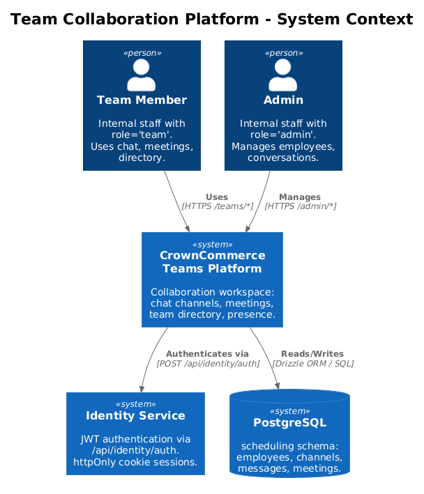
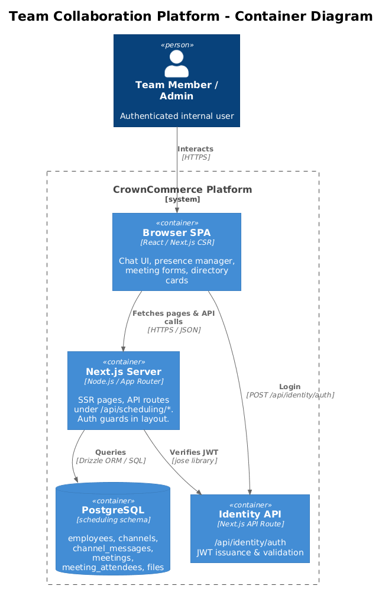
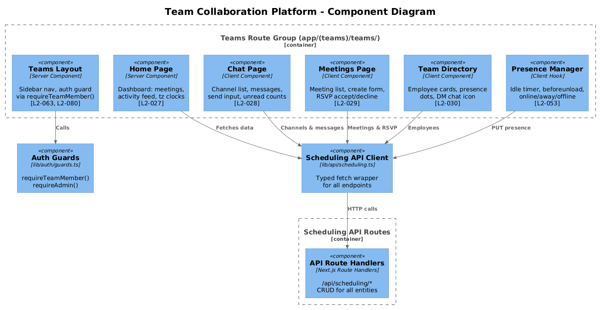
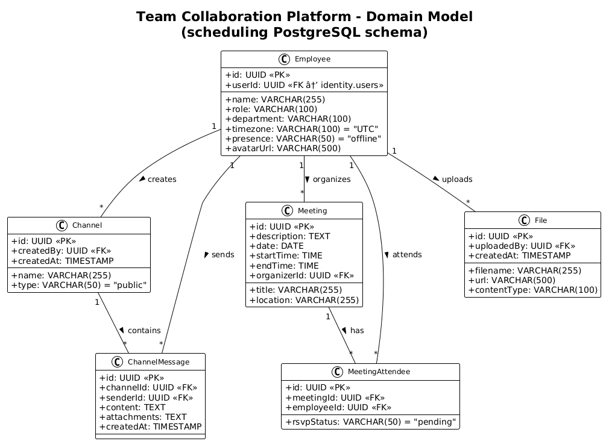
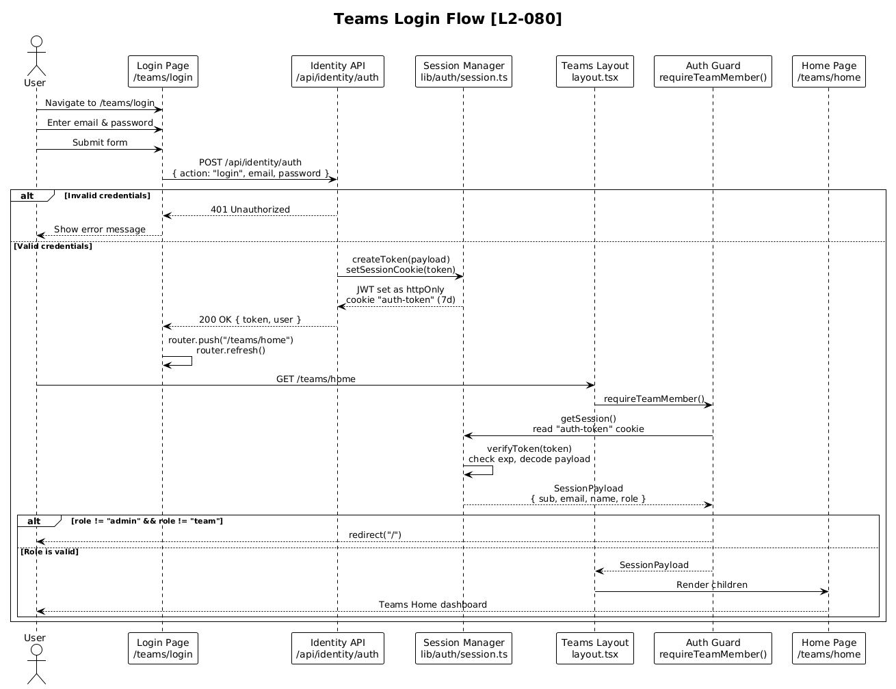
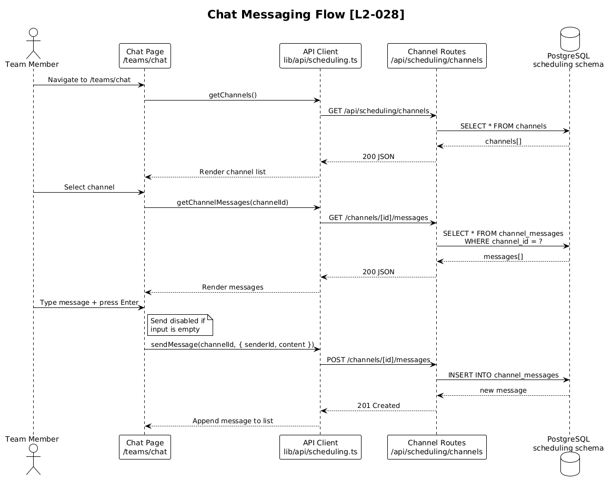
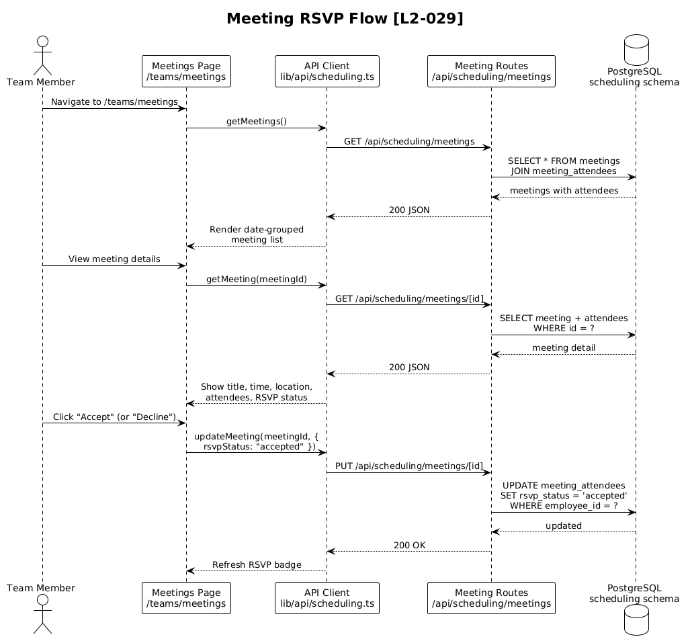
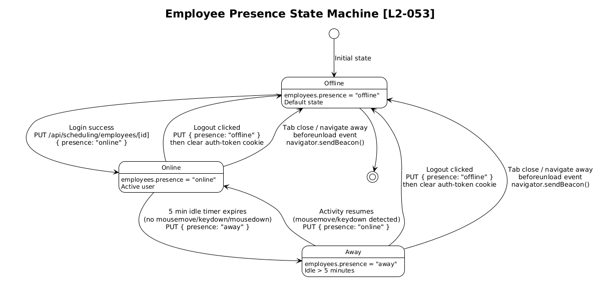

# Team Collaboration Platform — Detailed Design

## 1. Overview

The Team Collaboration Platform provides CrownCommerce internal team members with a unified workspace for real-time communication, meeting management, and team coordination. It is implemented as the `(teams)` route group within the Next.js 15 application, served under `/teams/*`.

### Purpose & Problem Statement

Internal teams need a centralized platform to:
- Communicate via persistent chat channels (public and direct messages)
- Schedule and manage meetings with RSVP tracking
- View team member availability through real-time presence indicators
- Access a team directory with role, department, and timezone information

### Actors

| Actor | Description |
|-------|-------------|
| **Team Member** | Authenticated user with `role = "team"`. Can access all `/teams/*` pages. |
| **Admin** | Authenticated user with `role = "admin"`. Can access `/teams/*` pages (via `requireTeamMember()` guard) and `/admin/*` employee/conversation management pages. |
| **Identity Service** | Internal authentication API at `/api/identity/auth` that issues JWT tokens. |
| **PostgreSQL** | Backing data store using the `scheduling` schema for all collaboration entities. |

### Scope

This design covers requirements **L2-027** (Teams Home), **L2-028** (Chat Channels), **L2-029** (Meeting Management), **L2-030** (Team Directory), **L2-033** (Admin Conversations), **L2-034** (Admin Employee Management), **L2-053** (Employee Presence), **L2-063** (Teams Sidebar), and **L2-080** (Teams Login).

### Design Trade-offs

| Decision | Rationale |
|----------|-----------|
| **Server-side auth guard** (`requireTeamMember()` in layout) | Prevents any unauthenticated rendering. The layout is a server component that redirects before children mount. Simpler than client-side route protection. |
| **Polling-first for messages** (with WebSocket path planned) | The current API layer uses REST endpoints. Real-time event types are defined in `lib/realtime/index.ts` but WebSocket transport is a separate feature (L1-026). Chat works via polling initially. |
| **`scheduling` pgSchema** for all team data | Domain isolation via PostgreSQL schemas keeps team tables separate from `identity`, `storefront`, and other schemas. Enables independent migrations. |
| **Employee ↔ User linkage via `userId`** | `scheduling.employees.userId` references `identity.users.id` but is nullable — employees can exist before a user account is provisioned. This decouples team directory management from auth provisioning. |
| **Presence stored in DB column** | `employees.presence` is a simple varchar field. This trades real-time accuracy for simplicity — presence updates go through the standard API. For high-frequency presence, a Redis-backed approach would be better, but the current scale doesn't require it. |

---

## 2. Architecture

### 2.1 C4 Context Diagram

Shows the Team Collaboration Platform in the context of its external actors and systems.



The platform sits between team members/admins and the backing services. The Identity Service handles authentication, while PostgreSQL (scheduling schema) stores all collaboration data.

### 2.2 C4 Container Diagram

Shows the technical containers that compose the platform.



The browser hosts the Next.js client-side components (chat UI, presence manager, forms). The Next.js server handles both SSR page rendering and API routes under `/api/scheduling/*`. All data persists in the `scheduling` PostgreSQL schema. Authentication flows through the Identity Service API at `/api/identity/auth`.

### 2.3 C4 Component Diagram

Shows the internal components within the Teams route group and their relationships.



Key observations:
- The **Teams Layout** (`app/(teams)/teams/layout.tsx`) wraps all pages and enforces authentication via `requireTeamMember()` (**L2-063**, **L2-080**)
- Each page component corresponds to a specific L2 requirement
- All pages consume the **Scheduling API Client** (`lib/api/scheduling.ts`) which calls the REST API routes
- The **Presence Manager** is a client-side concern that updates `employees.presence` via the API (**L2-053**)

---

## 3. Component Details

### 3.1 Teams Layout & Sidebar

**File:** `app/(teams)/teams/layout.tsx`
**Requirements:** L2-063 (Teams Sidebar), L2-080 (Auth Guard)

**Responsibility:** Provides the authenticated shell for all team pages. Renders the sidebar navigation and wraps child pages.

**Current Implementation:**
- Server component that calls `requireTeamMember()` before rendering
- Two-column layout: 264px sidebar (hidden on mobile) + flexible main content area
- Navigation links: Home (`/home`), Chat (`/chat`), Meetings (`/meetings`), Team (`/team`)

**Required Enhancements (per L2-063):**
- Display authenticated user's name, role, and avatar initials (derived from `SessionPayload.name`)
- Show presence status dot next to user info: green (Online), yellow (Away), gray (Offline)
- Presence dot color driven by the employee's `presence` field, fetched by matching `SessionPayload.sub` to `employees.userId`

**Dependencies:**
- `requireTeamMember()` from `lib/auth/guards.ts`
- `getSession()` from `lib/auth/session.ts` (to read user name/role for sidebar display)
- `schedulingApi.getEmployees()` (to fetch current employee record for presence)

### 3.2 Teams Home Page

**File:** `app/(teams)/teams/home/page.tsx`
**Requirements:** L2-027 (Teams Home)

**Responsibility:** Dashboard showing upcoming meetings, activity feed, and team timezone clocks.

**Key Behaviors:**
- **Upcoming Meetings:** Fetched via `schedulingApi.getMeetings()`, filtered to future dates, sorted ascending. Each meeting shows a color-coded badge (e.g., blue for "In 1 hour", amber for "Tomorrow"). Times displayed in the current user's timezone.
- **Activity Feed:** Recent channel messages across all channels the user belongs to. Each activity shows type-specific coloring (message = blue, meeting update = green, presence change = gray) and relative timestamps.
- **Timezone Clocks:** Display current time for each unique timezone found across team members. Fetched via `schedulingApi.getEmployees()` and grouped by `timezone` field.

**Data Source:** Authenticated user's employee record (matched via `SessionPayload.sub` → `employees.userId`).

### 3.3 Teams Chat Page

**File:** `app/(teams)/teams/chat/page.tsx`
**Requirements:** L2-028 (Teams Chat Channels)

**Responsibility:** Real-time messaging interface with channel management.

**Layout:**
- **Left Panel:** Channel list sidebar showing public channels and direct message channels. Each channel displays name and unread message count badge.
- **Right Panel:** Message display area for the selected channel. Each message shows sender name, content, and timestamp. Input area at bottom with text field and Send button.

**Key Behaviors:**
- Channels fetched via `GET /api/scheduling/channels`. Type `"public"` channels shown with `#` prefix; type `"direct"` channels shown with the other participant's name.
- Selecting a channel loads messages via `GET /api/scheduling/channels/[id]/messages`.
- Sending a message: `POST /api/scheduling/channels/[id]/messages` with `{ senderId, content }`. Send triggered by button click or Enter key. **Empty input disables the Send button** (L2-028 acceptance criteria).
- Unread counts: Tracked client-side by comparing last-read timestamp per channel against latest message `createdAt`.

**Dependencies:**
- `schedulingApi.getChannels()`, `schedulingApi.getChannelMessages(channelId)`, `schedulingApi.sendMessage(channelId, data)`
- Real-time events (`message:new` from `lib/realtime/index.ts`) for live message delivery when WebSocket transport is available

### 3.4 Teams Meetings Page

**File:** `app/(teams)/teams/meetings/page.tsx`
**Requirements:** L2-029 (Teams Meeting Management)

**Responsibility:** Meeting listing, creation, and RSVP management.

**Key Behaviors:**
- **Meeting List:** Fetched via `schedulingApi.getMeetings()`, grouped by date. Each meeting card shows title, time range (`startTime`–`endTime`), location, organizer name, and attendee count.
- **New Meeting Form:** Modal or inline form with fields: title (required), description, date (date picker), start time, end time, location, attendees (multi-select from employees). Submits via `POST /api/scheduling/meetings`.
- **RSVP:** Each meeting the current user is invited to shows Accept/Decline buttons. RSVP updates via `PUT /api/scheduling/meetings/[id]` updating the `meetingAttendees` record's `rsvpStatus` to `"accepted"` or `"declined"`.

**Dependencies:**
- `schedulingApi.getMeetings()`, `schedulingApi.createMeeting()`, `schedulingApi.updateMeeting()`
- `schedulingApi.getEmployees()` for attendee selection

### 3.5 Teams Directory Page

**File:** `app/(teams)/teams/team/page.tsx`
**Requirements:** L2-030 (Teams Directory)

**Responsibility:** Display all team members with presence and enable direct messaging.

**Key Behaviors:**
- Employees fetched via `schedulingApi.getEmployees()` and rendered as cards.
- Each card displays: **name**, **role**, **department**, **timezone**, and **presence status** with colored indicator (green = Online, yellow = Away, gray = Offline).
- **Chat icon** on each card: clicking opens or creates a DM channel with that employee. If a `"direct"` channel already exists between the current user and target, navigate to it. Otherwise, create via `POST /api/scheduling/channels` with `type: "direct"`.

**Dependencies:**
- `schedulingApi.getEmployees()`, `schedulingApi.getChannels()`, `schedulingApi.createChannel()`

### 3.6 Admin Conversations Page

**File:** `app/(admin)/admin/conversations/page.tsx`
**Requirements:** L2-033 (Admin Conversations)

**Responsibility:** Admin interface for viewing and managing team conversations.

**Key Behaviors:**
- List all channels/conversations with participant info and last message preview.
- View full message threads within a selected conversation.
- Create new conversation: form with subject (channel name), participants (multi-select employees), and initial message.
- Send messages using the authenticated admin's employee ID (looked up via `SessionPayload.sub` → `employees.userId`).

**Dependencies:**
- `schedulingApi.getChannels()`, `schedulingApi.getChannelMessages()`, `schedulingApi.createChannel()`, `schedulingApi.sendMessage()`
- `requireAdmin()` guard from `lib/auth/guards.ts`

### 3.7 Admin Employee Management Page

**File:** `app/(admin)/admin/employees/page.tsx`
**Requirements:** L2-034 (Admin Employee Management)

**Responsibility:** CRUD interface for managing employee records.

**Key Behaviors:**
- **Stats Cards:** Total employees, active count, on-leave count, employees by timezone — computed from the full employee list.
- **Data Table:** Sortable, filterable table of all employees. Columns: name, role, department, timezone, presence/status.
- **Status Filtering:** Toggle between All / Active / On Leave / Inactive views.
- **View/Edit:** Click an employee row to open a detail panel. Edit fields: name, role, department, timezone, avatarUrl. Save via `PUT /api/scheduling/employees/[id]`.

**Dependencies:**
- `schedulingApi.getEmployees()`, `schedulingApi.createEmployee()`, `schedulingApi.updateEmployee()`
- `requireAdmin()` guard

### 3.8 Presence Manager (Client-Side)

**Requirements:** L2-053 (Employee Presence)

**Responsibility:** Manages the authenticated user's presence status on the client side.

**State Machine:**

| Trigger | From | To | Mechanism |
|---------|------|----|-----------|
| Login success | — | Online | After JWT cookie set, `PUT /api/scheduling/employees/[id]` with `presence: "online"` |
| 5 min idle (no mouse/keyboard) | Online | Away | `setTimeout` + `mousemove`/`keydown` listeners. On timeout, `PUT` presence to `"away"` |
| Activity resumes | Away | Online | `mousemove`/`keydown` event fires, cancel idle timer, `PUT` presence to `"online"` |
| Logout | Online/Away | Offline | Before clearing auth token, `PUT` presence to `"offline"` |
| Tab close (`beforeunload`) | Online/Away | Offline | `window.addEventListener("beforeunload", ...)` sends `navigator.sendBeacon()` or sync XHR to set presence `"offline"` |

**Implementation Notes:**
- Use `navigator.sendBeacon()` for the `beforeunload` handler since async `fetch` may be cancelled by the browser during page unload.
- Idle timer resets on any `mousemove`, `keydown`, or `mousedown` event.
- Presence updates are also broadcast via `presence:update` real-time events (defined in `lib/realtime/index.ts`).

### 3.9 Scheduling API Routes

**Directory:** `app/api/scheduling/`

| Route | Methods | Description |
|-------|---------|-------------|
| `/api/scheduling/employees` | GET, POST | List all employees; create new employee |
| `/api/scheduling/channels` | GET, POST | List all channels; create new channel |
| `/api/scheduling/channels/[id]/messages` | GET, POST | List messages in channel; send message |
| `/api/scheduling/meetings` | GET, POST | List all meetings; create new meeting |
| `/api/scheduling/meetings/[id]` | GET, PUT, DELETE | Get, update, or delete a specific meeting |
| `/api/scheduling/files` | GET, POST | List files; upload file record |

All routes use Drizzle ORM to query the `scheduling` PostgreSQL schema. Data validation occurs at the route handler level. Responses return JSON with appropriate HTTP status codes (200 for reads, 201 for creates).

### 3.10 Scheduling API Client

**File:** `lib/api/scheduling.ts`

TypeScript client that wraps `fetch()` calls to the scheduling API routes. Provides typed interfaces (`Employee`, `Channel`, `ChannelMessage`, `Meeting`) and methods for all CRUD operations. Used by both `(teams)` and `(admin)` page components.

---

## 4. Data Model

### 4.1 Class Diagram



### 4.2 Entity Descriptions

All tables live in the `scheduling` PostgreSQL schema (defined via `pgSchema("scheduling")` in Drizzle).

#### Employee (`scheduling.employees`)

| Column | Type | Constraints | Description |
|--------|------|-------------|-------------|
| `id` | UUID | PK, auto-generated | Unique employee identifier |
| `user_id` | UUID | Nullable | FK to `identity.users.id`. Links employee record to auth user. Nullable to allow pre-provisioning employees before they have accounts. |
| `name` | VARCHAR(255) | NOT NULL | Display name |
| `role` | VARCHAR(100) | Nullable | Job role (e.g., "Developer", "Designer") |
| `department` | VARCHAR(100) | Nullable | Department (e.g., "Engineering", "Marketing") |
| `timezone` | VARCHAR(100) | Default: "UTC" | IANA timezone (e.g., "America/New_York") |
| `presence` | VARCHAR(50) | Default: "offline" | Current presence: "online", "away", "offline" |
| `avatar_url` | VARCHAR(500) | Nullable | Profile image URL |

**Employee ↔ User Linkage Pattern:** The `userId` column creates a loose coupling between the `scheduling` domain and the `identity` domain. This design allows:
- Admins to create employee records in the directory before the person has a login account
- Multiple identity users to potentially share employee context (though 1:1 is typical)
- The teams app to resolve `SessionPayload.sub` (user ID) → employee record at runtime

#### Channel (`scheduling.channels`)

| Column | Type | Constraints | Description |
|--------|------|-------------|-------------|
| `id` | UUID | PK, auto-generated | Unique channel identifier |
| `name` | VARCHAR(255) | NOT NULL | Channel display name (e.g., "general", "John ↔ Jane") |
| `type` | VARCHAR(50) | NOT NULL, default: "public" | `"public"` for group channels, `"direct"` for DMs |
| `created_by` | UUID | Nullable, FK → employees | Creator's employee ID |
| `created_at` | TIMESTAMP | NOT NULL, default: now() | Creation timestamp |

**Channel Model (Public vs DM):** Public channels are visible to all team members. DM channels (`type = "direct"`) are private between two participants. The channel `name` for DMs is typically set to a compound of participant names. Channel membership is implicit — public channels are open to all, DM channels are restricted to their creator and target.

#### ChannelMessage (`scheduling.channel_messages`)

| Column | Type | Constraints | Description |
|--------|------|-------------|-------------|
| `id` | UUID | PK, auto-generated | Unique message identifier |
| `channel_id` | UUID | NOT NULL, FK → channels | Parent channel |
| `sender_id` | UUID | NOT NULL, FK → employees | Message author's employee ID |
| `content` | TEXT | NOT NULL | Message body |
| `attachments` | TEXT | Nullable | JSON-encoded array of file references |
| `created_at` | TIMESTAMP | NOT NULL, default: now() | Send timestamp |

#### Meeting (`scheduling.meetings`)

| Column | Type | Constraints | Description |
|--------|------|-------------|-------------|
| `id` | UUID | PK, auto-generated | Unique meeting identifier |
| `title` | VARCHAR(255) | NOT NULL | Meeting title |
| `description` | TEXT | Nullable | Meeting description/agenda |
| `date` | DATE | NOT NULL | Meeting date |
| `start_time` | TIME | NOT NULL | Start time |
| `end_time` | TIME | NOT NULL | End time |
| `location` | VARCHAR(255) | Nullable | Physical or virtual location |
| `organizer_id` | UUID | Nullable, FK → employees | Organizer's employee ID |

#### MeetingAttendee (`scheduling.meeting_attendees`)

| Column | Type | Constraints | Description |
|--------|------|-------------|-------------|
| `id` | UUID | PK, auto-generated | Unique record identifier |
| `meeting_id` | UUID | NOT NULL, FK → meetings | Parent meeting |
| `employee_id` | UUID | NOT NULL, FK → employees | Invited employee |
| `rsvp_status` | VARCHAR(50) | Default: "pending" | `"pending"`, `"accepted"`, or `"declined"` |

**Meeting Lifecycle:** Organizer creates meeting → attendees added with `rsvp_status = "pending"` → each attendee accepts or declines → organizer can update or cancel meeting.

#### File (`scheduling.files`)

| Column | Type | Constraints | Description |
|--------|------|-------------|-------------|
| `id` | UUID | PK, auto-generated | Unique file identifier |
| `filename` | VARCHAR(255) | NOT NULL | Original filename |
| `url` | VARCHAR(500) | NOT NULL | Storage URL |
| `content_type` | VARCHAR(100) | Nullable | MIME type |
| `uploaded_by` | UUID | Nullable, FK → employees | Uploader's employee ID |
| `created_at` | TIMESTAMP | NOT NULL, default: now() | Upload timestamp |

---

## 5. Key Workflows

### 5.1 Teams Login Flow

**Requirements:** L2-080 (Teams Login)

The login page at `/teams/login` authenticates team members and establishes a session.



**Steps:**
1. User navigates to `/teams/login` (or is redirected there by `requireTeamMember()` guard).
2. User submits email and password.
3. Client-side form POSTs to `/api/identity/auth` with `{ action: "login", email, password }`.
4. Identity Service validates credentials and returns a JWT token.
5. Token is stored as an `httpOnly` cookie named `auth-token` (7-day expiry, secure in production).
6. Client redirects to `/teams/home` via `router.push("/teams/home")` + `router.refresh()`.
7. The Teams Layout server component calls `requireTeamMember()`, which reads the cookie, verifies the JWT, and checks `role === "admin" || role === "team"`.
8. If valid, the home page renders. If invalid or missing, redirect to `/` (root).

### 5.2 Chat Messaging Flow

**Requirements:** L2-028 (Teams Chat Channels)



**Steps:**
1. User navigates to `/teams/chat`. Page loads channel list via `GET /api/scheduling/channels`.
2. User selects a channel from the sidebar.
3. Messages load via `GET /api/scheduling/channels/[channelId]/messages`.
4. Messages render in chronological order with sender name, content, and timestamp.
5. User types a message in the input field. Send button is disabled while input is empty.
6. User presses Enter or clicks Send. Client POSTs to `/api/scheduling/channels/[channelId]/messages` with `{ senderId, content }`.
7. API route inserts into `scheduling.channel_messages` via Drizzle ORM and returns 201.
8. New message appears in the message list. (With real-time transport, `message:new` event broadcasts to other channel participants.)

### 5.3 Meeting RSVP Flow

**Requirements:** L2-029 (Teams Meeting Management)



**Steps:**
1. User navigates to `/teams/meetings`. Meetings load via `GET /api/scheduling/meetings`.
2. Meetings are displayed grouped by date with attendee count and RSVP status.
3. User views a specific meeting's details including attendee list.
4. User clicks Accept or Decline button.
5. Client sends `PUT /api/scheduling/meetings/[meetingId]` with updated attendee RSVP status.
6. API updates `meeting_attendees.rsvp_status` for the current employee's record.
7. UI refreshes to show updated RSVP status.

### 5.4 Presence State Machine

**Requirements:** L2-053 (Employee Presence)



The presence system uses three states with deterministic transitions:

- **Online:** Set immediately after successful login. Reset when activity resumes from Away.
- **Away:** Set after 5 minutes of no `mousemove`, `keydown`, or `mousedown` events.
- **Offline:** Set on explicit logout (before token clear), or via `beforeunload` event when the browser tab closes.

All state transitions call `PUT /api/scheduling/employees/[id]` to persist the new presence value. The `beforeunload` handler uses `navigator.sendBeacon()` for reliability during page teardown.

---

## 6. API Contracts

### 6.1 Authentication

**POST** `/api/identity/auth`

```json
// Request
{
  "action": "login",
  "email": "user@example.com",
  "password": "password123"
}

// Response 200
{
  "token": "eyJhbGciOiJIUzI1NiI...",
  "user": { "id": "uuid", "email": "...", "name": "...", "role": "team" }
}

// Response 401
{ "error": "Invalid credentials" }
```

**Session Cookie:** `auth-token` (httpOnly, secure in production, sameSite: lax, maxAge: 7 days)

### 6.2 Employees

**GET** `/api/scheduling/employees`
```json
// Response 200
[
  {
    "id": "uuid",
    "userId": "uuid | null",
    "name": "Jane Smith",
    "role": "Developer",
    "department": "Engineering",
    "timezone": "America/New_York",
    "presence": "online",
    "avatarUrl": null
  }
]
```

**POST** `/api/scheduling/employees`
```json
// Request
{
  "name": "Jane Smith",
  "role": "Developer",
  "department": "Engineering",
  "timezone": "America/New_York"
}

// Response 201
{ "id": "uuid", "name": "Jane Smith", ... }
```

### 6.3 Channels

**GET** `/api/scheduling/channels`
```json
// Response 200
[
  {
    "id": "uuid",
    "name": "general",
    "type": "public",
    "createdBy": "uuid",
    "createdAt": "2025-01-15T10:00:00Z"
  }
]
```

**POST** `/api/scheduling/channels`
```json
// Request
{ "name": "project-alpha", "type": "public", "createdBy": "employee-uuid" }

// Response 201
{ "id": "uuid", "name": "project-alpha", "type": "public", ... }
```

### 6.4 Channel Messages

**GET** `/api/scheduling/channels/[channelId]/messages`
```json
// Response 200
[
  {
    "id": "uuid",
    "channelId": "uuid",
    "senderId": "uuid",
    "content": "Hello team!",
    "attachments": null,
    "createdAt": "2025-01-15T10:30:00Z"
  }
]
```

**POST** `/api/scheduling/channels/[channelId]/messages`
```json
// Request
{ "senderId": "employee-uuid", "content": "Hello team!" }

// Response 201
{ "id": "uuid", "channelId": "uuid", "senderId": "uuid", "content": "Hello team!", ... }
```

### 6.5 Meetings

**GET** `/api/scheduling/meetings`
```json
// Response 200
[
  {
    "id": "uuid",
    "title": "Sprint Planning",
    "description": "Plan sprint 42",
    "date": "2025-01-20",
    "startTime": "09:00:00",
    "endTime": "10:00:00",
    "location": "Room A",
    "organizerId": "uuid"
  }
]
```

**POST** `/api/scheduling/meetings`
```json
// Request
{
  "title": "Sprint Planning",
  "description": "Plan sprint 42",
  "date": "2025-01-20",
  "startTime": "09:00:00",
  "endTime": "10:00:00",
  "location": "Room A",
  "organizerId": "uuid"
}

// Response 201
{ "id": "uuid", "title": "Sprint Planning", ... }
```

**PUT** `/api/scheduling/meetings/[id]`
```json
// Request (partial update)
{ "title": "Updated Sprint Planning", "location": "Room B" }

// Response 200
{ "id": "uuid", "title": "Updated Sprint Planning", ... }
```

### 6.6 Files

**POST** `/api/scheduling/files`
```json
// Request
{ "filename": "report.pdf", "url": "/uploads/report.pdf", "contentType": "application/pdf", "uploadedBy": "uuid" }

// Response 201
{ "id": "uuid", "filename": "report.pdf", ... }
```

---

## 7. Security Considerations

### 7.1 Authentication & Authorization

- **JWT-based sessions** using `jose` library with HS256 algorithm. Tokens stored in `httpOnly` cookies to prevent XSS access (**L2-080**).
- **Server-side auth guard** `requireTeamMember()` runs in the Teams Layout server component. Every `/teams/*` page is protected before any rendering occurs.
- **Role-based access:** `requireTeamMember()` allows `role === "admin"` or `role === "team"`. Admin pages use `requireAdmin()` which restricts to `role === "admin"` only.
- **Token expiry:** 7-day JWT lifetime. No refresh token mechanism — user must re-login after expiry.

### 7.2 Data Isolation

- All team data lives in the `scheduling` PostgreSQL schema, isolated from `identity` and other schemas.
- API routes at `/api/scheduling/*` do not currently enforce per-user data scoping — any authenticated team member can read all channels, messages, and meetings. Future enhancement: channel membership enforcement for DM privacy.

### 7.3 Input Validation

- Message content should be sanitized to prevent stored XSS (messages are rendered in the UI).
- Meeting date/time inputs validated server-side to prevent invalid schedules.
- Employee `timezone` values should be validated against IANA timezone database.

### 7.4 Presence Security

- **`beforeunload` reliability:** `navigator.sendBeacon()` is used for offline presence updates during tab close because `fetch()` requests may be cancelled. Beacon payloads are limited, so only the presence status is sent (**L2-053**).
- **Stale presence:** If `beforeunload` fails (browser crash, network loss), presence may show stale "online" state. A server-side TTL or heartbeat mechanism would mitigate this — flagged as an open question.

### 7.5 Threat Mitigations

| Threat | Mitigation |
|--------|-----------|
| Session hijacking | httpOnly + secure cookies; sameSite: lax |
| XSS via messages | Sanitize message content on render; React's default escaping helps |
| Unauthorized access | Server-side `requireTeamMember()` / `requireAdmin()` guards |
| CSRF on mutations | sameSite cookie policy; POST/PUT verbs for state changes |
| Presence spoofing | Presence updates should verify authenticated user matches employee ID |

---

## 8. Open Questions

| # | Question | Context | Impact |
|---|----------|---------|--------|
| 1 | **How should stale presence be handled?** | If a user's browser crashes, `beforeunload` won't fire and presence stays "online". Should we implement a server-side heartbeat (e.g., 30s ping) or TTL-based expiry? | L2-053 — affects team directory accuracy |
| 2 | **Should DM channels enforce membership?** | Currently, API routes return all channels to any authenticated user. DM channels between two people should not be visible to others. | L2-028 — privacy concern |
| 3 | **How are unread counts persisted?** | L2-028 requires unread message counts. Current schema has no `last_read_at` tracking per user per channel. Options: (a) add a `channel_members` table with `lastReadAt`, or (b) track client-side in localStorage. | L2-028 — requires schema change for (a) |
| 4 | **Meeting attendee management endpoint?** | The current `PUT /api/scheduling/meetings/[id]` updates the meeting itself. RSVP updates to `meeting_attendees` may need a dedicated endpoint (e.g., `PUT /api/scheduling/meetings/[id]/attendees/[employeeId]`). | L2-029 — API design decision |
| 5 | **WebSocket transport timeline?** | Real-time event types are defined in `lib/realtime/index.ts` (`message:new`, `presence:update`, `typing:start/stop`), but no WebSocket server exists yet. When is L1-026 planned? Chat polling interval in the meantime? | L2-028, L2-053 — UX responsiveness |
| 6 | **Admin conversation model vs team chat?** | L2-033 describes admin conversations as separate from team chat. Should admin conversations use the same `channels` table (with a special type like `"admin"`) or a separate table? | L2-033 — data model decision |
| 7 | **Employee status vs presence?** | L2-034 references employee statuses (Active/On Leave/Inactive) for filtering, but the schema only has a `presence` field (online/away/offline). Should a separate `status` column be added to `employees`? | L2-034 — schema change needed |
