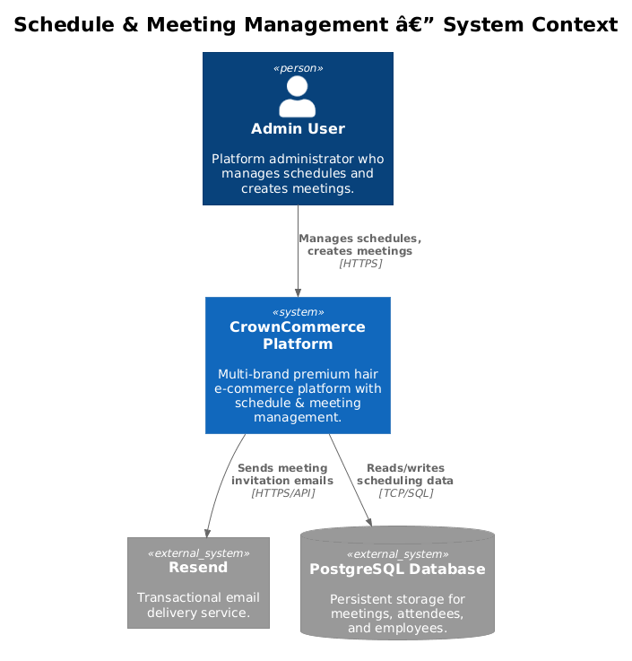
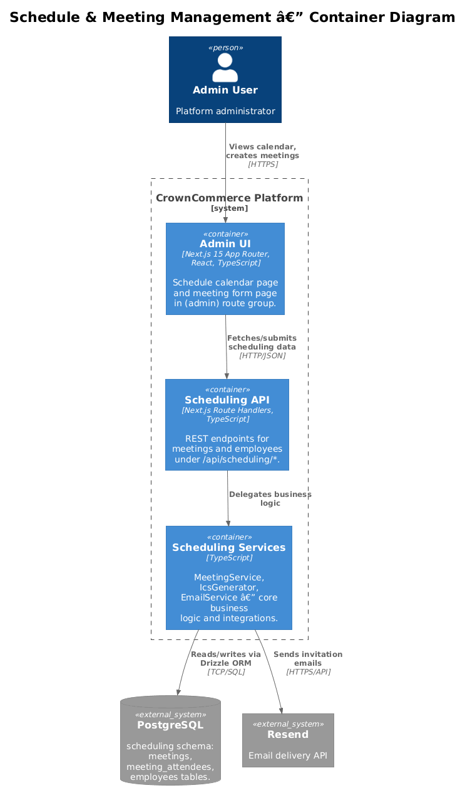
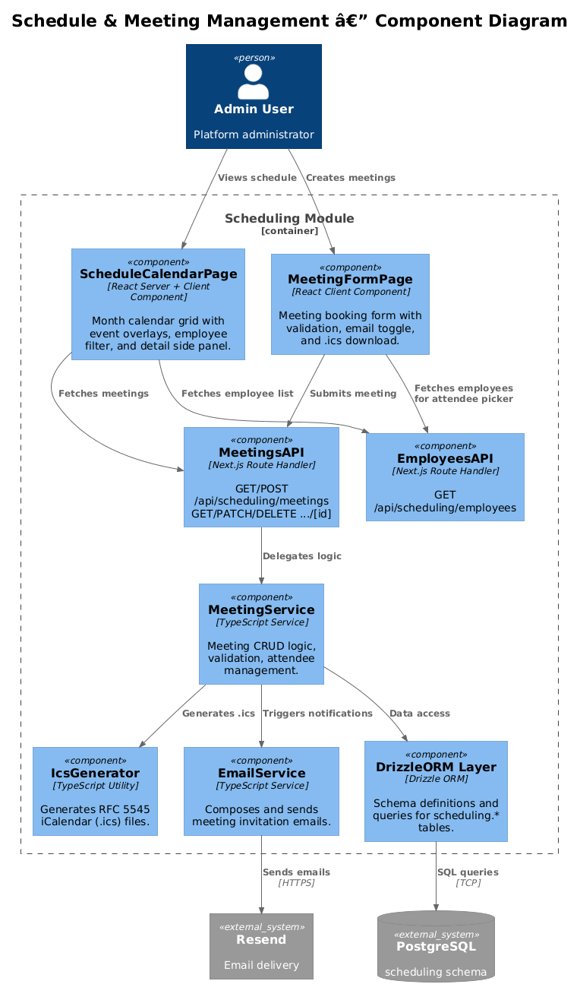
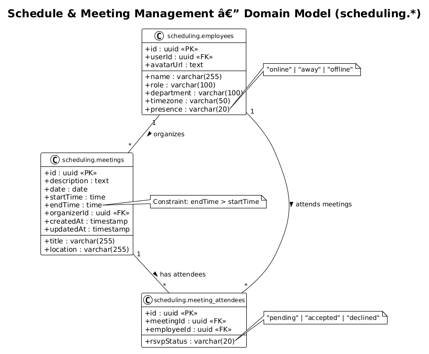
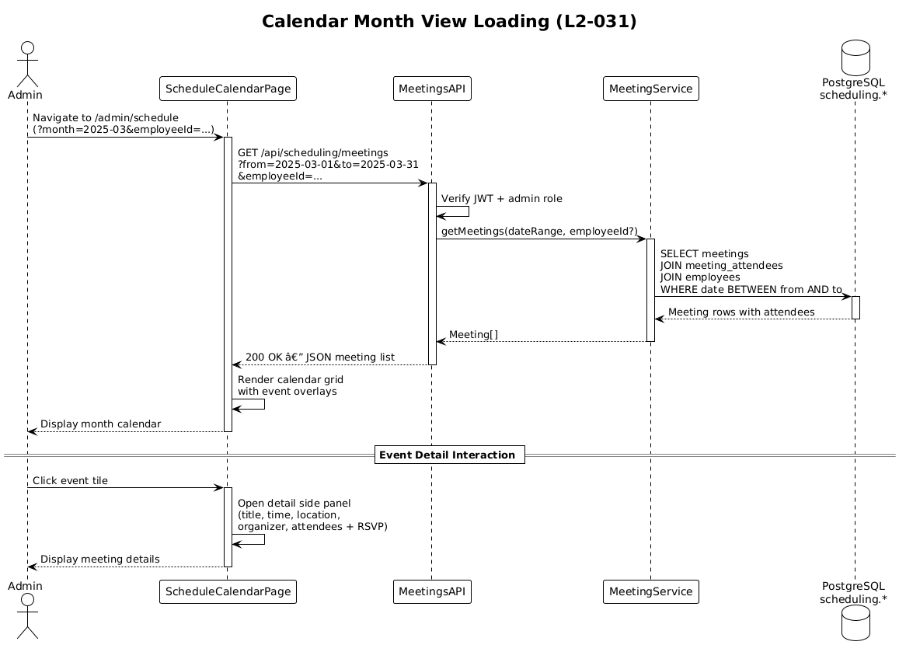
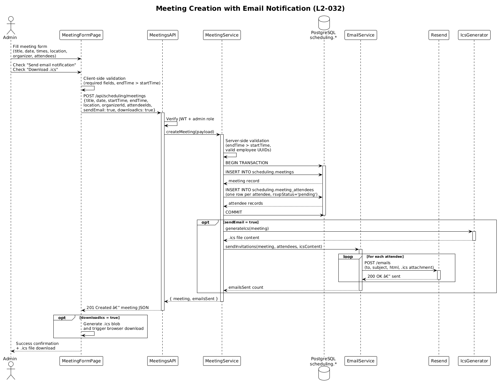

# Schedule & Meeting Management — Detailed Design

## 1. Overview

This document describes the detailed design for **Feature 13: Schedule & Meeting Management** within the CrownCommerce platform. It covers two requirements:

| Requirement | Title                        | Description                                                                                      |
| ----------- | ---------------------------- | ------------------------------------------------------------------------------------------------ |
| **L2-031**  | Admin Schedule Calendar      | Calendar view of scheduled events across employees with month navigation and employee filtering.  |
| **L2-032**  | Admin Meeting Creation       | Meeting booking form with email notifications via Resend and iCalendar (.ics) file generation.   |

### Actors

| Actor            | Description                                                                 |
| ---------------- | --------------------------------------------------------------------------- |
| **Admin User**   | Platform administrator who manages schedules, creates meetings, and tracks employee availability. |
| **Employee**     | Staff member who appears on the schedule and receives meeting invitations.   |

### Scope Boundary

**In scope:**

- Admin-facing calendar page with month view, navigation, and employee filtering
- Meeting creation form with validation, email notifications, and .ics download
- REST API for meetings and employees within the `scheduling` schema
- RSVP status tracking for meeting attendees

**Out of scope:**

- Recurring meeting patterns (see Open Questions)
- Employee self-service scheduling
- External calendar sync (Google Calendar, Outlook)
- Real-time collaborative editing of meetings

---

## 2. Architecture

### 2.1 C4 Context Diagram



The Schedule & Meeting Management feature sits within the CrownCommerce platform, accessed by Admin Users through the admin route group. It relies on PostgreSQL for persistent storage and Resend as the external email delivery service for meeting invitations.

### 2.2 C4 Container Diagram



The feature spans multiple containers within the Next.js application: the admin UI pages render calendar and meeting forms via React server/client components, the Scheduling API layer (Next.js Route Handlers) processes requests, and the PostgreSQL `scheduling` schema stores all domain data. Resend is invoked server-side for email delivery.

### 2.3 C4 Component Diagram



Within the Scheduling module, the key components are:

- **ScheduleCalendarPage** and **MeetingFormPage** — admin-facing React pages
- **MeetingsAPI** and **EmployeesAPI** — Next.js Route Handler endpoints
- **MeetingService** — core business logic for meeting CRUD and validation
- **IcsGenerator** — produces iCalendar (.ics) files for download
- **EmailService** — composes and sends invitation emails via Resend
- **DrizzleORM** — data access layer for the `scheduling` schema

---

## 3. Component Details

| Component              | Responsibility                                                                 | Technology / Location                              |
| ---------------------- | ------------------------------------------------------------------------------ | -------------------------------------------------- |
| **ScheduleCalendarPage** | Renders month calendar grid with event overlays, employee filter, navigation | `app/(admin)/admin/schedule/page.tsx` — RSC + Client |
| **MeetingFormPage**    | Meeting booking form with validation, email toggle, and .ics download button   | `app/(admin)/admin/meetings/page.tsx` — Client Component |
| **MeetingsAPI**        | Route Handlers for meeting CRUD operations                                     | `app/api/scheduling/meetings/route.ts`, `[id]/route.ts` |
| **EmployeesAPI**       | Route Handler to list employees for filters and attendee selection              | `app/api/scheduling/employees/route.ts`            |
| **MeetingService**     | Business logic: validation, meeting creation, attendee management              | `lib/scheduling/meeting-service.ts`                |
| **IcsGenerator**       | Generates RFC 5545–compliant iCalendar files from meeting data                 | `lib/scheduling/ics-generator.ts`                  |
| **EmailService**       | Composes meeting invitation emails and sends via Resend SDK                    | `lib/scheduling/email-service.ts`                  |
| **DrizzleORM Layer**   | Schema definitions and queries for the `scheduling` pgSchema                   | `lib/scheduling/schema.ts`, `lib/scheduling/queries.ts` |

### 3.1 ScheduleCalendarPage

**Responsibility:** Server Component that fetches meetings for the displayed month range and renders an interactive calendar grid. A client-side `CalendarShell` handles month navigation (previous / next / today) and an employee filter dropdown. Clicking an event opens a detail side panel.

**Interfaces:**
- Search params: `?month=2025-03&employee=<id>`
- Fetches: `GET /api/scheduling/meetings?from=...&to=...&employeeId=...`

**Dependencies:** MeetingsAPI, EmployeesAPI

### 3.2 MeetingFormPage

**Responsibility:** Client Component rendering the meeting booking form. Fields: title, description, date, start time, end time, location, organizer (single select), attendees (multi-select). Includes a "Send email notification" checkbox and a "Download .ics" button. Client-side and server-side validation ensures end time is after start time.

**Interfaces:**
- Submits: `POST /api/scheduling/meetings`
- Fetches employees: `GET /api/scheduling/employees`

**Dependencies:** MeetingsAPI, EmployeesAPI, IcsGenerator (client-side .ics generation)

### 3.3 MeetingService

**Responsibility:** Core domain logic. Validates meeting data (time range, required fields), orchestrates database writes (meeting + attendees), triggers email notifications when requested, and generates .ics payloads.

**Design note:** The service is invoked from Route Handlers and never directly from client code. All mutations go through the API layer to enforce auth.

### 3.4 IcsGenerator

**Responsibility:** Produces an RFC 5545–compliant VCALENDAR string from meeting data. Supports VEVENT with DTSTART, DTEND, SUMMARY, DESCRIPTION, LOCATION, ORGANIZER, and ATTENDEE fields.

**Design note:** Also used server-side to embed .ics attachments in email notifications.

### 3.5 EmailService

**Responsibility:** Composes HTML meeting invitation emails (title, time, location, attendee list) and sends them via the Resend SDK. One email per attendee. Includes an .ics attachment for calendar import.

**Dependencies:** Resend SDK (`resend`), IcsGenerator

---

## 4. Data Model



All tables reside in the PostgreSQL `scheduling` schema, defined via Drizzle ORM's `pgSchema('scheduling')`.

### 4.1 Entity Descriptions

#### `scheduling.meetings`

| Column        | Type                    | Constraints           | Description                          |
| ------------- | ----------------------- | --------------------- | ------------------------------------ |
| `id`          | `uuid`                  | PK, default `gen_random_uuid()` | Unique meeting identifier   |
| `title`       | `varchar(255)`          | NOT NULL              | Meeting title                        |
| `description` | `text`                  | nullable              | Optional meeting description         |
| `date`        | `date`                  | NOT NULL              | Meeting date                         |
| `startTime`   | `time`                  | NOT NULL              | Meeting start time                   |
| `endTime`     | `time`                  | NOT NULL              | Meeting end time (must be > startTime) |
| `location`    | `varchar(255)`          | nullable              | Physical or virtual location         |
| `organizerId` | `uuid`                  | FK → employees.id, NOT NULL | Employee who organized the meeting |
| `createdAt`   | `timestamp`             | default `now()`       | Record creation timestamp            |
| `updatedAt`   | `timestamp`             | default `now()`       | Record last-update timestamp         |

#### `scheduling.meeting_attendees`

| Column        | Type                    | Constraints           | Description                          |
| ------------- | ----------------------- | --------------------- | ------------------------------------ |
| `id`          | `uuid`                  | PK, default `gen_random_uuid()` | Unique attendee record ID   |
| `meetingId`   | `uuid`                  | FK → meetings.id, NOT NULL | Associated meeting           |
| `employeeId`  | `uuid`                  | FK → employees.id, NOT NULL | Attending employee           |
| `rsvpStatus`  | `varchar(20)`           | NOT NULL, default `'pending'` | One of: `pending`, `accepted`, `declined` |

#### `scheduling.employees`

| Column        | Type                    | Constraints           | Description                          |
| ------------- | ----------------------- | --------------------- | ------------------------------------ |
| `id`          | `uuid`                  | PK, default `gen_random_uuid()` | Unique employee identifier  |
| `userId`      | `uuid`                  | FK → auth.users.id, UNIQUE | Linked platform user account |
| `name`        | `varchar(255)`          | NOT NULL              | Full display name                    |
| `role`        | `varchar(100)`          | NOT NULL              | Job role / title                     |
| `department`  | `varchar(100)`          | nullable              | Department name                      |
| `timezone`    | `varchar(50)`           | default `'UTC'`       | IANA timezone identifier             |
| `presence`    | `varchar(20)`           | default `'offline'`   | Current presence status              |
| `avatarUrl`   | `text`                  | nullable              | URL to profile avatar image          |

---

## 5. Key Workflows

### 5.1 Calendar Month View Loading



1. **Admin** navigates to `/admin/schedule` (optionally with `?month=2025-03`).
2. **ScheduleCalendarPage** (server component) determines the date range for the displayed month.
3. Page calls `GET /api/scheduling/meetings?from=2025-03-01&to=2025-03-31` (with optional `&employeeId=...`).
4. **MeetingsAPI** verifies JWT authentication and admin role.
5. **MeetingService** queries the database for meetings within the date range, joining `meeting_attendees` and `employees` for attendee details.
6. Database returns the meeting rows with attendee information.
7. API returns the JSON meeting list to the page.
8. **ScheduleCalendarPage** renders the calendar grid with event overlays positioned by date and time.
9. **Admin** clicks an event tile.
10. A **detail side panel** slides in showing full meeting information: title, time, location, organizer, attendee list with RSVP statuses.

### 5.2 Meeting Creation with Email Notification



1. **Admin** navigates to `/admin/meetings` and fills in the meeting form (title, description, date, start/end times, location, organizer, attendees).
2. Admin optionally checks "Send email notification" and/or "Download .ics".
3. **MeetingFormPage** performs client-side validation (required fields, end time > start time).
4. Form submits `POST /api/scheduling/meetings` with the meeting payload.
5. **MeetingsAPI** verifies JWT authentication and admin role.
6. **MeetingService** performs server-side validation (end time > start time, valid employee IDs).
7. Service creates the `meetings` record in the database.
8. Service creates `meeting_attendees` records for each attendee (with `rsvpStatus: 'pending'`).
9. Database confirms both inserts (wrapped in a transaction).
10. If `sendEmail` is true: **EmailService** generates an invitation email for each attendee with an .ics attachment (via **IcsGenerator**) and sends via **Resend**.
11. API returns the created meeting (with attendees) as JSON.
12. If `downloadIcs` is true: **MeetingFormPage** generates a client-side .ics file and triggers a browser download.
13. Admin sees a success confirmation and can navigate back to the schedule calendar.

---

## 6. API Contracts

### `GET /api/scheduling/meetings`

List meetings within a date range, optionally filtered by employee.

**Query Parameters:**

| Param        | Type     | Required | Description                              |
| ------------ | -------- | -------- | ---------------------------------------- |
| `from`       | `string` | Yes      | Start date (ISO 8601, e.g. `2025-03-01`) |
| `to`         | `string` | Yes      | End date (ISO 8601, e.g. `2025-03-31`)   |
| `employeeId` | `string` | No       | Filter to meetings involving this employee |

**Response: `200 OK`**

```json
{
  "meetings": [
    {
      "id": "a1b2c3d4-...",
      "title": "Weekly Stylist Sync",
      "description": "Discuss upcoming appointments and product orders.",
      "date": "2025-03-15",
      "startTime": "10:00",
      "endTime": "11:00",
      "location": "Main Salon — Room A",
      "organizer": {
        "id": "e1f2a3b4-...",
        "name": "Jane Doe",
        "avatarUrl": "/avatars/jane.jpg"
      },
      "attendees": [
        {
          "id": "f5e6d7c8-...",
          "employeeId": "b2c3d4e5-...",
          "name": "John Smith",
          "rsvpStatus": "accepted"
        }
      ]
    }
  ]
}
```

### `POST /api/scheduling/meetings`

Create a new meeting with attendees.

**Request Body:**

```json
{
  "title": "Product Training Session",
  "description": "New product line walkthrough for all stylists.",
  "date": "2025-03-20",
  "startTime": "14:00",
  "endTime": "15:30",
  "location": "Training Room B",
  "organizerId": "e1f2a3b4-...",
  "attendeeIds": ["b2c3d4e5-...", "c3d4e5f6-..."],
  "sendEmail": true,
  "downloadIcs": false
}
```

**Response: `201 Created`**

```json
{
  "meeting": {
    "id": "d4e5f6a7-...",
    "title": "Product Training Session",
    "description": "New product line walkthrough for all stylists.",
    "date": "2025-03-20",
    "startTime": "14:00",
    "endTime": "15:30",
    "location": "Training Room B",
    "organizerId": "e1f2a3b4-...",
    "attendees": [
      { "employeeId": "b2c3d4e5-...", "rsvpStatus": "pending" },
      { "employeeId": "c3d4e5f6-...", "rsvpStatus": "pending" }
    ],
    "createdAt": "2025-03-10T09:00:00Z"
  },
  "emailsSent": 2
}
```

**Error Response: `400 Bad Request`**

```json
{
  "error": "Validation failed",
  "details": [
    { "field": "endTime", "message": "End time must be after start time." }
  ]
}
```

### `GET /api/scheduling/meetings/[id]`

Retrieve a single meeting by ID with full attendee details.

**Response: `200 OK`** — Same shape as a single meeting object above.

**Error Response: `404 Not Found`**

```json
{ "error": "Meeting not found." }
```

### `PATCH /api/scheduling/meetings/[id]`

Update an existing meeting. Supports partial updates.

**Request Body:** Any subset of the `POST` body fields.

**Response: `200 OK`** — Updated meeting object.

### `DELETE /api/scheduling/meetings/[id]`

Delete a meeting and its attendee records.

**Response: `204 No Content`**

### `GET /api/scheduling/employees`

List all employees for calendar filtering and attendee selection.

**Query Parameters:**

| Param        | Type     | Required | Description                       |
| ------------ | -------- | -------- | --------------------------------- |
| `department` | `string` | No       | Filter by department              |
| `search`     | `string` | No       | Search by name (case-insensitive) |

**Response: `200 OK`**

```json
{
  "employees": [
    {
      "id": "e1f2a3b4-...",
      "name": "Jane Doe",
      "role": "Senior Stylist",
      "department": "Styling",
      "timezone": "America/New_York",
      "presence": "online",
      "avatarUrl": "/avatars/jane.jpg"
    }
  ]
}
```

---

## 7. Security Considerations

| Concern                     | Mitigation                                                                 |
| --------------------------- | -------------------------------------------------------------------------- |
| **Authentication**          | All `/api/scheduling/*` endpoints require a valid JWT in httpOnly cookies, verified via `jose`. |
| **Authorization**           | Endpoints check for admin role claims in the JWT payload before processing requests. |
| **Input validation**        | Server-side validation enforces: required fields present, `endTime > startTime`, valid UUID references, date format correctness. |
| **CSRF protection**         | httpOnly + SameSite cookies prevent cross-site request forgery.            |
| **SQL injection**           | Drizzle ORM parameterized queries prevent injection attacks.               |
| **Email abuse**             | Rate limiting on meeting creation prevents bulk email sending via Resend.  |
| **Data access boundaries**  | Employee filtering respects the `scheduling` schema boundary; no cross-schema joins leak data. |

---

## 8. Open Questions

1. **Recurring meetings:** Should we support recurrence rules (daily, weekly, monthly) as part of L2-032, or defer to a future feature? This would require an RRULE field on `meetings` and expansion logic in the calendar view.
2. **Timezone display:** The calendar currently shows times in the server's timezone. Should we convert to the viewing admin's local timezone or the organizer's timezone? The `employees.timezone` field is available.
3. **RSVP workflow:** L2-032 tracks `rsvpStatus` but doesn't define a flow for attendees to accept/decline. Should the invitation email include accept/decline links, or is this admin-managed only?
4. **Conflict detection:** Should the system warn when creating a meeting that overlaps with another meeting for the same attendee(s)?
