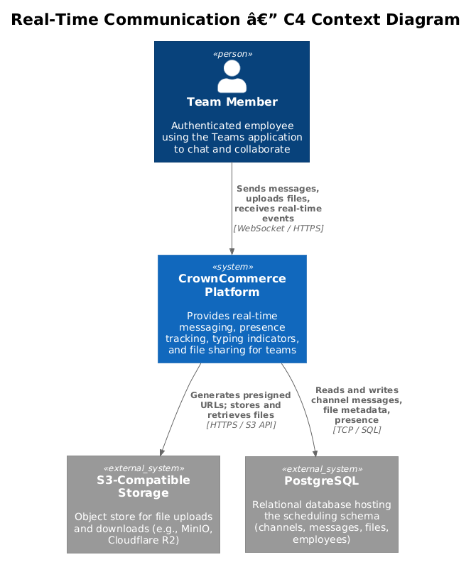
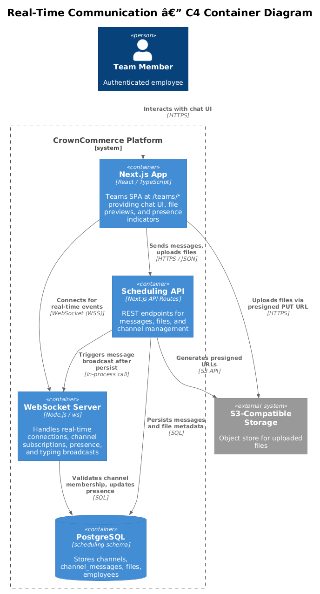
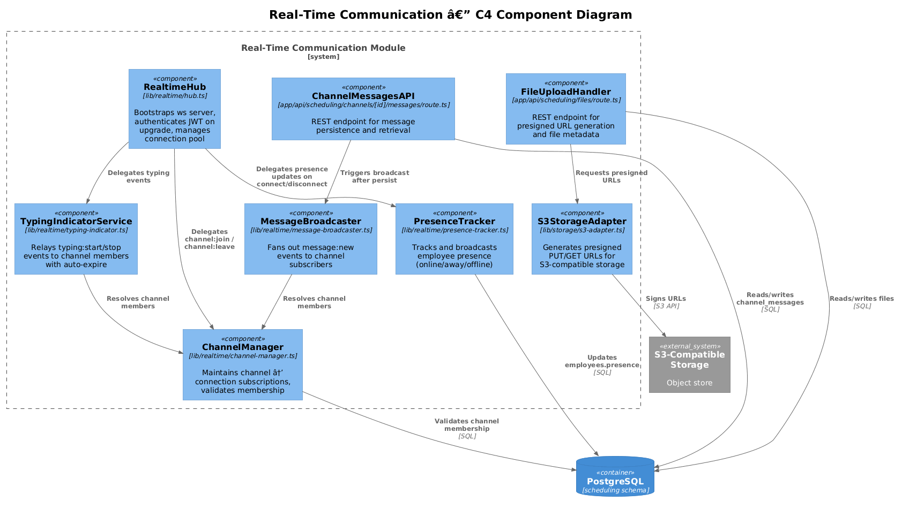
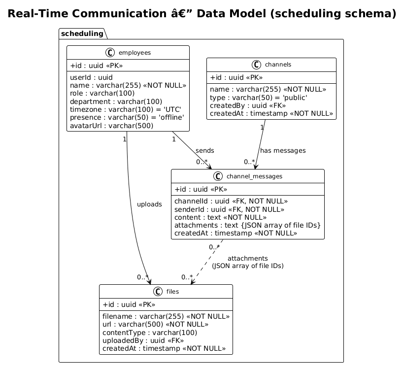
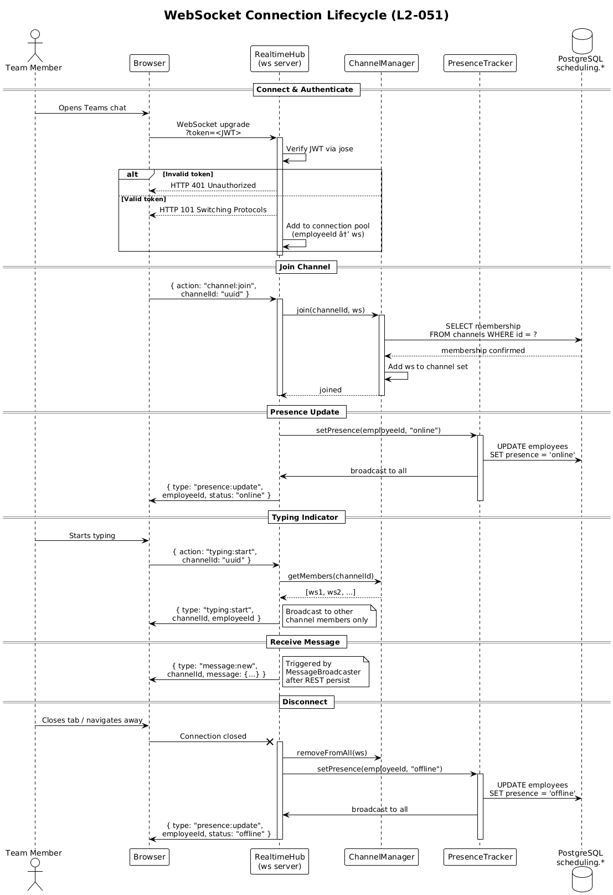
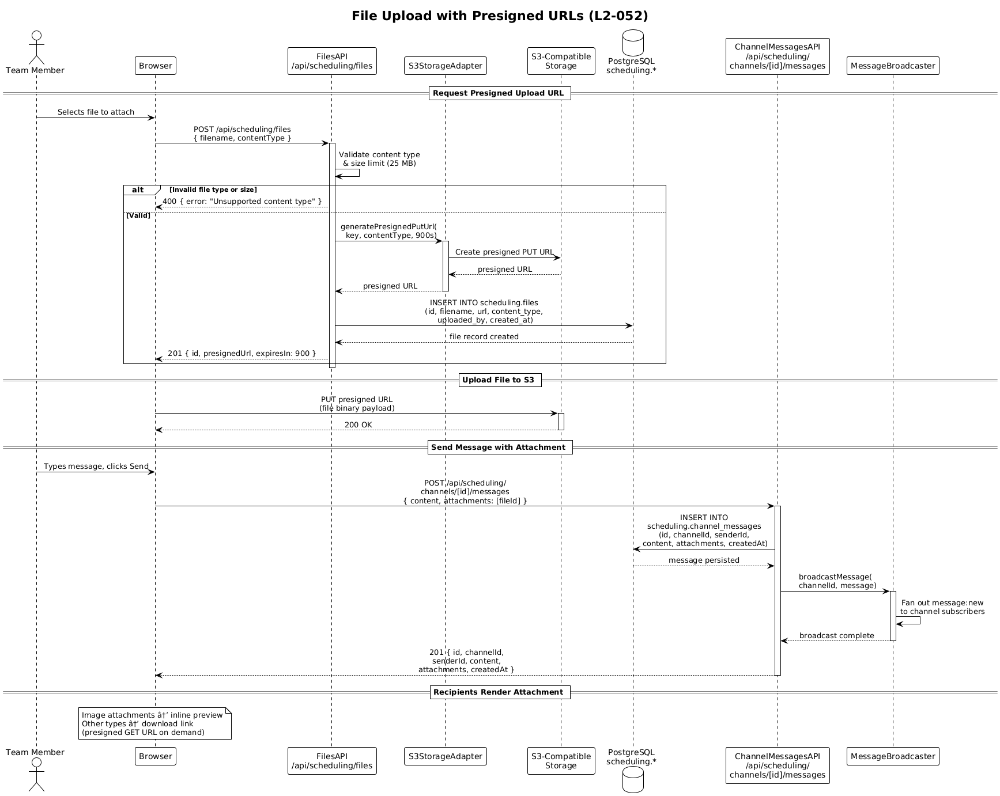

# Real-Time Communication — Detailed Design

| Field       | Value                              |
| ----------- | ---------------------------------- |
| Requirement | L2-051, L2-052                     |
| Status      | Draft                              |
| Last Updated| 2025-07-16                         |

---

## 1. Overview

This design covers the **real-time communication** subsystem of the
CrownCommerce Scheduling domain. It addresses two requirements:

| Req    | Title                          | Summary |
| ------ | ------------------------------ | ------- |
| L2-051 | Real-Time Communication Hub    | WebSocket-based hub for team messaging, channel subscriptions, presence updates, and typing indicators |
| L2-052 | File Upload and Management     | S3-compatible file upload with presigned URLs, file metadata storage, and chat attachment support |

### 1.1 Actors

| Actor         | Description |
| ------------- | ----------- |
| Team Member   | Authenticated employee using the Teams application (`/teams/*`) to chat, share files, and collaborate |
| System        | Automated processes such as presence timeout, WebSocket heartbeat, and presigned URL generation |

### 1.2 Scope Boundary

**In scope:**
- WebSocket server lifecycle (connect, authenticate, join channels, disconnect)
- Channel-based message broadcast (`message:new`)
- Presence tracking and broadcast (`presence:update`)
- Typing indicators (`typing:start`, `typing:stop`)
- File upload via presigned S3 URLs
- File metadata persistence in `scheduling.files`
- Message persistence with attachment references in `scheduling.channel_messages`

**Out of scope:**
- Channel CRUD (covered by the Scheduling domain API design)
- Employee management and authentication (covered by Auth design)
- Push notifications / offline message queue (see Open Questions)

---

## 2. Architecture

### 2.1 C4 Context Diagram



The CrownCommerce Platform provides real-time messaging capabilities to
Team Members. It relies on PostgreSQL for persistence and an
S3-compatible object store for file storage.

### 2.2 C4 Container Diagram



The Next.js App (SPA) connects to a dedicated WebSocket Server (`ws`
package) for real-time events and to Scheduling API routes for REST
operations. Both containers share access to the PostgreSQL
`scheduling` schema and the S3-compatible storage.

### 2.3 C4 Component Diagram



Internal components of the real-time communication module are grouped
into two areas:

- **Realtime Hub** — manages WebSocket connections, channel
  subscriptions, presence, and typing indicators.
- **File & Message API** — handles REST endpoints for file upload and
  channel message persistence.

---

## 3. Component Details

### 3.1 RealtimeHub

- **File:** `lib/realtime/hub.ts`
- **Responsibility:** Bootstraps the `ws` WebSocket server, handles
  the HTTP upgrade request, authenticates the JWT token from the
  connection query string, and maintains a connection pool keyed by
  employee ID.
- **Interfaces:** `onConnection(ws, req)`, `broadcast(event)`,
  `sendToChannel(channelId, event)`
- **Dependencies:** `jose` (JWT verification), `ws` (WebSocket server)
- **Design notes:** Satisfies L2-051 AC-1, AC-2

### 3.2 ChannelManager

- **File:** `lib/realtime/channel-manager.ts`
- **Responsibility:** Maintains an in-memory `Map<channelId, Set<ws>>`
  of channel subscriptions. Processes `channel:join` and
  `channel:leave` client commands. Validates channel membership
  against the database before allowing subscription.
- **Interfaces:** `join(channelId, ws)`, `leave(channelId, ws)`,
  `getMembers(channelId)`
- **Dependencies:** Drizzle ORM (`scheduling.channels`)
- **Design notes:** Satisfies L2-051 AC-2

### 3.3 PresenceTracker

- **File:** `lib/realtime/presence-tracker.ts`
- **Responsibility:** Tracks employee online/away/offline status.
  Updates `scheduling.employees.presence` column on state changes.
  Broadcasts `presence:update` events to all connected clients.
- **Interfaces:** `setPresence(employeeId, status)`,
  `getPresence(employeeId)`
- **Dependencies:** Drizzle ORM (`scheduling.employees`), RealtimeHub
- **Design notes:** Satisfies L2-051 AC-3

### 3.4 TypingIndicatorService

- **File:** `lib/realtime/typing-indicator.ts`
- **Responsibility:** Receives `typing:start` and `typing:stop` client
  messages, then broadcasts them to all other members of the given
  channel. Applies a 5-second auto-expire to prevent stale indicators.
- **Interfaces:** `handleTyping(channelId, employeeId, isTyping)`
- **Dependencies:** ChannelManager, RealtimeHub
- **Design notes:** Satisfies L2-051 AC-4

### 3.5 MessageBroadcaster

- **File:** `lib/realtime/message-broadcaster.ts`
- **Responsibility:** Called after a message is persisted via the REST
  API. Constructs a `message:new` event and fans it out to all
  WebSocket connections subscribed to the target channel.
- **Interfaces:** `broadcastMessage(channelId, message)`
- **Dependencies:** ChannelManager, RealtimeHub
- **Design notes:** Satisfies L2-051 AC-1

### 3.6 FileUploadHandler

- **File:** `app/api/scheduling/files/route.ts`
- **Responsibility:** Accepts `POST` requests to initiate a file
  upload. Generates a presigned PUT URL for S3, inserts a pending
  record into `scheduling.files`, and returns the presigned URL and
  file ID to the client. Handles `GET` requests to retrieve file
  metadata and generate a presigned download URL.
- **Interfaces:** `POST /api/scheduling/files`,
  `GET /api/scheduling/files/[id]`
- **Dependencies:** S3StorageAdapter, Drizzle ORM (`scheduling.files`)
- **Design notes:** Satisfies L2-052 AC-1, AC-2

### 3.7 S3StorageAdapter

- **File:** `lib/storage/s3-adapter.ts`
- **Responsibility:** Wraps the AWS S3 SDK to generate presigned PUT
  and GET URLs. Configurable bucket name, region, and endpoint for
  S3-compatible providers (e.g., MinIO, Cloudflare R2).
- **Interfaces:** `generatePresignedPutUrl(key, contentType, expiresIn)`,
  `generatePresignedGetUrl(key, expiresIn)`
- **Dependencies:** `@aws-sdk/client-s3`, `@aws-sdk/s3-request-presigner`

### 3.8 ChannelMessagesAPI

- **File:** `app/api/scheduling/channels/[id]/messages/route.ts`
- **Responsibility:** Persists new channel messages (`POST`) and
  retrieves message history (`GET`). After persisting a message,
  invokes MessageBroadcaster to push the `message:new` event over
  WebSocket.
- **Interfaces:** `POST /api/scheduling/channels/[id]/messages`,
  `GET /api/scheduling/channels/[id]/messages`
- **Dependencies:** Drizzle ORM (`scheduling.channelMessages`),
  MessageBroadcaster

---

## 4. Data Model



### 4.1 Entity Descriptions

#### `scheduling.files`

| Column       | Type                  | Description |
| ------------ | --------------------- | ----------- |
| id           | uuid (PK, default random) | Unique file identifier |
| filename     | varchar(255), NOT NULL | Original file name |
| url          | varchar(500), NOT NULL | S3 object key / URL |
| content_type | varchar(100)          | MIME type (e.g. `image/png`) |
| uploaded_by  | uuid (FK → employees) | Employee who uploaded the file |
| created_at   | timestamp, NOT NULL, default now | Upload timestamp |

#### `scheduling.channel_messages`

| Column      | Type                  | Description |
| ----------- | --------------------- | ----------- |
| id          | uuid (PK, default random) | Unique message identifier |
| channel_id  | uuid (FK → channels), NOT NULL | Target channel |
| sender_id   | uuid (FK → employees), NOT NULL | Author of the message |
| content     | text, NOT NULL        | Message body |
| attachments | text (JSON array)     | Array of file IDs, e.g. `["uuid1","uuid2"]` |
| created_at  | timestamp, NOT NULL, default now | Send timestamp |

#### Related tables (existing)

- `scheduling.employees` — employee profile including `presence` column
- `scheduling.channels` — channel definitions (name, type, created_by)

---

## 5. Key Workflows

### 5.1 WebSocket Connection Lifecycle (L2-051)



1. The Team Member's browser initiates a WebSocket upgrade request to
   `ws://host/api/realtime?token=<JWT>`.
2. RealtimeHub intercepts the upgrade, verifies the JWT using `jose`,
   and extracts the employee ID.
3. On success, the connection is added to the connection pool.
4. The client sends a `channel:join` command with a channel ID.
5. ChannelManager validates membership and adds the connection to the
   channel subscription set.
6. PresenceTracker sets the employee's status to `online` and
   broadcasts `presence:update` to all connected clients.
7. When another client sends a message via the REST API,
   MessageBroadcaster delivers `message:new` to all channel members.
8. Typing indicators flow directly over WebSocket — the client sends
   `typing:start`/`typing:stop` and TypingIndicatorService relays them
   to other channel members.
9. On disconnect (browser close / network loss), the connection is
   removed from all channel subscriptions and PresenceTracker sets
   status to `offline`, broadcasting the change.

**Trade-off:** JWT is passed as a query parameter rather than a header
because the browser WebSocket API does not support custom headers. The
token is validated server-side on upgrade and the query parameter is
not logged.

### 5.2 File Upload with Presigned URLs (L2-052)



1. The Team Member selects a file in the chat UI.
2. The browser sends `POST /api/scheduling/files` with the filename
   and content type.
3. FileUploadHandler validates the content type and size, generates a
   presigned PUT URL via S3StorageAdapter (15-minute expiry), inserts
   a file record into `scheduling.files`, and returns the presigned
   URL and file ID.
4. The browser uploads the file directly to S3 using the presigned URL
   (PUT request).
5. S3 confirms the upload with HTTP 200.
6. The browser sends the chat message via
   `POST /api/scheduling/channels/[id]/messages` with the file ID(s)
   in the `attachments` array.
7. ChannelMessagesAPI persists the message, then MessageBroadcaster
   pushes `message:new` to all channel members.
8. Receiving clients see image attachments as inline previews (via
   presigned GET URLs) and other file types as download links.

**Trade-off:** Files are uploaded directly from the browser to S3
(bypassing the API server) to reduce bandwidth and latency. The
trade-off is a two-step flow (get presigned URL, then upload).

---

## 6. API Contracts

### 6.1 WebSocket Endpoint

**URL:** `ws://host/api/realtime?token=<JWT>`

**Client → Server messages:**

```json
{ "action": "channel:join", "channelId": "uuid" }
{ "action": "channel:leave", "channelId": "uuid" }
{ "action": "typing:start", "channelId": "uuid" }
{ "action": "typing:stop", "channelId": "uuid" }
```

**Server → Client events** (as defined in `lib/realtime/index.ts`):

```typescript
// message:new — broadcast to channel members
{
  "type": "message:new",
  "channelId": "uuid",
  "message": {
    "id": "uuid",
    "senderId": "uuid",
    "content": "Hello team!",
    "createdAt": "2025-07-16T10:30:00Z"
  }
}

// presence:update — broadcast to all connected clients
{
  "type": "presence:update",
  "employeeId": "uuid",
  "status": "online" | "away" | "offline"
}

// typing:start / typing:stop — broadcast to channel members
{
  "type": "typing:start",
  "channelId": "uuid",
  "employeeId": "uuid"
}
```

### 6.2 POST /api/scheduling/files

Initiates a file upload by returning a presigned S3 URL.

**Request:**

```json
{
  "filename": "report.pdf",
  "contentType": "application/pdf"
}
```

**Response (201 Created):**

```json
{
  "id": "550e8400-e29b-41d4-a716-446655440000",
  "presignedUrl": "https://s3.example.com/bucket/key?X-Amz-Signature=...",
  "expiresIn": 900
}
```

**Error (400 Bad Request):**

```json
{
  "error": "Unsupported content type"
}
```

### 6.3 GET /api/scheduling/files/[id]

Returns file metadata and a presigned download URL.

**Response (200 OK):**

```json
{
  "id": "550e8400-e29b-41d4-a716-446655440000",
  "filename": "report.pdf",
  "contentType": "application/pdf",
  "downloadUrl": "https://s3.example.com/bucket/key?X-Amz-Signature=...",
  "createdAt": "2025-07-16T10:30:00Z"
}
```

**Error (404 Not Found):**

```json
{
  "error": "File not found"
}
```

### 6.4 POST /api/scheduling/channels/[id]/messages

Sends a message to a channel, optionally with file attachments.

**Request:**

```json
{
  "content": "Here's the Q3 report",
  "attachments": ["550e8400-e29b-41d4-a716-446655440000"]
}
```

**Response (201 Created):**

```json
{
  "id": "660e8400-e29b-41d4-a716-446655440001",
  "channelId": "770e8400-e29b-41d4-a716-446655440002",
  "senderId": "880e8400-e29b-41d4-a716-446655440003",
  "content": "Here's the Q3 report",
  "attachments": ["550e8400-e29b-41d4-a716-446655440000"],
  "createdAt": "2025-07-16T10:31:00Z"
}
```

### 6.5 GET /api/scheduling/channels/[id]/messages

Retrieves paginated message history for a channel.

**Query parameters:** `?cursor=<messageId>&limit=50`

**Response (200 OK):**

```json
{
  "messages": [
    {
      "id": "660e8400-...",
      "senderId": "880e8400-...",
      "content": "Hello!",
      "attachments": [],
      "createdAt": "2025-07-16T10:00:00Z"
    }
  ],
  "nextCursor": "660e8400-..."
}
```

---

## 7. Security Considerations

| Concern                        | Mitigation |
| ------------------------------ | ---------- |
| Unauthenticated WebSocket access | JWT token is verified on the HTTP upgrade request using `jose`. Connections without a valid token are rejected with HTTP 401. |
| Channel authorization          | ChannelManager validates that the employee is a member of the channel before subscribing. Messages are only delivered to subscribed connections. |
| Presigned URL leakage          | Presigned URLs expire after 15 minutes. PUT URLs are scoped to a single object key and content type. GET URLs are generated on-demand per request. |
| File type / size validation    | FileUploadHandler validates content type against an allow-list (images, PDFs, documents) and enforces a 25 MB size limit before issuing the presigned URL. |
| WebSocket message rate limiting | RealtimeHub enforces a per-connection rate limit (30 messages/second). Connections exceeding the limit are throttled and eventually disconnected. |
| XSS in message content         | Message content is stored as plain text. The frontend renders messages using React (automatic escaping). HTML is never interpreted. |
| Token in query string          | The WebSocket URL query parameter is not logged by the server. Connections use WSS (TLS) in production to prevent interception. |

---

## 8. Open Questions

| #  | Question | Impact | Status |
| -- | -------- | ------ | ------ |
| 1  | Should messages be persisted for offline users and delivered when they reconnect, or is message history via REST sufficient? | Affects whether we need a delivery queue or can rely on `GET /messages` pagination. | Open |
| 2  | What is the maximum number of concurrent WebSocket connections per server instance, and do we need horizontal scaling (e.g., Redis pub/sub for cross-instance broadcast)? | Determines infrastructure requirements and whether ChannelManager needs a distributed backing store. | Open |
| 3  | Should typing indicators include the employee's display name in the event payload to avoid an extra lookup on the client? | Minor UX vs. payload size trade-off. | Open |
