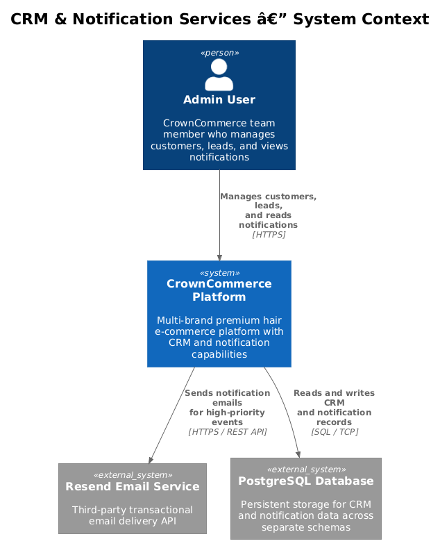
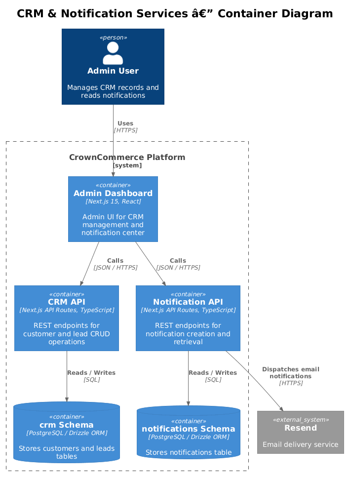
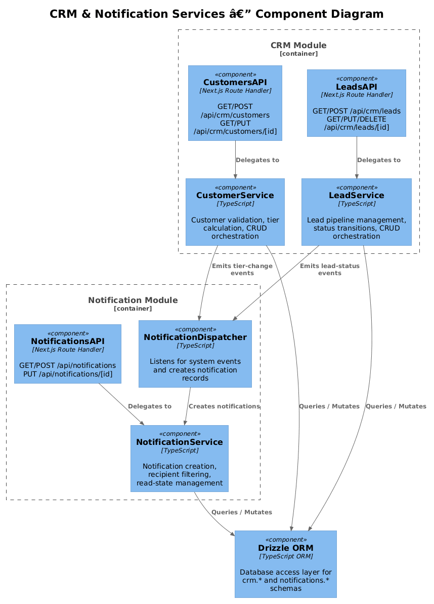
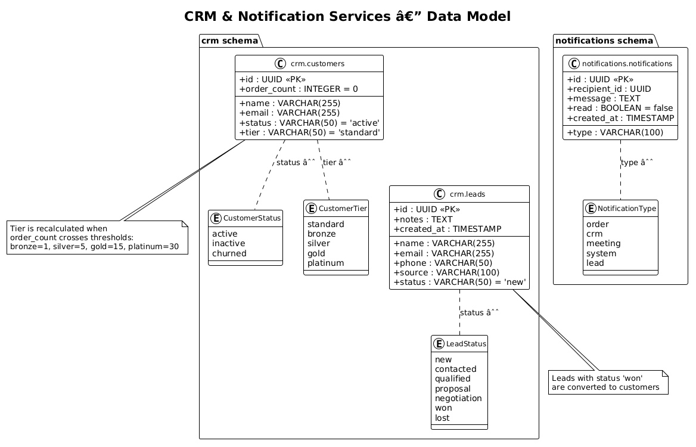
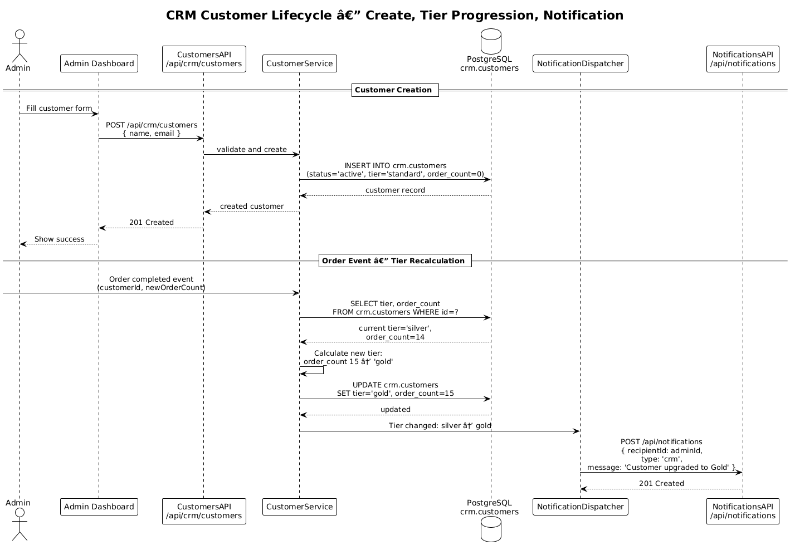
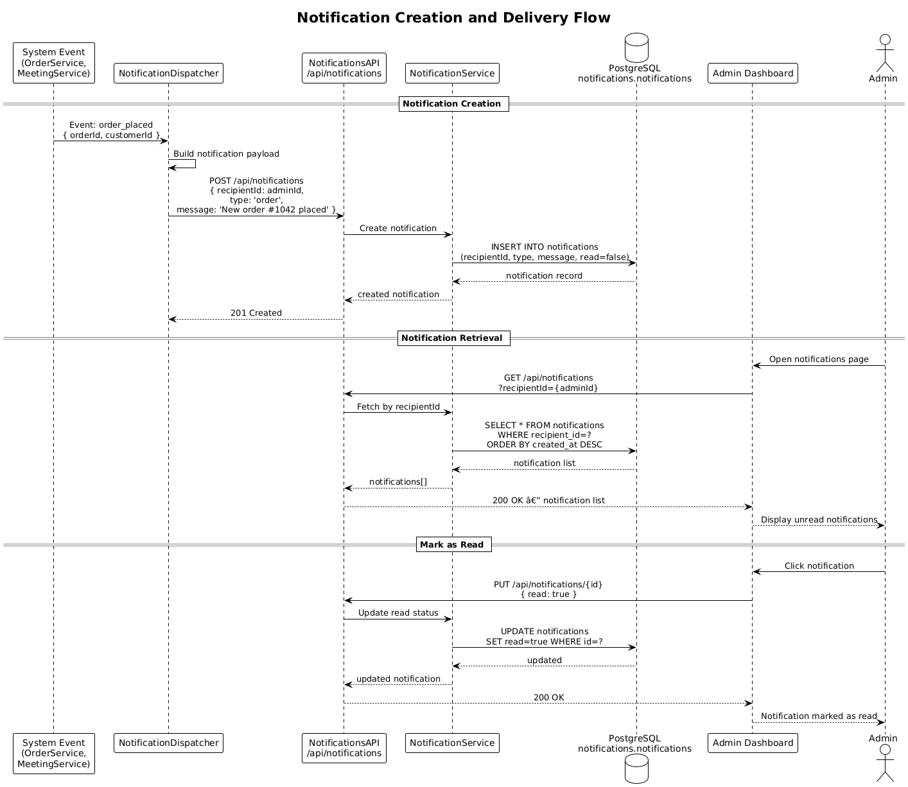

# CRM & Notification Services — Detailed Design

## 1. Overview

The CRM & Notification Services feature provides CrownCommerce with customer relationship management and a platform-wide notification system. It spans two requirements:

| Requirement | Summary |
|---|---|
| **L2-044** | CRM customer and lead management — CRUD operations for customer records and lead pipeline tracking |
| **L2-045** | Notification service — create, retrieve, and manage notifications for system-wide event delivery |

**Actors:**
- **Admin** — authenticated CrownCommerce team member who manages customer records, leads, and views notifications
- **System** — internal services (OrderService, MeetingService, etc.) that emit events triggering notifications
- **Recipient** — any authenticated user (admin or team member) who receives and reads notifications

**Scope boundary:** This feature covers CRM data management and in-app notification storage/retrieval. Transactional email delivery is handled by the Resend integration; this service creates the notification records and optionally dispatches emails via Resend. Newsletter/campaign functionality is handled separately by Feature 07.

## 2. Architecture

### 2.1 C4 Context Diagram

Shows the CRM & Notification system in the broader CrownCommerce landscape.



### 2.2 C4 Container Diagram

Technical containers involved in CRM and notification operations.



### 2.3 C4 Component Diagram

Internal components within the Next.js application that implement CRM and notification functionality.



## 3. Component Details

| Component | Responsibility | Source Path | Dependencies |
|---|---|---|---|
| **CustomersAPI** | Handles `GET` (list) and `POST` (create) for customers | `app/api/crm/customers/route.ts` | Drizzle ORM, `crm.customers` table |
| **CustomerByIdAPI** | Handles `GET` (read), `PUT` (update) for a single customer | `app/api/crm/customers/[id]/route.ts` | Drizzle ORM, `crm.customers` table |
| **LeadsAPI** | Handles `GET` (list) and `POST` (create) for leads | `app/api/crm/leads/route.ts` | Drizzle ORM, `crm.leads` table |
| **LeadByIdAPI** | Handles `GET` (read), `PUT` (update), `DELETE` (remove) for a single lead | `app/api/crm/leads/[id]/route.ts` | Drizzle ORM, `crm.leads` table |
| **NotificationsAPI** | Handles `GET` (list with optional `recipientId` filter) and `POST` (create) | `app/api/notifications/route.ts` | Drizzle ORM, `notifications.notifications` table |
| **NotificationByIdAPI** | Handles `PUT` (mark as read / update) for a single notification | `app/api/notifications/[id]/route.ts` | Drizzle ORM, `notifications.notifications` table |
| **CRM API Client** | Typed client-side SDK for calling CRM endpoints | `lib/api/crm.ts` | `lib/api/client.ts` |
| **Notifications API Client** | Typed client-side SDK for calling notification endpoints | `lib/api/notifications.ts` | `lib/api/client.ts` |
| **NotificationDispatcher** | Internal service that creates notification records in response to system events (tier upgrades, lead status changes, order events) | Planned: `lib/services/notification-dispatcher.ts` | NotificationsAPI, Resend SDK |

## 4. Data Model



### 4.1 Entity Descriptions

**crm.customers**

| Column | Type | Constraints | Description |
|---|---|---|---|
| `id` | UUID | PK, auto-generated | Unique customer identifier |
| `name` | VARCHAR(255) | NOT NULL | Customer full name |
| `email` | VARCHAR(255) | NOT NULL | Customer email address |
| `status` | VARCHAR(50) | DEFAULT `'active'` | Customer status: `active`, `inactive`, `churned` |
| `tier` | VARCHAR(50) | DEFAULT `'standard'` | Loyalty tier: `standard`, `bronze`, `silver`, `gold`, `platinum` |
| `order_count` | INTEGER | DEFAULT `0` | Cumulative order count, drives tier calculation |

**crm.leads**

| Column | Type | Constraints | Description |
|---|---|---|---|
| `id` | UUID | PK, auto-generated | Unique lead identifier |
| `name` | VARCHAR(255) | NOT NULL | Lead contact name |
| `email` | VARCHAR(255) | NOT NULL | Lead email address |
| `phone` | VARCHAR(50) | nullable | Contact phone number |
| `source` | VARCHAR(100) | nullable | Acquisition source: `website`, `referral`, `social`, `trade-show`, `cold-outreach` |
| `status` | VARCHAR(50) | NOT NULL, DEFAULT `'new'` | Pipeline stage (see §4.3) |
| `notes` | TEXT | nullable | Free-form notes about the lead |
| `created_at` | TIMESTAMP | NOT NULL, DEFAULT `now()` | Record creation timestamp |

**notifications.notifications**

| Column | Type | Constraints | Description |
|---|---|---|---|
| `id` | UUID | PK, auto-generated | Unique notification identifier |
| `recipient_id` | UUID | NOT NULL | User ID of the notification recipient |
| `type` | VARCHAR(100) | NOT NULL | Notification category: `order`, `crm`, `meeting`, `system`, `lead` |
| `message` | TEXT | NOT NULL | Human-readable notification message |
| `read` | BOOLEAN | DEFAULT `false` | Whether the recipient has read the notification |
| `created_at` | TIMESTAMP | NOT NULL, DEFAULT `now()` | Notification creation timestamp |

### 4.2 Customer Tiers

Customer tiers are derived from cumulative `order_count` thresholds:

| Tier | Order Count Threshold | Benefits |
|---|---|---|
| `standard` | 0 | Default tier for new customers |
| `bronze` | 1–4 | Early loyalty recognition |
| `silver` | 5–14 | Mid-level perks |
| `gold` | 15–29 | Premium treatment, priority support |
| `platinum` | 30+ | VIP status, exclusive access |

Tier recalculation is triggered when an order event increments `order_count`. The system compares the new count against thresholds and updates the `tier` field if a transition occurs.

### 4.3 Lead Pipeline Stages

Leads progress through a defined pipeline:

| Status | Description |
|---|---|
| `new` | Freshly captured lead, not yet contacted |
| `contacted` | Initial outreach made |
| `qualified` | Lead meets criteria for further engagement |
| `proposal` | Proposal or quote sent |
| `negotiation` | Active negotiation in progress |
| `won` | Deal closed successfully → convert to customer |
| `lost` | Deal lost or lead disqualified |

Transitions are not strictly enforced at the DB level — the API accepts any valid status value. Business logic validation (e.g., preventing `lost` → `new` regression) is recommended as a future enhancement.

## 5. Key Workflows

### 5.1 CRM Customer Lifecycle

Shows customer creation, tier progression on order events, and notification dispatch.



**Steps:**
1. Admin creates a new customer via the admin UI, POSTing to `/api/crm/customers`
2. CustomersAPI validates the payload and inserts into `crm.customers` with default `status: 'active'` and `tier: 'standard'`
3. Returns the created customer record (201)
4. Later, an order event arrives (e.g., from OrderService webhook or internal call)
5. CustomerService increments `order_count` and recalculates tier based on thresholds
6. If tier changes, updates the customer record via PUT
7. NotificationDispatcher creates a "tier upgrade" notification for the admin via POST `/api/notifications`

**Trade-off:** Tier recalculation is synchronous within the order processing flow. For high-volume scenarios, this could be moved to an async event queue. At current scale, synchronous updates are simpler and avoid eventual consistency issues.

### 5.2 Notification Creation and Delivery

Shows how system events trigger notifications and how recipients consume them.



**Steps:**
1. A system event occurs (order placed, meeting scheduled, lead status change)
2. The originating service calls NotificationDispatcher
3. NotificationDispatcher POSTs to `/api/notifications` with `recipientId`, `type`, and `message`
4. NotificationsAPI inserts the notification record with `read: false`
5. Admin opens the notifications page in the admin dashboard
6. AdminApp calls GET `/api/notifications?recipientId={adminId}`
7. API returns all notifications for the recipient, ordered by `created_at` descending
8. Admin clicks a notification → AdminApp calls PUT `/api/notifications/{id}` with `{ read: true }`
9. Notification is marked as read

## 6. API Contracts

### POST /api/crm/customers
**Purpose:** Create a new customer record (L2-044)
```json
// Request
{ "name": "Jane Doe", "email": "jane@example.com", "status": "active", "tier": "standard" }

// Response 201
{ "id": "uuid", "name": "Jane Doe", "email": "jane@example.com", "status": "active", "tier": "standard", "orderCount": 0 }

// Response 500
{ "error": "Failed to create customer" }
```

### GET /api/crm/customers
**Purpose:** List all customers (L2-044)
```json
// Response 200
[
  { "id": "uuid", "name": "Jane Doe", "email": "jane@example.com", "status": "active", "tier": "gold", "orderCount": 18 }
]
```

### GET /api/crm/customers/[id]
**Purpose:** Get a single customer by ID (L2-044)
```json
// Response 200
{ "id": "uuid", "name": "Jane Doe", "email": "jane@example.com", "status": "active", "tier": "gold", "orderCount": 18 }

// Response 404
{ "error": "Not found" }
```

### PUT /api/crm/customers/[id]
**Purpose:** Update a customer record (L2-044)
```json
// Request (partial update)
{ "tier": "platinum", "orderCount": 35 }

// Response 200
{ "id": "uuid", "name": "Jane Doe", "email": "jane@example.com", "status": "active", "tier": "platinum", "orderCount": 35 }

// Response 404
{ "error": "Not found" }
```

### POST /api/crm/leads
**Purpose:** Create a new lead record (L2-044)
```json
// Request
{ "name": "John Smith", "email": "john@company.com", "phone": "+1-555-0100", "source": "website", "notes": "Interested in wholesale" }

// Response 201
{ "id": "uuid", "name": "John Smith", "email": "john@company.com", "phone": "+1-555-0100", "source": "website", "status": "new", "notes": "Interested in wholesale", "createdAt": "2025-01-15T10:30:00Z" }
```

### GET /api/crm/leads
**Purpose:** List all leads (L2-044)
```json
// Response 200
[
  { "id": "uuid", "name": "John Smith", "email": "john@company.com", "phone": "+1-555-0100", "source": "website", "status": "qualified", "notes": "Interested in wholesale", "createdAt": "2025-01-15T10:30:00Z" }
]
```

### GET /api/crm/leads/[id]
**Purpose:** Get a single lead by ID (L2-044)
```json
// Response 200
{ "id": "uuid", "name": "John Smith", "email": "john@company.com", "phone": "+1-555-0100", "source": "website", "status": "qualified", "notes": "Interested in wholesale", "createdAt": "2025-01-15T10:30:00Z" }

// Response 404
{ "error": "Not found" }
```

### PUT /api/crm/leads/[id]
**Purpose:** Update a lead record (L2-044)
```json
// Request
{ "status": "proposal", "notes": "Sent pricing sheet on 2025-01-20" }

// Response 200
{ "id": "uuid", "name": "John Smith", "email": "john@company.com", "phone": "+1-555-0100", "source": "website", "status": "proposal", "notes": "Sent pricing sheet on 2025-01-20", "createdAt": "2025-01-15T10:30:00Z" }
```

### DELETE /api/crm/leads/[id]
**Purpose:** Remove a lead record (L2-044)
```json
// Response 200
{ "success": true }
```

### POST /api/notifications
**Purpose:** Create a notification (L2-045)
```json
// Request
{ "recipientId": "user-uuid", "type": "order", "message": "Order #1042 has been shipped" }

// Response 201
{ "id": "uuid", "recipientId": "user-uuid", "type": "order", "message": "Order #1042 has been shipped", "read": false, "createdAt": "2025-01-15T14:00:00Z" }
```

### GET /api/notifications
**Purpose:** List notifications, optionally filtered by recipient (L2-045)
```json
// Query: ?recipientId=user-uuid
// Response 200
[
  { "id": "uuid", "recipientId": "user-uuid", "type": "crm", "message": "Customer Jane Doe upgraded to Gold tier", "read": false, "createdAt": "2025-01-15T14:00:00Z" }
]
```

### PUT /api/notifications/[id]
**Purpose:** Update a notification (e.g., mark as read) (L2-045)
```json
// Request
{ "read": true }

// Response 200
{ "id": "uuid", "recipientId": "user-uuid", "type": "crm", "message": "Customer Jane Doe upgraded to Gold tier", "read": true, "createdAt": "2025-01-15T14:00:00Z" }

// Response 404
{ "error": "Not found" }
```

## 7. Security Considerations

| Concern | Mitigation |
|---|---|
| **Authentication** | All CRM and notification endpoints require a valid `auth-token` httpOnly cookie containing a JWT signed via jose. Requests without valid tokens receive 401. |
| **CRM authorization** | CRM endpoints (`/api/crm/*`) require admin role claim in the JWT. Non-admin users receive 403. |
| **Notification scoping** | Users can only retrieve notifications where `recipientId` matches their authenticated user ID. Admin users can view all notifications. Enforced at the API layer. |
| **Input validation** | All POST/PUT payloads should be validated via Zod schemas before database insertion. Currently the routes accept raw `body` — adding Zod validation is a recommended improvement. |
| **PII handling** | Customer and lead records contain PII (name, email, phone). Access is restricted to admin users. Database columns should not be logged in plain text. Consider encryption at rest for phone numbers. |
| **SQL injection** | Mitigated by Drizzle ORM's parameterized queries. No raw SQL is used in the API routes. |
| **Rate limiting** | Notification creation endpoint should be rate-limited to prevent abuse from internal services flooding the notifications table. |

## 8. Open Questions

1. **Notification channels:** The current implementation supports in-app notifications only (stored in DB, retrieved via API). Should we add email dispatch via Resend for high-priority notifications (e.g., tier upgrades, deal-won events)? This would require a `channel` field on the notification record and integration with the Resend SDK.

2. **CRM integration with external systems:** Should the CRM support webhook-based sync with external CRM platforms (Salesforce, HubSpot)? If so, we'll need an outbound webhook dispatcher and an inbound sync endpoint. This is out of scope for the initial release but should inform the data model design.

3. **Data retention and archival:** What is the retention policy for notifications? Unread notifications older than 90 days could be auto-archived or deleted. Similarly, `lost` leads may need a retention window before permanent deletion for GDPR compliance.
