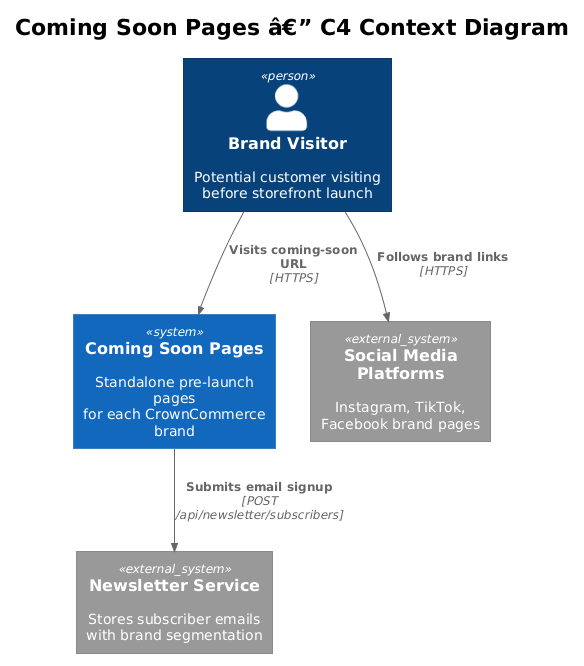
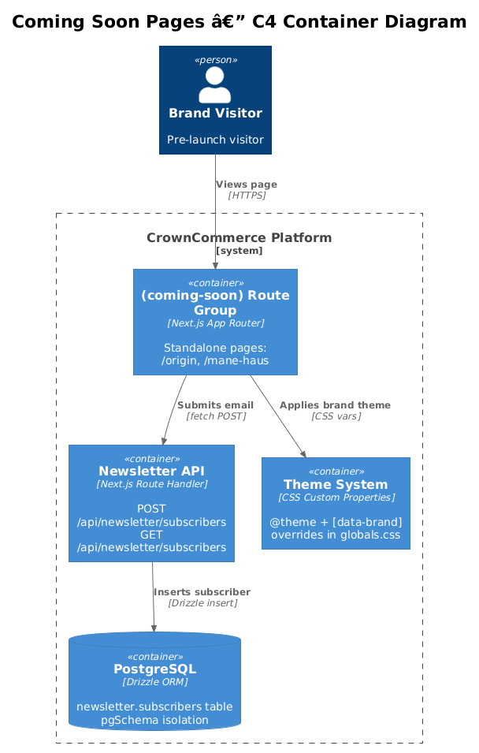
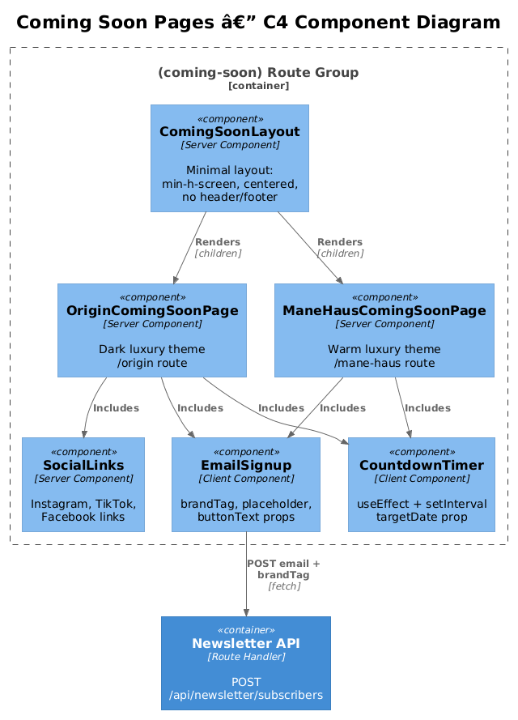
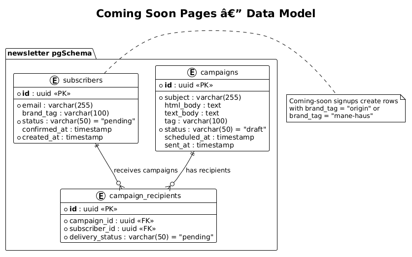
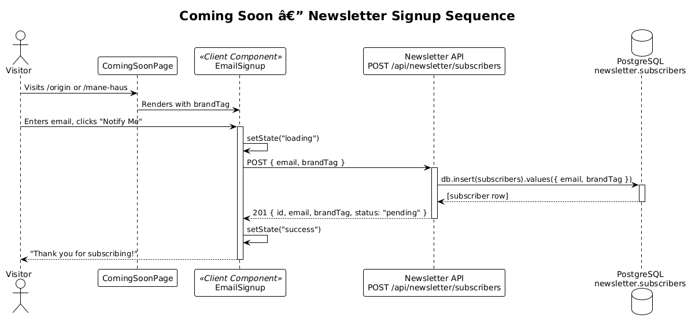
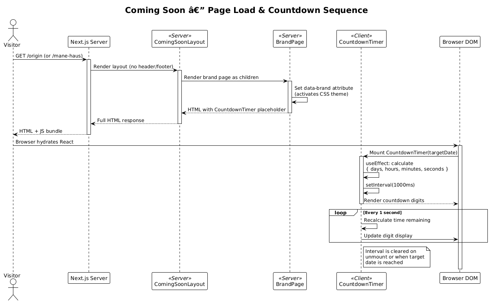

# Feature 16 — Coming Soon Pages: Detailed Design

> **Requirement:** L2-023 Coming Soon Pages
> **Status:** Draft
> **Last Updated:** 2025-07-15

---

## 1. Overview

Each CrownCommerce brand requires a standalone coming-soon page that communicates the brand identity before its full storefront launches. These pages live in the `(coming-soon)` route group with a minimal layout (no shared header/footer), brand-specific theming via CSS custom properties, a client-side countdown timer to the launch date, a newsletter email signup connected to the existing Newsletter API, and social media links.

### 1.1 Scope

| In Scope | Out of Scope |
|----------|-------------|
| Standalone coming-soon pages for Origin and Mane Haus | Full storefront design |
| Brand-specific CSS theming via `data-brand` attribute | CMS-driven content editing |
| Countdown timer (client-side, configurable target date) | Server-side countdown |
| Newsletter email signup (reuses `/api/newsletter/subscribers`) | New newsletter API endpoints |
| Social media link rendering | Social media analytics |
| Minimal `(coming-soon)` layout without header/footer | SEO optimization beyond meta tags |

### 1.2 Key Decisions

- **Route group isolation:** `(coming-soon)` has its own `layout.tsx` that deliberately omits the header, footer, and navigation present in `(storefront)`.
- **Shared Newsletter API:** Both coming-soon signup and storefront signup POST to the same `/api/newsletter/subscribers` endpoint with a `brandTag` discriminator.
- **CSS custom property theming:** The same `[data-brand]` attribute system used by the main storefronts is reused here, ensuring consistent brand colors.
- **Client-side countdown:** The countdown timer runs entirely on the client using `useEffect` + `setInterval`, avoiding server-side time drift issues.

---

## 2. Architecture

### 2.1 C4 Context Diagram

Shows where the Coming Soon subsystem sits relative to users and external services.



### 2.2 C4 Container Diagram

Shows the containers involved in rendering coming-soon pages and handling newsletter signups.



### 2.3 C4 Component Diagram

Shows the internal components within the Coming Soon route group.



---

## 3. Component Details

### 3.1 Route Group: `(coming-soon)`

| File | Role |
|------|------|
| `app/(coming-soon)/layout.tsx` | Minimal layout — centers children in full-screen flex container. No header, footer, or nav. |
| `app/(coming-soon)/origin/page.tsx` | Origin Hair Collective coming-soon page. Dark luxury theme. |
| `app/(coming-soon)/mane-haus/page.tsx` | Mane Haus coming-soon page. Warm luxury theme with `data-brand="mane-haus"`. |

### 3.2 `ComingSoonLayout` — `app/(coming-soon)/layout.tsx`

```tsx
export default function ComingSoonLayout({ children }: { children: React.ReactNode }) {
  return <div className="min-h-screen flex items-center justify-center">{children}</div>;
}
```

- **Server component** — no client-side state required at the layout level.
- Renders children centered vertically and horizontally in a full-viewport container.
- No `<Header>`, `<Footer>`, or `<ChatWidget>` (unlike the storefront layout).

### 3.3 `OriginComingSoonPage` — `app/(coming-soon)/origin/page.tsx`

- Renders brand name "Origin Hair Collective" with `font-heading` (Fraunces serif).
- Tagline, countdown timer (`<CountdownTimer />`), and `<EmailSignup brandTag="origin" />`.
- Social media links for Instagram, TikTok, Facebook.
- Uses default theme (Origin dark luxury: `--color-background: #1A1A1C`, `--color-accent: #C9A962`).

### 3.4 `ManeHausComingSoonPage` — `app/(coming-soon)/mane-haus/page.tsx`

- Wraps content in `data-brand="mane-haus"` to activate the warm luxury theme override.
- Same structural pattern as Origin but with Mane Haus branding.
- Theme activates via CSS: `[data-brand="mane-haus"] { --color-background: #FAF7F2; --color-accent: #B8860B; }`.

### 3.5 `CountdownTimer` Component

A client component (`"use client"`) that renders a live countdown to a configurable launch date.

| Prop | Type | Description |
|------|------|-------------|
| `targetDate` | `string` | ISO 8601 date string for the launch date |
| `className` | `string?` | Optional Tailwind classes |

**Implementation:**
- Uses `useState` to hold `{ days, hours, minutes, seconds }`.
- `useEffect` with `setInterval(1000)` recalculates remaining time each second.
- Clears interval on unmount or when target date is reached.
- Renders four digit-display boxes with labels.

### 3.6 `EmailSignup` Component — `components/email-signup.tsx`

Existing reusable component already in the codebase. Props:

| Prop | Type | Description |
|------|------|-------------|
| `brandTag` | `string` | Brand identifier sent to Newsletter API |
| `placeholder` | `string?` | Input placeholder text |
| `buttonText` | `string?` | Submit button label |

- Calls `POST /api/newsletter/subscribers` with `{ email, brandTag }`.
- Manages `idle | loading | success | error` state via `useState`.

### 3.7 Brand Theme System

The coming-soon pages share the global CSS custom property system defined in `app/globals.css`:

| Token | Origin (default) | Mane Haus (`[data-brand="mane-haus"]`) |
|-------|-------------------|----------------------------------------|
| `--color-background` | `#1A1A1C` (dark) | `#FAF7F2` (warm cream) |
| `--color-foreground` | `#FAFAF9` (light) | `#1C1917` (dark) |
| `--color-accent` | `#C9A962` (gold) | `#B8860B` (dark gold) |
| `--color-muted` | `#2A2A2E` | `#F5F0E8` |
| `--color-card` | `#232326` | `#FFFFFF` |
| `--color-border` | `#3A3A3E` | `#E7E0D5` |
| `--font-heading` | Fraunces serif | Fraunces serif |
| `--font-body` | DM Sans sans-serif | DM Sans sans-serif |

---

## 4. Data Model

### 4.1 Class Diagram



### 4.2 Entity Descriptions

#### `newsletter.subscribers` table

| Column | Type | Description |
|--------|------|-------------|
| `id` | `uuid` | Primary key, auto-generated |
| `email` | `varchar(255)` | Subscriber email address |
| `brand_tag` | `varchar(100)` | Brand identifier (`origin`, `mane-haus`) |
| `status` | `varchar(50)` | Subscription status: `pending`, `confirmed`, `unsubscribed` |
| `confirmed_at` | `timestamp` | When the subscriber confirmed their email |
| `created_at` | `timestamp` | Row creation timestamp |

- The `brand_tag` column allows the Newsletter API to segment subscribers by brand.
- Coming-soon signups flow into the same `subscribers` table as storefront signups, differentiated only by `brand_tag`.
- The `newsletter` pgSchema isolates this table from other domain schemas.

---

## 5. Key Workflows

### 5.1 Newsletter Signup Flow

Shows the sequence from user entering their email to the subscriber record being created.



### 5.2 Page Load & Countdown Flow

Shows the page rendering lifecycle including countdown timer initialization.



---

## 6. API Contracts

### 6.1 `POST /api/newsletter/subscribers`

**Request:**

```json
{
  "email": "user@example.com",
  "brandTag": "origin"
}
```

**Success Response (201):**

```json
{
  "id": "a1b2c3d4-...",
  "email": "user@example.com",
  "brandTag": "origin",
  "status": "pending",
  "confirmedAt": null,
  "createdAt": "2025-07-15T12:00:00Z"
}
```

**Error Response (500):**

```json
{
  "error": "Failed to create subscriber"
}
```

### 6.2 `GET /api/newsletter/subscribers`

Returns all subscribers. Used by admin dashboard, not by coming-soon pages.

---

## 7. Security Considerations

| Concern | Mitigation |
|---------|------------|
| **Email validation** | Client-side `type="email"` + server-side validation via Drizzle schema constraints |
| **Rate limiting** | Should add rate limiting to `POST /api/newsletter/subscribers` to prevent abuse (see Open Questions) |
| **XSS via email display** | React auto-escapes output; no `dangerouslySetInnerHTML` used |
| **CSRF protection** | Same-origin policy; API routes behind Next.js middleware |
| **Bot spam signups** | Consider adding honeypot field or reCAPTCHA |
| **Data privacy** | Email addresses stored in isolated `newsletter` pgSchema; no PII leakage to other domains |

---

## 8. Open Questions

| # | Question | Impact | Status |
|---|----------|--------|--------|
| 1 | Should rate limiting be applied to the newsletter signup endpoint? | Prevents abuse/spam signups | Open |
| 2 | Should there be email confirmation (double opt-in) before marking as confirmed? | GDPR compliance, better list quality | Open |
| 3 | What is the exact launch date for each brand? Needs to be configurable. | Countdown timer accuracy | Open |
| 4 | Should social media links come from a config file or be hardcoded per brand? | Maintainability | Open |
| 5 | Should the coming-soon page redirect to the storefront after launch? | User experience post-launch | Open |
