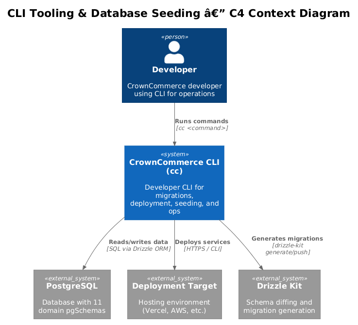
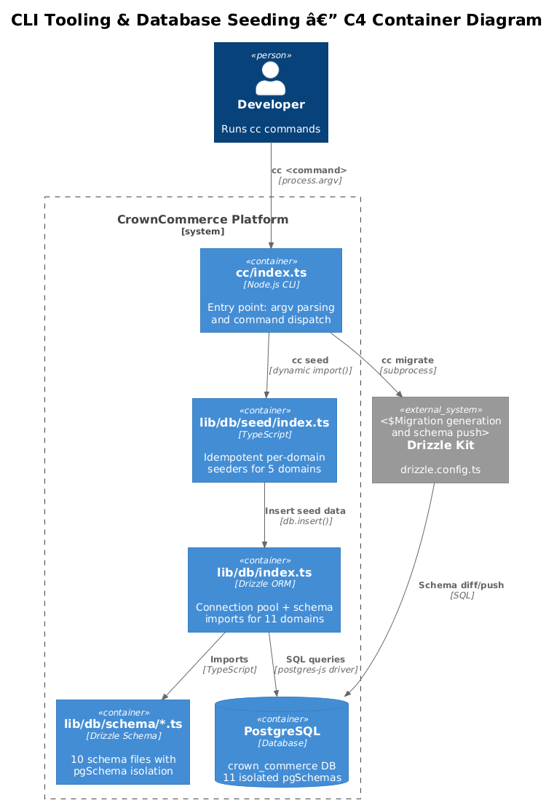
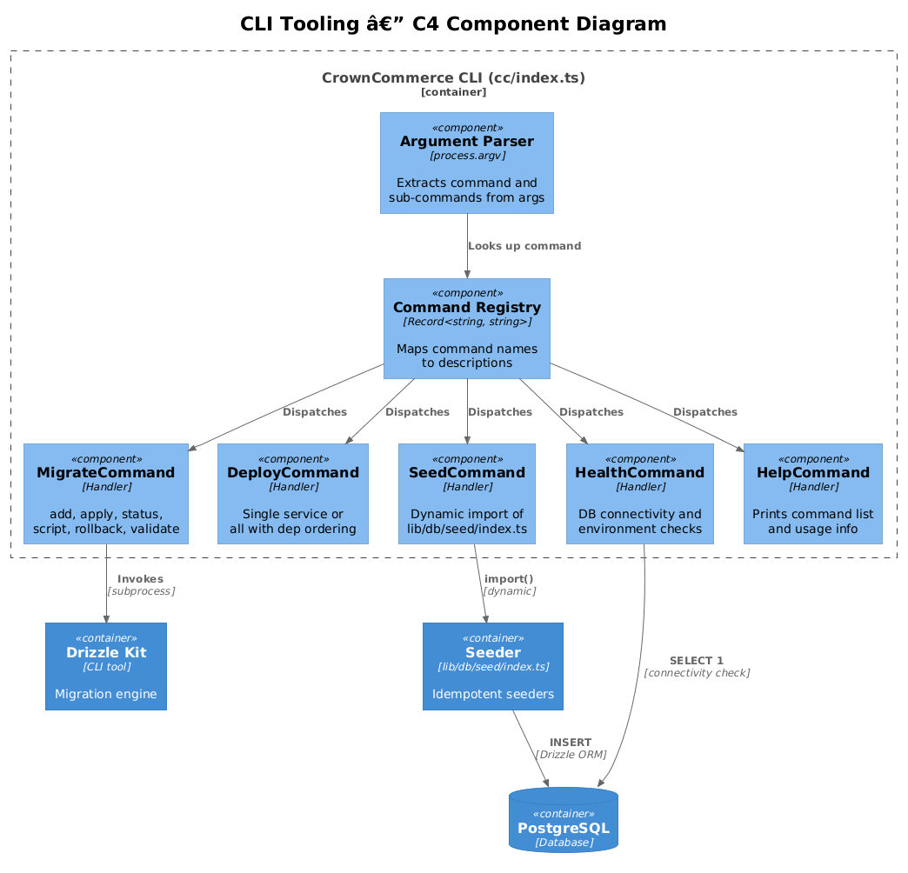
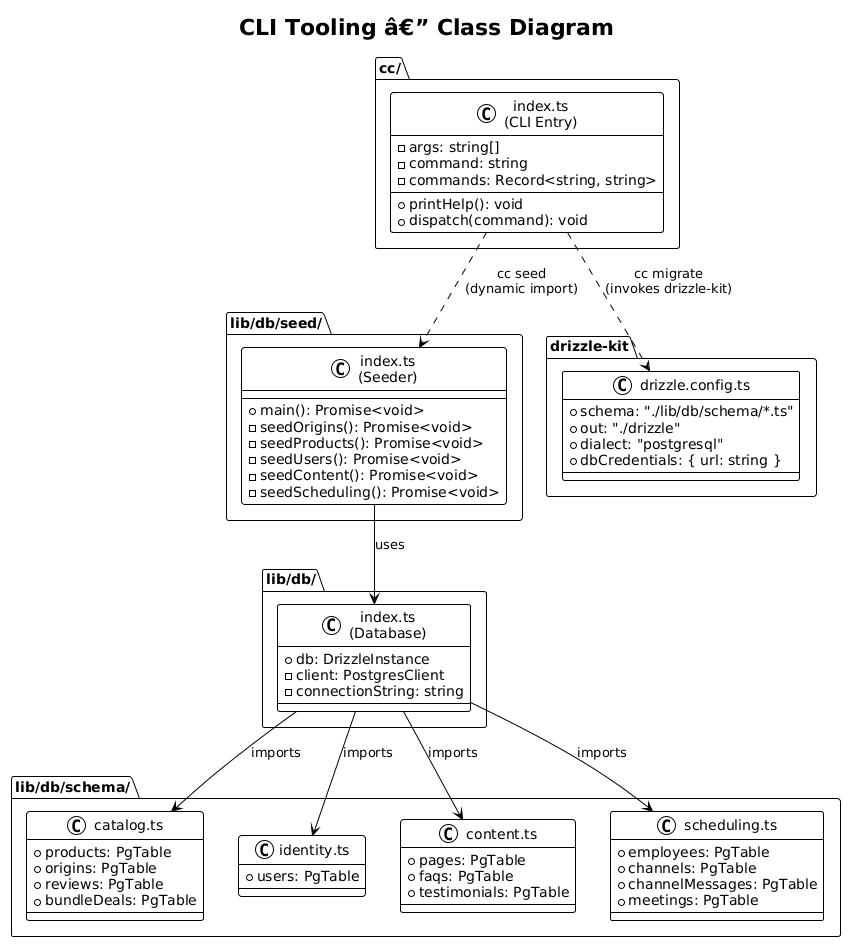
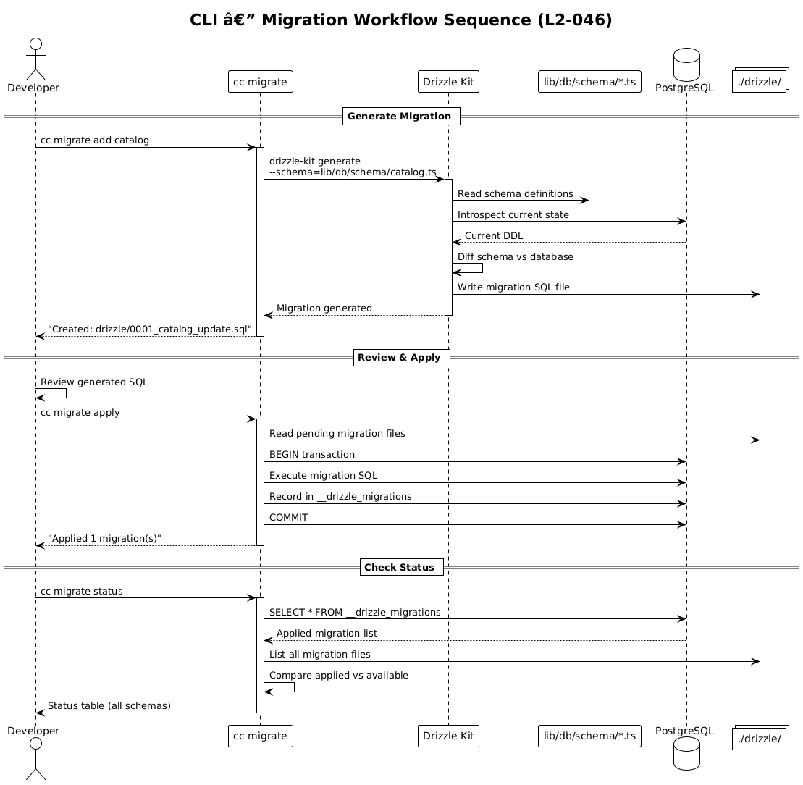
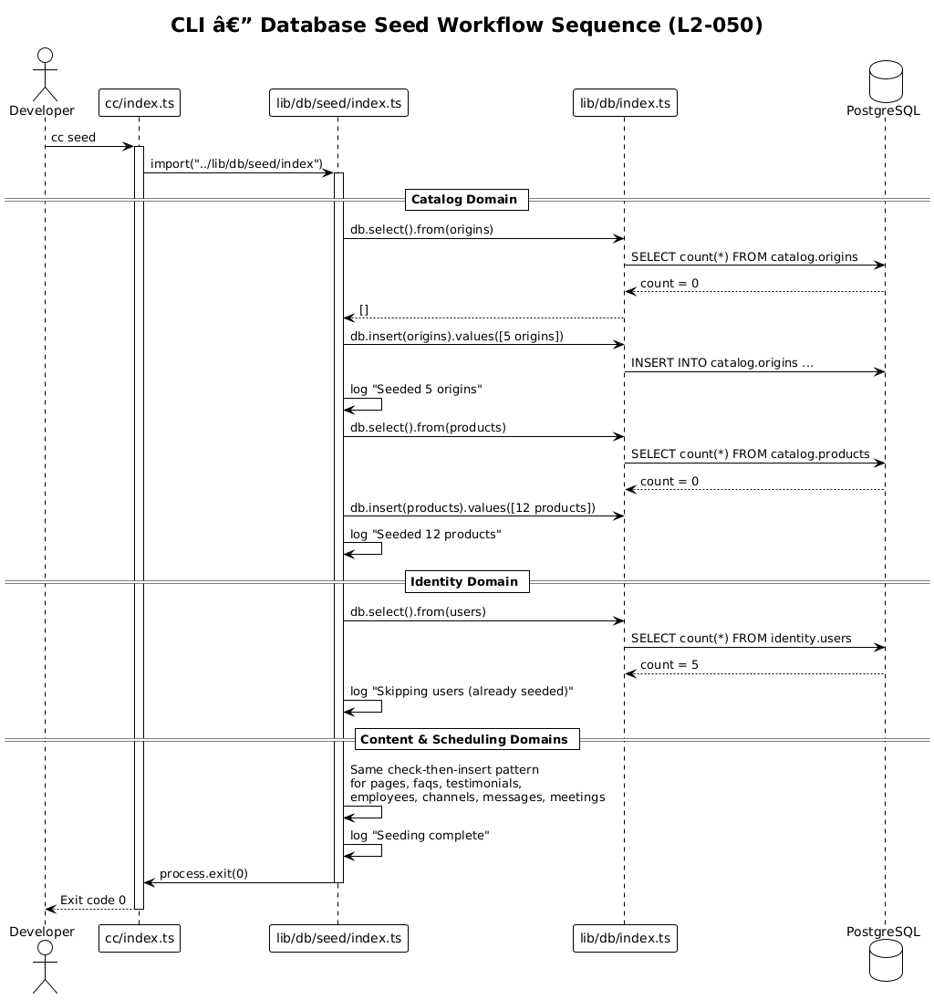
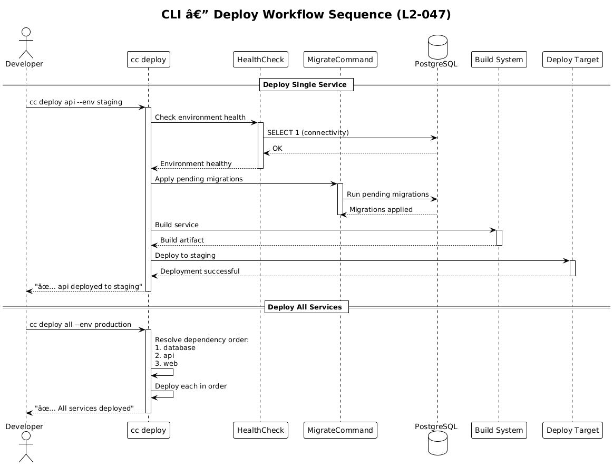

# Feature 17 — CLI Tooling & Database Seeding: Detailed Design

> **Requirements:** L2-046 CLI Migration Tool · L2-047 CLI Deploy Tool · L2-050 Database Auto-Seeding
> **Status:** Draft
> **Last Updated:** 2025-07-15

---

## 1. Overview

CrownCommerce includes a developer CLI (`cc`) that orchestrates database migrations, deployments, seeding, health checks, and operational tasks. The CLI is the single entry point for all developer-facing automation, wrapping Drizzle ORM for database operations and providing a consistent command interface across the 11 domain schemas.

### 1.1 Scope

| In Scope | Out of Scope |
|----------|-------------|
| `cc migrate` — generate, apply, status, script, rollback, validate (L2-046) | Production database access controls |
| `cc deploy <service> --env <env>` — single/all service deployment (L2-047) | CI/CD pipeline configuration |
| `cc seed` — idempotent per-domain seeders (L2-050) | Production data migration |
| `cc health` — environment health checks | Monitoring/alerting infrastructure |
| `cc campaign`, `cc logs`, `cc scaffold` — additional commands | Email delivery infrastructure |
| Argument parsing and command dispatch architecture | GUI-based admin tools |

### 1.2 Key Decisions

- **Single entry point:** All commands flow through `cc/index.ts` which parses `process.argv` and dispatches to command handlers.
- **Drizzle ORM integration:** Migrations use `drizzle-kit` under the hood; the CLI wraps `drizzle-kit generate`, `drizzle-kit push`, and raw SQL execution for rollbacks.
- **Schema-per-domain:** Each of the 11 domain schemas (catalog, identity, content, newsletter, etc.) has independent migration tracking, aligning with the `pgSchema` isolation pattern.
- **Idempotent seeding:** Seeders check for existing data before inserting, making them safe to run repeatedly.
- **Dynamic imports:** The `seed` command uses `import("../lib/db/seed/index")` for lazy loading to keep CLI startup fast.

---

## 2. Architecture

### 2.1 C4 Context Diagram

Shows where the CLI sits relative to developers and external systems.



### 2.2 C4 Container Diagram

Shows the containers involved in CLI operations.



### 2.3 C4 Component Diagram

Shows the internal command architecture of the CLI.



---

## 3. Component Details

### 3.1 CLI Entry Point — `cc/index.ts`

The CLI entry point uses a `#!/usr/bin/env node` shebang for direct execution. It extracts the command from `process.argv[2]` and dispatches to the appropriate handler.

**Command Registry:**

| Command | Description | Status |
|---------|-------------|--------|
| `cc migrate` | Database migration management (L2-046) | Planned |
| `cc deploy` | Deployment orchestration (L2-047) | Planned |
| `cc seed` | Database seeding (L2-050) | Implemented |
| `cc health` | Environment health checks | Implemented |
| `cc campaign` | Email campaign management | Planned |
| `cc logs` | Log viewing and tailing | Planned |
| `cc scaffold` | Code generation scaffolding | Planned |
| `cc help` | Print help text | Implemented |

### 3.2 Migrate Command — `cc migrate` (L2-046)

Sub-commands:

| Sub-command | Usage | Description |
|-------------|-------|-------------|
| `add` | `cc migrate add <service>` | Generate a new migration file for a domain schema via `drizzle-kit generate` |
| `apply` | `cc migrate apply` | Apply all pending migrations across all services |
| `status` | `cc migrate status` | Show migration status for all 11 domain schemas |
| `script` | `cc migrate script <from> <to>` | Generate SQL script for a migration range |
| `rollback` | `cc migrate rollback <service>` | Revert the last applied migration for a service |
| `validate` | `cc migrate validate` | Validate all schema files against the database state |

**Implementation Pattern:**
- `add` invokes `drizzle-kit generate` with the schema path for the target service.
- `apply` invokes `drizzle-kit push` or executes generated SQL migration files in order.
- `status` queries the `drizzle.__drizzle_migrations` table to compare applied vs. pending.
- `rollback` applies the down-migration SQL or reverts the schema to a previous snapshot.

### 3.3 Deploy Command — `cc deploy` (L2-047)

| Usage | Description |
|-------|-------------|
| `cc deploy <service> --env <env>` | Deploy a single service to the target environment |
| `cc deploy all --env <env>` | Deploy all services in dependency order |

**Deployment Order (dependency graph):**
1. Database migrations (must apply first)
2. API services (depend on DB)
3. Web application (depends on API)

**Environment targets:** `development`, `staging`, `production`

### 3.4 Seed Command — `cc seed` (L2-050)

Delegates to `lib/db/seed/index.ts` via dynamic import. The seeder covers 5 domains:

| Domain | Seed Data | Count |
|--------|-----------|-------|
| Catalog | Origins (hair sources) | 5 |
| Catalog | Products (bundles, closures, frontals, wigs) | 12 |
| Content | Pages (about, shipping, returns, privacy, terms) | 5 |
| Content | FAQs | 6 |
| Content | Testimonials | 3 |
| Identity | Users (2 admin + 3 customer) | 5 |
| Scheduling | Employees | 5 |
| Scheduling | Meetings | 4 |
| Scheduling | Channels | 7 |
| Scheduling | Channel messages | 12 |

### 3.5 Database Seeder — `lib/db/seed/index.ts`

The seeder follows an idempotent check-then-insert pattern:

```
For each domain table:
  1. SELECT count(*) FROM table
  2. IF count > 0 → log "Skipping (already seeded)" → continue
  3. ELSE → INSERT seed data → log "Seeded N rows"
```

**Seed data characteristics:**
- Origins include countries of origin (Brazilian, Peruvian, Malaysian, Indian, Cambodian).
- Products reference origin IDs, include pricing, descriptions, and category tags.
- Users have pre-hashed bcrypt passwords for immediate dev login.
- Content pages have slug-based routing aligned with storefront routes.

### 3.6 Additional Commands

| Command | Description |
|---------|-------------|
| `cc health` | Checks database connectivity, environment variables, and service availability. Currently returns a static success message; planned to check DB connection, env vars, and API health. |
| `cc campaign` | Manage email campaigns — create, schedule, send, track. Wraps the Newsletter API. |
| `cc logs` | Tail application logs filtered by service, level, or time range. |
| `cc scaffold` | Generate boilerplate code for new domain schemas, API routes, and page components. |

### 3.7 Drizzle Configuration — `drizzle.config.ts`

```typescript
export default defineConfig({
  schema: "./lib/db/schema/*.ts",   // All 11 domain schema files
  out: "./drizzle",                  // Migration output directory
  dialect: "postgresql",
  dbCredentials: {
    url: process.env.DATABASE_URL || "postgresql://localhost:5432/crown_commerce",
  },
});
```

---

## 4. Data Model

### 4.1 Class Diagram

Shows the CLI command structure and its relationship to the database layer.



### 4.2 Schema-to-Domain Mapping

| pgSchema | Schema File | Tables |
|----------|-------------|--------|
| `catalog` | `lib/db/schema/catalog.ts` | products, origins, reviews, bundleDeals |
| `identity` | `lib/db/schema/identity.ts` | users |
| `content` | `lib/db/schema/content.ts` | pages, faqs, testimonials |
| `newsletter` | `lib/db/schema/newsletter.ts` | subscribers, campaigns, campaignRecipients |
| `scheduling` | `lib/db/schema/scheduling.ts` | employees, channels, channelMessages, meetings |
| `orders` | `lib/db/schema/orders.ts` | orders, orderItems |
| `chat` | `lib/db/schema/chat.ts` | conversations, messages |
| `inquiries` | `lib/db/schema/inquiries.ts` | inquiries |
| `crm` | `lib/db/schema/crm.ts` | contacts, interactions |
| `notifications` | `lib/db/schema/notifications.ts` | notifications |

---

## 5. Key Workflows

### 5.1 Migration Workflow

Shows the full migration lifecycle: generate → review → apply → push.



### 5.2 Seed Workflow

Shows the idempotent seeding pattern: check → seed → skip.



### 5.3 Deploy Workflow

Shows the deployment orchestration including dependency ordering.



---

## 6. API Contracts

### 6.1 CLI Interface

```
CrownCommerce CLI (cc)

Usage: cc <command> [options]

Commands:
  migrate         Database migration management
    add <service>               Generate migration for a service
    apply                       Apply pending migrations
    status                      Show migration status
    script <from> <to>          Generate SQL script for range
    rollback <service>          Revert last migration
    validate                    Validate schema vs database

  deploy          Deployment orchestration
    <service> --env <env>       Deploy single service
    all --env <env>             Deploy all in dependency order

  seed            Database seeding (idempotent)
  health          Environment health checks
  campaign        Email campaign management
  logs            Log viewing
  scaffold        Code generation
  help            Show this help message
```

### 6.2 Database Seed Script Interface

The seed script (`lib/db/seed/index.ts`) is invoked via dynamic import from the CLI:

```typescript
// cc/index.ts
import("../lib/db/seed/index");
```

The seed script:
- Imports `db` from `@/lib/db`
- Imports domain schema tables from `@/lib/db/schema/*`
- Runs async `main()` function
- Calls `process.exit(0)` on success, `process.exit(1)` on error

### 6.3 npm Script Integration

```json
{
  "db:generate": "drizzle-kit generate",
  "db:push": "drizzle-kit push",
  "db:studio": "drizzle-kit studio",
  "db:seed": "npx tsx cc/index.ts seed"
}
```

---

## 7. Security Considerations

| Concern | Mitigation |
|---------|------------|
| **Database credentials in CLI** | Read from `DATABASE_URL` environment variable; never hardcoded in source |
| **Seed data passwords** | Pre-hashed bcrypt passwords; plaintext passwords only in development documentation |
| **Production seed prevention** | Seeder should check `NODE_ENV` and refuse to run in production |
| **Migration rollback safety** | Rollbacks should require explicit `--confirm` flag; destructive operations logged |
| **Deploy command access** | Should require authentication/authorization before deploying to staging/production |
| **SQL injection in migrations** | Drizzle ORM generates parameterized queries; raw SQL reviewed before execution |

---

## 8. Open Questions

| # | Question | Impact | Status |
|---|----------|--------|--------|
| 1 | Should `cc migrate` wrap `drizzle-kit` directly or use its programmatic API? | Implementation approach | Open |
| 2 | Should deploy command integrate with a specific CI/CD platform (Vercel, AWS)? | Deployment target | Open |
| 3 | Should seeders support a `--force` flag to re-seed even if data exists? | Developer experience | Open |
| 4 | Should `cc health` check external service connectivity (email, payment)? | Health check depth | Open |
| 5 | Should there be a `cc migrate dry-run` that shows SQL without executing? | Safety | Open |
| 6 | Should `cc scaffold` generate test files alongside source files? | Code generation completeness | Open |
