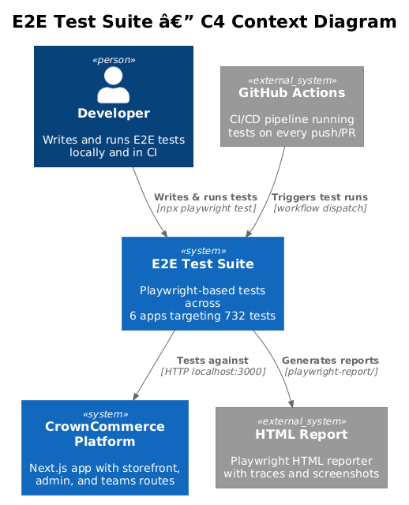
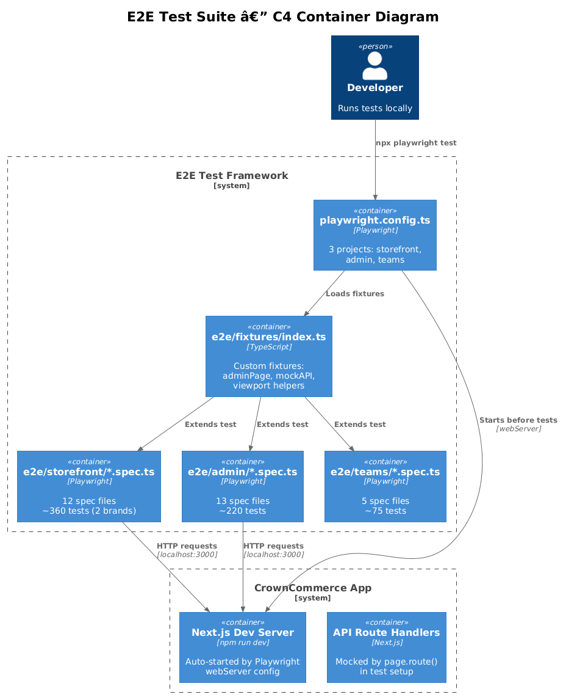
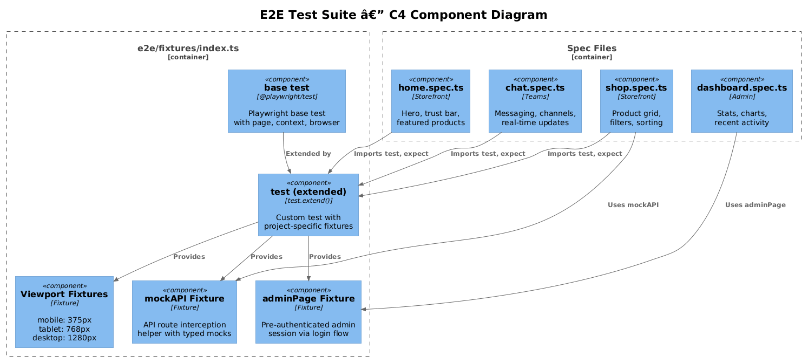
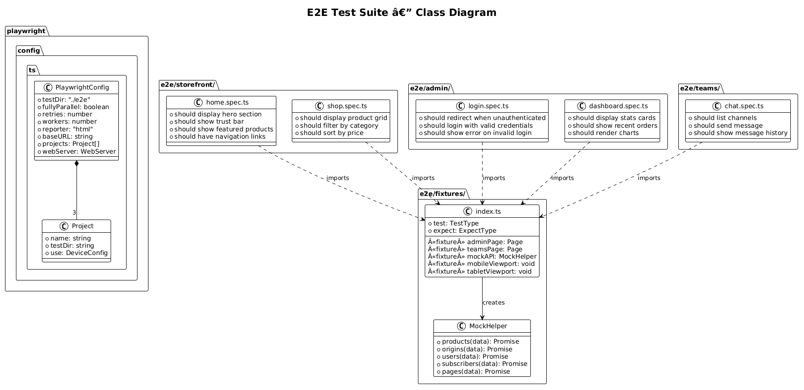
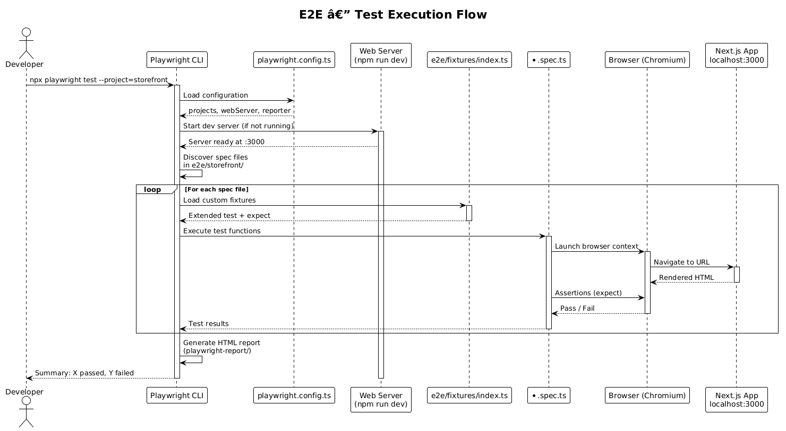
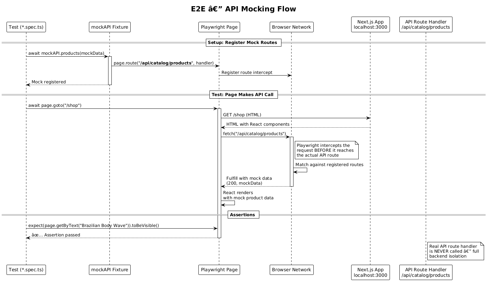
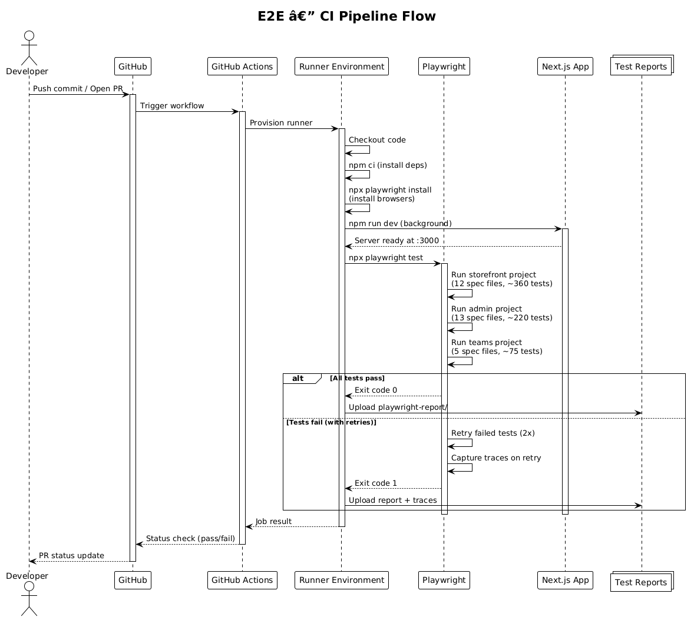

# Feature 18 — E2E Test Suite: Detailed Design

> **Requirements:** L2-048 E2E Tests — Consumer Storefronts · L2-049 E2E Tests — Admin and Teams
> **Status:** Draft
> **Last Updated:** 2025-07-15

---

## 1. Overview

The CrownCommerce E2E test suite uses Playwright to verify end-to-end behavior across all 6 applications: Origin Hair Collective storefront, Mane Haus storefront, Admin Dashboard, Teams Portal, and each brand's Coming Soon page. The suite targets 732 total tests organized by application and feature, with API mocking for backend isolation, multi-viewport responsive testing, and CI pipeline integration.

### 1.1 Scope

| In Scope | Out of Scope |
|----------|-------------|
| Storefront E2E tests for Origin and Mane Haus (L2-048) | Unit tests and integration tests |
| Admin panel E2E tests (L2-049) | Load/performance testing |
| Teams portal E2E tests (L2-049) | Visual regression testing |
| Multi-viewport responsive testing (mobile, tablet, desktop) | Cross-browser testing beyond Chromium |
| API mocking for backend isolation | Real payment processing tests |
| Custom Playwright fixtures for shared setup/teardown | Manual QA test plans |
| CI pipeline integration (GitHub Actions) | Accessibility audits (separate tool) |

### 1.2 Key Decisions

- **Page Object Pattern via Fixtures:** Instead of traditional page object classes, tests use Playwright's `test.extend()` fixture system for shared setup, teardown, and page helpers.
- **API Mocking Strategy:** Tests mock API responses at the network level using `page.route()` to isolate frontend behavior from backend state.
- **Multi-Project Configuration:** Playwright config defines separate projects for `storefront`, `admin`, and `teams`, each with their own test directory.
- **Responsive Breakpoints:** Tests run at 3 viewports — mobile (375px), tablet (768px), desktop (1280px) — configured via Playwright device emulation.
- **CI Integration:** Tests run in GitHub Actions with `workers: 1` in CI for stability, full parallelism in local dev.

---

## 2. Architecture

### 2.1 C4 Context Diagram

Shows where the E2E test suite sits relative to the platform and CI/CD.



### 2.2 C4 Container Diagram

Shows the containers involved in running E2E tests.



### 2.3 C4 Component Diagram

Shows the internal components of the E2E test framework.



---

## 3. Component Details

### 3.1 Playwright Configuration — `playwright.config.ts`

| Setting | Local | CI |
|---------|-------|-----|
| `fullyParallel` | `true` | `true` |
| `retries` | `0` | `2` |
| `workers` | `auto` | `1` |
| `reporter` | `html` | `html` |
| `trace` | `on-first-retry` | `on-first-retry` |
| `baseURL` | `http://localhost:3000` | `http://localhost:3000` |

**Projects:**

| Project | Test Directory | Device |
|---------|---------------|--------|
| `storefront` | `./e2e/storefront` | Desktop Chrome |
| `admin` | `./e2e/admin` | Desktop Chrome |
| `teams` | `./e2e/teams` | Desktop Chrome |

**Web Server:** Automatically starts `npm run dev` before tests and waits for `http://localhost:3000` to be ready.

### 3.2 Test Directory Structure

```
e2e/
├── storefront/
│   ├── home.spec.ts              # Homepage sections, hero, trust bar
│   ├── navigation.spec.ts        # Header nav, mobile menu, footer links
│   ├── shop.spec.ts              # Product grid, filtering, sorting
│   ├── product-detail.spec.ts    # PDP, variants, add-to-cart
│   ├── cart.spec.ts              # Cart page, quantity, remove
│   ├── checkout.spec.ts          # Checkout flow, form validation
│   ├── contact.spec.ts           # Contact form submission
│   ├── faq.spec.ts               # FAQ accordion, search
│   ├── content-pages.spec.ts     # About, shipping, returns, privacy, terms
│   ├── wholesale.spec.ts         # Wholesale application
│   ├── ambassador.spec.ts        # Ambassador program
│   └── 404.spec.ts               # Not found page
├── admin/
│   ├── login.spec.ts             # Auth redirect, login flow
│   ├── dashboard.spec.ts         # Dashboard stats, charts
│   ├── products.spec.ts          # Product CRUD
│   ├── origins.spec.ts           # Origin management
│   ├── inquiries.spec.ts         # Inquiry list, response
│   ├── testimonials.spec.ts      # Testimonial management
│   ├── subscribers.spec.ts       # Subscriber list, export
│   ├── employees.spec.ts         # Employee management
│   ├── schedule.spec.ts          # Schedule management
│   ├── meetings.spec.ts          # Meeting scheduling
│   ├── conversations.spec.ts     # Chat conversations
│   ├── hero-content.spec.ts      # Hero banner editing
│   └── trust-bar.spec.ts         # Trust bar configuration
├── teams/
│   ├── login.spec.ts             # Teams auth
│   ├── home.spec.ts              # Teams dashboard
│   ├── chat.spec.ts              # Team messaging
│   ├── meetings.spec.ts          # Meeting management
│   └── team-members.spec.ts      # Member directory
└── fixtures/
    └── index.ts                  # Custom fixtures, test helpers
```

### 3.3 Fixture System — `e2e/fixtures/index.ts`

The fixture file extends Playwright's base `test` with custom fixtures:

```typescript
import { test as base } from "@playwright/test";

export const test = base.extend({
  // Authenticated admin page
  adminPage: async ({ page }, use) => {
    await page.goto("/login");
    await page.fill('[name="email"]', "admin@crowncommerce.com");
    await page.fill('[name="password"]', "password");
    await page.click('button[type="submit"]');
    await page.waitForURL("/dashboard");
    await use(page);
  },

  // API mock helper
  mockAPI: async ({ page }, use) => {
    const mock = {
      products: (data) => page.route("**/api/catalog/products**", route =>
        route.fulfill({ json: data })
      ),
      // ... additional mock methods
    };
    await use(mock);
  },
});

export { expect } from "@playwright/test";
```

**Fixture Responsibilities:**

| Fixture | Purpose |
|---------|---------|
| `adminPage` | Pre-authenticated admin session |
| `teamsPage` | Pre-authenticated teams session |
| `mockAPI` | API mocking helper with typed methods per endpoint |
| `mobileViewport` | Sets viewport to 375×667 (iPhone SE) |
| `tabletViewport` | Sets viewport to 768×1024 (iPad) |

### 3.4 API Mocking Strategy

Tests mock backend responses using Playwright's `page.route()` to intercept network requests:

```typescript
test("should display products", async ({ page }) => {
  await page.route("**/api/catalog/products**", route =>
    route.fulfill({
      status: 200,
      json: [{ id: "1", name: "Brazilian Body Wave", price: 129.99 }],
    })
  );
  await page.goto("/shop");
  await expect(page.getByText("Brazilian Body Wave")).toBeVisible();
});
```

**Mocking Rules:**
- All API calls are mocked in test setup — no real database calls during E2E tests.
- Mock data is co-located with fixtures or defined inline for simple cases.
- Error scenarios tested by mocking 4xx/5xx responses.

### 3.5 Responsive Testing Strategy

Each storefront test includes responsive variants:

| Breakpoint | Viewport | Device |
|------------|----------|--------|
| Mobile | 375 × 667 | iPhone SE |
| Tablet | 768 × 1024 | iPad |
| Desktop | 1280 × 720 | Desktop Chrome |

Responsive tests verify:
- Mobile hamburger menu toggle
- Grid layout changes (1-col → 2-col → 4-col)
- Touch-friendly button sizing
- Sticky header behavior

### 3.6 Test Coverage Targets (L2-048, L2-049)

| Application | Test Files | Estimated Tests |
|-------------|-----------|-----------------|
| Origin Storefront | 12 spec files | 180 |
| Mane Haus Storefront | 12 spec files | 180 |
| Admin Dashboard | 13 spec files | 220 |
| Teams Portal | 5 spec files | 75 |
| Coming Soon (Origin) | 1 spec file | 12 |
| Coming Soon (Mane Haus) | 1 spec file | 12 |
| **Total** | **44 spec files** | **~732 tests** |

### 3.7 npm Scripts

```json
{
  "e2e": "playwright test --project=storefront",
  "e2e:admin": "playwright test --project=admin",
  "e2e:teams": "playwright test --project=teams",
  "e2e:ui": "playwright test --project=storefront --ui",
  "e2e:all": "playwright test"
}
```

---

## 4. Data Model

### 4.1 Class Diagram

Shows the test framework structure — fixtures, spec files, and their relationships.



### 4.2 Test Artifact Descriptions

| Artifact | Location | Description |
|----------|----------|-------------|
| Test reports | `playwright-report/` | HTML report with test results, screenshots, traces |
| Traces | `test-results/` | Playwright traces captured on first retry |
| Screenshots | `test-results/` | Failure screenshots captured automatically |
| Videos | `test-results/` | Optional video recording (disabled by default) |

---

## 5. Key Workflows

### 5.1 Test Execution Flow

Shows the lifecycle of a test run from CLI invocation to report generation.



### 5.2 API Mocking Flow

Shows how API mocking intercepts network requests during tests.



### 5.3 CI Pipeline Flow

Shows how E2E tests integrate into the GitHub Actions CI pipeline.



---

## 6. API Contracts

### 6.1 Test CLI Interface

```bash
# Run all storefront tests
npx playwright test --project=storefront

# Run a specific test file
npx playwright test e2e/storefront/home.spec.ts

# Run tests with UI mode (debugging)
npx playwright test --project=storefront --ui

# Run tests in headed mode
npx playwright test --headed

# Run all projects
npx playwright test

# Generate HTML report
npx playwright show-report
```

### 6.2 Fixture API

```typescript
import { test, expect } from "../fixtures";

// Basic test
test("page title", async ({ page }) => { ... });

// Admin test (pre-authenticated)
test("admin dashboard", async ({ adminPage }) => { ... });

// With API mock
test("product list", async ({ page, mockAPI }) => {
  await mockAPI.products([...]);
  ...
});
```

### 6.3 Common Selectors

Tests use accessible selectors following Playwright best practices:

| Selector Method | Example | Use Case |
|----------------|---------|----------|
| `getByRole` | `page.getByRole("link", { name: /shop/i })` | Navigation, buttons, form elements |
| `getByText` | `page.getByText("Brazilian Body Wave")` | Content verification |
| `getByTestId` | `page.getByTestId("product-grid")` | Complex structural elements |
| `getByLabel` | `page.getByLabel("Email")` | Form inputs |
| `getByPlaceholder` | `page.getByPlaceholder("Enter email")` | Input fields |

---

## 7. Security Considerations

| Concern | Mitigation |
|---------|------------|
| **Test credentials in source** | Use dedicated test accounts with minimal permissions; credentials in fixtures only |
| **API mocking bypass** | Mocks intercept at network level; no real API calls leak to production |
| **CI secrets exposure** | `DATABASE_URL` and auth secrets stored in GitHub Actions secrets, not in test code |
| **Test data isolation** | Tests use mocked data; no shared database state between test runs |
| **Screenshot/trace PII** | Traces may capture PII; `.gitignore` excludes `test-results/` and `playwright-report/` |
| **Flaky test stability** | 2 retries in CI; traces on first retry for debugging; `workers: 1` in CI |

---

## 8. Open Questions

| # | Question | Impact | Status |
|---|----------|--------|--------|
| 1 | Should E2E tests run against a real database or always use API mocking? | Test reliability vs. integration confidence | Open |
| 2 | Should we add visual regression testing (e.g., Playwright's `toHaveScreenshot()`)? | Catching CSS regressions | Open |
| 3 | Should cross-browser testing (Firefox, WebKit) be added to the Playwright config? | Browser compatibility | Open |
| 4 | What is the CI timeout threshold for the full 732-test suite? | Pipeline performance | Open |
| 5 | Should test data fixtures be shared across spec files via a central mock data module? | DRY test data | Open |
| 6 | Should there be a separate Playwright project per brand (origin-storefront, mane-haus-storefront)? | Brand-specific test isolation | Open |
